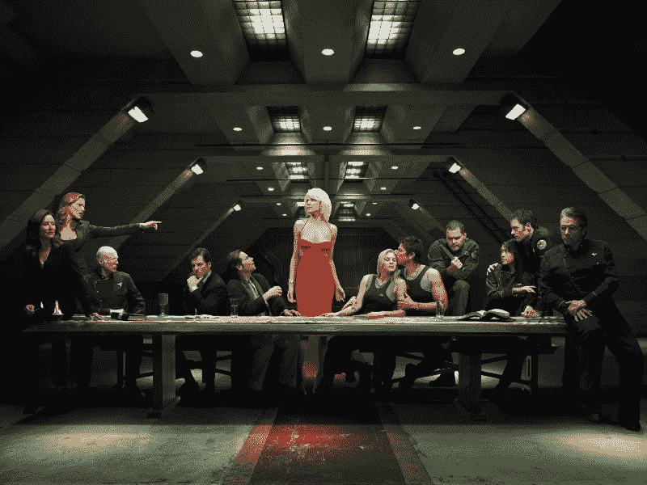
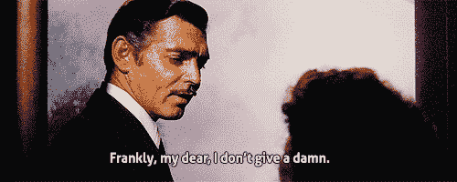
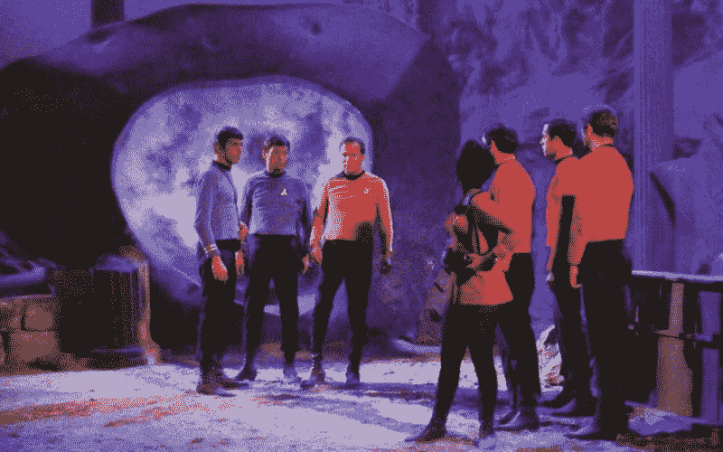

# 我已经五年没骂人了。我的意志力暴涨。

> 原文：<https://www.freecodecamp.org/news/i-havent-said-a-cuss-word-in-5-years-here-s-how-this-boosted-my-willpower-3e7ecc98e006/>

> "不能控制自己的人是不自由的."—爱比克泰德

我已经尝试了很多年的实验来增强我的意志力:

*   戒掉咖啡和酒精
*   每天跑 10 公里
*   洗冷水澡而不是热水澡

然而，到目前为止，我为增强自己的意志所做的最简单的事情就是不再说某些 4 个字母的英语单词。

五年前，我决定今后，我将不再说任何你在旧约中找不到的脏话。

我的承诺立即受到了考验。我在我哥哥的家里(一个不穿鞋的家庭)，我们调暗了灯光，这样我们就可以看电影了。我正端着一碗刚爆好的爆米花走回他的客厅，突然一条实木桌腿从阴影中出现。

我踢我的脚趾如此之难，整个桌子在他的硬木地板上发出刺耳的声音。

我的家人沉默了。他们看了一眼我滔滔不绝的小脚趾。然后抬头看着我的脸。

“哇哦！”我弟弟的妻子说。“那不疼吗？”

我只是站在那里，捏着我的爆米花碗。我咬紧牙关，不假思索地说:“如果你够坚强，就不会。”

我不知道我是怎么了。事实上，我的脚趾疼得要命。不管是什么，那天晚上，一个家族性的迷因诞生了。

从那以后，每当我们家有人受伤，他们都会开玩笑地回答不可避免的关于疼痛的问题，说“如果你够坚强就不会了。”然后大家都笑了。

如果这发生在我发誓保持沉默之前，我肯定会上蹿下跳，大声咒骂。但是，相反，一种宁静的一面开始浮现并占据了我的人格。

### 用“别名”代替亵渎

可恶。见鬼。开枪吧。几乎所有的脏话都有更柔和的版本，我很快就采用了它们。

但是少了一个词。每个人都用作动词、形容词甚至名词的大词——有时都在同一个句子中。不，“软糖”对我没用。

幸运的是，在上海的一个多雨的冬天，我和妻子刚刚看完了《太空堡垒卡拉狄加》的整个系列。

《太空堡垒卡拉狄加》描绘了一个科技发达的文明，但同时也是一个忧郁、酗酒、满嘴脏话的文明。编剧们没有像类似的《坚韧不拔——但仍然是 PG-13——节目那样完全省略 f 字，而是决定编造他们自己的 f 字，这样演员就可以在电视上自由地说: [frak](https://en.wikipedia.org/wiki/Frak_(expletive)) 。

当你第一次看这个节目时，注意到他们说“妈的”，这很俗气。角色们互相说着诸如“去你的！”，“搞什么鬼？”甚至“去你妈的”

当然，这是在“水力压裂”一词进入流行词汇之前，这是一种将高压流体泵入地下以提取石油和天然气的有环境问题的行为。

这使得“该死”这个词的使用更加荒谬。这种荒谬赋予了它某种幽默。某种力量。

因此，随着这最后一个添加到我的脏话别名阵列，我有一切我需要去亵渎自由。

就像机器人主角埃利奥特·奥尔德逊先生后来习惯于听到每当有人说“E 公司”时就听到“邪恶公司”这几个字一样，我习惯于听到太空堡垒卡拉狄加“frak”而不是其他人的 f 炸弹。

随着时间的推移，我越来越少使用这些化名。当然，有时候我会大喊，“哦，妈的！[我们的生产服务器停机了](https://medium.freecodecamp.com/rebuilding-the-747-at-35-000-feet-165bddf4782)！”但更多的时候，我只是用坚忍的沉默来应对糟糕的情况。

### 明天会少% @ # $点

戒掉咒骂并不难做到。除了增强我的意志力，它似乎还让我每天的前景变得更加光明。

关于脏话在人类心理学中的作用，没有太多确凿的研究。一些一次性的研究表明，经常说脏话的人可能更聪明，或者被别人认为更诚实的 T2。这些结论对我来说似乎违背直觉，但我会保持开放的心态，以防更多的研究支持这一点。

我个人并不觉得我因为不骂人而失去了任何动态范围。这并不是说骂人有什么错，也不是说骂人应该受到任何形式的审查。人们骂人。没什么大不了的。截至 2017 年，我们有更大的问题要担心。

相反，我认为脏话常常能增加一种有价值的戏剧效果。

回到 1934 年，好莱坞电影公司要求 1934 年电影《乱世佳人》的制片人将现在著名的台词:“坦白地说，亲爱的，我一点也不在乎”改为“坦白地说，亲爱的，我不在乎。”

但制片方成功地辩称，“该死”这个词对于传达这种情绪的程度是必要的，并将其留在了影片中。

制片人还成功地主张了柯克船长的名句“让我们离开这个鬼地方”中“地狱”一词的使用权。这是“地狱”这个词第一次在电视广播中这样使用。它出现在 1967 年经典的《星际迷航》剧集《永远边缘的城市》中。(顺便说一句，如果你没看过这一集，[它在网飞](https://www.netflix.com/au/watch/70109463)播出，你一定要看)。

不说脏话的一个好处是，我不再需要在有礼貌的人面前或在孩子面前自我审查自己的言论。脏话不再像过去那样只是在随意的玩笑中“脱口而出”。

我现在可以说出我的想法，我相信，虽然有些人可能会对我的想法提出异议，但他们可能不会对我使用的词语感到畏惧。

如果你想了解更多像这样的小窍门，你可以用它们来提高你的意志力——从而提高你的工作效率——我推荐你阅读斯坦福心理学教授 Kelly McGonigal 的这本书:

[**意志力本能:自我控制是如何工作的，为什么它很重要，你能做些什么来获得更多…**](http://amzn.to/2nLHzja)
[*编辑描述* amzn.to](http://amzn.to/2nLHzja)

我计划继续探索能增强我意志力的习惯。因为正如这位伟大的诗人曾经写道:

> “我们之所以如此，是因为我们自己。我们的身体是我们的花园，我们的意志是园丁。”――威廉·莎士比亚，奥赛罗

感谢阅读！如果你喜欢这篇文章，请点击？所以其他人会在媒体上看到这个。

