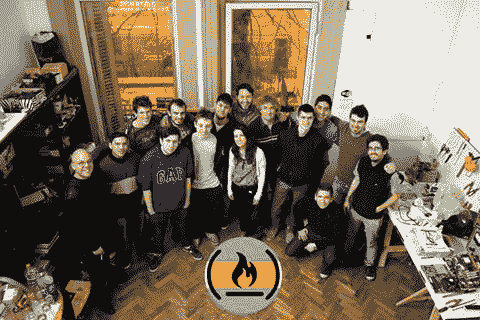

# 去年我主持了 40 场编码活动。以下是我学到的。

> 原文：<https://www.freecodecamp.org/news/i-hosted-40-coding-events-last-year-heres-what-i-learned-94d607cd04f4/>

这里有三个值得你花时间的链接:

1.  去年我主持了 40 场编码活动。以下是我学到的。( [6 分钟读数](http://bit.ly/2njIXJS))
2.  我分析了网飞终极兽王每一集的数据
3.  昨天，国会投票取消了美国的互联网隐私保护。以下是如何在 10 分钟内建立一个 VPN，以及为什么你迫切需要( [10 分钟阅读](http://bit.ly/2nvIQLX))

额外收获:今天早上，我现场采访了 JavaScript 开发者和作者 Sacha Greif，询问他新的基于 Meteor 的 web 开发框架 Vulcan.js ( [35 分钟观察](http://bit.ly/2ohyoIa))

### 想到这一天:

> “昨天的法案不仅让有线电视公司和无线供应商可以随心所欲地处理你的浏览历史、购物习惯、你的位置和从你的在线活动中收集的其他信息，而且还会阻止联邦通信委员会再次建立类似的消费者隐私保护。”——前联邦通信委员会主席汤姆·惠勒

### 每日一图:

摄影师查尔斯·欧里尔(Charles O'Rear)以“幸福”为背景，这是默认的 Windows 背景，也是有史以来最受欢迎的照片之一。

### 今日学习小组:

布宜诺斯艾利斯自由代码营

编码快乐！

–昆西·拉森，自由代码营的老师

如果你从这封邮件中获得了价值，考虑一下[支持我们的非营利组织](http://bit.ly/donate-to-fcc)。