# 我刚刚问了 23000 名开发者他们对 JavaScript 的看法。以下是我学到的。

> 原文：<https://www.freecodecamp.org/news/i-just-asked-23-000-developers-what-they-think-of-javascript-heres-what-i-learned-9a06b61998fa/>

萨沙·格里菲

# 我刚刚问了 23000 名开发者他们对 JavaScript 的看法。以下是我学到的。

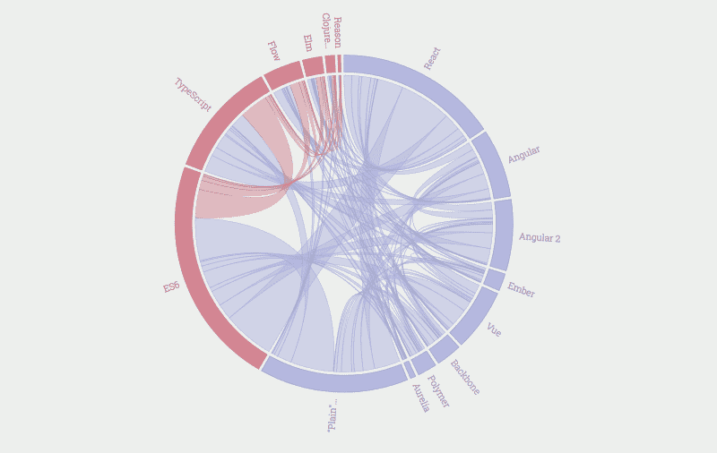

我最近发表了 2017 年版年度 JavaScript 调查的结果，这些结果是从 23，000 多名开发者那里收集的。

调查结果揭示了许多事情，从流行趋势到工资细目分类。如果你还没有亲自看一看的话，你会想要亲自看一看。但在所有这些数据中，以下是对我来说最突出的 10 件事。

即使你已经看到了结果，你也可能想看看我们刚刚添加的新的[功能](https://stateofjs.com/2017/features/)和[观点](https://stateofjs.com/2017/opinions/)部分。

### 洞察力#1:反应是这里停留

今年的版本证实了去年的趋势:React 是目前占主导地位的前端库。

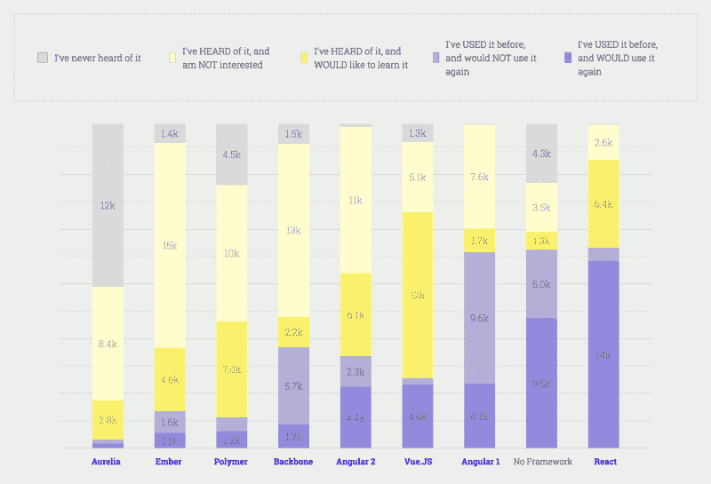

React has the most happy users (dark purple bar) by far

React 早期的批评(通常集中在它混合 HTML 和 JS 的方式上)现在看起来像是遥远的记忆，脸书通过[取消他们许可证的专利条款](https://medium.freecodecamp.org/facebook-just-changed-the-license-on-react-heres-a-2-minute-explanation-why-5878478913b2)平息了开发者今年的最后一个主要障碍。

随着使用人数和开发者满意度都达到历史最高水平，可以肯定地说 React 正处于巅峰，至少目前是这样。

### 洞察力#2: Angular 正在转变成一个新的角色

这并不意味着你现在就应该把角度排除在外。虽然它确实没有 React 那样的动力，但它确实有一些非常强大的因素。

首先，Angular 背后有谷歌的力量。随便你怎么说，那都是业内一些最优秀的工程师在全职工作改进框架。

同样需要指出的是，Angular 仍然拥有庞大的用户群。银行、政府和其他大公司不能像普通的自由职业者一样快速地接受最新的热点，因此他们经常要维护大量遗留的有角度的代码库。

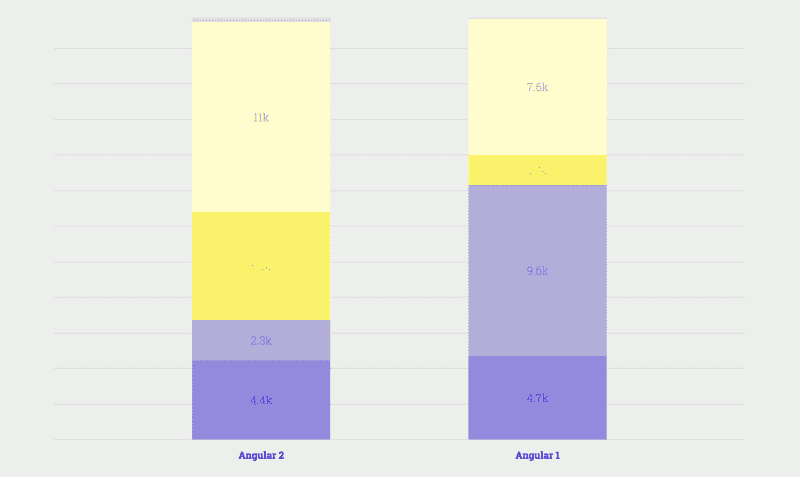

“new” Angular (2+) vs “old” Angular (AngularJS): smaller adoption, but much higher developer satisfaction

但最后一点可能是最关键的:Angular 不再试图与 React 正面交锋，而是重新专注于企业市场。看看 Angular 对 TypeScript 的采用就知道了:虽然它可能会让一些开发人员却步，但这个决定也带来了企业应用程序所需的可靠性和安全性。

### 洞察力#3:你不能再忽视 Vue.js 了

Vue 去年似乎从无到有，并在很短的时间内成为 React 皇冠上最大的威胁。它可能没有 Angular 的原始数据或 Ember 的寿命，但它有击败两者的东西:**动量**。

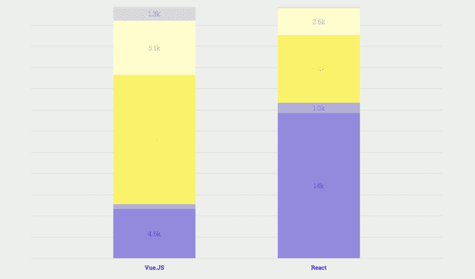

Vue & React: the two highest developer satisfaction ratios (light purple vs dark purple)

虽然 Vue 击败 React 似乎仍然希望渺茫，但在提供完整的框架式体验方面，Vue 确实有更好的故事，这要归功于由同一个核心团队维护的官方[路由](https://router.vuejs.org/en/)和[状态管理](https://github.com/vuejs/vuex)库。

### 洞察力#4:一些图书馆的知识会帮助你赚得更多(但原因可能不是你想的那样)

通过收集和交叉引用工资数据，我们能够找出哪些技术最有利可图。

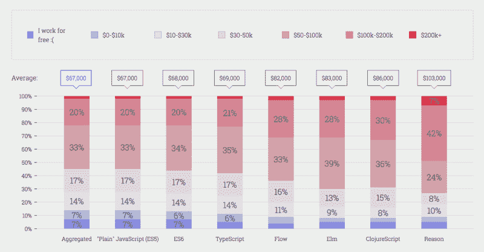

JavaScript flavors, from lowest-paying (left) to highest-paying (right)

事实证明，通常是聚合物或推理等小众技术与最高工资相关。

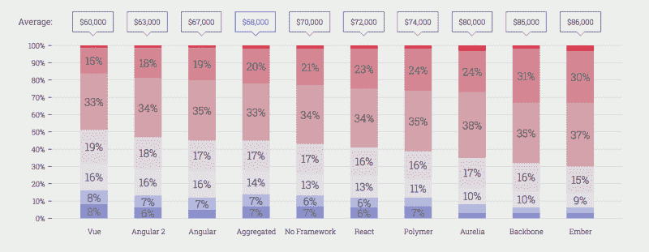

JavaScript front-end libraries, from lowest-paying (left) to highest-paying (right)

现在，在你辞掉目前的工作，沉浸在聚合物视频中度过圣诞假期之前，请记住相关性不等于因果关系。

虽然聚合物开发人员可能会获得更高的报酬，但也有可能更多的高级开发人员(他们自然会赚得更多)倾向于尝试更多样化的库，而初级程序员(他们从工资阶梯的底部开始)则更喜欢专注于一两种主流技术。

因此，也许(仅仅是也许)追逐一天中的最新潮流毕竟不是赚大钱的关键。

### 洞察#4: 2018 年将是 GraphQL 之年

如果你和大多数调查对象一样，你听说过 [GraphQL](http://graphql.org) 并且很感兴趣，但是你还没有真正尝试过它(提示:[我为你写了这篇文章](https://medium.freecodecamp.org/so-whats-this-graphql-thing-i-keep-hearing-about-baf4d36c20cf)！).

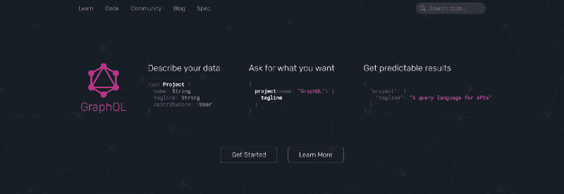

REST wishes it had a logo this cool

事实证明，这是很常见的情况。在调查中提到的所有技术中，GraphQL 是最令人感兴趣的一种——尽管它目前的用户数量很少。

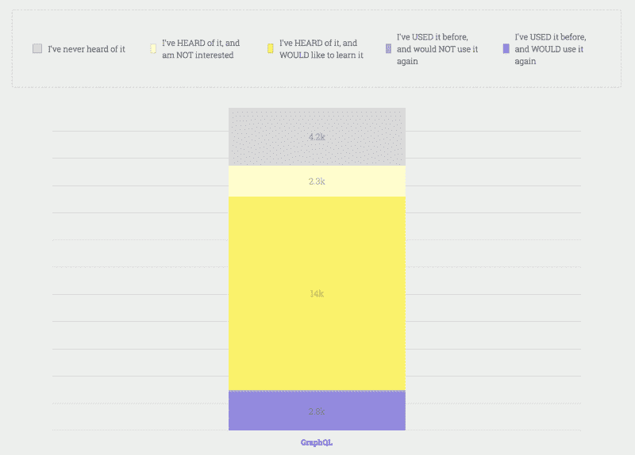

That big yellow bar represents 14k GraphQL-curious developers

说到当前用户，值得一提的是他们对 GraphQL 的总体满意度很高。有了这种高兴趣和高满意度的结合，如果 2018 年是 GraphQL 最终跨越鸿沟成为主流技术的一年，请不要惊讶。

### 洞察力#6: JavaScript！=前端

我们已经知道 JavaScript 不仅仅在浏览器中使用。毕竟，Node 多年来一直是非常受欢迎的后端选择。

但在 2017 年，JavaScript 进一步扩展:像 AWS Lambda 这样的平台让你可以在没有后端的情况下编写后端代码，而物联网设备的日益普及意味着，不久之后，你的烤面包机很可能也会运行 JavaScript。

This toaster uses the heat generated by running Slack’s desktop app to toast your bread

如果这听起来很荒谬，请记住今年最受欢迎的文本编辑器 VS Code 本身是用 JavaScript 编写的，并作为一个电子应用程序运行。

JavaScript 从一个显示横幅广告的工具发展到支持文本编辑器，这一切都发生在几年的时间里。相信我，JavaScript 烤面包机的出现可能比你想象的要快。

### 洞察力#7:微软正在反击

说到 VS 代码，这绝对是今年最大的惊喜之一。当 Sublime Text 和 Atom 正在争夺文本编辑器的霸主地位时，新来者 VS Code 从窗口进来，偷走了它们的午餐。

Sublime Text 传统上有速度优势，但被不直观的 UI 拖累，而 Atom 有很好的 UI，但经常感觉迟钝。

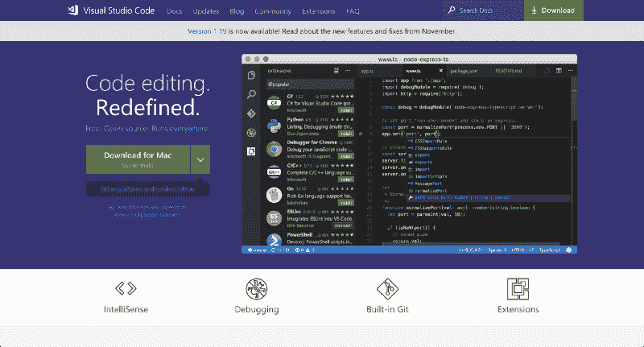

VS Code

原来 VS 代码可能已经找到了正确的平衡。虽然它是建立在 Atom 这样的电子之上，但微软的工程师们在提高其性能方面做了很大的工作。就像 Sublime 一样，它支持大量的插件和定制，尽管是在一个更加用户友好的“it just works”包中。

再加上 TypeScript 的兴起(稍后会有更多介绍)，看起来微软终于把它的网页游戏整合在一起，并表明它可以制作开发者使用的东西，因为他们实际上*希望*这样做，而不仅仅是因为他们*有*这样做。

### 洞察力#8: JavaScript 在世界各地都是不同的

当我们谈论 JavaScript 时，我们通常倾向于将其视为一个单一的、统一的生态系统。虽然确实存在跨地区的主要趋势，但有趣的是，每个国家都经常将自己的混合香料添加到 JavaScript 熔炉中。

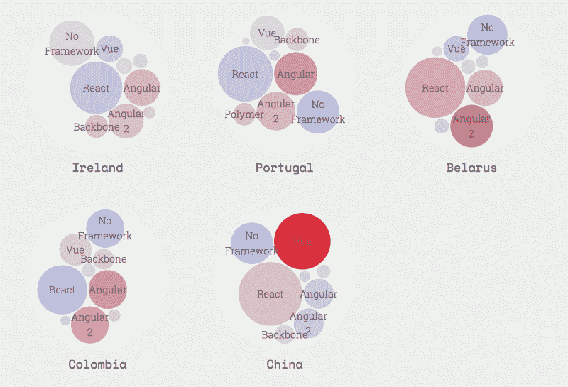

例如，你知道 Vue 在中国非常受欢迎吗？这是有道理的，因为 Vue 的创造者[尤雨溪](https://twitter.com/youyuxi)会说这种语言，而且 Vue 已经被多家主要的中国科技公司采用，如[阿里巴巴](https://www.alibaba.com/)和[百度](http://www.baidu.com/)。

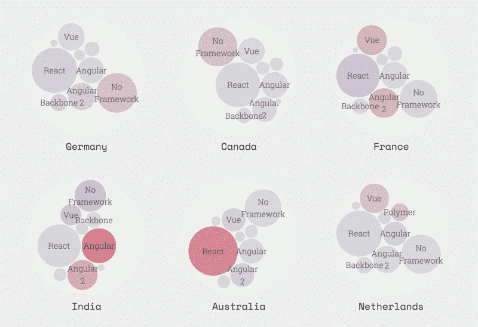

另一方面，印度似乎更喜欢棱角分明。这可能至少部分是由印度充满活力的外包行业推动的，该行业经常追逐 Angular 最适合的大型企业项目。

### 洞察力#9:类型化 JavaScript 正在崛起

打字稿。GraphQL。榆树。原因。这些都有什么共同点？首先，它们都是发展迅速的尖端技术。第二，都是靠类型。

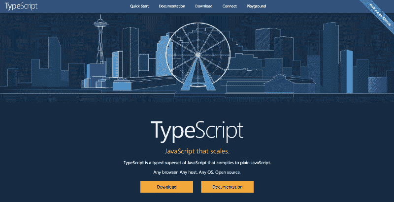

It’s got “type” right there in the name. A bit too on the nose if you ask me…

虽然 JavaScript 开发人员长期以来一直享受着自由，可以随心所欲地编码，而不会被编译器吼来吼去，但这种自由可能是一把双刃剑:它也意味着更不可靠、更容易出错的开发人员体验。

然而在 2017 年，事情终于发生了变化。随着 TypeScript 被更广泛地采用，开发人员也在向类似 IDE 的文本编辑器(如 VS Code)迁移，以更好地利用类型提供的额外功能，这并不是巧合。

### 洞察力#10: JavaScript 是你想要的任何东西

这个调查再次显示了 JavaScript 生态系统已经变得多么丰富。

看起来，经过多年在与 JavaScript 斗争和忽视之间的交替，开发人员社区终于找到了第三个选择:*改进*它。

认识到“JavaScript”基本上是你用它做的任何东西，这为语言变形和适应以满足几乎任何需求打开了大门，而且这种趋势没有停止的迹象。

这可能是为什么大多数开发人员都认为，尽管有缺陷，但这种语言总的来说正朝着正确的方向发展:

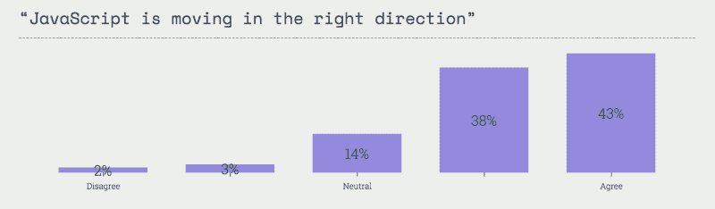

### 下一步是什么

我们仍在分析和发布一些额外的数据。如果你想知道什么时候发布(或者如果你想知道我们什么时候开始 2018 年版的调查)，你可以[给我们留下你的电子邮件](https://stateofjs.com/)

此外，我们在《最佳杂志》的朋友们正在努力编写 2017 年版的年度[明日之星](https://risingstars2016.js.org/)综合报道，该报道将于 1 月初发布。在此之前，新年快乐，并希望您的财产永远不会被定义！

### 学习和支持 JS 的状态！

最后，如果你想支持这个项目，同时了解所有这些很酷的新技术，我们建议查看这些链接到 [Wes Bos](http://wesbos.com) 课程。他是周围最好的老师之一，在他的视频上投入了大量的精力，我个人也用他的材料来学习 React。

[**ES6 for every one**](https://es6.io/friend/STATEOFJS?utm_source=stateofjs&utm_medium=sponsor&utm_campaign=10things&utm_content=textlink)
[*一门高级培训课程，旨在强化您的核心 JavaScript 技能，掌握 ES6 提供的所有技能。21 个模块…* es6.io](https://es6.io/friend/STATEOFJS?utm_source=stateofjs&utm_medium=sponsor&utm_campaign=10things&utm_content=textlink) [**React 适合初学者**](https://reactforbeginners.com/friend/STATEOFJS?utm_source=stateofjs&utm_medium=sponsor&utm_campaign=10things&utm_content=textlink)
[*想升级自己的 JavaScript 技能，学习 React.js？学习如何构建网站和 web 应用程序，只需几个…*reactforbeginners.com](https://reactforbeginners.com/friend/STATEOFJS?utm_source=stateofjs&utm_medium=sponsor&utm_campaign=10things&utm_content=textlink)[**学习 Node**](https://learnnode.com/friend/STATEOFJS?utm_source=stateofjs&utm_medium=sponsor&utm_campaign=10things&utm_content=textlink)
[*一个高级培训课程，学习使用 Node.js、Express、MongoDB 和 friends 构建应用程序。*learnnode.com](https://learnnode.com/friend/STATEOFJS?utm_source=stateofjs&utm_medium=sponsor&utm_campaign=10things&utm_content=textlink)[**JavaScript 30**](https://javascript30.com/friend/STATEOFJS?utm_source=stateofjs&utm_medium=sponsor&utm_campaign=Front-end&utm_content=textlink)
[*用香草 JS 用 30 天打造 30 样东西用 30 个教程*javascript30.com](https://javascript30.com/friend/STATEOFJS?utm_source=stateofjs&utm_medium=sponsor&utm_campaign=Front-end&utm_content=textlink)