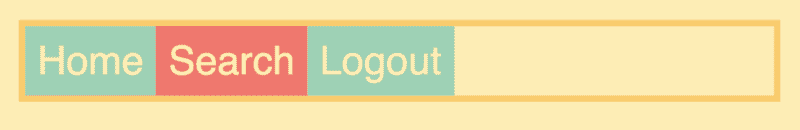
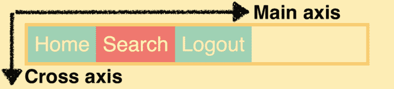
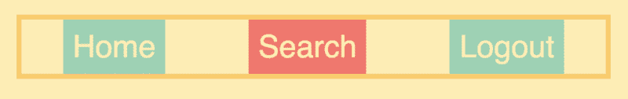
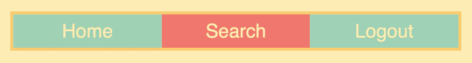
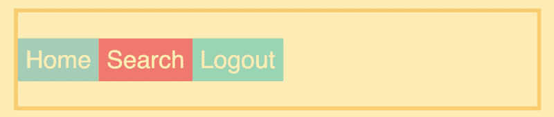
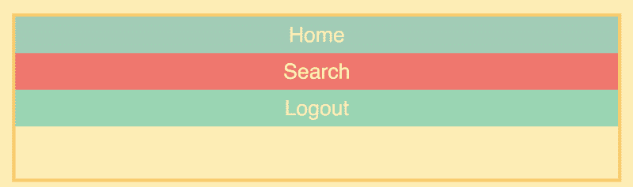
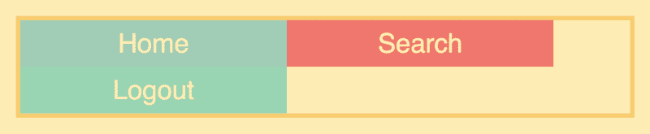
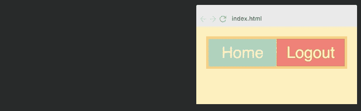
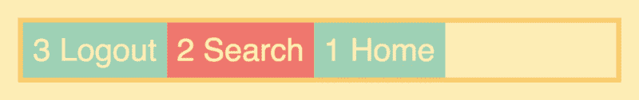

# 在这个自由和互动的教程学习 CSS Flexbox

> 原文：<https://www.freecodecamp.org/news/i-just-launched-a-free-full-length-flexbox-course-where-you-can-build-projects-interactively-1860e3d3c4af/>

在 [CSS 网格课程取得成功后，我在 12 月与 freeCodeCamp 一起推出了](https://medium.freecodecamp.org/heres-my-free-css-grid-course-merry-christmas-3826dd24f098)(到目前为止已有超过 14，000 名学生！)，我决定推出第二个免费课程。

这次可以学习 Flexbox，这已经成为前端开发者的必备技能。

Flexbox 也是我从学习 CSS 网格课程的学生那里收到的最多的请求之一。

在本文中，我将解释 Flexbox 课程是如何安排的，以便您可以决定它是否适合您。

但是如果你想立即直接进入课程，你可以直接[去那里开始](https://scrimba.com/g/gflexbox?utm_source=freecodecamp.org&utm_medium=referral&utm_campaign=gflexbox_launch_article)。

更新:我还在这里推出了一个免费的 [CSS 变量课程。](https://scrimba.com/g/gcssvariables?utm_source=freecodecamp.org&utm_medium=referral&utm_campaign=gflexbox_launch_article)

[Click here to get to the course.](https://scrimba.com/g/gflexbox?utm_source=freecodecamp.org&utm_medium=referral&utm_campaign=gflexbox_launch_article)

### 我的 Flexbox 课程涵盖的内容

该课程由 12 个互动屏幕广播组成，带您从初级到高级。它的重点是尽可能早地给你相关的技能，这意味着我已经根据我认为它们在现实世界中的有用程度对它们进行了优先排序。

因此，如果你只完成了前五项，你仍然会学到新的概念，你可以开始在你的项目中使用。这就是说，我仍然建议通过整个事情的工作。

在整个课程中，您将使用 navbar 进行构建和实验，因为这是 Flexbox 的一个非常典型的用例。

让我们看一下每个截屏:

#### 第一课:你的第一个 Flexbox

您将从创建一个简单的布局开始。这将教你 flex **容器**和 flex **项目**的概念，这是 Flexbox 布局的两个核心要素。

#### 第二课:主轴和横轴

在第二个截屏中，我解释了 Flexbox 的一个核心概念，这是早期理解的关键:轴。Flexbox 布局有两个轴:主轴和横轴。默认情况下，主轴是水平的，横轴是垂直的，但它们也可以翻转角色。

#### 第三课:如何调整内容

`justify-content`属性控制主轴上的内容。在整个课程中，你的主轴大部分是水平的，而不是垂直的。我选择这样做是因为我发现现实生活中水平的 Flexbox 布局比垂直的更常见。

#### 第 4 课:如何定位单个项目

在本课中，您将学习如何使用将`margin`设置为自动的古老技巧来定位单个项目。

#### 第 5 课:弹性属性

属性允许你给你的项目相应的宽度。它实际上是另外三个属性的简写:`flex-grow`、`flex-shrink`和`flex-basis`。但是我们会把这些留到课程的最后，因为它们更高级。

#### 第 6 课:如何对齐项目

属性控制横轴上的项目，在我们的例子中横轴是垂直的。在上面的图像中，我们已经沿着这个轴将项目居中。

#### 第 7 课:弹性方向列

将`flex-direction`设置为列将翻转主轴和横轴，这样物品就向下放置，而不是侧向放置。

#### 第八课:包装

默认情况下，Flexbox 不允许你包装你的项目，这意味着它们将停留在一行或一行。如果你设置`flex-wrap`换行，你就可以了。我将展示这将如何进行。

#### 第 9 课:弹性增长、收缩和基础

Flex 的增长、收缩和基础理解起来有点复杂，所以这是本课程中最长的截屏。简而言之，`flex-basis`设置项目的基本宽度，`flex-grow`控制它如何超出基本宽度，而`flex-shrink`控制当项目比其基本宽度窄时它如何收缩。

#### 第十课:秩序

我们将以关于`order`地产的讲座结束课程。这将向您介绍*源顺序独立性*，它允许您独立地设置项目的顺序，而与它们在 HTML 中的布局无关。

#### 奖金部分

在奖金部分，您将从头到尾创建两个现实世界的布局。

在第一个例子中，你将利用你在课程中学到的一切，创建一个能适应不同屏幕尺寸的导航条。

在第二次额外讲座中，您将尝试使用 Flexbox 创建一个图像网格。如果你学过我的 CSS 网格课程，你会从那里认出设置:

仅此而已。

### 辛巴格式

最后，让我们看看课程背后的技术。它是用 Scrimba 构建的，这是一个交互式编码截屏工具，是由我的两位令人敬畏的联合创始人[辛德雷](https://medium.com/u/c825b7f99be3)和[马格努斯](https://medium.com/u/1a7998d688dd)构建的。

Scrimba 截屏看起来像普通的视频，但它们是完全互动的。您可以编辑类型转换中的代码。

这里有一张解释这个概念的 gif 图:

暂停截屏→编辑代码→运行！→查看您的变化

当您觉得需要试验代码以便正确理解它时，或者当您只想复制一段代码时，这是非常有用的。

此外，因为 Scrimba 截屏是在代码编辑器中进行的，它们只占用普通视频带宽的 1%。这意味着 Scrimba 屏幕广播更容易传输——即使你的互联网连接很慢。

我希望你喜欢这门课程。如果你有任何反馈或要求添加更多的视频，请随时在 Twitter 上告诉我，我很乐意考虑。

编码快乐！

* * *

感谢阅读！我的名字叫 Per Borgen，我是最简单的学习编码方法——Scrimba 的联合创始人。如果你想学习建立专业水平的现代网站，你应该看看我们的[响应式网页设计训练营](https://scrimba.com/g/gresponsive?utm_source=freecodecamp.org&utm_medium=referral&utm_campaign=gflexbox_launch_article)。

[Click here to get to the advanced bootcamp.](https://scrimba.com/g/gresponsive?utm_source=freecodecamp.org&utm_medium=referral&utm_campaign=gflexbox_launch_article)