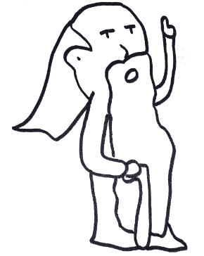

# 我什么都不知道，但没关系

> 原文：<https://www.freecodecamp.org/news/i-know-nothing-but-it-is-okay-6c0d9a4fe09f/>

纳斯塔西亚·萨比

# 我什么都不知道，但没关系

Photo by [freestocks.org](https://unsplash.com/photos/YTUZcmmf1eU?utm_source=unsplash&utm_medium=referral&utm_content=creditCopyText) on [Unsplash](https://unsplash.com/search/photos/knowledge?utm_source=unsplash&utm_medium=referral&utm_content=creditCopyText)

作为一名开发人员，我最喜欢的一件事就是学习。但是要学习一些东西，你必须承认你不知道。

有时会很困难。

前一段时间，我被要求处理一个线性回归。我慌了。除了知道它是数学之外，我对它的内容一无所知。问题是我确信我应该知道这一点。

我在责备自己:“但是为什么你有文学学士学位(高中学位)，而不是像你职业中的其他人一样有普通的学士学位？你为什么更喜欢在大学学习文学而不是计算机科学？如果你选择了正常研究，你就会知道什么是线性回归。你应该知道该怎么处理。你没有权利在这里。你是个骗子”。

然后我做了我害怕时会做的事:打电话给我妹妹。她有一个“普通”的学士学位。

"嗨妹妹，你能解释一下什么是线性回归吗？"

她回答我说，她不知道那是什么，她在高中时从来没有学过。

我如释重负。我仍然不知道什么是线性回归，但我可以坦然承认我的无知。我花了一些时间去理解它，并最终处理了它。

你可以说这个故事结局很好。我不太确定，因为我应该在给我妹妹打电话之前承认我的无知。

有时候，我有一种不在自己位置上的感觉。我觉得我在抢别人的工作，一个学习“正常”的人。因此，我害怕暴露。

我知道我不是唯一一个有这种感觉的人。你会发现自己处于这种情况有很多原因。

我最近和一个才华横溢的人一起工作，他有很多能力。但她肯定是个冒名顶替者，因为她不知道这个框架或 Java 中的这个东西，这让她在工作中遇到了麻烦。

如果我们退后一步，如果你不知道一些事情，这并不可耻。最重要的是承认。

第一，不可能什么都知道。

那么，如果你没有学到什么，可能是因为你在做别的事情。如果说我直到现在才知道卡夫卡是如何真正处理来自制片人的信息的，那是因为我花了几个月的时间学习关于 Spark 的东西。这东西帮我通过了认证。到头来还不算太糟。

也是因为我最终意识到我对 Scala 函数式编程知之甚少，所以我决定去上在线课程。再说一次，这并不坏。

说你不知道是进步的一种方式。

我不禁想起苏格拉底和这句绝妙的句子:

> 我唯一知道的是我什么都不知道。

A philosopher — drawing from me

最伟大的哲学家之一(对我来说，也对许多人来说)自称无知。我相信认识到自己的无知是自我进步和提高标准的有力途径。

当你认识到你所不知道的，你就不会有偏见。你可以平静地学习。你不是小心眼。你准备好学习一切。

因此，我很高兴学会了线性回归的概念，即使在开始时我完全不知所措。

我应该平静而直接地说出真相:“我对线性回归一无所知，但没关系。我会学的”。

Peaceful landscape — picture from Vincent Sebille