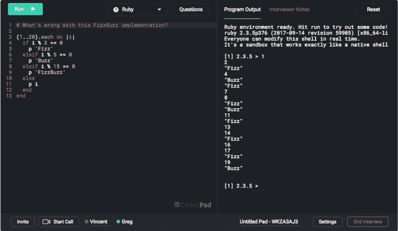
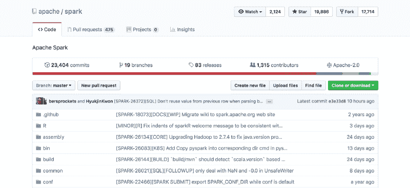
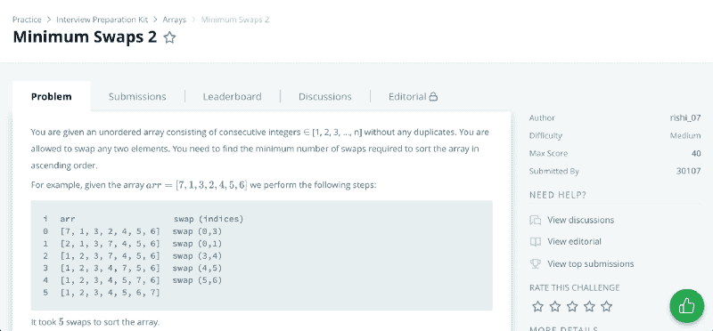

# 我在脸书找到了一份实习工作。以下是我学到的一些技巧。

> 原文：<https://www.freecodecamp.org/news/i-landed-an-internship-at-facebook-here-are-some-tips-i-learned-b83685cde27/>

作者 Chester Leung

# 我在脸书找到了一份实习工作。以下是我学到的一些技巧。

The CoderPad coding interview environment. [Image credit](https://coderpad.io/getting-started-candidates).

在面试了谷歌、微软、Dropbox、Yelp 等公司后，我最近接受了脸书的邀请。我花了一点时间来反思和思考是什么帮助我脱颖而出。这里有一些提示，按过程的不同部分分类。

### **获得面试机会:建立简历**

吸引一家公司及其招聘团队眼球的最重要因素可能是你的简历。自从我三年前涉足这个行业以来，随着我获得了更多的经验，我的简历也发生了变化。年复一年，随着我简历的变化，我从公司得到的回复率大大提高了——每年我都收到更多实习申请的回复和跟进。真的，我的简历只有几处大的改动。下面我重点介绍三个。

**研究**。我认为这为我打开了更多的大门——在我开始做研究后的那个学期，我从公司那里得到了大约 75%的回复。如果你有机会在教授或研究生手下工作，抓住它。你不仅能在短时间内学到大量知识，并得到该领域一些最聪明的人的指导，而且(在你的简历中)你还展示了超越课堂的热情和学习动力。

做研究可以培养一种心态，去解决学术界和工业界都存在的棘手、复杂的问题。公司希望有潜力的人加入进来并产生影响，表明你有合适的心态和相关经验是朝着正确方向迈出的一步。

**开源**。您参与的项目也可能是开源的，这是您的应用程序的另一个优势。如果找不到研究岗位，贡献开源。开源通常被认为是非常积极的，公司吹嘘他们对它的贡献有多大。它给你机会去做一些有益于整个社区的事情，并为一个可能比你大得多的项目添砖加瓦。

Apache Spark: a famous open source project

**一个个人网站**。也许这只是我一个人的想法，公司实际上并不关注这一点，但似乎拥有一个个人网站会让你比那些不关注它的公司领先一步。就我个人而言，我注意到在我的简历中加入个人网站后，招聘季的回复率提高了 50%。

开发你的个人网站，建立了你的个人品牌，说明你有基本的前端知识。你花时间学习 HTML 和 CSS，并使用你所使用的 web 框架——这是你真正对软件开发感兴趣的另一个标志。

### **准备面试**

你收到了一封招聘人员的邮件。现在怎么办？准备时间到了！

软件工程实习面试通常有两个部分:行为和技术。

#### **行为准备**

准备一个 1-2 分钟的自我介绍。去年夏天你做了什么？你上过哪些你非常喜欢的课？你最近做了哪些很酷的项目？一定要包括你的研究和开源经验。

通常面试持续 45-60 分钟，所以最多有 15 分钟讨论非技术细节。在与每家公司面谈之前，我都浏览了一下它们的网站和相关博客，以了解更多信息。

每个公司有什么酷的地方？他们实际上做什么？有没有不太出名的分支机构在做更吸引我的工作？

找到并讨论那些表明你花时间做了一些研究的事情。在最初的调查中把这些东西写下来，这样你以后可以参考它们(就像在面试之前！).每一件小事都可能让你从接下来的 20 名候选人中脱颖而出。

面试官一般会做自我介绍，可能会讲讲公司的使命是什么，是做什么的，然后让你讲讲自己。准备好背你准备的东西。

#### **技术准备**

技术性的东西，嗯，是技术性的——你必须花时间去学习这些材料。以下是我用来帮助我准备面试的一些很好的资源:

*   一块白板。面试官经常会让你写出代码，或者像谷歌文档那样无法编译的代码。也就是说，你不知道自己是否犯了语法错误。准备的时候试着在白板上写下代码。这与普通开发环境中的编码有很大不同。你也可以使用白板来勾画和想象你的想法。
*   [破解编码面试](https://www.amazon.com/Cracking-Coding-Interview-Programming-Questions/dp/0984782850/ref=sr_1_2?ie=UTF8&qid=1544962927&sr=8-2&keywords=cracking+the+coding+interview)。它对采访中涉及的大多数话题都有简短的评论，还有一堆难度不等的问题。我买了一本硬拷贝。这让我能够在内容部分突出重要的注释，并在问题旁边画一些图表。内容部分对各种主题进行了很好的总结，比如数据结构、排序、动态编程等等，以此来刷新你的记忆。实际上，我在采访中看到过几个直接取自这本书的问题。可能是最大的资源。
*   [LeetCode](https://leetcode.com/problemset/all/) 。LeetCode 就像破解编码面试一样，有不同层次的问题供你练习。但是 LeetCode 提供了一个在线环境，在这里你可以输入代码，你的代码可以在这里编译和运行。这是检查代码实际运行的好方法，也是练习调试的好平台。(注意:能够快速找出代码哪里有 bug 是关键。这会在实际面试中帮到你很多。每个问题都有一个论坛，在那里你可以看到其他人是如何处理这个问题的。看到你可以用其他方法解决问题总是很酷的。
*   [HackerRank](https://www.hackerrank.com/dashboard) 。很多公司使用 HackerRank 来应对编码挑战，HackerRank 已经编写了一个[面试准备工具包](https://www.hackerrank.com/interview/interview-preparation-kit)来帮助你准备面试。该工具包回顾了许多与破解编码面试相同的主题，但为您提供了一个通过物理编码来应用概念的平台。这将帮助你习惯在线编码环境，它与实际面试中使用的环境非常相似。

A HackerRank Interview Preparation Question

### **实际面试**

你的采访到了。行为部分来了又走了。该出发了。

在你第一次遇到这个问题后，花些时间思考一下。不要觉得你必须立即解决问题。在你开始编码之前，和你的面试官讨论一下你的方法。有时候，在你开始编码之前，面试官想要一个比你最初的解决方案更有效的解决方案，或者可能告诉你他们不关心效率，任何旧的强力方法都可以。

这也给了面试官一个给你反馈的机会。在这方面，定期寻求反馈或指导。一些面试官以这种方式帮了我大忙。把面试想得不那么像考试，更像是合作解决一些问题。

小提示:如果你不记得特定语言函数的确切语法，问问你是否可以查一下。根据我的经验，通常可以，或者面试官会给你可以使用的功能签名。

#### 祝你好运！

希望你已经从这篇文章中学到了一些东西。在我的大学生涯中，我有许多支持我的同龄人和导师给我指导和建议。希望转发一下，让你的实习找的轻松一点。

如果你需要任何个人指导，请随时在 LinkedIn 上给我发消息。添加一个关于这篇文章的小说明，这样我就知道你不只是想增加你的连接数量。感谢阅读！祝你好运！