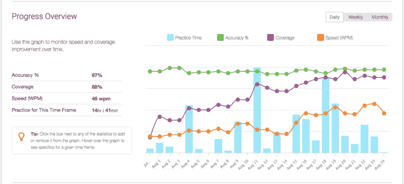
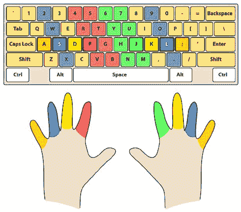
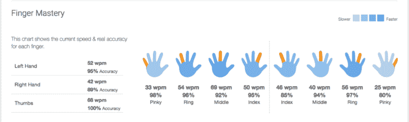

# 我在 29 岁的高龄学会了触摸打字。值得吗？

> 原文：<https://www.freecodecamp.org/news/i-learned-to-touch-type-at-the-ripe-old-age-of-29-was-it-worth-it-112ef2150fec/>

马修·伯菲尔德

# 我在 29 岁的高龄学会了触摸打字。值得吗？

Photo by [rawpixel.com](https://unsplash.com/photos/hPlajOgEs3s?utm_source=unsplash&utm_medium=referral&utm_content=creditCopyText) on [Unsplash](https://unsplash.com/?utm_source=unsplash&utm_medium=referral&utm_content=creditCopyText)

我最近读了一篇文章，以最简单的形式说，编程就是在键盘上按键。

从根本上来说，程序员就是打字员！我们只是碰巧按特定的顺序按键，让编译器读取字符的组合，并将它们转换成机器代码。

因此，如果你打字很慢，你的 IDE 有多好，你的文本编辑器有多好，或者你认为你的工作流程有多高效，都没有关系。你总是会受到打字速度的限制。

现在，我听到了这样一种观点，作为一名程序员，打字速度并不那么重要。你应该花大部分时间思考给定的问题/解决方案，而不是实际打字。

我倾向于同意。但是，在所有事情都相同的情况下，我还是宁愿打字更快，这样我就可以尽快处理下一个问题。毕竟，在我的职业生涯中，我计划编写数万行(如果不是数百行)代码。那要打很多字。

Jim Carrey typing as God in the film Bruce Almighty

### 评估我的技能

不要误解我，我的打字速度并不可怕。我以每分钟大约 40 个单词的速度打字，这显然是平均水平(尽管我找不到任何确切的来源)。我甚至可以不用看键盘就能打字。多年来，我已经形成了一种相当粗略的风格，我用四个手指——我的两个食指和中指。

我本能地知道键盘上的字母键在哪里，但仍然需要不时地往下看。尤其是数字、符号和标点符号(逗号、句号等)。

我知道我可以更有效率。尝试用十个手指打字一个月，看看效果如何，有什么坏处呢？如果我看不到任何改进，我可以随时恢复。

因此，在我 29 岁的高龄，我决定是时候自学如何触摸打字了。

### 开始使用正确的程序

我在谷歌上搜索学习触摸打字，第一个出现的网站是[打字俱乐部](https://www.typingclub.com/)。它是免费的，界面也很好，所以我选择了它。

从我开始练习到现在已经将近一个月了，我已经花了 14 小时 44 分钟来练习。

My stats taken from typingclub.com

如你所见，我在 7 月 31 日才开始，我的速度(wpm —橙色线)一直在稳步增长。

仅仅过了一个月，我的打字速度已经提高了 10wpm。我对键盘的代码覆盖率也有所提高。这不完全是一帆风顺的，但也不完全是艰难的。

这是我每周的笔记。

### 第一周

本周平均打字速度:15 瓦/分

最初几天很简单。我开始一次学一把钥匙。当你学习认字键时，进步感觉很快——经过一个小时左右的练习，我已经掌握了字母表的四分之三。打字感觉很好，也相对容易。

但是试图在现实世界中使用我新获得的打字技能完全是一场灾难。

我不仅慢，而且不准。这让我做的每件事都非常低效和令人沮丧。不用说，我还不能在现实世界中使用我的触摸打字技能。

### 第二周

本周平均打字速度:每分钟 22 次

第二周之后，我已经学完了所有的字母表和一些数字。

但有趣的是:键盘右侧的 shift 键对我来说完全陌生，我以前从未使用过。使用触摸键入，您可以使用右 shift 键来大写左手键，使用左 shift 键来大写右手键。

在现实世界中打字还是太慢了。我仍然没有足够的练习在所有的键上打字，尤其是在编程中一直使用的符号键。

### 第三周

平均打字速度:每分钟 39 字

第三周下来，我终于涵盖了整个键盘。我打字已经和开始前一样快了。太疯狂了！仅仅经过三个星期的刻意练习，我已经用我的老方法打字一样快了。

我甚至能够在真实世界的场景中开始触摸打字！

目前有两件事让我慢了下来:

1.  我花了一秒钟把手指对准正确的键。我必须把左手放在 a，s，d，f 键上，右手放在 j，k，l，；钥匙。重要的是我首先要把它们放在正确的位置上，否则我的准确度会下降。
2.  在触摸打字中，你用右手小指按一串键(见下文)。我仍然很低效和不准确，在编程中我一直在使用它们。

[image credit](https://spaceplace.nasa.gov/sign-here-typing/en/)

这对右手小指来说是一个很大的障碍。我肯定还需要一段时间来提高效率。

毫不奇怪，打字俱乐部显示我的右手小指是我效率最低的手指。

Finger mastery screenshot from typingclub.com

到目前为止，我已经打了 70%的球杆。实际上没有什么需要学习的，所以现在只需要练习。我要努力完成它。我目前平均每分钟打 50 个字，我的最好成绩是每分钟 61 个字。我的准确率通常在 95%左右。

### 结论

我认为这一个月提升我打字风格的投资是非常值得的。在第三和第四周，我看到我的打字速度有了显著的提高，现在还有进一步提高的潜力。

我已经超越了我以前的打字速度，现在可以在野外使用我的触摸打字而不会感到沮丧。

现在触摸打字最烦人的地方是，大多数时候，我只打少量的字。就像，几个词。而且仅仅是把我的手正确地放在键盘上就要花相当长的时间。毫无疑问，随着时间的推移，随着我对触摸打字越来越熟悉，这种情况会有所改善。

我还需要提高我对数字和符号的准确性——但同样，这需要时间。

总的来说，我真的很感谢我花时间来提升这项技能。我确信这将对我的职业生涯大有裨益。

如果你喜欢这篇文章，请给我一些掌声，让更多的人看到它。谢谢！