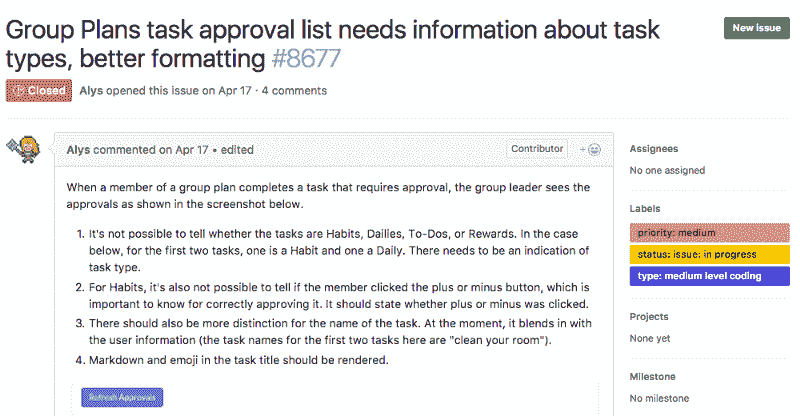
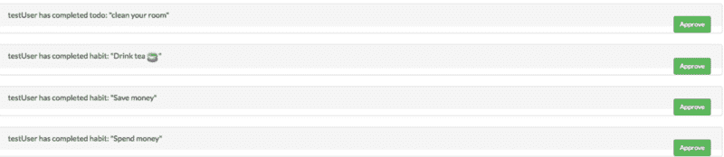
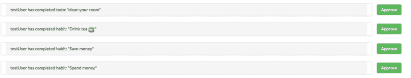
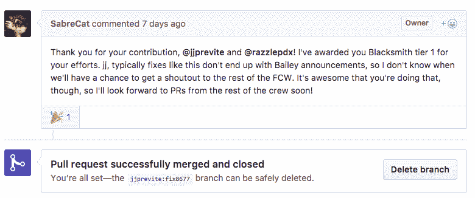

# 我在 200 天内做出了我的第一份开源贡献(你也可以这样做)

> 原文：<https://www.freecodecamp.org/news/i-made-my-first-open-source-contribution-within-200-days-and-how-you-can-too-4d5bdbd63fad/>

2016 年 12 月 22 日，我创建了一个 freeCodeCamp 账号。2017 年 7 月 1 日，我的第一个 pull 请求被合并到了一个开源项目中。

我想写这篇文章与他人分享我的经验。我希望它能向您展示，为开源项目做贡献比您想象的要容易。

### 你为什么要为开源做贡献？

您可能听说过，作为一名开发人员，为做贡献是对您时间的一种很好的利用。但是如果你还不相信，这里有两个理由可以考虑:

#### 理由 1:这将有助于你找到工作

这是我决定为开源项目做贡献的主要原因之一。我大学校友中的一些高级开发人员告诉我，这可以让我看起来更有竞争力。

当你通过 freeCodeCamp 自己做一个项目，或者一门课程，你是唯一一个必须批准代码的人。对于一个开源项目，成千上万的人可能会使用你写的代码。因此，编写干净、可重用的代码的压力更大了。

此外，开发人员社区必须接受它。所以当他们接受你的代码时，这很有分量，因为有很多人看过它。

我认为，可以肯定地说，对雇主来说，开源贡献比大多数个人项目更重要。

#### 原因 2:这是对社区的回馈

为开源项目做贡献给了你一个志愿贡献时间来改进你和你的社区所使用的项目的机会。这可能是编程最酷的方面之一。

有人建立了一个项目，然后他们将它开源，这样公众就可以看到源代码。然后一群互不认识的人贡献代码。它可以改善全世界人民的生活。世界上没有什么东西能与之相比。

### 为开源做贡献的过程是怎样的？

你可能想知道我是怎么做的。首先，我定期检查我使用的应用程序和网站，看看是否有开源的。

接下来，我问了几个和我关系密切的编程朋友(他们是我第一次在 Chingu 群组中认识的)；)而且我们都同意一起接受挑战。

我们决定选择游戏化任务管理器 [Habitica](https://habitica.com/) 。

我们选择它的原因如下:

*   我们每天都在使用它
*   他们的贡献的[维基写得很好](http://habitica.wikia.com/wiki/Guidance_for_Blacksmiths)
*   他们鼓励新手做出贡献
*   他们的代码库主要由 Javascript 组成
*   他们有一个小组，当你遇到困难时，你可以问问题并获得帮助

接下来，我们讨论了我们认为最好的解决方法。

以下是我们使用的分步行动计划:

#### 第一步:找一个“导师”——如果我们迷路了，可以在社区中帮助我们的人

幸运的是，Habitica 有一个很棒的程序员协会，叫做“有抱负的铁匠(为 Habitica 编码)”我们在群里发帖，一个成员同意给我们提供一些指导。

#### 第二步:找到适合我们技能水平的问题

接下来，我们查看了 [Habitica Github repo](https://github.com/HabitRPG/habitica/issues) 上的问题，并找到了那些标记为“中级编码”的问题我们挑选了四个选项，然后问我们的导师哪一个最适合我们的第一次投稿。经过我们小组的讨论，我们决定选择[这个](https://github.com/HabitRPG/habitica/issues/8677#event-1146999223)。



#### 第三步:单独进行，但也要通过结对编程会话

这个问题花了两个星期，或者大约 14-18 个小时来解决。我们通常每天花 1-4 个小时在这上面。我们花了大部分时间来弄清楚我们需要更改哪些文件。

我们花了几个小时查看项目文件夹。我们搜索了不同的术语，如“组”和“组批准”，直到我们能够找到需要修复的代码行。

找到文件后，我们面临新的挑战。我们必须弄清楚如何从数据库中获取数据，并能够在 JSON 文件中调用它，以显示在“Group Plans Task Approval”页面上。

我们查看了数据库中的对象，发现了一个任务类型键值对，其中包含了我们需要的信息。然后我们必须将它作为一个名为`groupApprovalsController.js`的文件中对象的属性添加到一个对象中。这样我们可以在 JSON 文件中引用它。多亏了我们在 [freeCodeCamp](https://www.freecodecamp.org) 、柯尔特·斯蒂尔 [Web 开发者训练营课程](https://www.udemy.com/the-web-developer-bootcamp/)和阅读[你不知道的 JS](https://github.com/getify/You-Dont-Know-JS) 上的 JavaScript 经验，我们才能搞清楚这一切。

我们面临的下一个挑战是能够渲染 markdown 和表情符号。该项目使用了由主要项目程序员之一开发的 npm 包，所以文档很容易理解。我们查看了类似的 Jade 页面，并识别出降价是如何呈现的模式。

一旦我们知道了 markdown 的语法和需要添加的页面。我们以为剩下的会很容易。但事实并非如此。我们努力想出如何传入我们需要的特定文本。

经过几个小时的挫折和多次不成功的尝试，我们终于弄明白了。我们必须将一个参数“approval”传递给一个名为`approvalTitle`的函数，并将文本设置为等于该参数。我们最后写的那行是:

```
markdown(text = “approvalTitle(approval)”)
```

当然，我们以为已经完成了…直到我们注意到新代码移动了页面上“批准”按钮的位置。



一个解决方案带来了新的问题，但我们接受了新的挑战并坚持了下来。挖了一圈之后，Rachel 找到了一个 Bootstrap 补丁，让它看起来好一点。



#### 步骤#4:提交一个拉动请求(PR)来征求反馈

我们的修复并不完美，但它解决了大多数问题，只有几个小的格式问题。我们向有抱负的铁匠协会寻求帮助。他们建议我们提交拉取请求以获得反馈。我们提交了一个包含我们更改的。不久之后，另一个开发人员就如何解决格式问题提出了一些建议。

#### 步骤#5:清理代码并提交最终的 PR

在清理提交并以有意义的方式组织它们之后，我们提交了最终的 PR。

#### 第六步:合并后庆祝

2017 年 7 月 1 日星期六，我们的 PR 合并了，我们庆祝了一下。



### 我学到了什么？

这些是我从我的第一份开源贡献中学到的主要东西:

*   如何处理别人写的代码
*   如何与另一个开发人员合作修复 bug
*   如何提交拉式请求
*   如何编写有意义的提交消息
*   如何为开源项目做贡献

我非常感谢 Habitica 社区给予我们的所有鼓励。我很高兴能和我的朋友瑞秋一起研究这个。由于这次经历，我作为一名开发人员成长了。

### 最后的想法

如果你像我一样是编程新手，我建议你考虑参与一个开源项目。一开始可能看起来很可怕，但其中的一部分确实很可怕。这意味着你正朝着正确的方向前进。

你正走出舒适区，进入未知领域。这是真正学习的地方。在这里，你会遇到意想不到的挑战。

如果你为一个你认为对新手有益的开源项目做出了贡献，请用名字来评论！:)

感谢阅读！我希望这篇文章对你有所帮助。如果有，请点击让我知道。或者在下面留言评论。