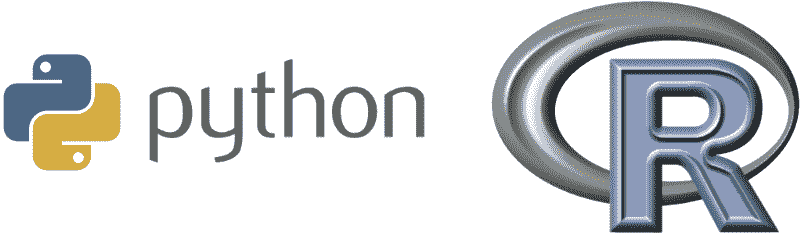
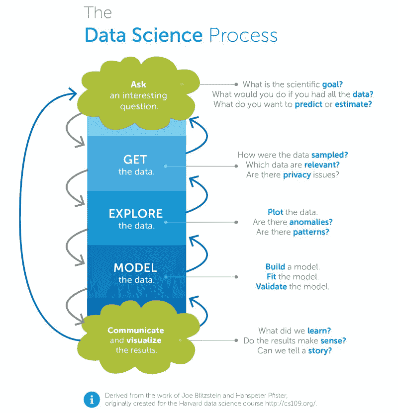
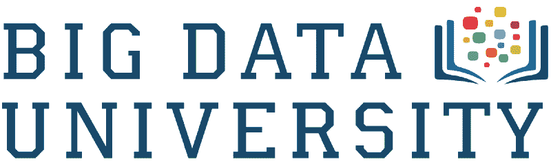
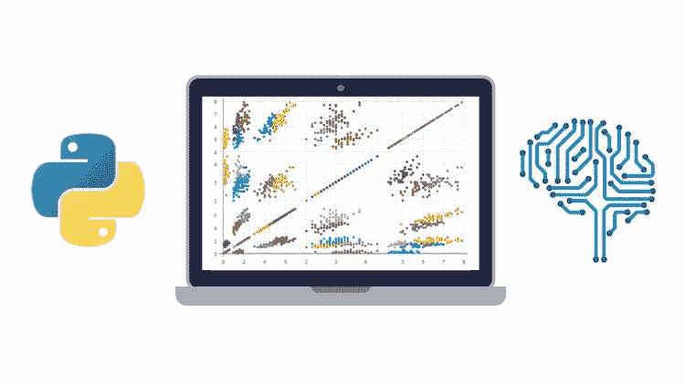
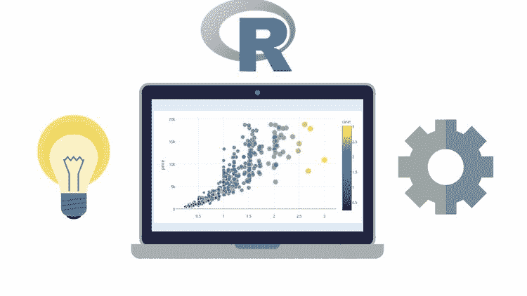
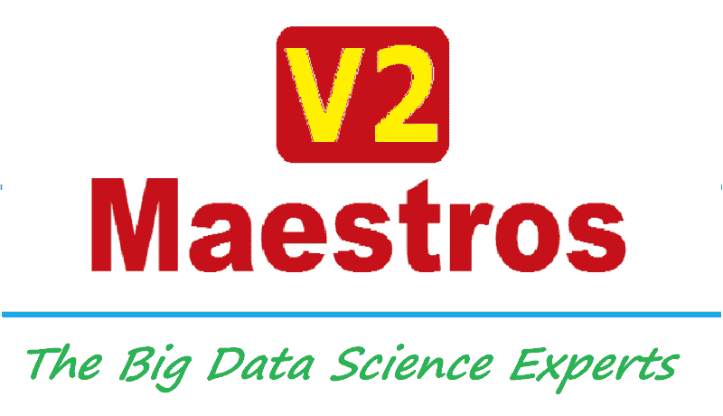
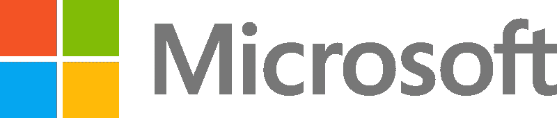
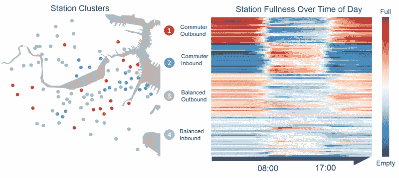

# 我根据数千个数据点，对互联网上的每一门数据科学导论课程进行了排名

> 原文：<https://www.freecodecamp.org/news/i-ranked-all-the-best-data-science-intro-courses-based-on-thousands-of-data-points-db5dc7e3eb8e/>

大卫·文丘里

一年前，我退出了加拿大最好的计算机科学项目之一。我开始利用在线资源创建自己的[数据科学硕士项目](https://medium.com/@davidventuri/i-dropped-out-of-school-to-create-my-own-data-science-master-s-here-s-my-curriculum-1b400dcee412#.5fwwphdqd)。我意识到，我可以通过 edX、Coursera 和 Udacity 来学习我需要的一切。我可以更快、更有效地学习它，而且只需要很少的费用。

我现在几乎完成了。我参加了许多数据科学相关的课程，并旁听了更多课程的部分内容。我知道有哪些选择，以及准备成为数据分析师或数据科学家的学员需要哪些技能。几个月前，我开始创建一个由评论驱动的指南，为数据科学中的每个学科推荐最佳课程。

对于本系列的第一个指南，我为初学数据科学家推荐了几个[编码类](https://www.freecodecamp.org/news/if-you-want-to-learn-data-science-start-with-one-of-these-programming-classes-fb694ffe780c/#.42hhzxopw)。然后是[统计和概率课](https://www.freecodecamp.org/news/if-you-want-to-learn-data-science-take-a-few-of-these-statistics-classes-9bbabab098b9/#.p7pac546r)。

### 现在介绍数据科学。

(如果您不确定数据科学入门课程需要什么，也不要担心。我很快会解释。)

对于本指南，我花了 10 多个小时试图识别截至 2017 年 1 月提供的每一门在线数据科学导论课程，从它们的教学大纲和评论中提取关键信息，并汇编它们的评级。为了完成这个任务，我求助于开源课程中央社区及其数千个课程评级和评论的数据库。

Class Central’s [homepage](https://www.class-central.com/).

自 2011 年以来， [Class Central](https://www.class-central.com/) 创始人[达瓦尔·沙阿](https://www.class-central.com/@dhawal)比世界上任何人都更关注在线课程。Dhawal 亲自帮我整理了这个资源列表。

### 我们如何选择要考虑的课程

每门课程必须符合三个标准:

1.  **它必须教授数据科学流程。**稍后更上。
2.  必须按需提供或每隔几个月提供一次。
3.  **它必须是一个互动的在线课程，所以没有书籍或只读教程**。虽然这些都是可行的学习方法，但本指南主要关注课程。

我们相信我们涵盖了所有符合上述标准的著名球场。由于 Udemy 上似乎有数百门课程，我们选择只考虑评论最多和评分最高的课程。不过，总有可能我们漏掉了什么。所以，如果我们漏掉了一门好的课程，请在评论区告诉我们。

### 我们如何评估课程

我们收集了中央课堂和其他复习网站的平均评分和复习次数，以计算每门课程的加权平均评分。我们阅读文本评论，并使用这些反馈来补充数字评级。

我们根据两个因素做出主观的教学大纲判断:

1.**数据科学流程的覆盖范围。**课程是否刷过或跳过某些科目？它是否过于详细地涵盖了某些主题？请参阅下一节了解这个过程需要什么。

2.**常用数据科学工具的使用。**课程是否使用 Python 和/或 R 等流行编程语言授课？这些课程不是必需的，但在大多数情况下是有帮助的，所以我们稍微倾向于选择这些课程。

Python and R are the two most popular programming languages used in data science.

### 数据科学流程是什么？

*什么是数据科学？数据科学家是做什么的？*这些是数据科学导论课程应该回答的基本问题类型。以下来自哈佛大学教授 Joe Blitzstein 和 Hanspeter Pfister 的信息图概述了一个典型的**数据科学过程**，这将帮助我们回答这些问题。

Visualization from [Opera Solutions](http://blog.operasolutions.com/bid/384900/what-is-data-science).

本数据科学简介课程的目标是熟悉数据科学流程。我们不希望对该过程的特定方面进行太深入的报道，因此标题的“简介”部分。

对于每个方面，理想的课程解释过程框架内的关键概念，介绍常用工具，并提供几个例子(最好是实践)。

我们只是在找介绍。因此，本指南不包括完整的专业或项目，如约翰霍普金斯大学 Coursera 上的[数据科学专业](http://click.linksynergy.com/fs-bin/click?id=SAyYsTvLiGQ&subid=&offerid=479491.1&type=10&tmpid=18061&u1=cc-medium-career-guide-intro-to-data-science &RD_PARM1=https%3A%2F%2Fwww.coursera.org%2Fspecializations%2Fjhu-data-science%2F)或 Udacity 的[数据分析师纳米学位](https://www.udacity.com/course/data-analyst-nanodegree--nd002?utm_medium=referral&utm_campaign=api)。这些课程汇编回避了本系列的目的:为每个学科找到最好的**个人**课程，以组成数据科学教育。本系列文章的最后三个指南将详细介绍数据科学过程的各个方面。

### 需要基本的编码、统计和概率经验

下面列出的几门课程需要基本的编程、统计和概率经验。这个要求是可以理解的，因为新的内容相当先进，而且这些科目通常有几门专门的课程。

这种经验可以通过我们在本数据科学职业指南的前两篇文章([编程](https://medium.freecodecamp.com/if-you-want-to-learn-data-science-start-with-one-of-these-programming-classes-fb694ffe780c#.ld31z08y5)、[统计](https://medium.freecodecamp.com/if-you-want-to-learn-data-science-take-a-few-of-these-statistics-classes-9bbabab098b9))中的推荐获得。

### 我们挑选的最佳数据科学入门课程是…

*   [数据科学 A-Z:现实生活中的数据科学练习包括](http://click.linksynergy.com/fs-bin/click?id=SAyYsTvLiGQ&offerid=507388.9685&type=3&subid=0&u1=cc-medium-career-guide-intro-to-data-science)(基里尔·叶列缅科/Udemy)

就覆盖 20 多个合格课程的数据科学流程的广度和深度而言，基里尔·叶列缅科在 Udemy 上的[数据科学 A-Z](http://click.linksynergy.com/fs-bin/click?id=SAyYsTvLiGQ&subid=&offerid=323058.1&type=10&tmpid=14538&RD_PARM1=https%3A%2F%2Fwww.udemy.com%2Fdatascience%2F%26u1%3Dcc-medium-career-guide-intro-to-data-science)是明显的赢家。在 3，071 条评论中，它的加权平均评级为 4.5 星，这使它成为被考虑的课程中评级最高和评论最多的课程之一。

它概述了整个过程，并提供了现实生活中的例子。在 21 小时的内容，这是一个很好的长度。评论家喜欢讲师的演讲和内容的组织。价格因 Udemy 折扣而异，这种折扣很常见，所以您只需 10 美元就可以购买接入服务。

虽然它没有检查我们的“常用数据科学工具的使用”框**，**，但是非 Python/R 工具选择(gretl、Tableau、Excel)在上下文中被有效地使用。叶列缅科在解释 gretl 选择(gretl 是一个统计软件包)时提到了以下内容，尽管它适用于他使用的所有工具(重点是我的):

> 在 gretl 中，我们将能够像在 R 和 Python 中一样进行同样的建模，但是我们不需要编码。这就是这里的大问题。你们有些人可能已经非常了解 R，但有些人可能根本不知道。我的目标是向你展示如何构建一个健壮的模型，并给你一个框架，你可以在你选择的任何工具中应用它。gretl 将帮助我们避免陷入编码的泥沼。

一位著名的评论家指出:

> 基里尔是我在网上找到的最好的老师。他使用现实生活中的例子，并解释常见的问题，让你对课程有更深的理解。他还就作为一名数据科学家意味着什么提供了许多见解，从处理不充分的数据一直到将您的工作提交给 C 级管理层。我强烈推荐这门课程，初学者到中级数据分析师！

### 一个非常棒的以 Python 为中心的介绍

*   [数据分析简介](https://www.class-central.com/mooc/4937/udacity-intro-to-data-analysis) (Udacity)

Udacity 的[数据分析简介](https://www.class-central.com/mooc/4937/udacity-intro-to-data-analysis)是一个相对较新的产品，是 Udacity 受欢迎的[数据分析师 Nanodegree](https://medium.com/@davidventuri/review-udacity-data-analyst-nanodegree-1e16ae2b6d12#.8uvi6hlpv) 的一部分。它使用 Python 清晰而连贯地涵盖了数据科学过程，尽管它在建模方面有所欠缺。估计的时间表是 36 小时(6 周内每周 6 小时)，尽管根据我的经验它会更短。在两次评论中，它的加权平均评级为 5 星。它是免费的。

视频制作精良，讲师(卡罗琳·巴克伊)清晰而有风度。大量的编程测验强化了在视频中学到的概念。学生们将对他们新的和/或改进的 NumPy 和 Pandas 技能(这些是流行的 Python 库)充满信心。期末项目——在纳米学位课程中进行评分和审查，而不是在免费的个人课程中——可以成为文件夹的一个很好的补充。

### 令人印象深刻的产品，没有评论数据

*   [数据科学基础](https://bigdatauniversity.com/learn/data-science/)(大数据大学)

数据科学基础(Data Science Fundamentals)是由 IBM 的大数据大学提供的四门课程系列。它包括名为[数据科学 101](https://bigdatauniversity.com/courses/data-science-101/) 、[数据科学方法论](https://bigdatauniversity.com/courses/data-science-methodology-2/)、[使用开源工具的数据科学实践](https://bigdatauniversity.com/courses/data-science-hands-open-source-tools/)和 [R 101](https://bigdatauniversity.com/courses/r-101/) 的课程。

它涵盖了完整的数据科学过程，并介绍了 Python、R 和其他几个开源工具。这些课程具有巨大的生产价值。估计需要 13-18 个小时的努力，这取决于你最后是否学习了“R 101”课程，这对于本指南来说是不必要的。不幸的是，它没有我们用于分析的主要评论网站的评论数据，所以我们还不能推荐它超过上述两个选项。它是免费的。

### 竞争

我们的第一选择在 3，068 条评论中的加权平均评分为 4.5 分(5 颗星)。让我们看看其他备选方案，按评级降序排列。下面你会找到几门以 R 语言为重点的课程，如果你想学习这门语言的话。

*   用于数据科学和机器学习的 Python 训练营(何塞·波尔蒂利亚/Udemy):以工具为重点的全过程覆盖(Python)。更少的流程驱动，更多的是对 Python 非常详细的介绍。令人惊叹的课程，尽管对本指南的范围来说并不理想。就像下面 Jose 的 R 课程一样，它可以兼作 Python/R 入门和数据科学入门。21.5 小时的内容。它在 1644 条评论中获得了 **4.7** 星的加权平均评分。费用视 Udemy 折扣而定，折扣是常见的。
*   数据科学和机器学习训练营(R)(何塞·波尔蒂利亚/Udemy):以工具为重点的全过程覆盖(R)。较少的过程驱动，更多的是对 R. Amazing 课程的详细介绍，尽管对本指南的范围来说并不理想。就像上面 Jose 的 Python 课程一样，它可以兼作 Python/R 和数据科学的入门课程。18 小时的内容。它在 847 条评论中获得了 **4.6** 星的加权平均评分。费用视 Udemy 折扣而定，折扣是常见的。

Jose Portilla has two Data Science and Machine Learning Bootcamps on Udemy: one for [Python](http://click.linksynergy.com/fs-bin/click?id=SAyYsTvLiGQ&subid=&offerid=323058.1&type=10&tmpid=14538&RD_PARM1=https%3A%2F%2Fwww.udemy.com%2Fpython-for-data-science-and-machine-learning-bootcamp%2F%26u1%3Dcc-medium-career-guide-intro-to-data-science) and one for [R](http://click.linksynergy.com/fs-bin/click?id=SAyYsTvLiGQ&subid=&offerid=323058.1&type=10&tmpid=14538&RD_PARM1=https%3A%2F%2Fwww.udemy.com%2Fdata-science-and-machine-learning-bootcamp-with-r%2F%26u1%3Dcc-medium-career-guide-intro-to-data-science).

*   [使用 Python 进行数据科学和机器学习——动手实践！](http://click.linksynergy.com/fs-bin/click?id=SAyYsTvLiGQ&subid=&offerid=323058.1&type=10&tmpid=14538&RD_PARM1=https%3A%2F%2Fwww.udemy.com%2Fdata-science-and-machine-learning-with-python-hands-on%2F%26u1%3Dcc-medium-career-guide-intro-to-data-science) (Frank Kane/Udemy):部分流程覆盖。专注于统计学和机器学习。适当的长度(九个小时的内容)。使用 Python。在 3104 条评论中，它获得了 **4.5** 星的加权平均评分。费用视 Udemy 折扣而定，折扣是常见的。
*   [数据科学入门](http://click.linksynergy.com/fs-bin/click?id=SAyYsTvLiGQ&subid=&offerid=323058.1&type=10&tmpid=14538&RD_PARM1=https%3A%2F%2Fwww.udemy.com%2Flearn-data-science%2F%26u1%3Dcc-medium-career-guide-intro-to-data-science) (Data Hawk Tech/Udemy):全流程覆盖，虽然覆盖深度有限。相当短(三个小时的内容)。简要介绍了 R 和 Python。它在 62 篇评论中的加权平均评分为 **4.4** 星。费用视 Udemy 折扣而定，折扣是常见的。
*   [应用数据科学:导论](https://www.class-central.com/mooc/1806/open-education-by-blackboard-applied-data-science-an-introduction)(锡拉丘兹大学 Blackboard 开放教育):全过程覆盖，虽然分布不均匀。侧重于基本统计数据和 r .太应用，对于本指南的目的而言，没有足够的过程焦点。在线课程体验感觉脱节。它在 6 次评论中的加权平均评分为 **4.33** 星。免费。
*   数据科学简介(Nina Zumel & John Mount/Udemy):虽然在数据准备和建模方面有很好的深度，但只涵盖了部分过程。好的长度(六个小时的内容)。使用 r。它在 101 条评论中的加权平均评分为 **4.3** 星。费用视 Udemy 折扣而定，折扣是常见的。
*   [Python 应用数据科学](http://click.linksynergy.com/fs-bin/click?id=SAyYsTvLiGQ&subid=&offerid=323058.1&type=10&tmpid=14538&RD_PARM1=https%3A%2F%2Fwww.udemy.com%2Fapplied-data-science-with-python%2F%26u1%3Dcc-medium-career-guide-intro-to-data-science)(V2·马斯特罗斯/Udemy):全流程覆盖，对流程的每个方面都有很好的深度覆盖。体面的长度(8.5 小时的内容)。使用 Python。它在 92 条评论中的加权平均评分为 **4.3** 星。费用视 Udemy 折扣而定，折扣是常见的。

V2 Maestros has two versions of their “*Applied Data Science”* course: one for [Python](http://click.linksynergy.com/fs-bin/click?id=SAyYsTvLiGQ&subid=&offerid=323058.1&type=10&tmpid=14538&RD_PARM1=https%3A%2F%2Fwww.udemy.com%2Fapplied-data-science-with-python%2F%26u1%3Dcc-medium-career-guide-intro-to-data-science) and one for [R](http://click.linksynergy.com/fs-bin/click?id=SAyYsTvLiGQ&subid=&offerid=323058.1&type=10&tmpid=14538&RD_PARM1=https%3A%2F%2Fwww.udemy.com%2Fapplied-data-science-with-r%2F%26u1%3Dcc-medium-career-guide-intro-to-data-science).

*   [想成为数据科学家？](http://click.linksynergy.com/fs-bin/click?id=SAyYsTvLiGQ&subid=&offerid=323058.1&type=10&tmpid=14538&RD_PARM1=https%3A%2F%2Fwww.udemy.com%2Fwant-to-be-a-data-scientist%2F%26u1%3Dcc-medium-career-guide-intro-to-data-science) (V2 马斯特罗斯/Udemy):全程覆盖，虽然覆盖深度有限。相当短(3 个小时的内容)。工具覆盖范围有限。它在 790 多条评论中获得了 **4.3** 星的加权平均评分。费用视 Udemy 折扣而定，折扣是常见的。
*   [Data to Insight:数据分析简介](https://www.class-central.com/mooc/2129/futurelearn-data-to-insight-an-introduction-to-data-analysis)(奥克兰大学/FutureLearn):覆盖面不清楚。声称专注于数据探索、发现和可视化。不是按需提供的。24 小时内容(八周内每周三小时)。它在 2 篇评论中获得了 **4** 星的加权平均评级。免费提供付费证书。
*   [数据科学方向](https://www.class-central.com/mooc/6405/edx-data-science-orientation)(微软/edX):部分过程覆盖(缺少建模方面)。使用 Excel，这是有意义的，因为这是一门微软品牌的课程。12-24 小时的内容(六周内每周两到四小时)。它在 40 篇评论中的加权平均评分为 **3.95** 星。25 美元可免费获得认证证书。
*   [数据科学精要](https://www.class-central.com/mooc/3954/edx-dat203x-data-science-and-machine-learning-essentials)(微软/edX):全流程覆盖，每个方面都有很好的覆盖深度。涵盖 R、Python、Azure ML(微软机器学习平台)。一些 1 星评论引用工具选择(Azure ML)和讲师的糟糕交付。18-24 小时的内容(六周内每周三至四小时)。它在 67 篇评论中的加权平均评分为 **3.81** 星。49 美元可免费获得认证证书。

The above two courses are from Microsoft’s [Professional Program Certificate in Data Science](http://www.awin1.com/awclick.php?gid=295463&mid=6798&awinaffid=301045&linkid=599979&clickref=&p=https%3A%2F%2Fwww.edx.org%2Fmicrosoft-professional-program-certficate-data-science) on edX.

*   应用数据科学与 R(V2·马斯特罗斯/Udemy):上面 V2·马斯特罗斯的 Python 课程的 R 同伴。完整的流程覆盖，对流程的每个方面都有良好的深度覆盖。像样的长度(11 小时的内容)。它在 212 条评论中的加权平均评分为 **3.8** 星。费用视 Udemy 折扣而定，折扣是常见的。
*   [数据科学简介](https://www.class-central.com/mooc/1480/udacity-intro-to-data-science) (Udacity):部分过程覆盖，尽管对所覆盖的主题有很好的深度。缺乏探索方面，尽管 Udacity 有一个关于探索性数据分析(EDA)的很棒的、完整的[课程](https://www.class-central.com/mooc/1478/udacity-data-analysis-with-r)。声称长度为 48 小时(8 周内每周 6 小时)，但在我的经验中更短。一些评论认为缺乏对高级内容的设置。感觉杂乱无章。使用 Python。它在 18 条评论中的加权平均评分为 **3.61** 星。免费。
*   [Python 中的数据科学介绍](http://click.linksynergy.com/fs-bin/click?id=SAyYsTvLiGQ&subid=&offerid=451430.1&type=10&u1=cc-medium-career-guide-intro-to-data-science&tmpid=18061&RD_PARM1=https%3A%2F%2Fwww.coursera.org%2Flearn%2Fpython-data-analysis)(密歇根大学/Coursera):部分过程覆盖。没有建模和虚拟化，尽管[应用数据科学与 Python 专业化](http://click.linksynergy.com/fs-bin/click?id=SAyYsTvLiGQ&subid=&offerid=451430.1&type=10&tmpid=18061&u1=cc-medium-career-guide-intro-to-data-science&RD_PARM1=https%3A%2F%2Fwww.coursera.org%2Fspecializations%2Fdata-science-python)中的课程#2 和#3 涵盖了这些方面。对于本指南的目的来说，参加全部三门课程太深入了。使用 Python。四周的长度。它在 15 条评论中的加权平均评分为 **3.6** 星。提供免费和付费选项。

The University of Michigan teaches the [Applied Data Science with Python Specialization](http://click.linksynergy.com/fs-bin/click?id=SAyYsTvLiGQ&subid=&offerid=451430.1&type=10&tmpid=18061&u1=cc-medium-career-guide-intro-to-data-science&RD_PARM1=https%3A%2F%2Fwww.coursera.org%2Fspecializations%2Fdata-science-python) on Coursera.

*   [数据驱动的决策](http://click.linksynergy.com/fs-bin/click?id=SAyYsTvLiGQ&subid=&offerid=451430.1&type=10&tmpid=18061&u1=cc-medium-career-guide-intro-to-data-science&RD_PARM1=https%3A%2F%2Fwww.coursera.org%2Flearn%2Fdecision-making)(普华永道/Coursera):部分覆盖(缺乏建模)，以业务为重点。介绍了许多工具，包括 R、Python、Excel、SAS 和 Tableau。四周的长度。它在 2 篇评论中的加权平均评分为 **3.5** 星。提供免费和付费选项。
*   [数据科学速成班](http://click.linksynergy.com/fs-bin/click?id=SAyYsTvLiGQ&subid=&offerid=451430.1&type=10&u1=cc-medium-career-guide-intro-to-data-science&tmpid=18061&RD_PARM1=https%3A%2F%2Fwww.coursera.org%2Flearn%2Fdata-science-course)(约翰·霍普金斯大学/Coursera):对整个过程的极其简要的概述。对于本系列的目的来说太简短了。两个小时的长度。它在 19 篇评论中的加权平均评分为 **3.4** 星。提供免费和付费选项。
*   [数据科学家的工具箱](http://click.linksynergy.com/fs-bin/click?id=SAyYsTvLiGQ&subid=&offerid=451430.1&u1=cc-medium-career-guide-intro-to-data-science &type=10&tmpid=18061&RD_PARM1=https%3A%2F%2Fwww.coursera.org%2Flearn%2Fdata-scientists-tools)(约翰霍普金斯大学/Coursera):对整个过程的极其简要的概述。更像是约翰·霍普金斯大学[数据科学专业](http://click.linksynergy.com/fs-bin/click?id=SAyYsTvLiGQ&subid=&offerid=479491.1&type=10&tmpid=18061&u1=cc-medium-career-guide-intro-to-data-science &RD_PARM1=https%3A%2F%2Fwww.coursera.org%2Fspecializations%2Fjhu-data-science%2F)的设置课程。声称有 4-16 个小时的内容(四周内每周一至四个小时)，尽管一位评论家指出它可以在两个小时内完成。它在 182 条评论中的加权平均评分为 **3.22** 星。提供免费和付费选项。
*   [数据管理和可视化](http://click.linksynergy.com/fs-bin/click?id=SAyYsTvLiGQ&subid=&offerid=451430.1&type=10&tmpid=18061&u1=cc-medium-career-guide-intro-to-data-science &RD_PARM1=https%3A%2F%2Fwww.coursera.org%2Flearn%2Fdata-visualization)(卫斯理大学/Coursera):部分流程覆盖(缺乏建模)。四周的长度。良好的生产价值。使用 Python 和 SAS。它在 6 条评论中的加权平均评分为 **2.67** 星。提供免费和付费选项。

截至 2017 年 1 月，以下课程没有复习。

*   [CS109 数据科学](http://cs109.github.io/2015/)(哈佛大学):非常深入的全过程覆盖(可能对于本系列的目的来说太深入了)。整整 12 周的本科课程。课程导航很困难，因为课程不是为在线消费而设计的。真实的哈佛讲座被拍摄下来。以上数据科学过程信息图源于本课程。使用 Python。没有审查数据。免费。

The featured viz on Harvard CS109’s [homepage](http://cs109.github.io/2015/).

*   [商业数据分析简介](http://click.linksynergy.com/fs-bin/click?id=SAyYsTvLiGQ&subid=&offerid=451430.1&type=10&tmpid=18061&u1=cc-medium-career-guide-intro-to-data-science&RD_PARM1=https%3A%2F%2Fwww.coursera.org%2Flearn%2Fdata-analytics-business)(科罗拉多大学博尔德分校/Coursera):部分过程覆盖(缺乏建模和可视化方面)，关注商业。在他们的讲座中，数据科学过程被伪装成“信息-行动价值链”。四周的长度。描述了几个工具，尽管只深入介绍了 SQL。没有审查数据。提供免费和付费选项。
*   [数据科学入门](https://www.lynda.com/Big-Data-tutorials/Introduction-Data-Science/420305-2.html) (Lynda):全流程覆盖，虽然覆盖深度有限。相当短(三个小时的内容)。介绍 R 和 Python。没有审查数据。费用取决于 Lynda 套餐。

### 包装它

这是六个系列中的第三个，涵盖了让您进入数据科学领域的最佳在线课程。我们在[的第一篇文章](https://www.freecodecamp.org/news/if-you-want-to-learn-data-science-start-with-one-of-these-programming-classes-fb694ffe780c/#.fhrn45v3c)中介绍了编程，在[的第二篇文章](https://www.freecodecamp.org/news/if-you-want-to-learn-data-science-take-a-few-of-these-statistics-classes-9bbabab098b9/#.p7pac546r)中介绍了统计和概率。该系列的其余部分将涵盖其他数据科学核心能力:数据可视化和机器学习。

**[如果你想学习数据科学，就从这些编程班中的一个](https://www.freecodecamp.org/news/if-you-want-to-learn-data-science-start-with-one-of-these-programming-classes-fb694ffe780c/)** 开始吧

**[如果你想学数据科学，就上几堂这些统计课](https://www.freecodecamp.org/news/if-you-want-to-learn-data-science-take-a-few-of-these-statistics-classes-9bbabab098b9/#.p7pac546r)**

最后一篇文章将是这些文章的总结，加上其他关键主题的最佳在线课程，如数据争论、数据库，甚至软件工程。

如果您正在寻找数据科学在线课程的完整列表，您可以在 Class Central 的[数据科学和大数据](https://www.class-central.com/subject/data-science)主题页面上找到它们。

如果你喜欢读这篇文章，可以看看 [Class Central](https://www.class-central.com/) 的其他作品:

这里有 250 门常春藤盟校的课程，你现在就可以在网上免费选修
*布朗大学、哥大、康乃尔大学、达特茅斯大学、哈佛大学、宾夕法尼亚大学、普林斯顿大学和耶鲁大学的 250 门 MOOCs 课程。*

[**根据数据统计的 50 个最好的免费在线大学课程**
*当我在 2011 年 11 月推出 Class Central 时，大约有 18 个免费的在线课程，而且几乎都是…*](https://www.freecodecamp.org/news/the-data-dont-lie-here-are-the-50-best-free-online-university-courses-of-all-time-b2d9a64edfac/)

如果你对我错过的课程有什么建议，请在回复中告诉我！

如果您觉得这很有帮助，请单击？所以更多的人会在媒体上看到它。

*这是我在中央课堂上发表的[原创文章的浓缩版，我在其中加入了进一步的课程描述、教学大纲和多篇评论。](https://www.class-central.com/report/best-intro-data-science-courses/)*