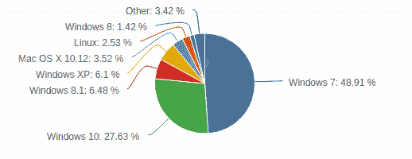
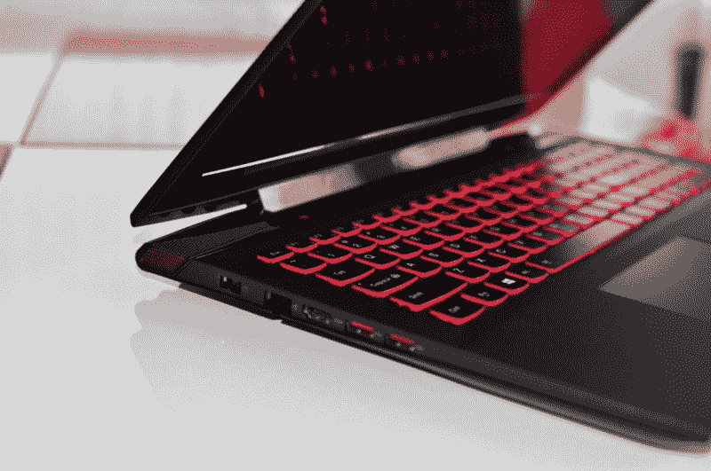
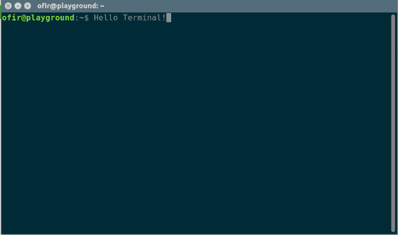
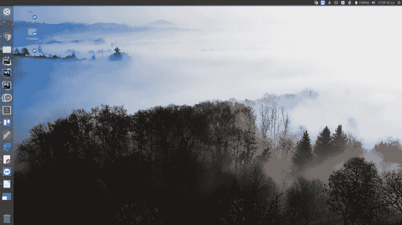

# 我从 Windows 换到了 Linux。以下是我一路走来学到的经验。

> 原文：<https://www.freecodecamp.org/news/i-switched-from-windows-to-linux-here-are-the-lessons-i-learned-along-the-way-434da84ab63f/>

奥菲尔·查孔

# 我从 Windows 换到了 Linux。以下是我一路走来学到的经验。


把大部分时间花在电脑前的人需要质疑自己的基本习惯。我说的是他们用的操作系统。Windows 台式电脑的市场份额现在超过 90%！

每个人都出于不同的原因使用 Windows:

*   Windows OS(操作系统)是他们 PC(个人电脑)的默认操作系统。
*   用户是在不同版本的 Windows 操作系统下长大的，所以很难改变。
*   大多数人认为 Windows 是他们台式电脑的唯一选择。除了 Mac OS，他们没有更多的选择。

我必须承认，Windows 设计得很好，很方便。它允许您轻松执行许多任务，并定期更新。

但是如果你是一个对其他操作系统没有什么经验的 Windows 用户，你可能不知道你所有的选择。



我在这里展示的 Windows 替代品是 Linux。

Linux 是由社区开发的开源操作系统。Linux 类似于 Unix，这意味着它与其他基于 Unix 的系统基于相同的原则。Linux 是免费的，有不同的发行版，例如 [Ubuntu](http://www.ubuntu.com) 、 [CentOS](https://centos.com/) 和 [Debian](http://www.debian.org/) 。

每种发行版都有它的优点和缺点。每一种用于不同的应用。Linux 的硬盘被认为是轻量级的。它被用于嵌入式系统、智能家居设备、物联网等等。Android OS 也是基于 Linux 的。

作为一名拥有超过 7 年经验的科技企业家，我不得不说，从 Windows 切换到 Ubuntu 让我变得更有效率。

当我注意到我使用的基本工具不允许我在延迟方面取得进展时，我开始仔细观察操作系统。这些工具包括 Android Studio IDE 和一个运行在 Windows 机器上的 Android 模拟器。我以为是硬件的问题。于是我升级到了一台[联想 Y50–70 PC](https://ofirchakon.com/stack)，配有 16GB 内存和 512MB 固态硬盘。



The laptop

安装了必要的软件后，我意识到我的新电脑也有类似的延迟问题。我期望我的新电脑能很快。但事实并非如此。就在那时，我改变了策略。

我意识到硬件不是问题。于是我开始对软件进行研究。Ubuntu 的 Linux 发行版是最受 PC 用户欢迎的发行版。Ubuntu 有客户端版和服务器版。切换到 Linux 的一个巨大优势是我现在已经熟悉了 Ubuntu。另外，我可以在我的个人电脑和我操作的服务器上使用 Linux。

我阅读了许多关于使用哪种操作系统的在线资料，例如，Linux 和 Windows 或者 Windows 和 Ubuntu。我意识到，从长远来看，符合我需求的操作系统会让我更有效率。

所以我等待一个信号。信号来了——这是一种病毒，它迫使我备份所有文件并重新格式化我的电脑。但这次我用的是 Ubuntu 操作系统。我考虑过并排安装 Windows 和 Ubuntu 来实现软着陆。我很高兴我没有。我离开 Windows 是因为我致力于 Ubuntu。我不想让 Windows 成为一个后备选择。

以下是我从 Windows 转到 Linux 后学到的经验。这些课程主要面向开发人员、程序员和任何创造产品的人。

### 表演

由于其轻量级架构，Linux 的运行速度比 Windows 8.1 和 10 都快。在切换到 Linux 之后，我注意到我的计算机的处理速度有了显著的提高。我用了和在 Windows 上一样的工具。Linux 支持许多高效的工具，并无缝地操作它们。

### 安全性

Linux 是一个[开源](https://github.com/torvalds/linux)软件。任何人都可以贡献代码来帮助增强用户对 Linux 的体验。同样，任何人都可以添加功能、修复错误、降低安全风险等等。

大规模的开源项目受益于多双眼睛的检查。因此，Linux 比 Windows 更安全。你不需要安装杀毒软件来清除恶意软件，你只需要坚持使用推荐的软件库。那你就可以走了。

### 软件开发

Linux 中的终端是一个通配符。你几乎可以用它做任何事情。这包括软件安装、应用程序和服务器配置、文件系统管理等等。

如果你是一个开发者，终端是最佳选择。没有什么比运行服务器，[训练机器学习模型](https://codingstartups.com/practical-machine-learning-ridge-regression-vs-lasso/)，访问远程机器，从同一个终端窗口编译运行脚本更方便的了。这是一个巨大的生产力助推器。通过使用终端，自动化成为游戏规则的改变者。



### 模块性

使用 Linux，您可以轻松地配置和访问您的计算机、检查进程以及管理虚拟环境。因为您的服务器可能是基于 Linux 的，所以模仿行为、使用类似的软件和软件包以及自动化工作流将会更容易。

### 使用远程 Linux 服务器

大多数服务器都是基于 Linux 的，原因没有在这里列出。Linux 为开发者提供了操作[可扩展且安全的服务器](https://codingstartups.com/scaling-saas-product-infrastructure-high-availability/)的工具。因此，操作端到端应用的技术型企业家必须掌握 Linux 来配置和维护服务器。

Windows 使用第三方工具如 [PUTTY](https://en.wikipedia.org/wiki/PuTTY) 来连接基于 Linux 的服务器并与之交互。这不太方便。例如，要用 Windows 复制文件，需要下载另一个工具。

基于 Linux 的本地机器的一个优点是它可以用一个命令行连接到远程服务器。这是在终端中完成的。主机可以存储在文件中，也可以与 SSH 密钥和用户名一起存储。要连接 SSH，您只需键入以下命令:

```
ssh ofir-server
```

你被录取了。不需要密码。

这是一个基于 Linux 的本地机器配置和维护基于 Linux 的服务器的能力的例子。通过终端为两台机器工作是显而易见的。大多数流行的云提供商也有命令行界面(CLIs)来方便集成。

### 熟悉底层操作系统原理

Windows 实现水平很高。开发人员很少接触内部问题和实现。Linux 则相反。配置必须由终端实现。这包括编辑操作系统文件、添加计划任务、更新软件、安装驱动程序等。

当你使用 Ubuntu 时，[AskUbuntu.com](http://askubuntu.com/)是你的朋友。你不仅学习技能，还学习如何解决问题(有时是艰难的方式)。此外，您还将学习如何监控机器的问题、配置不同的组件等等。



### 然而，并非一切都是完美的

*   换成 Ubuntu 有个学习曲线。一些你在使用 Windows 时不需要帮助的事情，你在使用 Linux 时可能需要帮助。不过，你可以用 AskUbuntu.com 来寻求帮助。如果您的计算机上安装了特殊的硬件，例如 GPU，预计会遇到问题。
*   每一个科技企业家都应该是一个拥有最低限度平面设计技能的设计师。不幸的是，Adobe 还没有向 Linux 用户发布任何产品。所以不可能直接运行它们。Ubuntu 的替代品是 [GIMP](https://www.gimp.org/) 。这是一个自由软件，具有开发者和设计者的基本功能。尽管有缺点，但我并不后悔转行。我现在都是 Ubuntu 了，真希望几年前就搬走了。

Linux 并不适合所有人。在你决定改变之前，先看看它是否符合你的需要。如果你认为自己是一名技术企业家、开发人员、数据科学家或程序员，你绝对应该去看看 Ubuntu。

如果你是一名科技企业家，想要获得更多有见地的帖子，请访问[CodingStartups.com](https://codingstartups.com)