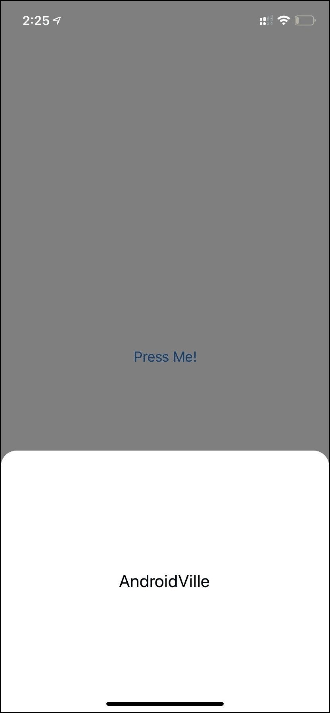
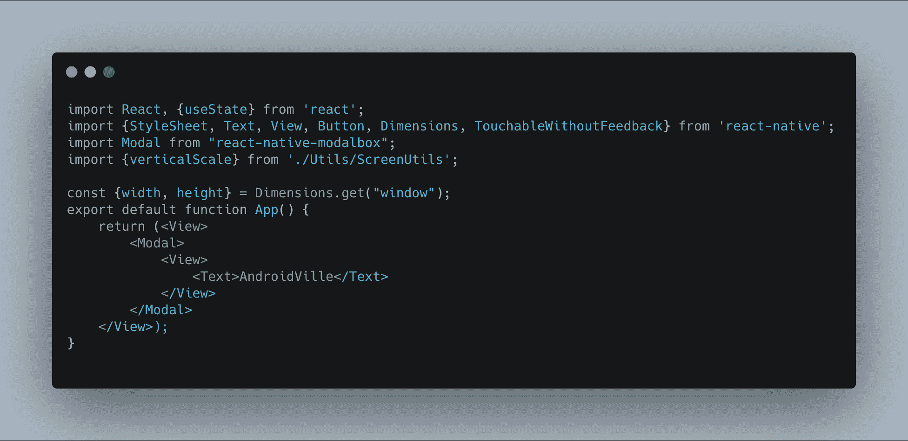
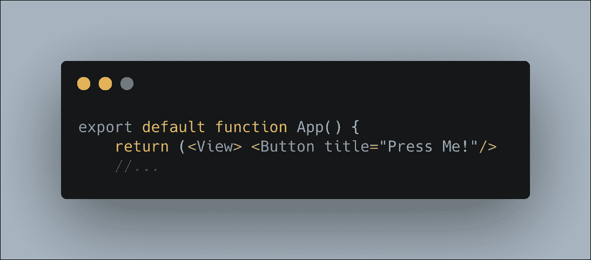
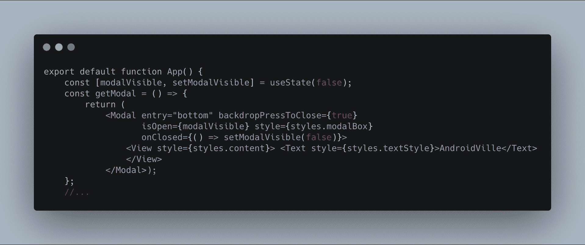
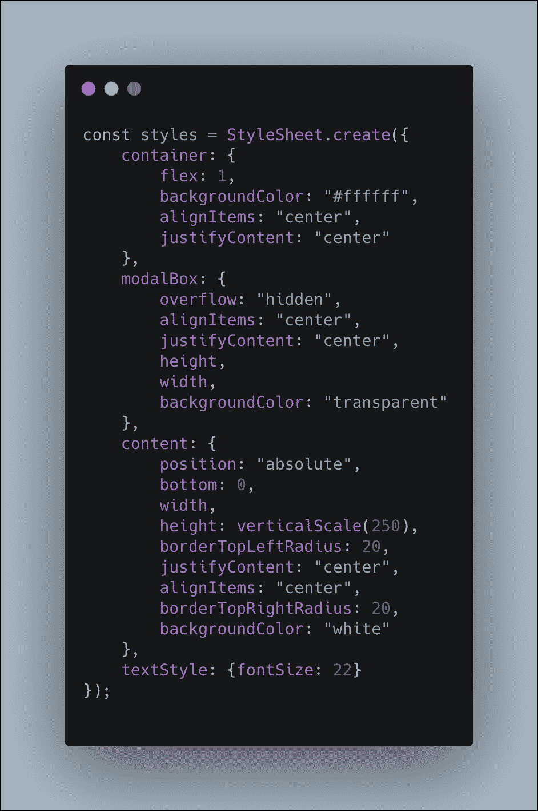
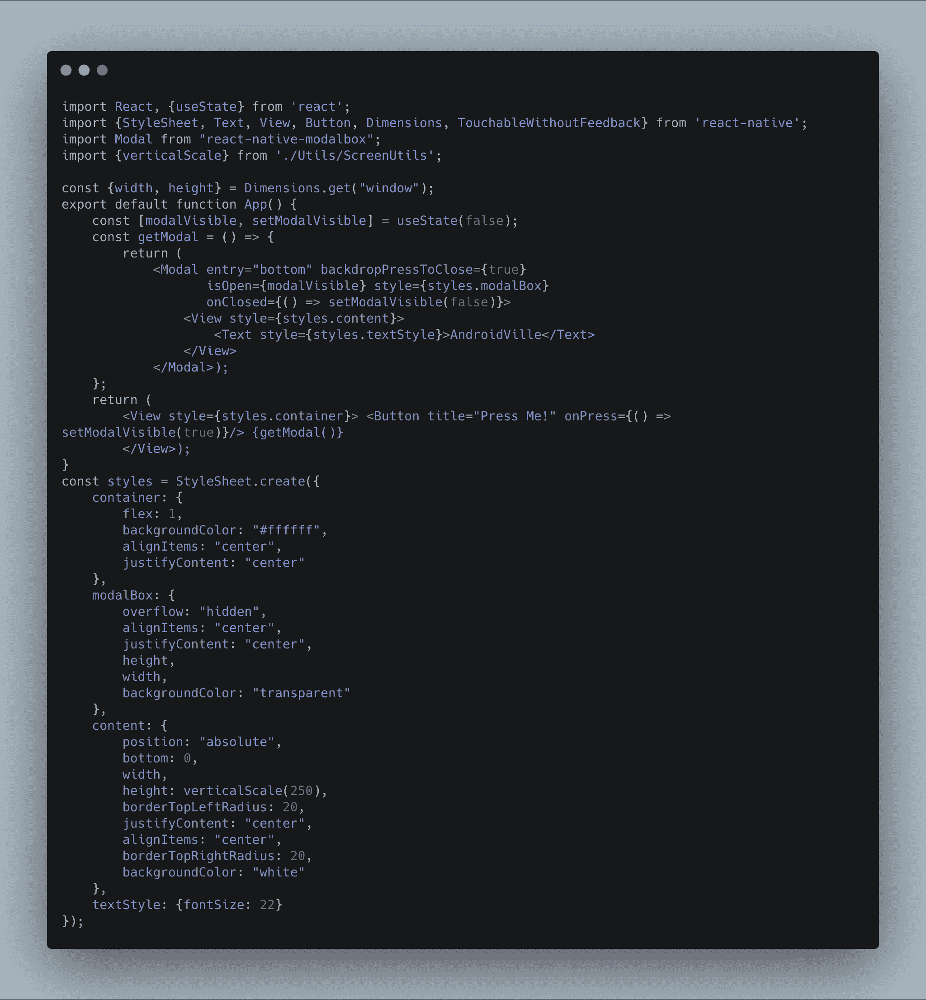

# 为什么我切换到反应原生创造一个超级容易的底部表

> 原文：<https://www.freecodecamp.org/news/i-switched-to-react-native-and-created-a-bottom-sheet-its-easier-than-native/>

我最近换了工作，我的第一个任务是在 React Native 中创建一个底部表单。

我来自一个原生 Android 开发背景，我认为这将会像在原生中创建一个底层一样令人生畏。但是我错了！我被迷住了，以至于我决定写一个关于在 React Native 中创建底层表单的简单教程。

底部表单是从屏幕底部向上滑动的有用组件，通常包含不同的选项。它在现代设计中非常常见，被优步、Zomato 等应用程序使用。

下面是最终的结果:

Source: https://ayusch.com/

因此，让我们来看看如何在 React Native 中创建底部工作表。

## 入门指南

首先，在 React Native 中创建新项目。为此，我使用 expo-cli。如果你不知道 expo-cli 或刚刚开始使用 React Native，请查看[此链接](https://reactnative.dev/docs/getting-started)。

我将我的项目命名为 BottomSheetDemo。

接下来，我们需要安装 react-native-modalbox。这为我们提供了许多内置的功能，如动画，位置，背景等。

> $ Expo install react-native-modal box @ 1 . 7 . 1

注意:记得安装 1.7.1 版本。最新版本有一个 bug，backdropPressToClose 不起作用。

## 创建模型

是时候创建我们的模型了。删除开始时提供给您的代码，并将以下内容添加到 App.js 文件中:

这是我们最基本的床单/莫代尔。我们将只显示模态中心的文本。

## 添加交互

当按钮被按下时，我们需要底部的表显示出来。让我们增加一些互动。

我将在屏幕中间添加一个简单的按钮:

点击这个按钮，我们需要显示/隐藏我们的底部工作表。为此，我们将使用 useState React 钩子来维护状态。

我们的模型有一个名为“isOpen”的属性，我们可以切换来显示/隐藏我们的底部工作表。为了展示这一点，我们只需将 modalVisible 设置为 false，反之亦然。

但是首先，让我们把我们的模态从代码的其余部分中分离出来，因为它开始变得有点混乱。我将创建一个单独的函数来返回我的模态。

代码现在看起来干净多了。但是我们的底板看起来仍然不完全像底板。我们需要添加一些造型。

## 来加点造型吧！

创建一个样式表，并向其中添加以下样式:

下面是最终代码的样子:

我们终于在 React Native 中创建了底部表单。它非常简单，比在原生 Android 中创建要容易得多。

我无法对 iOS 发表评论，因为我从未尝试过。

因此，如果你是一名 iOS 开发人员，或者有在 iOS 中创建底层表单的经验，请告诉我你的经历。

加入 AndroidVille [SLACK](https://rebrand.ly/73lbl3) 面向移动开发人员的工作空间，在这里人们可以分享他们对最新技术的学习，尤其是 Android 开发、RxJava、Kotlin、Flutter 以及一般的移动开发。

[点击此链接加入工作区。绝对免费](https://rebrand.ly/73lbl3)。

喜欢你读的书吗？别忘了在[脸书](https://www.facebook.com/AndroidVille)、Whatsapp、 [*LinkedIn*](https://www.linkedin.com) *上分享这个帖子。*

*你可以在 [LinkedIn](https://www.linkedin.com/in/ayuschjain) 、 [Quora](https://www.quora.com/profile/Ayusch-Jain) 、 [Twitter](https://twitter.com/ayuschjain) 和 [Instagram](https://www.instagram.com/androidville/) 上关注我，在那里我会回答与移动开发相关的问题，尤其是 Android 和 Flutter。*