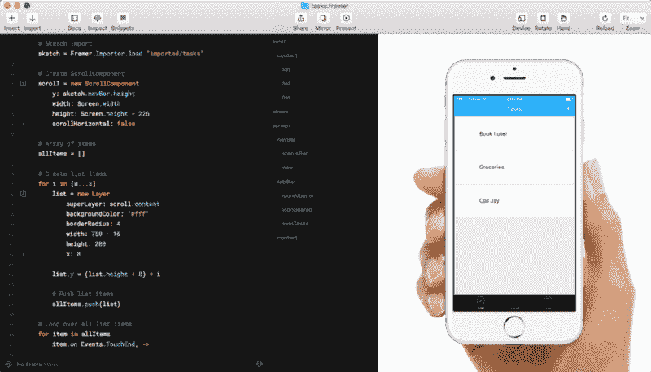
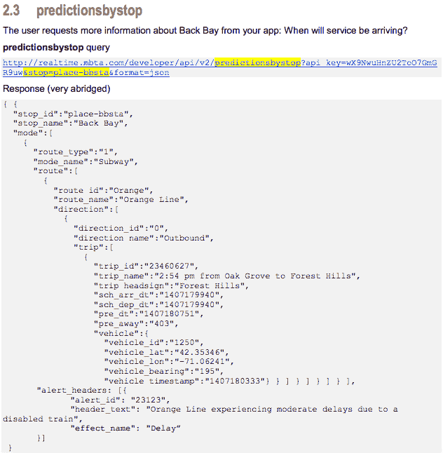
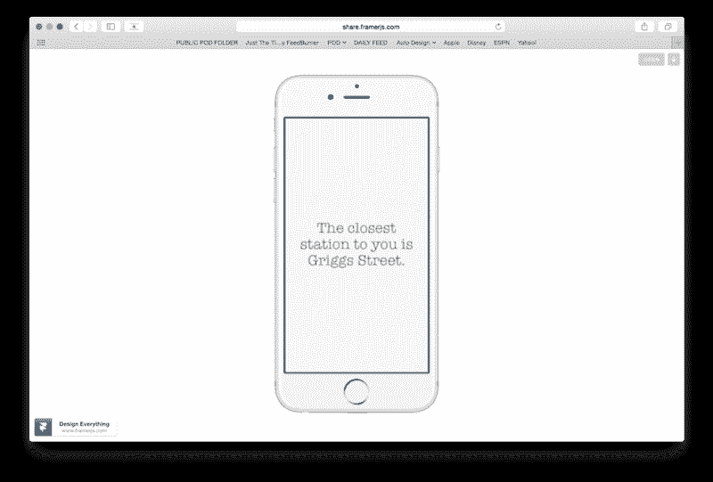
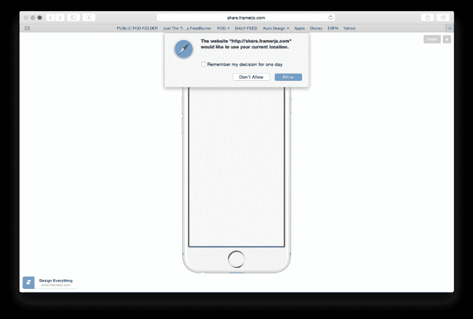
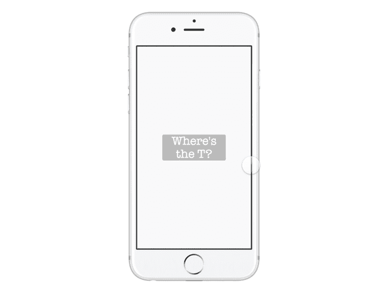

# 对于更真实的 FramerJS 原型，只需添加数据

> 原文：<https://www.freecodecamp.org/news/i-tried-framer-and-i-loved-it-part-2-31fdef35a1e2/>

作者马蒂·劳里塔

# 对于更真实的 FramerJS 原型，只需添加数据


> *“数据！数据！数据！没有粘土我做不了砖！”*
> *——*亚瑟·柯南·道尔爵士

今天大多数交互原型都服务于一个目的:让你的用户相信这个原型就是“真实事物”的样子和感觉。

在过去，设计师们已经通过花哨的用户界面、动画和流畅的过渡实现了这一点。

但是这些已经不够用了。用户已经厌倦了这些把戏。他们经历了 iPhone 时代，现在期望一个流畅的用户界面成为标准。

那么下一个前沿是什么呢？怎样才能让人们相信一个原型是“真实”的？

通过使用真实数据。


Time to go down the rabbit-hole…

FramerJS 是一个强大的基于代码的框架，用于构建 web 应用和移动应用的原型。在本文中，我将向您展示如何使用它来构建一个具有真实数据的真实原型。



Framer’s Interface, Framerjs.com

作为马萨诸塞湾运输管理局(MBTA)的一名乘客，我非常高兴能乘坐一个有 100 多年历史的交通系统。

你可以想象，火车并不总是准点的。

我对 Framer 已经比较熟悉了，因此，我决定尝试设计一个应用程序来解决这个问题。

作为一个对代码一知半解的设计师，这至少是令人畏惧的。

我给我哥哥打了电话，他是塔夫茨大学计算机科学专业的一名天才，我们开始谈正事。


[come hither]

### 定位我们的用户

首先要做的是实时找到用户的位置。

今天的移动浏览器内置了这个功能。

通过两个函数，您可以获得用户的纬度和经度。

然后，您可以将这些坐标放入键值对的[散列表中。在这个数据表中，关键字可能是“dog_breed”，值可能是“Pomeranian”所以现在，你可以在任何需要的时候调用那个键，它会返回相应的值。](https://www.google.com/search?q=define+hash+table&oq=define+hash+table&aqs=chrome..69i57j69i60j69i65j69i61j69i60j69i61.2328j0j1&sourceid=chrome&ie=UTF-8)

这是我们最后得到的结果:

```
#get locationgetLocation = () -> print “INSIDE GET LOC” navigator.geolocation.getCurrentPosition(showPosition);
```

```
showPosition = (position) -> print “INSIDE SHOW POS” gpsCoords = { “client_lat”: “#{position.coords.latitude}”, “client_lon”: “#{position.coords.longitude}” }
```

现在我们有了用户的确切位置，是时候进入第二阶段了。

### 定位我们的火车


Where’s that train….Mr. Andersonnnnn?

获得用户的位置是容易的部分。现在，我们需要找到并解析来自 MBTA 的 API 数据。

不幸的是，这个组织就像任何其他资金不足的政府机构一样。

所以，他们的代码是——我该怎么说呢——有点恶作剧。它看起来是这样的:



Kiiind of a jumbled mess.

数据嵌套在数组和键值对的组合中。其中一些是只有一个条目的数据表。花了一些时间来理解如何提取我们需要的数据。

不管怎样，一旦我们理解了这个结构，我们的想法就是从用户的浏览器中获取位置数据，并将其插入到对 MBTA 的 API 调用中。那么 MBTA API 将返回最接近该位置的所有数据。

我们想要的第一个数据是离当前位置最近的站点:

```
#grab MBTA station datadata = JSON.parse Utils.domLoadDataSync “http://realtime.mbta.com/developer/api/v2/stopsbylocation?api_key=De_WCTE-gkyYSitBw82YSw&lat=#{gpsCoords["client_lat"]}&lon=#{gpsCoords["client_lon"]}&format=json"  stops = data[“stop”]  stationText.html = null  for i in stops  if i[“parent_station_name”] != “” stationText.html = “The closest station to you is “ + i[“parent_station_name”] + “.”
```

一旦我们有了数据，我们就把它解析成人类可以阅读的东西。我们创建了一个字符串(一个英语句子)，上面写着“离你最近的车站是”,然后在末尾加上站名。瞧啊。第一步！



它非常有效！

除了谷歌 Chrome 中没有。

我们很快了解到，出于某种奇怪的原因，谷歌决定禁用位置 API。真的谷歌？你没有足够的钱给这个小家伙一些位置数据？

但无论如何，原型在 Safari 中运行良好。



在庆祝我们最初的成功后，我们决定让我们的生活再次变得艰难。

如果我们不仅想知道最近的车站，还想知道最近的火车有多远，它从哪里来，还有多远？

哦天啊。


That “uh-oh” moment.

### 更多疯狂的数据

既然我们已经掌握了 MBTA 数据是如何融合的，我们就进入第二个 API，它提供(大部分)准确的训练数据。

经过一番欺骗，我们得到了这样的结果:

```
#grab nearest train data data2 = JSON.parse Utils.domLoadDataSync “http://realtime.mbta.com/developer/api/v2/predictionsbystop?api_key=De_WCTE-gkyYSitBw82YSw&stop=#{i["stop_id"]}&format=json" routes = data2[“”] timeAway = data2[“mode”][0][“route”][0][“direction”][0][“trip”][0][“pre_away”] trainDir = data2[“mode”][0][“route”][0][“direction”][0][“direction_name”] trainLine = data2[“mode”][0][“route”][0][“route_name”] timeAwayRound = Utils.round timeAway/60, 0 stationText2.html = “The next “ + trainDir + “ “ + trainLine + “ train is “ + timeAwayRound + “ mins away.”
```

这会从第一个 API 中获取“stop_id”(最近的地铁站)，并将其插入第二个 API 的请求中。

然后，我们只需费力地从数据中提取我们需要的信息。

“timeAway”告诉我们最近的火车离我们有多远，以秒为单位。

“火车方向”告诉我们火车前进的方向。

“trainLine”告诉我们火车在哪条服务线上。

然后，我们创建了一个快速公式，将秒转换成分钟，并将所有数据转储到一个有意义的字符串中。

瞧啊。一点点快速的用户界面，一些花哨的动画，我们做到了！



You can try out the prototype for yourself here: [http://share.framerjs.com/7ygqcpa64f67/](http://share.framerjs.com/7ygqcpa64f67/)


“Like…Whoa…”

### 外卖食品

我在建造这个的过程中学到了很多。一旦你弄明白了，用真实的数据工作是如此的自由。

我不能过分强调:如果你还没有练习阅读 API 文档，这可能会非常令人沮丧。耐心点。可能需要几个小时才能搞清楚这些并让它们工作。

语法必须完美。我是说*完美的*。

但是如果你真的得到了它，你会站在那里，玩着它，微笑着看着数字变化。

你会突然觉得…你会功夫。


感谢阅读。[试一试原型](http://share.framerjs.com/7ygqcpa64f67/)。我喜欢你的反馈！

另外，一定要看看我的第一篇关于 FramerJS 原型的文章。

*如果您喜欢，请点击？所以其他人会在媒体上看到这个。*