# 我想看看我能把自己的创造力发挥到什么程度。所以我重新设计了 Instagram。

> 原文：<https://www.freecodecamp.org/news/i-wanted-to-see-how-far-i-could-push-myself-creatively-so-i-redesigned-instagram-1ff99f28fa8b/>

我试图用便利贴和我的鳄鱼衬衫理解我的研究数据的照片。

挑战:拿一个我喜欢并每天使用的应用程序，然后看看作为一名设计师，我能在多大程度上创造性地推动自己，从头开始重新构建它。

我选择 Instagram 是因为我从 2011 年——insta gram 推出一年后——就成为了它的忠实用户。

最初，我开始使用 Instagram 的滤镜。但在过去的 6 年里，我已经能够看到应用程序中出现的各种变化和创新。我现在非常虔诚地使用 Instagram 来表达自己，并与当前趋势保持联系。

你可以说我是 Insta-老手。

*附注:我不为 Instagram 工作，本案例研究的观点仅代表我个人。与在 Instagram 工作的设计师不同，我无法完全访问影响他们当前设计的所有用户数据。因此，这个案例研究并不详尽，我当然不是建议 Instagram 放弃他们目前的设计，采用我的重新设计。*

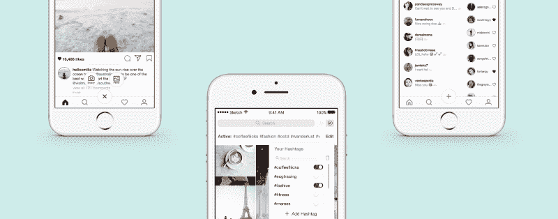

Some screenshots from my redesign

### 我从事这一切的个人目标

我重新设计的目标是:

*   为了在探索和保持联系时提供更吸引人的无缝体验
*   设计一个更加人性化和直观的用户界面
*   通过用户同理心来设计( [HCD](https://en.wikipedia.org/wiki/Human-centered_design) )

我个人发展的目标:

*   学习如何进行和分析用户研究，创建流程图和线框，通过草图进行设计，通过原理制作动画，通过视觉制作原型
*   坚持我的设计原则，从头到尾完成我的第一个设计项目

我在重新设计过程中承担的角色 *:*

*   用户研究员
*   数据分析师
*   UI/UX 设计器
*   产品设计师

为了简洁起见，我在本文中省略了我的草图和线框，但是欢迎您在这里查看它们。

### 了解 Instagram 公司

Instagram 是一个视觉故事应用程序，为用户提供了一个平台来策划和分享生活中美丽和创意的时刻。自 2010 年首次亮相以来，Instagram 的用户群已经增长到数亿，允许来自世界各地的人们联系和分享他们生活中的时刻。

为了跟上不断增长的业务，Instagram 不断进行创造性创新，以推进其“分享世界时刻”的使命。

### 我的用户研究和数据

在我开始重新设计项目之前，我采访了 40 名 Instagram 用户，以便更好地了解我的设计对象:

*   典型的 Instagram 用户长什么样？
*   他们使用 Instagram 的原因是什么？
*   是什么让他们回来了？

我要么亲自进行这些采访，要么通过电话或视频进行。

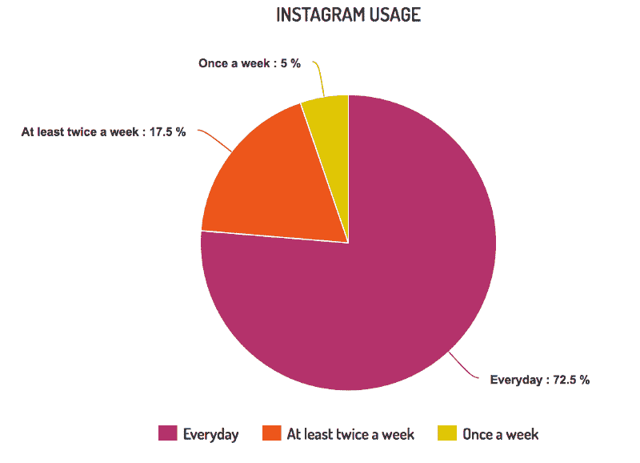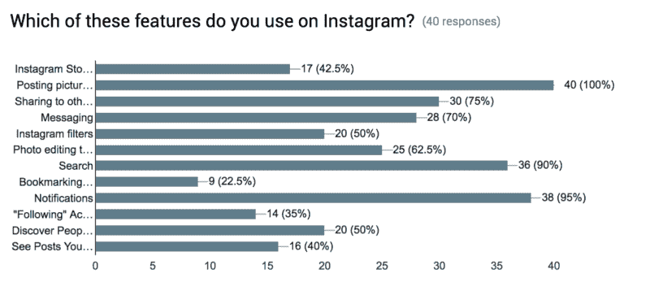

#### 目标受众人口统计

在我采访的 40 位 Instagrammers 中，有 10 位男性，30 位女性。男性使用者的年龄在 22 至 27 岁之间，而女性使用者的年龄在 19 至 25 岁之间。65%的人目前是计划接受高等教育的大学生或高中毕业生。

我觉得这是 Instagram 当前用户群的一个公平的代表性样本，因为 90%的 Instagram 用户都小于 35 岁。此外，[美国 18-29 岁的人中有 55%是 Instagram 用户](https://blog.hootsuite.com/instagram-demographics/)。

更有趣的是，在我采访的用户中，有 67.5%的人将 Instagram 列为他们最常用的三大应用。此外，72.5%的受访者每天都使用 Instagram。

#### 乐趣还在继续

我让我采访的 40 位 Instagram 用户用 3 个形容词来描述 insta gram。*你对 Instagram 有什么看法？让你有什么感觉？*

我一共收集了 **64 个形容词** *。*
排在前三位的形容词分别是: ***有创意、有趣、简单***

我还问他们喜欢 Instagram 的什么。以下是他们的三大理由:

1.  它是基于图片的
2.  它简单易用
3.  这有助于他们保持联系

### 典型 Instagram 用户的角色

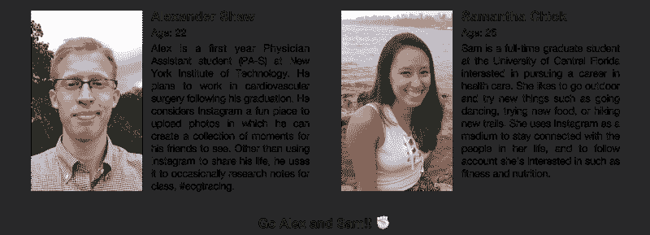

aka the average analysis of the 40 people I interviewed

你和谁关系更密切？你是不是像 Alex 一样，用 Instagram 分享自己的生活，偶尔用搜索功能找到很酷的东西？或者你像山姆一样，使用 Instagram 与朋友和她的兴趣保持联系？还是两者都有？

不管怎样，我在设计时都会考虑像你、Sam 和 Alex 这样的用户。

现在你对我为谁设计有了更好的理解，我们可以继续做好事了！

### 体验 1:主页

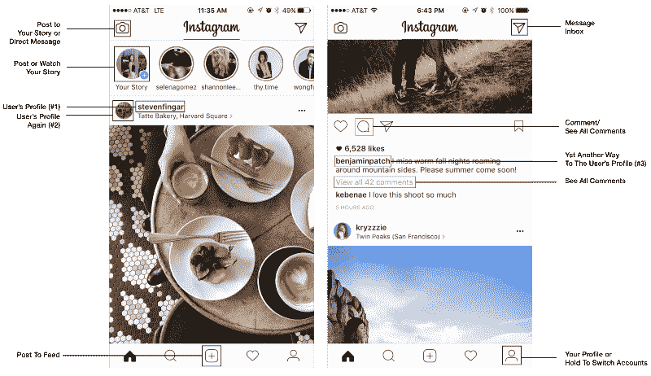

*Assessment of Instagram’s current home page*

除了主页中的重复功能之外，我还注意到了三个主要问题。

#### 问题#1:内容霸主 _instastories vs feed)

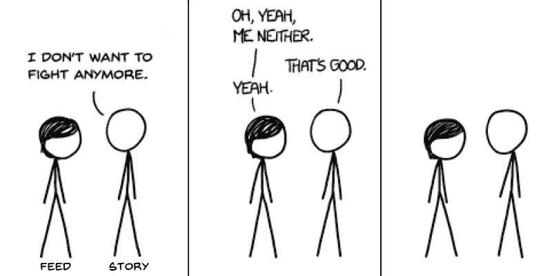

credits to xkcd.com

打开应用程序后，Instagram 用户马上会遇到两个争夺他们注意力的主要功能——他们应该滚动浏览故事还是浏览提要？

这两个选项都充满了内容，感觉就像一个无尽的滚动坑。根据对选择悖论的研究，更多的选择实际上会导致决策疲劳、幸福感降低、内疚或害怕错过机会(FOMO)。这一点尤其令人担忧，因为我抽样调查的 Instagram 用户中，几乎有一半报告称，他们会在起床后和/或晚上睡觉前查看 insta gram。

*边注:我决定保留 2016 年实现的最小色度设计 Instagram，因为我认为它背后的推理和逻辑是纯粹的天才。你可以在这里读到它。*

#### 对于这个解决方案，我选择将故事直接集成到提要中，原因有两个:

*   提要和故事现在将协同工作，为用户提供更具凝聚力的体验。
*   将故事整合到新闻供稿中也防止了它成为“[屋顶平台](https://medium.com/the-year-of-the-looking-glass/what-you-see-is-what-you-use-5a97677a8c71?ref=mybridge.co#.4ezuew3vh)”，就像[朱莉·卓](https://www.freecodecamp.org/news/i-wanted-to-see-how-far-i-could-push-myself-creatively-so-i-redesigned-instagram-1ff99f28fa8b/undefined)(脸书产品设计副总裁)提到的那样。在目前的 Instagram 设计中，一旦用户开始滚动订阅源，Instastories 很容易被遗忘。眼不见心不烦。

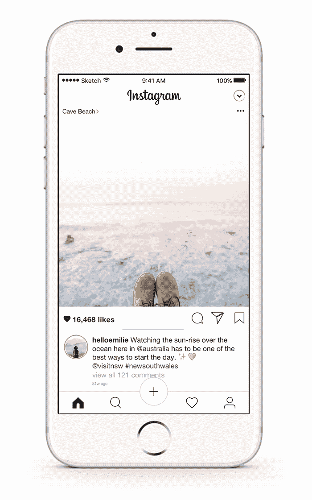

*   通过将故事实现到提要中，它现在将按照可变比率的强化时间表运行。这是[最强大的操作性条件反射类型，对任何目标行为都会产生最高的反应](https://www.boundless.com/psychology/textbooks/boundless-psychology-textbook/learning-7/operant-conditioning-47/schedules-of-reinforcement-200-12735/)——在这种情况下，就是 instastories 参与。

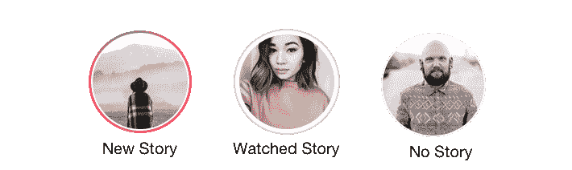

*旁注:别担心，我没有摆脱 Instastories。我只是把它们放到了收件箱里，你可以点击主页的右上角进入收件箱。我将在下面进一步讨论这个问题。*

#### 问题 2:顶部导航和滑动手势之间的分离

通过我的用户研究，我试图回答的一个主要问题是 Instagram 主页上的滑动功能是否直观。

简单来说，Instagram 用户是否意识到左右滑动与顶部导航相对应？

为了回答这个问题，我在采访中进行了一个相对简单的实验。

#### 方法(n=40)

在我开始这个实验之前，我提醒用户，在采访的这一部分，他们不应该看 Instagram。然后，我通过向我描述 Instagram 的典型个人资料页面从上到下的布局，引导用户可视化 Instagram 的界面。然后，在主页上。描述完主页之后。我问了他们四个简单的问题。

用于刷卡 **:**

1.  在主页上，当你从左向右滑动时，它会把你带到哪里？*答案:发布到故事的摄像机*
2.  在主页上，当你从右向左滑动时，它会把你带到哪里？*回答:消息收件箱*

对于顶部导航:

3.你如何在屏幕上发布你的故事？*答案:左上角摄像头图标*

4.你如何进入你的收件箱？*答案:右上角“箭头”图标*

注意:如果用户用“向左/向右滑动”回答了这部分问题，我会提示他们给出替代答案。(你知道去 **______** 的另一条路吗？)

这是我收集的所有数据。

根据我的结果，Instagram 的整体滑动知识并不是很好:

*   只有 20%的人正确回答了**和**两个刷卡反应。
*   30%的人至少答对了*个*，50%的人一个都没答对。
*   50%的人知道从左向右滑动会把他们带到相机前。
*   20%的人知道从右向左滑动会将他们带到信息收件箱。

顶部导航:

*   72.5%的人知道如何通过点击右上角的箭头图标进入他们的邮件收件箱。
*   55%的人知道如何通过点击左上角的相机图标来发布他们的故事。

其他有趣的事实和数据:

*   40 名受访者中只有 3 人答对了所有 4 个问题。
*   根据对 Instagram 导航熟悉程度的 1-5 分制，75%的人给自己打了 4 分或更高。只有 30%的人至少答对了一个刷卡问题。
*   相当高的 92.3%回答错误的人认为或猜测向左滑动会将他们带到探索/搜索页面。*(这是有意义的，因为搜索/探索图标位于底部导航的主页图标旁边)*

从结果分析可知， **Instagram 用户没有建立顶部导航和滑动功能之间的关联。**

> “我不知道。我只是四处点击，直到我找到我要找的东西，然后突然我看到了我的脸……”——随机的 Instagram 用户被问到他们如何进入他们的信息收件箱

让滑动手势更直观的一个方法可能是将其与底部导航链接起来。然而，我认为这将是我实现一个全新功能的大好机会…

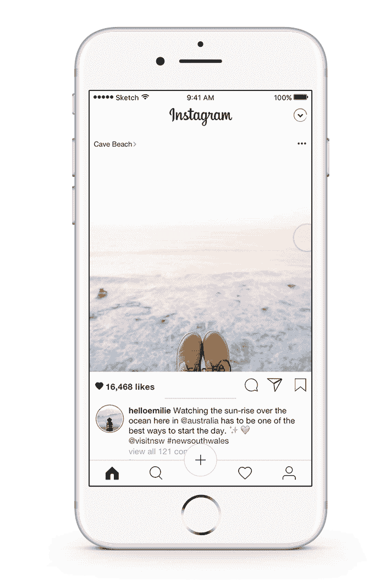

#### 滑动以查看新旧帖子

我的用户研究有一部分是花在阅读 app store 上 Instagram 的评论上的。Instagram 用户抱怨的一个主要问题是 feed 缺乏时间顺序。

我想知道的是*为什么*人**希望**他们的饲料是按时间顺序的？他们为什么对这一变化如此不安？通过深入挖掘，我发现用户把时间顺序和彻底性联系起来。根据 Instagram 目前的算法，热门帖子(被认为是你想看的帖子)位于 feed 的顶部。这让 Instagram 用户感到沮丧，因为他们经常会错过他们想看但不想看的帖子**(又名 FOMO——害怕错过)**。

为了与 Instagram 当前的算法和用户对时间顺序的需求达成妥协，我决定用一个指示器来实现这个滑动功能，让用户安心一些:

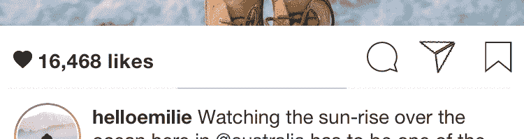

例如，如果指示器在中间。你会知道这不是最新的帖子，你可以向右滑动来查看更新的帖子。如果指示器在最左边，你可以放心知道你在那个用户的最新帖子上。要查看旧帖子，只需继续向左滑动。

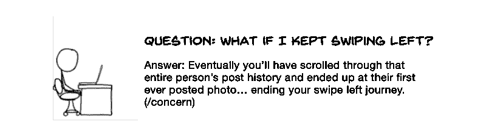

credits to xkcd.com

#### 问题#3:左上角——够不着，想不到。

人们拿手机的方式多种多样。不管用户如何握持，屏幕的左上角总是用户放置导航最不方便和痛苦的地方。因为 reaaaaach *把手机掉在脸上*…或者类似的东西。

研究表明，放置导航的最佳位置是手机的底部——就在用户拇指的旁边。

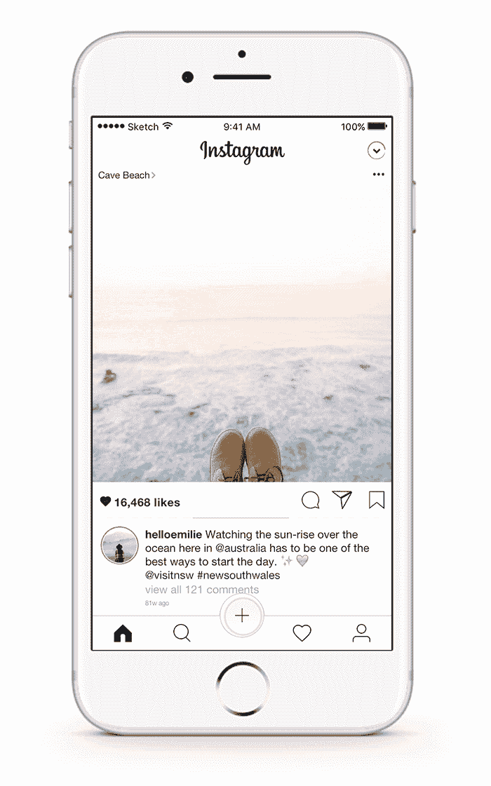

从我的数据来看，我采访的 100%的人都知道如何发布到他们的 feed(因为他们使用它)。然而，这些人中只有 57.5%的人不知道如何发布他们的故事，或者根本不使用它。为了增加 Instastories 的发布活动，我选择将两个发布功能结合起来，因为 1)它现在很容易访问，2)低调祈祷来自 feed 的人气会影响到故事。

### 经验 2:探索和发现模式

现在，你可以选择通过 Instagram 当前的原生算法**自发探索**，或者通过你自己保存的标签集**有意发现**。因此，Sam 和 Alex 可以打开“#ecgtracing”或“#fitness”来了解他们的最新兴趣。

在我的情况下，我可能会打开“# coffeefliicks”和“#dametravelers”来查看咖啡和地方的美学图片。你也可以单独点击标签，一次查看一个，然后向下拖动刷新，一起查看所有活动的标签。你也可以点击添加新的标签，删除标签，或者在你的标签集合中搜索(是的，它是按字母顺序排列的)。

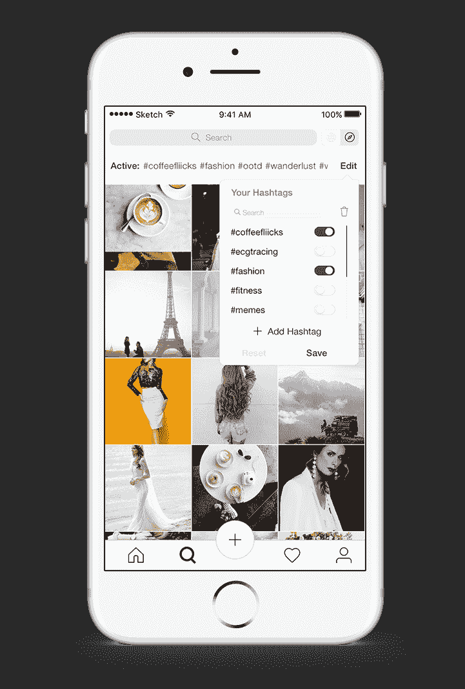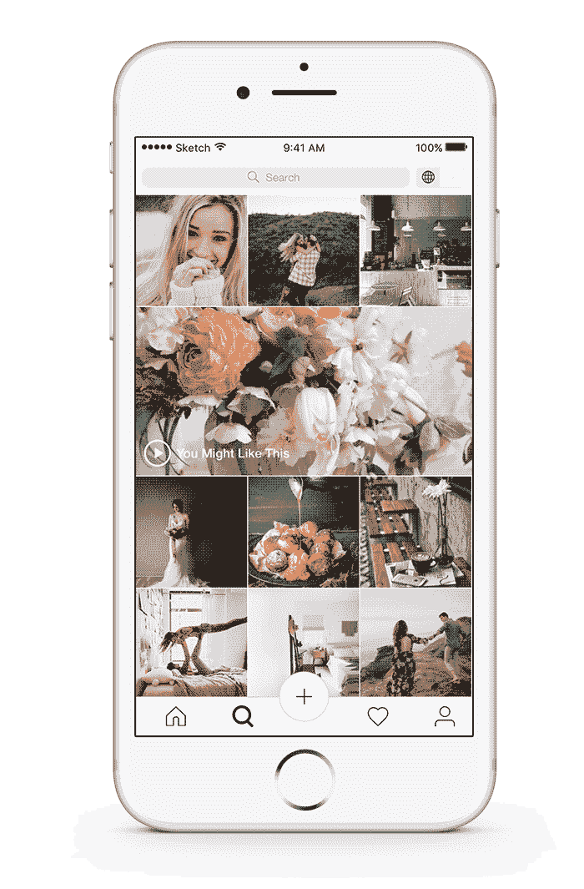

### 体验#3:滑入 DM 和故事

在我采访的用户中，只有 42.5%的人使用 Instastories。人们不使用 Instastories 的两个最大原因是:1)他们已经有了 Snapchat 和/或 2)他们不断看到来自他们并不特别关心的人的新故事。

为了弥补第二个原因，我实现了一个名为“来自你的收藏的故事”的新功能，向使用 Instastories 灌输更多的价值和目的。

现在，你所爱的、崇拜的和/或钦佩的人的故事都在你的提要的顶部，以获得即时的观看乐趣。谈论保持联系！

您可以通过点击人名旁边的心形图标，轻松地删除或添加联系人。( *Awee*

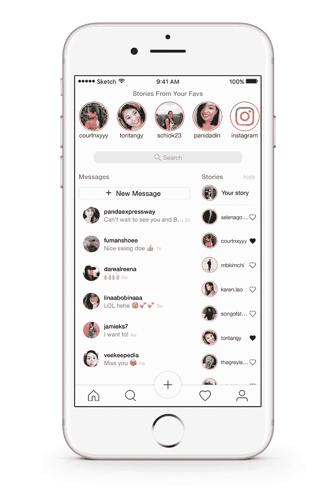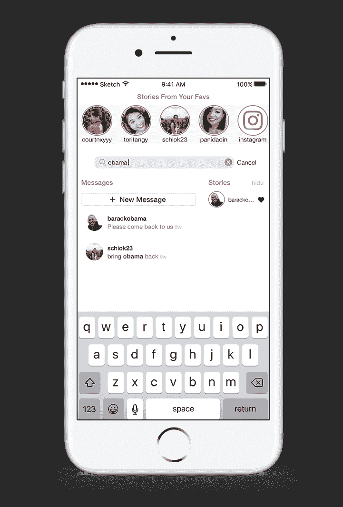

旁注:我将故事转移到 DM 中的原因是什么？首先，我需要一个地方来放故事，因为我把它从 feed 中移走了。第二，当你回复一个故事或发送一张照片时，它会直接进入你的收件箱。因此，将 Instastories 和 DM 归入一个大的快乐包是有意义的。

*另一个旁注:在当前的消息收件箱界面中，没有底部导航。如果用户知道如何使用滑动功能，他们就会知道如何返回主页，正如我上面提到的那样，我采访的用户中只有 20%知道向左滑动会带他们去 DM。考虑到这一点，我决定让底部导航保持静态，这样用户就不会感到迷失。*

### 体验#4:通知和配置文件

啊……最后一段路程。对于通知和个人资料页面，我想通过添加更多的负空间和分组/嵌套类似的项目来给用户界面更多的喘息空间。

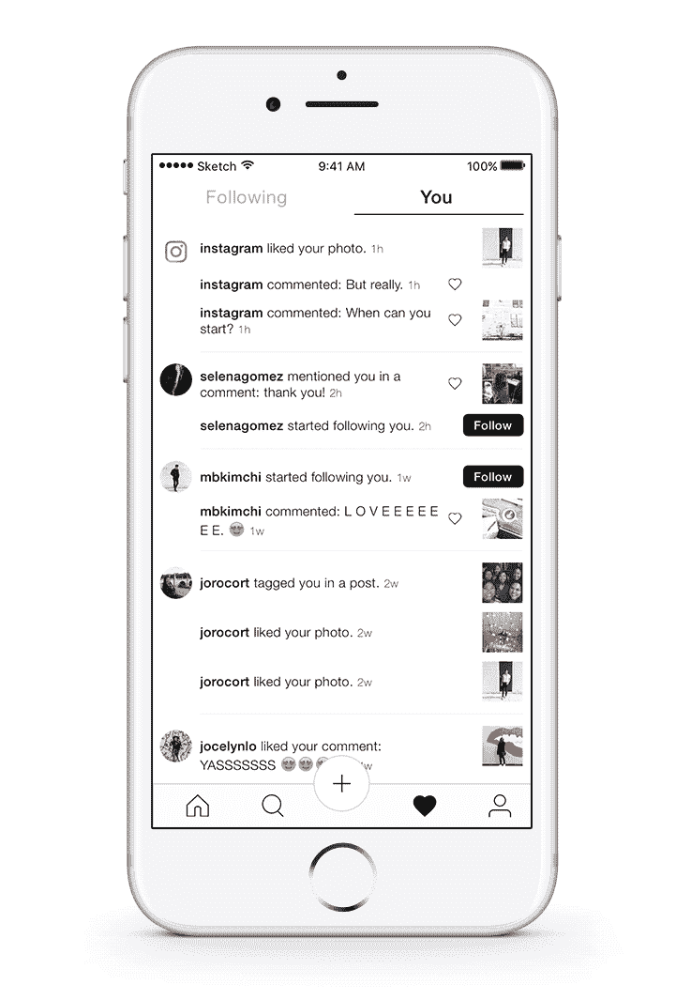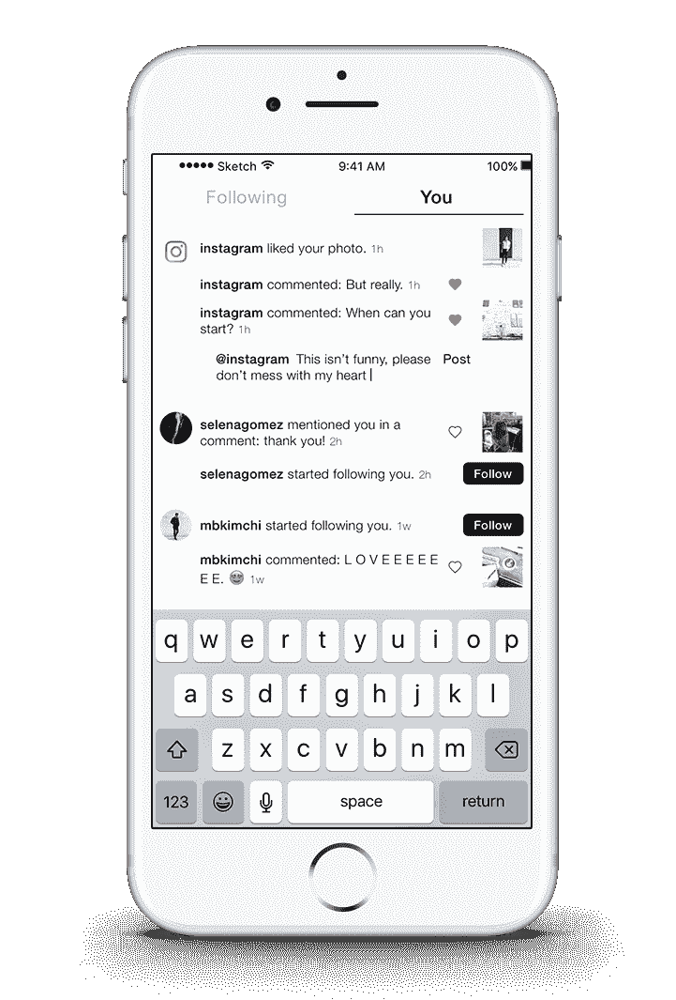

*I think you can guess which notifications are real…*

此外，你现在可以直接在通知中“喜欢”和回复评论，只需*按住那个人的用户名*(点击会带你进入他们的个人资料)。一旦你持有用户名，它将触发一个自动@用户名的评论框出现。然后你需要做的就是输入你的回复，点击“发布”。

我认为这将是一个很棒的功能，因为很多时候，你会迷失在帖子的评论海洋中。他们的用户名是什么？评论在哪里？评论怎么说的？

#### **“后续”通知**

今天最后一个有趣的事实——在我采访的 Instagram 用户中，只有 35%的人会查看他们所关注的人的活动。是否保留这个功能可能是我必须做出的最艰难的决定。我决定保留它，并简单地重新设计了它，通过放大照片来吸引更多的注意力。

#### **简介**

说实话，我很喜欢 Instagram 现在的设计。为了增加极简主义，我对观看图标做了一些轻微的改变，并增加了更多的负空间，以保持设计的一致性。

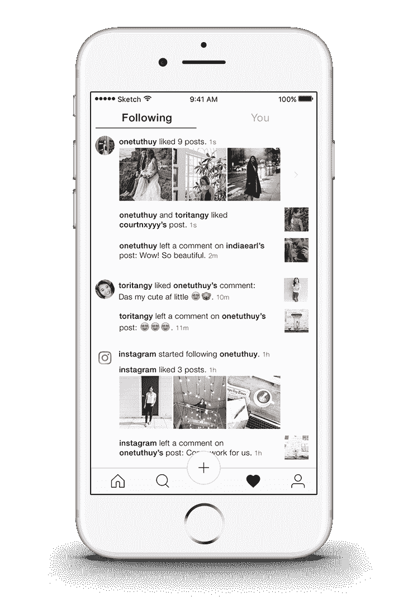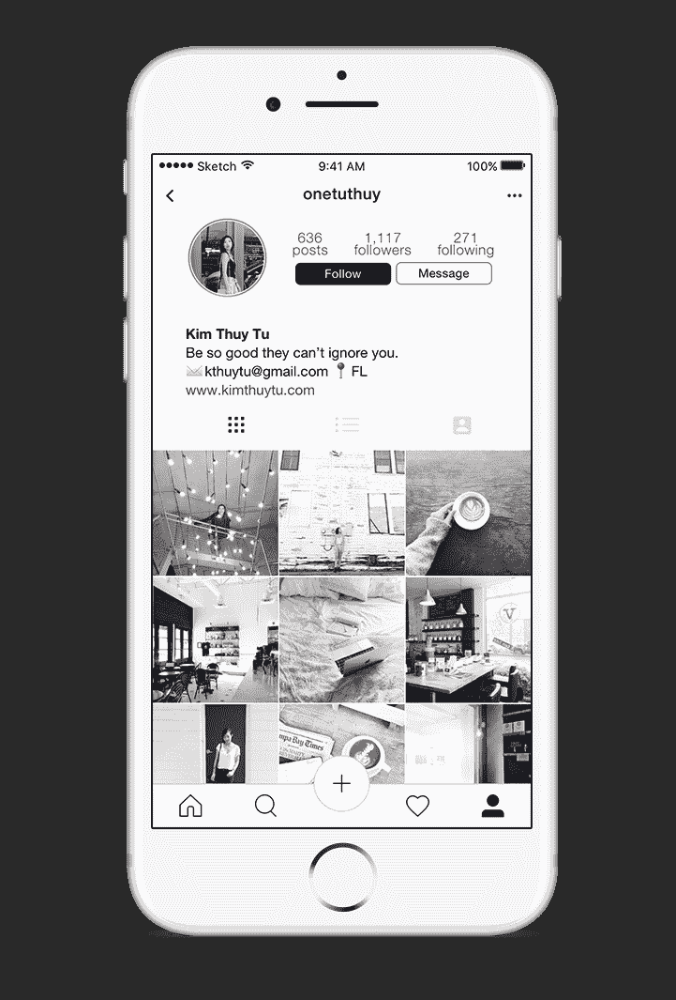

### 反思我在这里所做的工作

进入这个项目，我知道这将是我磨练设计技能的绝佳机会。在过去的一个学期里，我刚刚从学医转行，我想从事产品设计方面的职业。所以我认为对我来说，最好的学习方法就是投入到一个项目中，然后从那里开始。

现在回想起来，这完全是轻描淡写。在过去的两个月里，我学会了我开始学习的所有东西，以便交付这个项目和*更多的东西*。

我认为学习和创造过程中最好的事情之一是你来策划你自己的。你知道什么可行，什么不可行。你学习如何更快、更好、更有效地做事。你在学习的过程中会学到一些随机的东西，同时试图了解你实际上开始学习的东西。

最重要的是它不会结束。学习的过程是*连续的*。

> “设计不会变得更容易。你只会变得更好。”

就这样结束了。非常感谢您的阅读！

你可以在这里查看我的完整互动原型

编辑*(2017 年 3 月 10 日)*
*freeCodeCamp(通过 Youtube)采访了我从医学到设计的转变，以及是什么激发了我做这个重新设计。你可以在这里观看。*