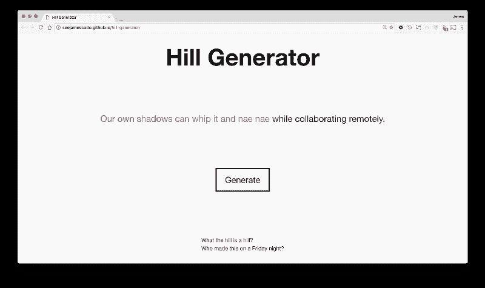

# 身份危机:我是开发者还是设计师？

> 原文：<https://www.freecodecamp.org/news/identity-crisis-am-i-a-developer-or-designer-ee513443e914/>

我曾经很迷茫，到底应该介绍自己是前端开发人员还是设计师。我会根据当时的情况和谈话对象来来回回地转换话题。

申请设计工作室？我最好称自己为网页设计师。被软件架构师面试？“你好，我是网页开发人员！”

后来，我在一家大型设计工作室找到了我梦寐以求的工作:

> 我:“那我会成为前端开发人员还是设计师？”

> 招聘人员:“都！这里的每个人都是设计师，但你的专业是前端开发。”

> 我:“废话。那我还是去上设计课吧。”

> 半专业提示 1:不要向设计工作室的招聘人员提及你从未上过设计课。

### 感觉被设计师吓倒

因此，我立即注册了大学最后一个学期的第一门设计课。这门课帮助我掌握了一些基本的用户体验概念，但我最终还是带着严重的自卑向我在 IBM 的新工作报到。

我进入了被研究、视觉和 UX 非凡人物包围的角色。他们都专注于用户的痛点。

和我对比一下。作为一名开发人员，我习惯于只问我需要实现哪些特性，然后决定如何最好地实现。

焦虑开始笼罩我。我开始想也许我做出了错误的职业选择。

也许我应该加入一个完全由开发人员组成的部门。

也许我应该加入一个工作室，把设计交给开发者，而不期待他们的反馈。

或者，也许我应该在加入一个大型多学科团队之前，先尝试一年自由职业。

在工作中，这种焦虑导致了害羞。

> 半专业提示#2:设计中的 f 字是“功能”功能的数量和用户体验的质量之间没有产品相关性。

### 学习行走两个世界

幸运的是，IBM Design 有一个为期三个月的入门级设计训练营，它教会了我可以同时成为开发人员和设计师。所以我从我的同龄人那里汲取技能，尽可能多地吸收他们的专业知识。

这个项目迫使我参加一些活动，帮助我了解我们的用户。就在那时，我爱上了编写用户故事来记录他们的挣扎，然后试图用我的开发技能来解决它们的过程。

一个关键的收获是，我们在一起的时间越长，我们的团队就越成功。分开单独工作，然后再一起回来的诱惑总是存在的。但是我们不得不反抗。

与视觉设计师结对编程对我帮助很大。它教会了我比阅读任何我能找到的 UI 模式介绍书更多的视觉原理。与此同时，视觉设计师——以前在印刷行业工作过——可以很快从我这里学到响应式设计的原则。

在整个夏令营中，我学到了多学科团队的真正力量。我们在研究、用户体验、视觉设计和前端开发方面互相学习——一切都以自然、对话的方式进行。

### 教开发人员如何像设计师一样思考

从设计训练营毕业几个月后，我有机会作为赞助商参加一个大学黑客马拉松。

该活动挤满了希望为各种问题提供史诗般解决方案的开发人员。我以为我在那里是为了帮助参与者调试他们的 web 应用程序，但我最终在设计方面帮了更多的忙。

Check out how simple — but crazy — a hill can be at the [Hill Generator](http://seejamescode.github.io/hill-generator/).

首先，一个家伙过来炫耀他已经使用 API 可视化了一些数据。在祝贺他的技术成就之后，我问他他的用户目标是什么。他承认他不知道。所以我们开始根据 IBM 的设计思维文档编写 hills。

接下来，另一个开发人员想在颜色选择上得到帮助。一年前，我绝对是最不可能寻求帮助的人。但我没有退缩。我问他希望 web 应用程序颜色传达什么。

> 戴夫:“你是什么意思？我只知道我们的颜色选择很难看。”

> 我:“啊，你说的是造型。你的颜色不仅仅能让东西看起来漂亮。为什么用户不想使用你的应用？”

> 戴夫:“嗯，这是一个资金管理应用程序。我不知道人们是否会信任我们来管理他们的钱。”

> 我:“那我们来看看有没有关于能引起信任和金钱共鸣的颜色的研究！”

带着正确的问题，我们开始研究和选择正确的颜色。

在黑客马拉松的第二天，我与一个团队交谈，这个团队正在扼杀它，并随着每次迭代而变得更好。该团队已经有了一个完整的“纸杯蛋糕”(完整的体验，但最小版本)的应用程序。他们知道是时候收集反馈了，但不知道如何着手去做。

这变成了我带领他们进行第一次用户测试的绝佳机会。该团队学会了向用户提供简单的目标，一次一个，然后要求用户在每次交互和每个屏幕上大声说出他们的想法。

> 半专业技巧 3:如果你的用户没有向你说出他们的想法，你怎么知道他们在想什么？

### 那我是什么？

Our multidisciplinary team at the design bootcamp may have sucked at hi-fives. But we learned a lot of other stuff from each other.

当然，我仍然能够在黑客马拉松上伸展我的前端开发人员肌肉。总是有大量的 JavaScript 和 CSS 错误需要帮助解决。我喜欢做那份工作。毕竟，web 开发是我开始职业生涯的原因。(实际上是项目管理，但我们不要去那里。)

那么我是谁？感谢我工作室的设计培训，我现在觉得有资格说我是一名设计师。但是这样做并不排斥我作为开发人员的角色。相反，我现在能够从第一次研究访谈一直到我们最终发布的产品代码，来触摸一个产品的成长。

那你是什么？你是具有数据分析和/或可视化背景的设计师吗？你是懂产品策略的设计师吗？

我鼓励你在你的组织中雇佣全职设计师。主动与他们分享你的优势。然后退后一步，向他们学习。

*如需更多信息:欢迎通过评论、[电子邮件](mailto:james@seejamescode.com)或 [@seejamescode](https://twitter.com/seejamescode) 联系我。我在 ATX 的 IBM Design 工作，总是喜欢和网页设计社区交流。也一定要在评论里分享自己的职业认同危机！*