# 如果我在推特上运行产品

> 原文：<https://www.freecodecamp.org/news/if-i-ran-product-at-twitter-b8dc1e3458cd/>

奥斯汀·奥尔雷德

我经常想到 Twitter。可能比没有任何金钱激励的人更应该这样做。我不是一个投资者(即使是在公开市场)，我和在那里工作的任何人都没有关系，我也没有权力进行任何改变，但我确实深深地爱着这个产品，更不用说它为我的生活做了什么。

这篇文章最初是从我在飞机上敲打一些东西开始的，作为一个思想实验，最后是我思考这个产品，就好像它是我自己的一样。

我是从一个初创公司创始人的角度来看这个问题的:一个工程团队如何才能获得最大的回报？我确信 Twitter 传播得很广，所以部分是因为这是一个挑战，部分是因为这是我习惯的思维方式，我试图尽可能多地重用现有的元素和设计模式，以使假设的变化相对简单。

但首先，在我们开始之前，我们需要了解一下 Twitter 的现状和原因。

### Twitter 的麻烦

Twitter 在这条道路上遇到了一些困难，这已经不是什么秘密。用户增长放缓，股价比以往任何时候都低，华尔街在杰克开始担任首席执行官大约 12 个小时后就对他失去了耐心，我不时听到人才弃船的风声——这不是上市公司的理想去处。

不过话虽如此，我还是长在 Twitter 上。即使风投们推测 Twitter 是否会在三年内被取代，我相信它是一个拥有强大网络的好产品，不能就这样消失。我认为，所有这些问题都能够而且将会得到解决。

简而言之，我在推特上长。

### 剖析推文

在我们深入讨论我将在 Twitter 上做出的改变之前，了解一下我认为的 Twitter 和 home Twitter feed 的基本元素是有帮助的。当我们这样做时，看到其他特性和修复应该放在哪里就变得容易多了。

一条推文可以分为四个基本元素:

1.  推文文本。140 个字符。(红色)。
2.  这条微博是从哪里来的。是转发吗？是来自瞬间吗？(绿色)。
3.  附件。这些包括照片，视频，藤蔓，潜望镜，链接，现在甚至其他推文。(蓝色)。
4.  元数据。谁发的微博，时间戳。(黑色)。

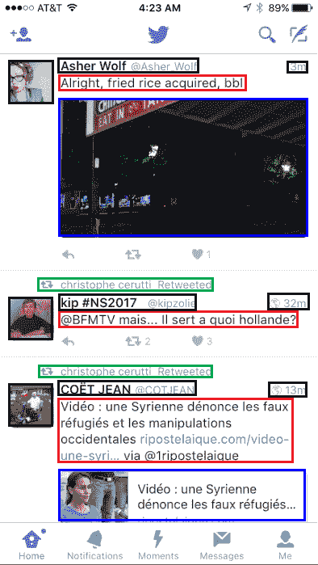

### 140 个字符(替换截图)

由于杰克在上面的推文中提到的短信限制，Twitter 的一个很大的意外特征是它的强制简洁性。我相信你知道，但提醒一下，每条推文必须少于(或等于)140 个字符。

许多人认为这很棒，因为它限制了 tweets 在你的 feed 中占据的垂直空间。虽然这是真的，但有限数量的字符的积极方面比不太高的推文要深刻得多。(如果屏幕空间是唯一的问题，有一个简单的解决方法——只显示前 140 个字符，并有一个“显示更多”按钮或类似的东西。)但这不是重点。

140 个字符的重要方面是填满 140 个字符所需的认知负荷。杰克曾经用这个比喻来描述它:想象你自己站在一幅壁画前，那是你的画布；20 英尺宽 8 英尺高的东西。你不得不思考、计划并确切地知道你应该如何利用每一寸空白空间。

现在把它和便利贴比较一下。有了便利贴，你只需记下一些东西，然后继续前进。

Twitter 现在相当于一张便利贴。这对于许多用例来说是很棒的，它从各种各样的来源产生了高得离谱的内容。

但是有些想法不适合贴在便利贴上。用户已经使用截图、tweetstorms，甚至像 twitlonger 这样的外部网站来绕过 140 个字符的限制。这显然是 Twitter 应该原生支持的事情——为什么要把所有人都送走，放弃那些点击和眼球？

如果不说别的，Twitter 前首席执行官交流的最佳方式是截图他的 iOS Notes 应用程序，这似乎有点可笑。

因此，挑战在于解决对更长推文的需求，同时不消除限制带来的好处。你如何停止让用户跳圈或使用黑客的变通方法来使产品做他们想要的？

现在我们理解了推特的结构，这真的很简单。

#### 邮报

Twitter 本身支持几种附件类型。有些是从应用程序内部添加的(照片、视频和投票)，有些是从推文的正文解析的(推文的链接和链接)，有些来自外部应用程序(Vine 和 Periscope)。

每个“撰写推文”屏幕的底部都有你可以在应用程序中发布推文的附件。

Twitter 需要做的就是添加一个更大的画布作为新的附件类型，以克服 140 个字符的困境。很简单，我把它叫做“邮报”

你可以这样设计(原谅我，我不是设计师)。

在投票按钮的右边放置一个按钮，您会看到:

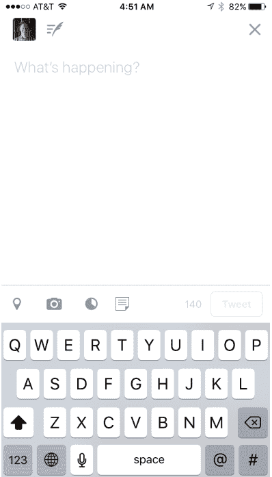

点击该按钮，您就可以:

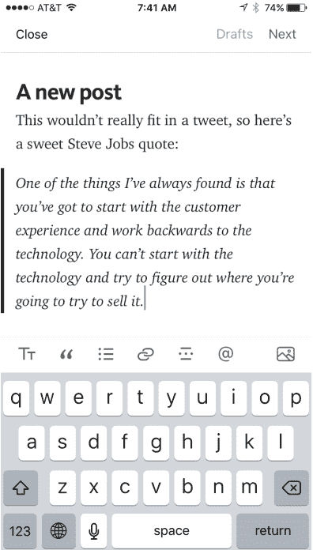

Yes, this is a Medium ripoff

这就像附加一张照片，除了不是选择一张照片来附加，而是在文章中添加文字。就像截图一样简单，但是有更多的用途。

文本编辑器本身不必像上图那样花哨；它可以是纯文本，人们会疯狂地使用它。

在时间线中显示的方式也已经解决了:这只是另一种形式的附件，就像照片或引用的推文一样:

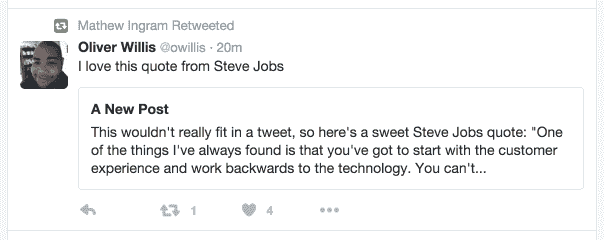

你可以从一个非常简单的编辑和阅读体验开始，最终得到一个类似于 Medium 的东西，但是是在 Twitter 本身内部构建的。

这就是事情变得真正有趣的地方。Twitter 不再是一个微博平台，它实际上可以成为…一个博客平台。

#### 推特风暴

但是帖子和推特风暴有些不同。帖子是一个长长的文本简介，而 tweetsstorm 是作为独立单元的 tweet 集合；每一条都可以被转发、回复，并在自己的上下文中进行互动。我不认为你想(或愿意)因为发表一篇文章而失去推特风暴。所以我认为推特风暴是独立的，也是一种附件。

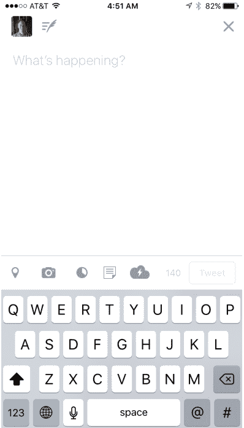

Adding a tweetstorm button is straight-forward

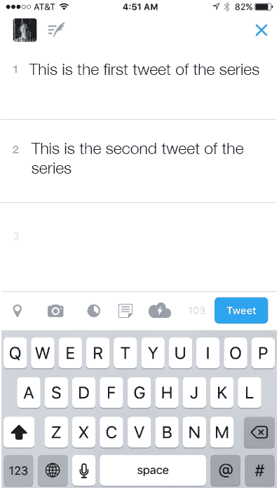

As is actually implementing the tweetstorm compose functionality

你甚至可以使用与创建投票屏幕非常相似的东西，除了不是添加许多投票选项，而是添加额外的 tweets。(当然，您可能会使用几个文本区域来代替文本字段，但原则是一样的)。

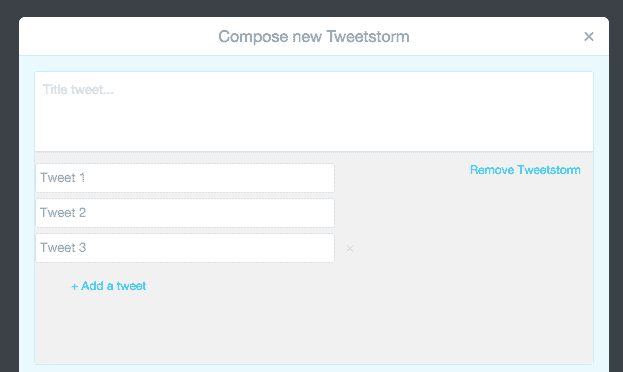

你会如何展示推特风暴？正常显示第一条推文，其余的作为附件:“ *n* 条推文。”点击它会在一个单独的时间线中打开它，这实际上允许你以正确的顺序阅读推文。

### 修复如下

Twitter 华尔街困境的核心是增长放缓。花几分钟时间和不使用 Twitter 的人(或者已经注册但没有找到足够价值继续使用的人)在一起，原因很明显。

简而言之，Twitter 的价值随着你的订阅质量而增加。这意味着在 Twitter 上投入更多时间和精力的人会从中获得更多。

但是把你的 feed 放在一起是非常困难的，尤其是对于那些没有什么可去做的新用户来说，他们之前从来没有故意创建过类似的 feed。

为了更好地解释这意味着什么，我想冒昧地从我奶奶的角度来看 Twitter。

#### 我奶奶

我的祖母除了偶尔使用“p@ssw0rd”这样的密码之外，对技术非常精通。她曾经为 Novell 工作，她写博客和电子邮件，当然知道如何使用电脑。

我奶奶用脸书吗？当然了。她用推特吗？没有。

很容易把它写成“这不是我们的目标市场”，但在某一点上，为了证明 x0 亿美元的市值，Twitter 需要开始吸引“迟到的大多数”用户。

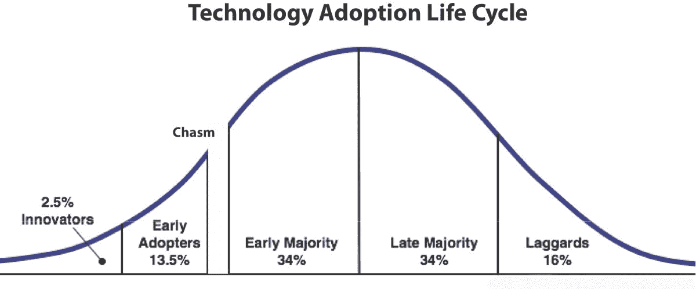

我奶奶是典型的晚采纳者。几年前，在她的一个孙子的推荐下，她开始使用脸书，并接受了他的好友请求。家里其他人马上看到她加入了，我们都开始加她为好友。她当然接受了这些请求。

在她意识到这一点之前，她什么也没做，就在脸书上重建了她现实生活中的社交网络。现在，她每次登录脸书都能看到家人的照片、视频和帖子。重要的是，她甚至不需要思考就能做到这一点。

我不确定在互联网上还有比这更糟糕的经历了。

与 Twitter 这样的网络相比，脸书有两大优势:

1.  脸书的连接是双向的(有时我称之为“懒惰”)；如果我加你，你接受了，你就不知不觉地把我加到了你的社交图上。在 Twitter 上，每个用户都必须手动创建自己的图表，而不仅仅是对他人做出反应。
2.  脸书正在重建一个现有的社交图，仅仅是将“我在生活中认识的人”替换为“我在脸书认识的人”使用 Twitter 的伟大(也是困难)之处在于，你正在从头开始创建一个以前不存在的图形*。特别是对于非早期采用者来说，这是一个非常高的要求。*

单向图是我最喜欢 Twitter 的地方，也是导致 Twitter 发展缓慢的原因。正如他们所说，脸书是你认识的人，推特是你希望你认识的人。

Twitter 的问题是有时人们不知道他们希望知道谁。脸书赢了，因为每个人都知道他们认识谁。

我认识的大多数 Twitter 用户花了过多的时间修剪和发现谁该关注——不断增加和删除他们的订阅。我甚至可以说，一个人从使用 Twitter 中获得的价值与他或她花在调整他或她追随的人上的时间直接相关。

#### 图表的重要性

最初的社交图谱是脸书的一个基本指标，以至于(现在传奇的)成长团队只专注于让每个新成员拥有七个联系。他们发现这是人们愿意逗留的时间点。他们知道你会在这一点上上瘾。

我的直觉是，对于 Twitter 来说，类似的数字是真实的——在某种程度上，创建足够多的高质量社交图会使 Twitter 具有粘性。

Twitter 面临的问题是，在 Twitter 上从无到有地创建一个图表，比在脸书上重新创建一个图表(甚至可能是意外地)要困难得多。

这对现有用户和新用户都适用，但我们将首先关注新用户。

#### 入职:引导图表

Twitter 似乎很清楚计算机科学家会称之为[冷启动](https://en.wikipedia.org/wiki/Cold_start)的问题:简而言之，他们对新用户一无所知，当你一无所知时，很难做出预测(更不用说构建社交图了)。他们已经尝试了几种方法来解决新注册用户的问题，从当前的“调查”到之前的“注销主页”，但这些显然都没有击中要害。

在经历了几次入职流程后，我真诚地相信，如果它在当前状态下根本不存在，那会更好。碎到我无法想象*不是*毁了任何人第一次报名的体验。

今天早上，我经历了入职流程，又创建了三次新账户(在各种平台上多次入职是我的一个奇怪爱好)。我试过一次，试图准确匹配我个人所说的话，一次只使用我 gmail 账户中的联系人，最后一次只使用我的手机联系人。

这些对我来说都是特定的，所以可能很难确定是否有价值，但我认为问题会很明显。

对于第一轮，我在 Twitter 的调查中说我喜欢科技/科学，但没有给出任何进一步的背景或联系方式。这是 Twitter 推荐我关注的人:

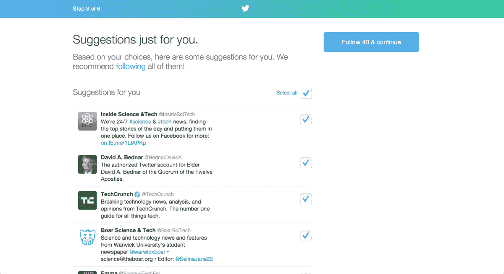

《科技内幕》,一个我从未听说过的帐户，但它似乎是科学和技术，所以我想这是有道理的。然后是 TechCrunch，一个我目前不太关注的账户，因为我不是这本书的狂热粉丝，但公平地说，我说了 tech，这是 TechCrunch。

其中还包括 LDS 教会的几位领导人。我不知道这是从哪里来的，但我在犹他州，所以它可能是基于位置的东西。随便啦。我只是关注和 Twitter 推荐的每个人。

令我惊讶的是，当我看着这个网站上 99%的人都是 CNN、ESPN 和犹他爵士。很明显，列表中更靠后的是一些我没有关注的非常非科技的账户(我假设很多用户同样不会关注)，这些巨大的、不断发推的和完全不相关的账户完全控制了我的订阅。

如果我是第一次使用，我会离开，再也不回来。但也许那只是侥幸。

然后我试着用一个新账户，只导入我的 gmail 联系人列表。这是 Twitter 根据我的电子邮件推荐我关注的人:

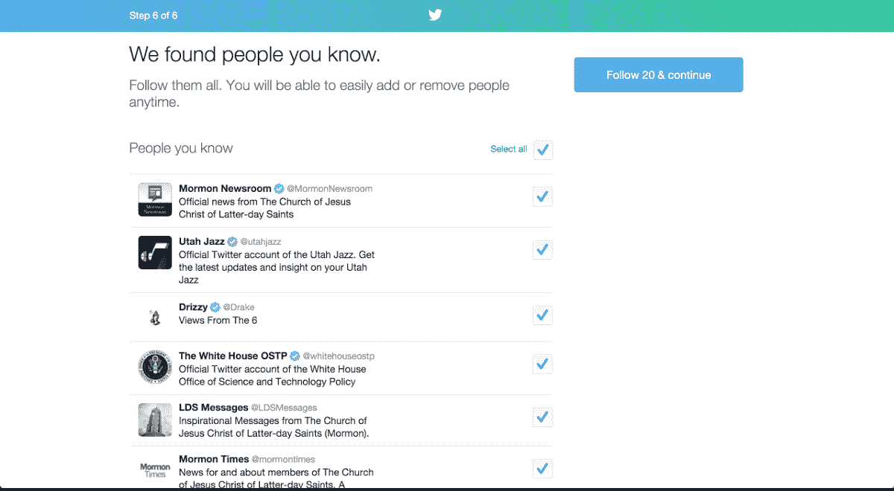

也许我有一封来自摩门教新闻编辑室的电子邮件，但他们肯定不是我的“联系人”我不知道德雷克是怎么上去的，也不知道白宫是怎么上去的，但这显然又坏了。我的 feed 是一堆品牌，其中大多数都在努力推广内容。

但也许是因为我在桌面上，没人再用桌面了；让我们试试手机。这次我将只使用我的手机联系人列表*中的*。

令我惊讶的是，Twitter 又为我注入了大量其他账户。从巴拉克·奥巴马和比尔·克林顿到新闻网站和各种随机的名人，夹杂着我真正认识和关心的人。

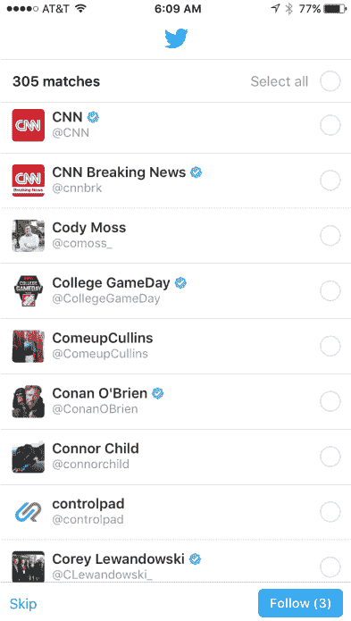

当我到达我的主屏幕时，推文来自(按此顺序):

《时代》、《市场观察》、《企业家》、《时代》、《ESPN》、CNN、《经济学人》、《福布斯》、《华尔街日报》。

我不得不滚动浏览 57 条推文，然后才看到我认识的人发来的消息。

#### 我来这里不是为了追随品牌

也许这只是我的看法，但我猜想解决社交图问题的第一步是停止迷恋流行和品牌账户——尤其是那些每小时发 7 次微博的账户。看起来 Twitter 正在全面推广这些技术。也许我是一个非典型用户，但在我看来，他们是一些最糟糕的账户:他们大多发布新闻稿和文章链接。

#### 我如何找到可以追随的人

1.  我喜欢寻找和我发同样链接的人。这意味着他们通常对相同的话题或阅读相同的材料感兴趣。它几乎变成了一个反向喷嘴。
2.  有时我会浏览我转发的推文，并关注那些转发它们的人。
3.  偶尔我会使用类似于 [Electoralhq](https://www.electoralhq.com/) 的工具来创建一个其他人关注的所有人的列表，本质上是重新创建那个人的 feed。然后，我可以偶尔使用那个人的反馈来寻找新的人。(这实际上曾经是 Twitter 的一个功能)。
4.  我喜欢创建被我关注的人关注，但没有被我关注的人的列表。我发现了一些我最喜欢的账户。

正如你所看到的，这些不是大多数用户会做的事情，但它们极大地增加了 Twitter 对我的价值，我认为看到这些工具被广泛使用是件好事。(实际上，我过去曾经尝试过构建其中的一些，但是 API 调用限制使得它不可能实现。)

这相对来说是微不足道的，但是考虑到社交图的构建是 Twitter 最重要的一个方面，如果有一些额外的工具来找到人就好了。

### 关注超过人

解决社交图问题的一个潜在的更明显的方法是让我关注更多的人。

如果你能关注*事件会怎么样？*

如果您可以关注*主题会怎么样？*

这显然是 Twitter 试图用时刻来解决的问题，但时刻并不能解决问题。

#### 固定力矩

时刻的问题不在于设计、按钮的位置或者布局；这一切都执行得非常好(为此向 Moments 团队致敬)。

瞬间的问题在于内容。Moments 实际上是在 Twitter 内部重建了雅虎主页的一部分。

我和我认识的大多数使用 Twitter 的人都去 Twitter 寻找雅虎主页上没有的东西。

这也不一定是《时刻》编辑团队的错；问题是编辑团队被赋予了一项不可能完成的任务:找到所有 Twitter 用户都想点击的内容。记住我的话，那永远不会发生。

Moments 着手解决的问题是*固化很难*。一个事件正在发生，当然，你可以关注这个标签，但是有太多的消防水管可以喝。我敢打赌思维过程是这样的:

> “对于人们来说，在像弗格森这样的大事件中，很难管理好自己的信息，让 Twitter 变得有价值。我们如何解决这个问题？”

> “那我们就雇一些人去找最好的东西，然后为他们做这件事。”

结合一些关于如何将这些推文整合到 feed 的头脑风暴，Twitter Moments 诞生了。我认为他们的方向是正确的。

但我也认为 Twitter 错过了一个巨大的机会，特别是因为它没有很好地扩展。

可能会有一些人对以上话题感兴趣，但我不知道他们是谁。我打赌推特会承认他们也不知道。

在我看来，错过的机会是有*人愿意在 Twitter 上为他人策划，甚至是一条一条地策划。*

可能只有 1%吧。也许只有 10%。但是为什么要坐在那里管理 10 个话题的推文，当你可以开放它，允许每个人管理 T2 任何话题的推文呢？

这样做可以向所有人开放，让每个事件都有人报道。它仍然是可嵌入、可链接和可共享的；你甚至可以“关注”某个时刻，让这些链接填充你的时间表，但它会出现在每个主题的*中。*

#### 开幕时刻

为了理解矩是如何工作的，让我们再一次把它分解成解剖碎片。

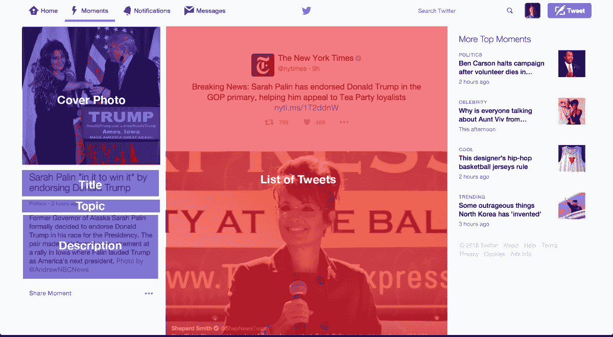

这其实非常简单。我从未见过 Moments 的后端，但我会想象它是四个“标题”字段，然后是一堆用于放置推文链接的字段。

我知道一个事实，你可以让普通人填写这些字段，因为我们在 Grasswire 使用几乎完全相同的字段几乎两年了(除了我们用“标签”代替“主题”，用“链接”代替“推文”)。

为什么不打开它呢？暴露后端，允许我创建一些将在 twitter.com/austenallred/moments,生活的时刻，并以同样的方式显示它。艰难的工作完成了。

那么问题就归结为“瞬间发现”

Klout(我知道，我知道)对我的推文进行了非常初步的分析，揭示了我感兴趣的主题:

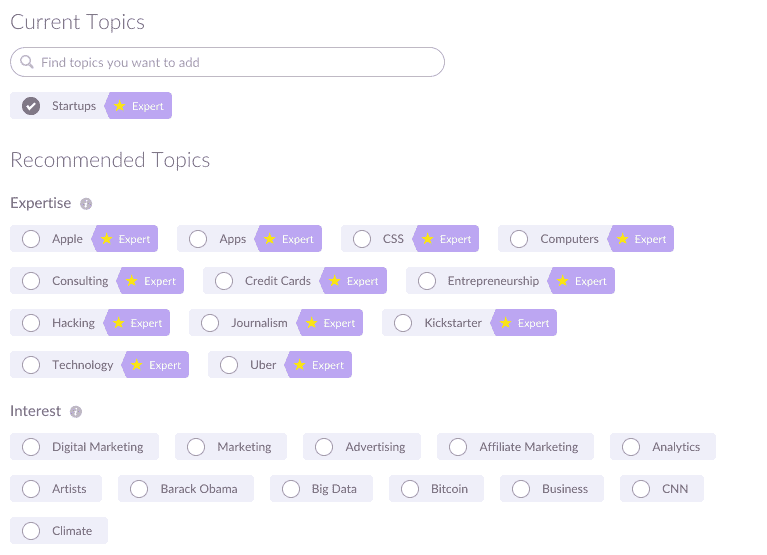

这是非常正确的；除了几个例外，我很想看到关于这些东西的瞬间。Twitter 拥有所有这些数据；它知道我在推特上发什么，这需要一些技巧，但没有理由推特不能向我展示关于这些事情的时刻。这样做将使时刻对我来说无比珍贵。

如果时刻有关于这些事情的内容，我可能会每天查看几次时刻标签。人们会创造并嵌入它们，新闻公司会以这种方式创造故事；你几乎可以在产品中直接内置一个更容易使用的 Storify，但重要的是，它应该是可扩展的和个性化的。

但是如果我想跟踪的不是一个*事件*呢？

#### 收集

Moments 适用于具有特定起止时间的事件。但是话题呢？

从技术上讲，Twitter 收藏是存在的，但它们的格式如此之广，以至于直到几天前我才知道它们是一个东西。收藏是个非常非常好的主意。但是有几个问题:

1.  我必须使用一种叫做“馆长”的特殊工具来创建它们。
2.  查看收藏很困难，因为它有些隐蔽。

这两者都有相当明显的解决方案。

创建一个收藏应该和创建一个列表一样简单，除了这次不是收集*个人*而是收集*个人的推文*。

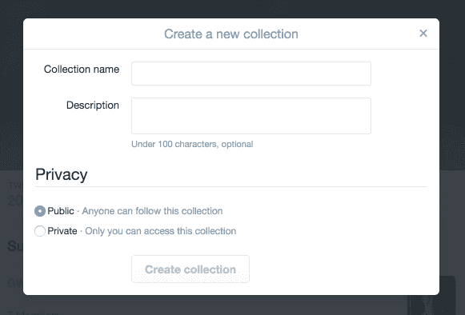

很简单:在个人资料照片下拉列表中添加另一个列表项，所有东西都有了一个家。

也不难理解如何将一条推文添加到收藏中。

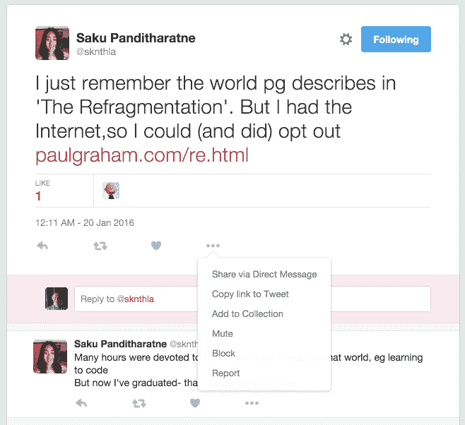

这些小细节很重要，因为这样就不需要构建一个具有搜索功能、发现、显示时间线的新方法等的独立产品。如果做得好，在现有产品中加入新功能实际上会更简单。对 API 和 UI 做了一些修改，就可以开始了。(当然，从创业背景来看，我肯定低估了这一点的难度，但理论上它不应该很复杂。)

但是对我来说，收藏真正有趣的地方在于你如何去跟随它们。

众所周知，Twitter 的绝大多数使用是在用户的主页上。列表没有起飞的原因是因为人们只是使用他们的家庭饲料。如果我是 Twitter 产品方面的全能人物，我会让人们关注一个收藏，然后将添加到他们那里的任何推文注入我的主页。(检查冲突和重复会更加困难，但我们现在将忽略这一点)。

注射到我的饲料中会是什么样子？与任何其他推文一样，除了回到我们对推文的剖析，我们现在有绿色的“from @user/collection-name”，而不是“retweed by[全名]。”(为了方便起见，我将它再次放在下面。)添加某种收藏图标，您就可以持续关注另一个用户策划的主题(或事件)。

以这种方式实现，我可以让别人在一条接一条的基础上为我做策展。现在你真的没有办法在 Twitter 上关注一件事情。你可以关注那些可能会发关于 T4 某件事的微博的 T2 人，但是他们可以发任何他们想发的微博，而你却不得不这样做。

在某种程度上，关注话题实际上会比关注人容易得多。策展人将会得到回报，因为他们的设计受到人们的赞赏，而新用户将能够直接进入他们感兴趣的话题，而不必去挑选他们感兴趣的人。

一旦这变得更加确定，您可以创建“组集合”，用户可以邀请其他人和他或她一起添加到集合中。但那是专家模式，我们还是业余的。

### 消防水管

也许最好的方式来描述我会做什么，如果我在 Twitter 的产品是解决“消防水管”的问题。Twitter 的问题是好东西太多了。对于绝大多数创业公司和产品来说，这是一个疯狂的梦想，但这不是 Twitter 生活的世界。

总的来说，Twitter 最大的问题是发现，这是人工创建社交图的结果，我认为这将有助于解决这个问题。

同样，这些只是随机的想法，大部分是在长途飞机飞行中写的，我既没有内部信息也没有权力实施这些改变，所以当所有的都说了，做了，这只是一个关于我喜欢的产品的长时间的头脑风暴。

概括一下:

*   添加新的附件类型，即文本帖子
*   原生 tweetstorm 集成
*   消除新用户入职时的压力
*   开放时刻
*   创建可跟进的“集合”

为 2016 年的推特干杯。