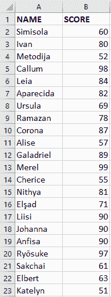
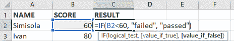
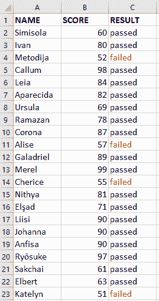
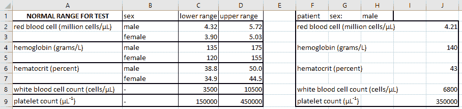
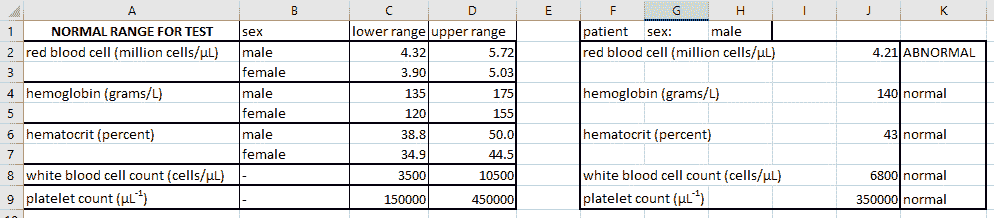
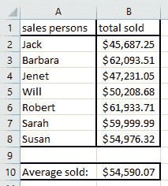
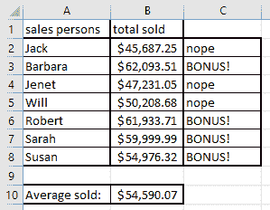

# IF 语句 Excel–IF 函数示例

> 原文：<https://www.freecodecamp.org/news/if-statement-excel-if-function-examples/>

如果您在 Excel 中分析数据，并且需要有条件地设置单元格的值，您可以使用`IF`语句来完成。

语法是`IF(logical_test, [value_if_true], [value_if_false])`，其中:

*   `logical_test`是计算结果为`TRUE`或`FALSE`的表达式，
*   `value_if_true`是可选参数，它是在`logical_test`为真的情况下表达式计算的值，并且
*   `value_if_false`是可选参数，确定`logical_test`为假时的值。

# IF 语句示例

让我们看看如何在实践中使用`IF`语句，以便更好地理解它是如何工作的。

## IF 语句示例 1

假设我们有一份学生名单和他们在一次考试中的分数，如下所示:

我们希望将每个学生标记为考试及格或不及格，我们可以使用一个`IF`语句来检查他们的分数是低于还是高于及格分数。及格分数是 60 分，所以如果学生得到的分数低于 60 分，这意味着他们没有通过考试，否则他们通过了考试。

我们可以在 excel 中把这个写成`IF(B2<60, "failed", "passed")`，如下图。

然后，我们可以将该信息填充到该列的所有单元格中。我们会得到这样的结果:

我使用了一点[条件格式](https://support.microsoft.com/en-us/office/use-conditional-formatting-to-highlight-information-fed60dfa-1d3f-4e13-9ecb-f1951ff89d7f)，以便更容易看出两个结果之间的差异。

## IF 语句示例 2

对于更复杂的逻辑，还可以嵌套 if 语句。我已经在本文的[中写了如何做到这一点。让我们在这里用一个医学领域的例子再看一遍。](https://www.freecodecamp.org/news/if-function-excel-tutorial-and-how-to-do-multiple-if-statements-in-excel/)

我们有患者的血液测试结果，以及正常范围值(因患者性别而异)。让我们用一个`IF`语句来检查验血结果是在正常范围之内还是之外:

男性和女性患者的正常范围是不同的，因此我们需要先检查患者的性别，然后才知道使用哪个范围来检查测试结果。

我们首先检查`$H$1="male"`(当我们将公式复制并粘贴到其他单元格时，我们使用`$`符号来固定这个单元格)。然后我们使用一个嵌套的`IF`语句将血液测试的值与范围进行比较。

如果病人是男性，我们用`IF(OR(J2<C2, J2>D2), "ABNORMAL", "normal")`。如果患者是女性，我们使用`IF(OR(J2<C3, J2>D3), "ABNORMAL", "normal")`。

[`OR`函数](https://support.microsoft.com/en-us/office/or-function-7d17ad14-8700-4281-b308-00b131e22af0)如果至少有一个参数为真，则返回真，如果没有一个参数为真，则返回假。在这种情况下，我们用它来检查测试结果是低于范围的下限值还是高于范围的上限值。如果在范围之外，我们返回`ABNORMAL`，如果在范围之内，我们返回`normal`。

综上所述，公式如下所示:

`=IF(H$1="male", IF(OR(J2<C2, J2>D2), "ABNORMAL", "normal"), IF(OR(J2<C3, J2>D3), "ABNORMAL", "normal"))`。

对于白细胞计数和血小板计数，根据患者的性别没有区别，因此公式更简单:

`=IF(OR(J8<C8, J8>D8), "ABNORMAL", "normal")`。

## IF 语句示例 3

在第三个例子中，让我们考虑一组销售人员在某个时期能够销售什么。

在这一组中，如果他们能够卖出比平均水平更多的东西，他们就会得到奖金。因此，让我们用这个公式来检查他们的平均收益:

`=IF(B2>B$10, "BONUS!", "nope")`

好像他们四个人这一期会有奖金！

# 结论

如果你需要分析数据，那么 Excel 中的`IF`语句非常有用。

我们已经通过三个不同的例子看到了它的作用，但是你能用它做什么只受到你的创造力的限制。玩得开心！