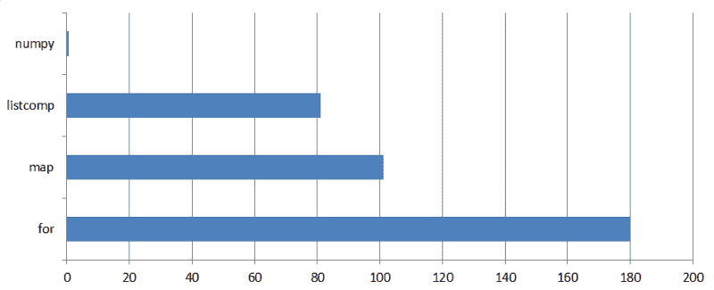

# 如果你在 Python 中有慢循环，你可以修复它…直到你不能

> 原文：<https://www.freecodecamp.org/news/if-you-have-slow-loops-in-python-you-can-fix-it-until-you-cant-3a39e03b6f35/>

马克西姆·马马耶夫

我们以一个计算问题为例，写一些代码，看看如何提高运行时间。开始了。

### 设定场景:背包问题

这是我们将用作例子的计算问题:

背包问题是组合优化中一个众所周知的问题。在这一节中，我们将回顾它最常见的形式，即 0–1 背包问题，以及通过动态编程的方法来解决它。如果你熟悉这个主题，你可以[跳过这部分](#467d)。

给你一个容量为**C*的背包和一堆 **N** 的物品。每一项都有重量**w【I】**和值**v【I】**。你的任务是把最值钱的东西装进背包。换句话说，你要最大化你放入背包主题的物品的总价值，有一个约束:被拿走物品的总重量**不能超过背包的容量**。***

*一旦你得到了一个解，背包中物品的总重量就叫做“解的重量”，它们的总价值就是“解的价值”。*

*这个问题有许多实际应用。例如，你决定向著名的 FAANG 股票(脸书、亚马逊、苹果、网飞和谷歌股票的统称)投资 1600 美元。每股都有当前市场价格和一年的估计价格。截至 2018 年的某一天，它们如下:*

```
*`========= ======= ======= =========Company   Ticker  Price   Estimate========= ======= ======= =========Alphabet  GOOG    1030    1330Amazon    AMZN    1573    1675Apple     AAPL    162     193 Facebook  FB      174     216 Netflix   NFLX    312     327========= ======= ======= =========`*
```

*为了简单起见，我们假设你不会把所有的鸡蛋放在一个篮子里。你愿意购买的**不超过每只股票的**股。你买什么股票能使你的利润最大化？*

*这是一个背包问题。你的预算(1600 美元)是袋子的容量(C) 。股票是需要打包的项目。当前价格是**权重(w)** 。价格估计是**值**。这个问题看起来微不足道。然而，乍看之下，解决方案并不明显——你是应该买一股亚马逊的股票，还是一股谷歌的股票，再加上苹果、脸书或网飞的某种组合。*

*当然，在这种情况下，你可以通过手工快速计算得出答案:你应该购买谷歌、网飞和脸书。这样你花了 1516 美元，期望获得 1873 美元。*

*现在你相信你发现了一个克朗代克。你打碎了你的存钱罐，收集了 10，000 美元。尽管你很兴奋，你仍然坚持“一股一买”的原则。因此，有了更多的预算，你必须拓宽你的选择。你决定将纳斯达克 100 指数中的所有股票作为买入的候选股票。*

*未来从未如此光明，但你突然意识到，为了确定你的理想投资组合，你将不得不检查大约 2 个⁰⁰组合。即使你对数字经济的迫近和无处不在超级乐观，任何经济都至少需要一个它运行的宇宙。不幸的是，在你的计算结束的几万亿年后，我们的宇宙可能就不存在了。*

#### *动态规划算法*

*我们必须放弃暴力的方法，设计一些聪明的解决方案。小背包问题(我们的是一个小问题，信不信由你)是通过动态规划解决的。基本思想是从一个我们知道其解决方案的小问题开始，然后逐步增加复杂性。*

*如果你觉得下面的解释太抽象，这里有一个[带注释的插图](https://github.com/mmamaev/looping_python/blob/master/ks_dp_example.pdf)来说明一个非常小的背包问题的解决方案。这将帮助你想象正在发生的事情。*

*假设，给定集合的前 **i** 项，我们知道所有背包容量 **k** 在 0 到 **C** 范围内的解值 **s(i，k)** 。*

*换句话说，我们缝了从 0 到 **C** 各种尺寸的 **C+1** “辅助”背包。然后我们整理了我们的收藏，拿走了第一件 **i** 物品，暂时把其余的都放在一边。现在我们假设，通过一些魔法，我们知道如何从这一组工作物品中最优地包装每一袋。对于不同的袋子，我们从工作集选择的项目可能不同，但目前我们对选择或跳过哪些项目不感兴趣。我们只记录每个新缝制的袋子的溶液值 **s(i，k)** 。*

*现在，我们从集合中取出下一个， **(i+1)** 项，并将其添加到工作集。让我们用这个新的工作集找到所有辅助背包的解决方案值。换句话说，对于所有的 **k=0，我们找到 **s(i+1，k)** ..C** 给定 **s(i，k)** 。*

*如果 **k** 小于新物品**w【I+1】**的重量，我们就不能拿这个物品。的确，即使我们只带了***这一件物品，光是它也放不进背包。因此， **s(i+1，k) = s(i，k)** 对于所有**k<w【I**+1】。****

****对于值 **k > = w[i** +1】我们必须做出选择:要么我们把新物品放入 capaci **t** *y* k 的背包中，要么我们跳过它。我们需要评估这两个选项，以确定哪一个能给我们带来更多的价值。****

****如果取第 **(i+1)** 项，则得到值**v【I+1】**，消耗背包容纳重量**w【I+1】**的那部分容量。这给我们留下了容量**k–w[I+1]***，我们必须使用(一些)第一个 **i** 项目来最佳地填充该容量。这个最佳填充具有解值 **s(i，k–w[I+1])**。这个数字对我们来说是已知的，因为根据假设，我们知道 **i** 项的工作集的所有解值。因此，带有物品 **i+1** 的背包 **k** 的候选解值将是
**s(i+1，k | I+1)= v[I+1]+s(I，k–w[I+1])**。*****

*****另一种选择是跳过项目 **i+1** 。在这种情况下，我们的背包没有任何变化，候选解值将与 **s(i，k)** 相同。*****

*****为了决定最佳选择，我们比较两个候选解的值:
**s(i+1，k | i+1 取)= v[i+1] + s(i，k–w[I+1])**
**s(I+1，k | i+1 跳过)= s(i，k)*******

*****这些中的最大值成为解 **s(i+1，k)** 。*****

*****总而言之:*****

```
*****`if k < w[i+1]:    s(i+1, k) = s(i, k)else:    s(i+1, k) = max( v[i+1] + s(i, k-w[i+1]), s(i, k) )`*****
```

*****现在我们可以一步一步地解决背包问题。我们从空的工作集 **( *i=0* )** 开始。显然， **s(0，k) = 0** 对于任何 **k** 。然后，我们采取步骤，向工作集添加项目，并找到解值 **s(i，k)** ，直到我们到达 **s(i+1=N，k=C)** ，这是原始问题的解值。*****

****注意，通过这样做，我们已经建立了网格的**解值。******

*****然而，尽管我们已经知道了解的值，但我们并不知道背包中到底放了什么东西。为了找出答案，我们回溯网格。从 **s(i=N，k=C)** 开始，我们比较 **s(i，k)与 s(I–1，k)** 。*****

*****如果 **s(i，k)= s(I–1，k)** ，则第 **i** 项没有被取。我们用**I = I–1**重申保持 **k** 的值不变。否则，第 **i** 项已被获取，对于下一个检查步骤，我们将背包收缩 **w[i]** —我们已经设置**I = I–1，k = k–w[I]**。*****

*****这样，我们检查从第 **N** 到第一个的所有物品，并确定它们中的哪些已经被放入背包。这给了我们背包问题的解决方案。*****

### *****代码和分析*****

*****现在，我们有了算法，我们将比较几种实现，从一个简单的开始。该代码可在 [GitHub](https://github.com/mmamaev/looping_python/blob/master/ks_dp_solvers.py) 上获得。*****

*****数据是**纳斯达克 100** 列表，包含一百只股票的当前价格和价格估计(截至 2018 年的某一天)。我们的投资预算是 1 万美元。*****

*****回想一下，股票价格不是整数，而是美分。因此，为了得到精确的解，我们必须以美分来计算所有的东西——我们肯定希望避免浮点数。因此，我们背包的容量是($)10000 x 100 美分= ($)1000000，我们问题的总大小 **N x C** = 1 000 000。*****

*****对于一个占用 4 字节内存的整数，我们预计该算法将消耗大约 400 MB 的 RAM。所以，记忆不会成为限制。我们应该关心的是执行时间。*****

*****当然，我们所有的实现都会产生相同的解决方案。供你参考，投入(解权重)为 999930 美元(9999.30 美元)，预期回报(解价值)为 1219475 美元(12194.75 美元)。要买的股票清单相当长(100 个项目中的 80 个)。您可以通过运行代码来获得它。*****

*****请记住，这是一个编程练习，而不是投资建议。当你读到这篇文章的时候，价格和估价已经和这里作为例子的有所不同了。*****

*****

Credit: [Martin von Rotz](https://www.snapwi.re/user/mavoro)***** 

#### *****普通的老式“for”循环*****

*****下面给出了该算法的简单实现。*****

*****有两部分。*****

*****在第一部分(上面的第 3–7 行)，两个嵌套的`for`循环用于构建解决方案网格。*****

*****外部循环将项目添加到工作集，直到我们到达 **N** (参数`items`中传递了 **N** 的值)。每个新工作集的解值行用为前一个工作集计算的值初始化。*****

****每个工作集的内部循环从新添加的`item` 到 **C** 的权重中迭代`k`的值(参数`capacity`中传递了 **C** 的值)。****

****注意，我们不需要从**k = 0**T4 开始循环。当`k` 小于`item`的权重时，解的值总是与先前工作集计算的值相同，并且这些数值已经通过初始化复制到当前行。****

****循环完成后，我们就有了解决方案网格和解决方案值。****

****第二部分(第 9-17 行)是一个由***迭代组成的单个`for`循环。它沿着网格回溯，找到哪些物品被放进了背包。*******

*******接下来，我们将专门关注算法的第一部分，因为它具有 **O(N*C)** 的时间和空间复杂度。回溯部分只需要 **O(N)** 时间，并且不花费任何额外的内存——它的资源消耗相对来说可以忽略不计。*******

*******在我的电脑上，简单的实现花了 **180 秒**来解决**纳斯达克 100** 背包问题。*******

*******有多糟糕？一方面，随着现代的速度，我们不习惯花三分钟等待电脑做事情。另一方面，问题的规模——一亿——看起来确实令人生畏，所以，也许三分钟可以？*******

*******为了获得一些基准，让我们用另一种语言编写相同的算法。我们需要一种静态类型的编译语言来保证计算速度。不，不是 c。这不是幻想。我们会坚持时尚，用 Go 来写:*******

*******如您所见，Go 代码与 Python 中的代码非常相似。我甚至复制粘贴了最长的一行。*******

*******运行时间是多少？ **400 毫秒**！换句话说，Python 出来比围棋慢 500 倍。如果我们在 c 中尝试，差距可能会更大，这对 Python 来说绝对是一场灾难。*******

*******

Quote from J. K. Rowling’s “Harry Potter and the Chamber of Secrets” [Source of original image here](https://pixabay.com/en/snail-rainy-day-spring-animal-slow-3385348/).******* 

*******为了找出是什么降低了 Python 代码的速度，让我们用 [line profiler](https://github.com/rkern/line_profiler) 运行它。你可以在 [GitHub](https://github.com/mmamaev/looping_python/blob/master/ks_dp_solvers_profiles.txt) 找到 profiler 的输出。*******

*******在简单的求解器中，99.7%的运行时间花费在两行上。这两行组成了内循环，执行了 9800 万次:*******

*******我对过长的行表示歉意，但是行分析器无法正确处理同一语句中的换行符。*******

*******我听说 Python 的`for`操作符很慢，但有趣的是，大部分时间不是花在`for`行，而是花在循环体上。*******

*******我们可以将循环体分解成单独的操作，以查看是否有任何特定的操作太慢:*******

*******似乎没有特别突出的操作。内循环中单个操作的运行时间与代码中其他地方类似操作的运行时间非常相似。*******

*******注意分解代码是如何增加总运行时间的。内部循环现在占用了 99.9%的运行时间。你的 Python 代码越笨，速度就越慢。很有趣，不是吗？*******

#### *******内置地图功能*******

*******让我们进一步优化代码，用内置的`map()`函数替换内部的`for`循环:*******

*******这段代码的执行时间是 **102 秒**，比直接实现的成绩差了 78 秒。的确，`map()`跑得明显更快，但不是压倒性的。*******

#### *******列表理解*******

*******您可能已经注意到，内部循环的每次运行都会产生一个列表(作为新的一行添加到解决方案网格中)。创建列表的 Pythonic 方式当然是列表理解。让我们试试看，而不是`map()`。*******

*******这在 **81 秒**内完成。我们实现了另一个改进，与简单的实现(180 秒)相比，运行时间减少了一半。脱离上下文，这将被称赞为重大进步。唉，我们离我们的基准 0.4 秒还有几光年的距离。*******

#### *******NumPy 数组*******

*******最后，我们用尽了内置的 Python 工具。是的，我能听到观众们高呼“NumPy！NumPy！”但是要欣赏 NumPy 的效率，我们应该事先通过尝试`for`、`map()`和列表理解，把它放到上下文中。*******

*******好了，现在是睡觉的时间了。因此，我们放弃列表，将数据放入 numpy 数组:*******

*******突然，结果令人沮丧。这段代码的运行速度比普通的列表理解求解器慢 1.5 倍( **123 秒**对 81 秒)。这怎么可能呢？*******

*******让我们检查两个解算器的线轮廓。*******

*******将`grid[0]`初始化为 numpy 数组(第 274 行)比它是 Python 列表(第 245 行)时快三倍。在外循环中，NumPy 数组(第 276 行)的初始化速度比 list(第 248 行)快 4.5 倍。到目前为止，一切顺利。*******

*******然而，第 279 行的执行比第 252 行的无 numpy 模拟慢 1.5 倍。问题是列表理解创建了一个值的列表，但是我们将这些值存储在一个位于表达式左侧的 T2 数组中。因此，这一行隐含地增加了将列表转换成 NumPy 数组的开销。由于第 279 行占用了 99.9%的运行时间，numpy 之前提到的所有优势都变得微不足道。*******

*******但是我们仍然需要一种方法来通过数组迭代 T2 以进行计算。我们已经知道列表理解是最快的迭代工具。(顺便说一下，如果您试图在一个普通的旧`for`循环中构建 NumPy 数组，避免从列表到 NumPy 数组的转换，那么您将获得高达 295 秒的运行时间。)那么，我们是不是被困住了，NumPy 是不是一点用都没有？当然不是。*******

*******

Credit: [Taras Makarenko](https://www.pexels.com/@taras-makarenko-188506)******* 

#### *******NumPy 的正确使用*******

*******仅仅在 NumPy 数组中存储数据是不够的。NumPy 的真正威力来自于在 NumPy 数组上运行计算的函数。它们将数组作为参数，返回数组作为结果。*******

*******例如，有一个函数`where()`，它以三个数组作为参数:`condition`、`x`和`y`，并返回一个从`x`或`y`选取元素构建的数组。第一个参数`condition`是一个布尔值数组。它告诉从哪里选取:如果`condition`的一个元素被求值为`True`，则`x`的相应元素被发送到输出，否则从`y`中选取元素。*******

*******请注意，NumPy 函数在一次调用中完成了所有这些工作。对数组的循环被放到了幕后。*******

*******这就是我们如何在第一个解算器中使用`where()`作为内部`for`循环的替代，或者分别作为最新的列表理解:*******

*******有三段代码很有趣:第 8 行、第 9 行和第 10–13 行，编号如上。它们一起代替了内部循环，内部循环将遍历所有可能大小的背包来寻找解的值。*******

*******在背包的容量达到新添加到工作集的项目的重量(`this_weight`)之前，我们必须忽略这个项目，并将解值设置为先前工作集的值。这非常简单(第 8 行):*******

```
*****`grid[item+1, :this_weight] = grid[item, :this_weight]`*****
```

*******然后我们构建一个辅助数组`temp`(第 9 行):*******

```
*****`temp = grid[item, :-this_weight] + this_value`*****
```

*******此代码类似于，但比以下代码快得多:*******

```
*****`[grid[item, k — this_weight] + this_value  for k in range(this_weight, capacity+1)]`*****
```

*******如果新物品被放入可容纳该物品的每个背包中，它会计算可能的解决方案值。*******

*******注意`temp`数组是如何通过给数组添加一个**标量**构建的。这是 NumPy 的另一个强大功能，叫做“广播”。当 NumPy 看到维数不同的操作数时，它会尝试扩展(即“广播”)低维操作数，以匹配另一个操作数的维数。在我们的例子中，标量被扩展为一个与`grid[item, :-this_weight]`大小相同的数组，并且这两个数组被加在一起。结果，`this_value` 的值被加到`grid[item, :-this_weight]`的每个元素上——不需要循环。*******

*******在下一部分中(第 10-13 行),我们使用函数`where()`,它完全按照算法的要求来做:它比较每个背包大小的两个可能的解值，并选择较大的一个。*******

```
*****`grid[item + 1, this_weight:] =                 np.where(temp > grid[item, this_weight:],             temp,             grid[item, this_weight:])`*****
```

*******通过`condition`参数进行比较，计算为`temp > grid[item, this_weigh` t:】。这是一个基于元素的操作，它产生一个布尔值数组，一个布尔值对应一个辅助背包的大小。 `A T`rUE 值表示对应的物品要装入背包。因此，从数组中获取的解值是函数`n, t` emp 的第二个参数。否则，将跳过该项，并从网格的前一行复制解值—t`he wher`e()函数的第三个参数。*******

*******最后，曲速引擎启动了！这个解算器在 **0.55 秒**内执行。这比基于列表理解的求解器快 145 倍，比使用`for`循环的代码快 329 倍。虽然我们没有超过用 Go 编写的求解器(0.4 秒)，但我们已经非常接近了。*******

#### *******一些循环将被保留*******

*******等等，但是外面的`for`循环呢？*******

*******在我们的例子中，不属于内循环的外循环代码只运行了 100 次，所以我们可以不用修改它。然而，其他时候外圈可能会和内圈一样长。*******

*******我们可以像对内循环那样使用 NumPy 函数重写外循环吗？答案是否定的。*******

*******尽管两者都是循环，但是外部循环和内部循环在它们所做的事情上是完全不同的。*******

*******内部循环产生一个基于另一个 1D 数组的 1D 数组，当循环开始时，它的元素都是已知的。正是输入数据的这种预先可用性，允许我们用`map()`、列表理解或 NumPy 函数来代替内部循环。*******

*******外部循环从 1D 数组产生一个 2D 数组，当循环开始时，其元素是未知的。此外，这些组件数组是通过递归算法计算的:只有在找到第 **i** 个之后，才能找到第 **(i+1)** 个数组的元素。*******

*******假设外部循环可以表示为一个函数:
`grid = g(row0, row1, … rowN)`
所有的函数参数必须在函数被调用之前被评估，然而只有`row0`是预先知道的。由于第 **(i+1)** 行的计算依赖于第 **i** 行的可用性，我们需要一个从`1`到`N`的循环来计算所有的`row` 参数。因此，要用一个函数代替外部循环，我们需要另一个循环来计算这个函数的参数。这另一个循环正是我们试图取代的循环。*******

******避免外部`for`循环的另一种方法是使用递归。人们可以很容易地编写递归函数`calculate(i)`来产生网格的第 **i** 行。为了完成这项工作，该函数需要知道第 **(i-1)** 行，因此它将自己称为`calculate(i-1)`，然后像我们之前做的那样使用 NumPy 函数计算第 **i** 行。然后整个外环可以用`calculate(N)`替换。为了使图片完整，可以在本文附带的源代码中找到递归背包解算器。******

******然而，递归方法显然是不可伸缩的。Python 不是尾部优化的。默认情况下，递归堆栈的深度限制在 1000 左右。这个限制肯定是保守的，但是，当我们需要数百万的深度时，堆栈溢出是非常可能的。此外，实验表明递归甚至没有提供优于带有外部`for`循环的基于 NumPy 的求解器的性能优势。******

******这就是我们用完 Python 及其库提供的工具的地方(据我所知)。如果你绝对需要加速实现递归算法的循环，你将不得不求助于 Cython，或者 Python 的 JIT 编译版本，或者另一种语言。******

### ******外卖食品******

******

Running times of knapsack problem solvers****** 

*   ******用 NumPy 函数做数值计算。它们比 Python 的内置工具快两个数量级。******
*   ******Python 的内置工具中，列表理解比`map()`快，明显比`for`快。******
*   ******对于深度递归算法，循环比递归函数调用更有效。******
*   ******您不能用`map()`、列表理解或 NumPy 函数替换递归循环。******
*   ******“哑”代码(分解成基本操作)是最慢的。使用内置函数和工具。******