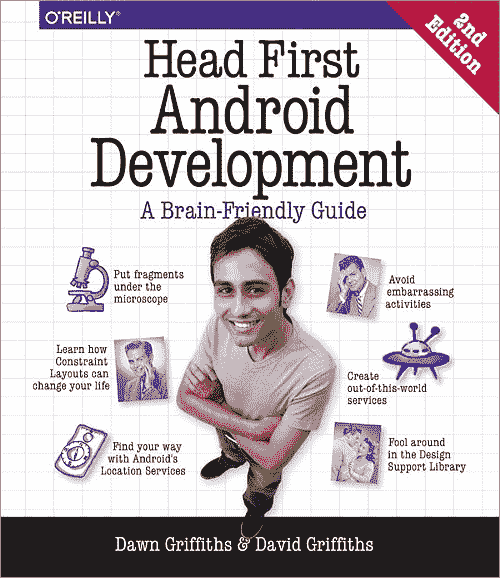
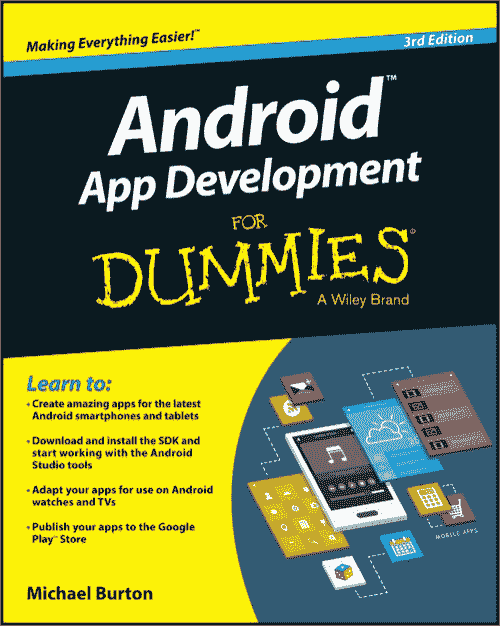
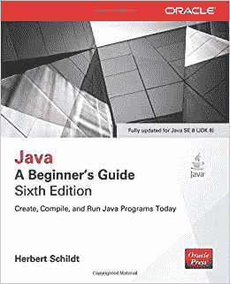
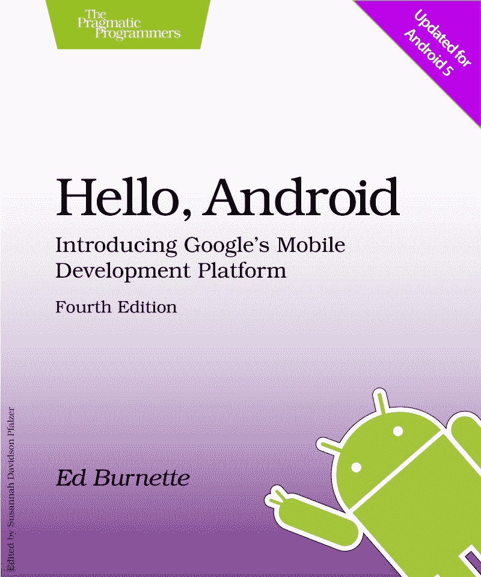
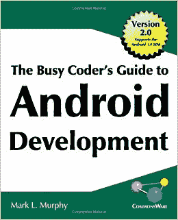
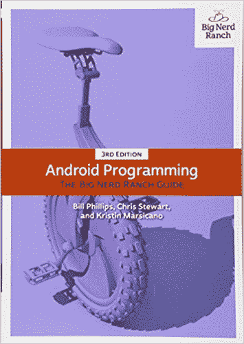
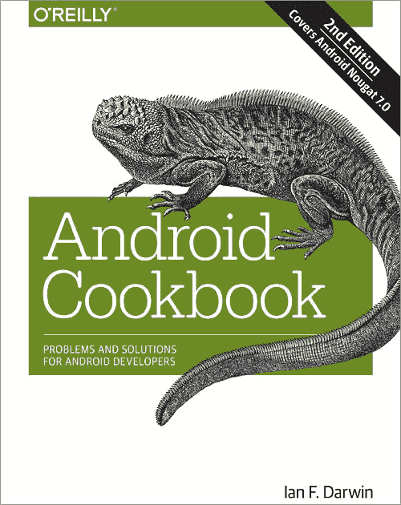
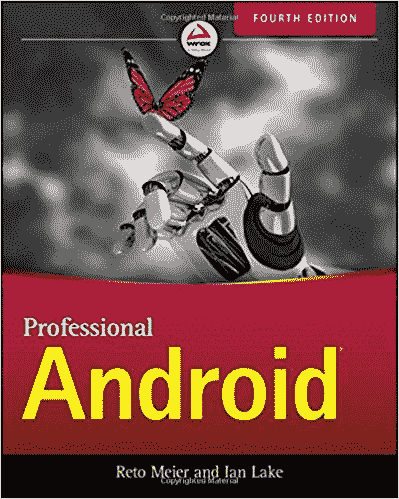
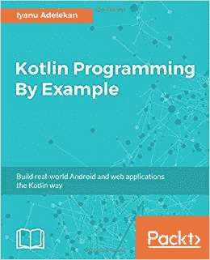
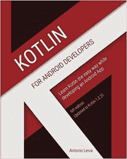

# 如果你想成为一名 Android 开发者，请阅读这些书籍

> 原文：<https://www.freecodecamp.org/news/if-you-want-to-become-an-android-developer-read-these-books-914cdf4b5347/>

作者:阿尤施·贾恩

# 如果你想成为一名 Android 开发者，请阅读这些书籍

Photo by [Susan Yin](https://unsplash.com/photos/2JIvboGLeho?utm_source=unsplash&utm_medium=referral&utm_content=creditCopyText) on [Unsplash](https://unsplash.com/search/photos/reading?utm_source=unsplash&utm_medium=referral&utm_content=creditCopyText)

在过去的三年里，我一直是一名 Android 开发人员，在这段时间里，许多书籍在我从新手到专家的旅程中帮助了我。当我开始的时候，似乎没有什么有用的文章可以指引我找到 Android 开发的最佳资源。

大多数文章都很模糊，而且似乎是由很少或没有实践经验的人写的。于是，我想我就写这篇文章，一劳永逸地为大家扫清道路。

下面是我挑选的关于 Android 开发的前十本书——你可以在我的博客上找到所有这些书[的链接。这份清单包括从初学者到高级水平的书籍。所以，继续读下去。](https://ayusch.com/top-10-android-development-books/)

#### **头先安卓开发**

这是我读的第一本关于 Android 开发的书。它非常适合初学者或者中级水平的 Android 开发者。这本书不会让你达到更高的水平，也不会触及任何像 RxJava、ButterKnife 或数据绑定这样的主题，但它会让你的基础知识达到顶点。

它涵盖了从如何设置您的 IDE 到创建一个正常运行的 Android 应用程序的所有内容。它有一种独特的方式，用思想泡泡和现实生活场景来解释概念。它还包含有趣的练习，如“填充磁铁”和“配对”，使事情更有趣。

如果你是 Android 开发的新手，并且想要深入了解它，那么这是一本完美的入门书籍——相信我。

**等级:初学者**

#### **为傻瓜开发安卓应用**

像我的第一个建议，这是一本遗产书。到现在为止,《假人》系列可能每个主题都有书？。这本书对于绝对的初学者来说确实很好，能够用简单的语言和较少的专业词汇清楚地解释概念。

它将指导您:

*   如何安装您需要的所有工具
*   设计一个好的用户界面
*   决定是对你的应用程序收费(以什么价格)还是免费提供
*   处理用户输入
*   手机和平板电脑应用的设计差异
*   避免常见陷阱的方法
*   鼓舞人心的示例应用。

如果你不确定从哪里开始，你可以选择这个。

**等级:初学者**

#### **Java:初学者指南，第六版**

为了学习 Android 开发或者变得更擅长 Android 开发，你需要掌握 Java 基础知识，这本书是一个完美的起点。

这本书针对 Java 8 进行了更新，所以它包括了 lambda 表达式和默认接口方法等主题。

这是非常基础的，对于想要开始使用 Java 进行 Android 开发的初学者来说非常好。

**等级:初学者**

#### **你好，Android:介绍谷歌的移动开发平台**

这本书也是给初学者看的，但是有一个抽象的层次。它没有深入解释所有的概念，只给你代码。如果那是你的事，你可以接受。

**等级:初级到中级**

#### **Android 开发繁忙的程序员指南**

说实话，我自己也没看过这本书。我上面提供的书足以让我全神贯注？但是，我从很多人那里听说这本书对所有层次的开发人员都有好处。

它涵盖了 Android 开发中的所有内容，应该不会让新的或中级的 Android 开发人员失望。

如果你是专业开发人员，我建议你试试**专业版安卓第四版**(详细如下)**。**

**等级:初级到中级**

#### **安卓编程:大书呆子牧场指南**

**大书呆子牧场指南**系列是大家在编程方面比较熟悉的书籍系列。他们有关于移动和网络开发以及其他一些技术的书籍。但是，我们来谈谈安卓系统。

《大书呆子牧场指南》是一本入门书籍，面向懂 Java，想学习 Android 开发的人。

它包括许多例子来支持这个理论。你将开发应用程序，如犯罪现场目录，照片浏览器，慢跑路线追踪器等。

虽然它经常被推荐给初学者，但我认为它有点太专业了，你需要在这本书旁边引用一些其他的资源。但是对于处于中级水平的人来说，这是一本完美的书。怎么推荐都不为过。

**级别:中级**

#### **安卓食谱**

这不是一本适合初学者的书。这是一本为专业 Android 开发人员编写的手册，他们正在寻找一些他们很难理解的主题的快速指南。解释简洁浅显。如果你选择阅读这本书，不要期望被填鸭式教育。

也就是说，它非常适合**专业人士**。只是一个快速指南，而不是太多的填鸭式。此外，我们还简要介绍了一些高级主题，并将解决方案作为练习。

举个例子:使用位置感知应用程序比简单地请求位置更新要复杂得多。然而，定位章节只涵盖了帮助新手入门的基本内容，而不是编写一个现实世界的应用程序。

**级别:专业人员和专家**

#### **专业安卓第四版**

顾名思义，这本书是为有经验的活动家而写的。

它涵盖了最佳实践、Android 应用程序生命周期和 UI 设计技术，例如为不同屏幕尺寸(包括平板电脑)构建强大的应用程序。

它包括许多真实世界的示例应用程序，为您提供专业 Android 开发的实践经验。但是请注意，这本书非常深入，需要一些编程经验来理解它的概念。

例如，它包括 JobScheduler、架构组件、Kotlin 简介、导航模式和设计模式。

如果你想让你的 Android 开发游戏更上一层楼，一定要看看这本书。

**等级:高级**

#### Kotlin 编程示例:以 Kotlin 的方式构建真实世界的 Android 和 web 应用程序

您将通过构建三个不同复杂度的应用程序来探索 Kotlin 的各种特性。第一个将是一个经典的俄罗斯方块游戏和 OOP 概念的阐述。

第二个是复杂程度增加的 messenger 应用。最后一款应用是 place reviewer:这是一款利用 Google Maps API 和 Place Picker 的 web 应用。

注意:它不仅包括 Android 应用程序示例，还包括构建 web 应用程序的示例。

也就是说，我认为没有一本书足以完全掌握一门语言。这本书里的例子足以让你很好地掌握科特林语。

**等级:任何想学习科特林的人**

#### 面向 Android 开发者的 Kotlin:在开发 Android 应用时学习 kot Lin

这是安东尼奥·莱瓦的一本电子书。如果你是一个 Android 开发者，你可能读过他的文章。

这本书很好地介绍了 Kotlin 编程语言，它带你经历了开发 Android 应用程序的过程。如果你是一名 Android 开发人员，并且想开始使用 Kotlin 进行开发，这本书是一个不错的起点(特别是因为在撰写本文时，它只是为数不多的 Android/Kotlin 教程之一)。

然而，这本书看起来像是匆忙出版的，因为它从头到尾都让人感觉很混乱。似乎作者为了让自己更容易理解，并不在乎解释书中的很多内容。

**等级:任何想学习 Android kot Lin 的人**

> 本文原帖[此处](https://ayusch.com/top-10-android-development-books/)。

喜欢你读的书吗？别忘了在****Whatsapp**和 **LinkedIn** 上分享这个帖子。**

***你可以在 [LinkedIn](https://www.linkedin.com/in/ayuschjain) 、 [Quora](https://www.quora.com/profile/Ayusch-Jain) 、 [Twitter](https://twitter.com/ayuschjain) 和 [Instagram](https://www.instagram.com/androidville/) 上关注我，在那里我**回答与**移动开发相关的**问题，尤其是 Android 和 Flutter** 。***