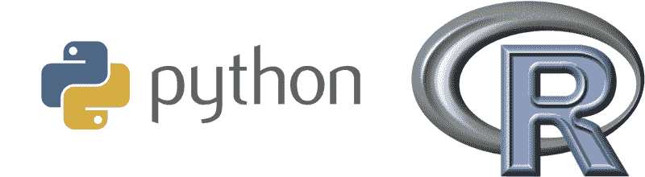
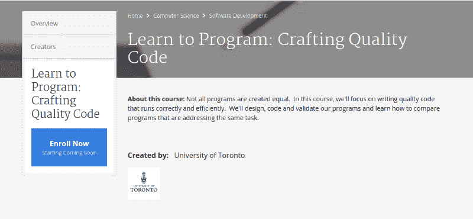
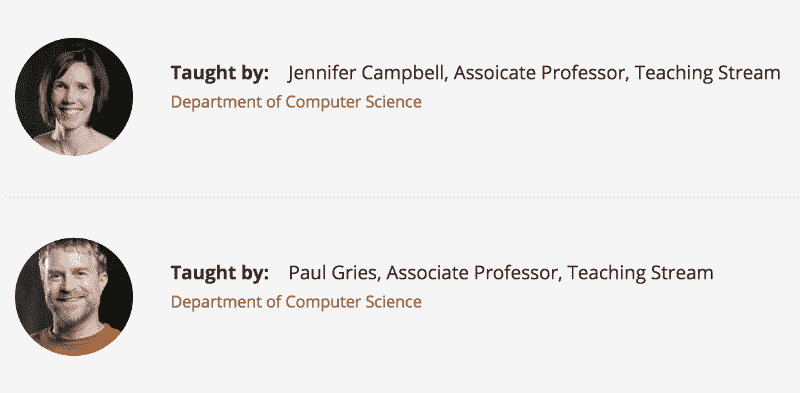
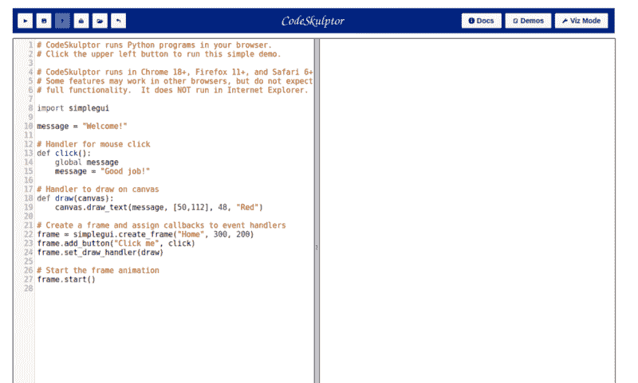
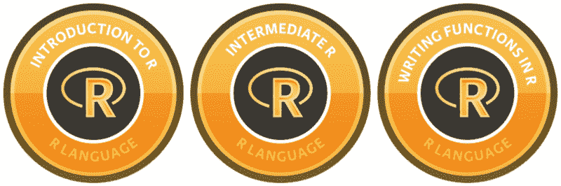
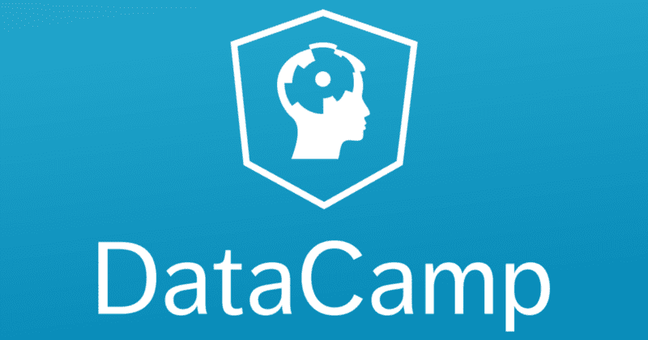

# 如果你想学习数据科学，可以从这些编程课程开始

> 原文：<https://www.freecodecamp.org/news/if-you-want-to-learn-data-science-start-with-one-of-these-programming-classes-fb694ffe780c/>

大卫·文丘里

# 如果你想学习数据科学，可以从这些编程课程开始

一年前，我还是一个没有任何编码背景的数字极客。在尝试了一门在线编程课程后，我深受启发，报名参加了加拿大最好的计算机科学课程之一。

两周后，我意识到我可以通过 edX、Coursera 和 Udacity 来学习我需要的一切。所以我退学了。

这个决定并不困难。我可以更快、更有效地学习我想学的内容，而且只需要很少的费用。

我已经有了大学学位，也许更重要的是，我已经有了大学经历。支付 3 万多美元重返校园似乎是不负责任的。

在意识到数据科学比计算机科学更适合我之后，我很快开始利用在线课程创建自己的数据科学硕士学位。我搜索了编程环境的介绍。我已经修了几门课程，并旁听了许多其他课程的部分内容。我知道有哪些选择，如果你的目标是数据分析师或数据科学家，需要哪些技能。

为了这个指南，我花了 20 多个小时试图找到截至 2016 年 8 月提供的每一个在线编程入门课程，从它们的教学大纲和评论中提取关键信息，并汇编它们的评级。为了完成这个任务，我求助于开源课程中央社区及其数千个课程评级和评论的数据库。

Class Central’s [homepage](https://www.class-central.com/).

自 2011 年以来， [Class Central](https://www.class-central.com/) 创始人[达瓦尔·沙阿](https://www.class-central.com/@dhawal)比世界上任何人都更关注在线课程。Dhawal 亲自帮我整理了这个资源列表。

### 我们如何选择要考虑的课程

每门课程都必须符合四个标准:

*   它介绍编程，也可以选择介绍计算机科学。参见下面的“关于编程与计算机科学的笔记”。
*   **指令语言是 Python 或 r。**这是目前数据科学中最流行的两种编程语言。
*   它必须是一个互动的在线课程，所以没有书籍或基于文本的教程。关于后者，Codecademy 的无视频和基于文本编辑器的课程符合条件，但严格的文本教程，如来自 [R 教程](http://www.r-tutor.com/r-introduction)的教程，则不符合条件。尽管书籍是学习编程、Python 和 R 的可行方法，但本指南主要关注课程。
*   它必须是一个相当长的时间:预计完成总共至少十个小时。

Python and R are the two most popular programming languages used in data science.

### 我们如何评估课程

我们相信我们已经涵盖了所有符合上述标准的著名球场。由于在 Udemy 上似乎有数百门 Python 和 R 语言的课程，我们选择只考虑评论最多和评分最高的课程。然而，我们有可能遗漏了一些东西。如果你认为是这样，请告诉我们。

我们收集了班级中心和其他评论网站的平均评分和评论数量。我们计算了每门课程的加权平均评分。如果一个系列有多个课程(像莱斯大学的[第一部分](http://bit.ly/2cDAXSz)和[第二部分](http://bit.ly/2dFvMSl)，我们计算所有课程的加权平均评分。我们也阅读文本评论，并使用这些反馈来补充数字评级。

我们根据三个因素做出主观的教学大纲判断:

1.  编程基础知识的覆盖面。
2.  涵盖更高级但有用的编程主题。(比如有几门课选择不涵盖面向对象编程。我们认为这是一个关键的话题，虽然不是交易的破坏者，因此这些课程只是被扣分，并没有被排除在考虑之外。)
3.  **教学大纲中有多少与数据科学相关？**

### 关于编程与计算机科学的一个注记

编程不是计算机科学，反之亦然。初学者可能不会敏锐地意识到其中的区别。借用[这个答案](http://programmers.stackexchange.com/questions/137103/whats-the-difference-between-computer-science-and-programming)来自程序员栈交换:

> 计算机科学是对计算机能做什么的研究；编程是让计算机做事情的实践。

我们正在寻找的课程介绍了**编程**，并选择性地触及了计算机科学的相关方面，这将有助于一名新程序员的认知。你会注意到，许多被考虑的课程确实有计算机科学部分。

然而，没有一门课程是严格意义上的计算机科学课程，这就是为什么像哈佛的 CS50x 在 edX 上被排除在外的原因。

### 我们为数据科学家挑选的最佳编程课程是…

多伦多大学 Coursera 上的“学习编程”系列。 [LTP1:基础知识](https://www.class-central.com/mooc/385/coursera-learn-to-program-the-fundamentals)和 [LTP2:制作质量代码](https://www.class-central.com/mooc/390/coursera-learn-to-program-crafting-quality-code)在 284 条评论中获得了近乎完美的加权平均评分 4.71 分(5 颗星)。对于初学数据的科学家来说，它们的内容难度和范围都很大。

这种免费的、基于 Python 的编程入门使其与我们考虑的其他 20 多门课程有所不同。

[Part 2](https://www.coursera.org/learn/program-code) of the University of Toronto’s “Learn to Program” series.

詹妮弗·坎贝尔和保罗·格里斯是多伦多大学计算机科学系(被认为是世界上最好的计算机科学系之一)的两位副教授，他们教授这个系列。自定进度、独立的 Coursera 课程与他们的书《[实用编程:使用 Python 3](https://www.amazon.ca/Practical-Programming-Introduction-Computer-Science/dp/1937785459) 的计算机科学导论》中的材料相匹配 LTP1 涵盖了该书的 40–50 %, LTP 2 涵盖了另外 40%。未涵盖的 10-20%对数据科学不是特别有用，这有助于他们成为我们的选择。

Your “Learn to Program” instructors: Jennifer Campbell and Paul Gries.

教授们友好而及时地根据我的要求发给我详细的课程大纲，在课程于 2016 年 9 月正式重启之前，很难在网上找到这些课程大纲。

[**学会编程:基础知识(LTP1)**](https://www.class-central.com/mooc/385/coursera-learn-to-program-the-fundamentals)

时间表:7 周

预计时间承诺:每周 6-8 小时

这门课程为没有编程经验的人提供了计算机编程的介绍。它涵盖了 Python 编程的基础，包括基本数据类型(数字类型、字符串、列表、字典和文件)、控制流、函数、对象、方法、字段和可变性。

**模块**

1.  安装 Python，IDLE，数学表达式，变量，赋值语句，调用和定义函数，语法，语义错误。
2.  字符串、输入/输出、函数重用、函数设计方案和文档字符串。
3.  布尔值、导入、名称空间和 if 语句。
4.  用于循环和复杂的字符串操作。
5.  While 循环、列表和可变性。
6.  用于索引、并行列表和字符串以及文件上的循环。
7.  元组和字典。

[**学习编程:手工制作质量代码(LTP2)**](https://www.class-central.com/mooc/390/coursera-learn-to-program-crafting-quality-code)

时间表:5 周

预计时间承诺:每周 6-8 小时

您知道 Python 编程的基础:基本数据类型(数字类型、字符串、列表、字典和文件)、控制流、函数、对象、方法、字段和可变性。为了在这门课程中取得成功，你需要擅长这些。

LTP:精心制作质量代码涵盖了接下来的步骤:设计更大的程序，测试你的代码以便你知道它能工作，阅读代码以便理解它的效率，以及创建你自己的类型。

**模块**

1.  设计算法:如何决定在函数体中做什么？首先，您如何确定要编写哪些函数？
2.  自动化测试:doctest 和 unittest。
3.  分析代码以提高速度——搜索和排序的细节。
4.  创建新类型:Python 中的类。
5.  用作参数、默认参数值和异常。

格里斯副教授还对课程结构做了如下评论:“每个模块都有大约 45 分钟到一个多小时的视频。还有视频测试问题，这将使学习视频的总时间达到大约 2 小时。”

这些视频一般都不到十分钟。

他继续说:“此外，我们每个模块有一个练习(十几个或两个左右的选择题和简答题)，应该需要一两个小时。在 LTP1 中有三个编程任务，每个任务可能需要四到八个小时的工作。LTP2 中有两个类似大小的编程任务。

他强调说，每周 6-8 小时的估计是一个粗略的猜测:“估计花费的时间是非常依赖于学生的，所以请在这种背景下考虑我的估计。例如，懂一点编程(也许是用另一种编程语言)的人可能会花完全不熟悉编程的人一半的时间。有时候，有些人会在一个概念上停留几个小时，而他们可能会轻松地浏览其他概念……这就是自定进度格式如此吸引我们的原因之一。”

总体而言，多伦多大学的*学习编程*系列课程预计将持续 12 周，每周 6-8 小时，这是大多数大学创建的在线课程的标准。如果你喜欢花 72-96 个小时来疯狂学习你的 MOOCs，在两到三周内完成是可行的，尤其是如果你有一点编程经验的话。

### **另一个伟大的 Python 选项**

如果你已经对编程有所了解，并且不介意教学大纲明显偏向游戏和交互式应用，我也推荐莱斯大学在 Coursera 上的 Python 交互式编程入门([第一部分](https://www.class-central.com/mooc/408/coursera-an-introduction-to-interactive-programming-in-python-part-1)和[第二部分](https://www.class-central.com/mooc/3196/coursera-an-introduction-to-interactive-programming-in-python-part-2))。

这门受欢迎的课程有 6，000 多条评论，最高加权平均评分为 4.93/5 颗星，以其引人入胜的视频、富有挑战性的测验和令人愉快的迷你项目而闻名。与我们的第一选择相比，它稍微困难一些，更少关注基础知识，更多关注不适用数据科学的主题。

这些课程也是 Coursera 上计算专业化的 7 门课程[原则的一部分。](http://bit.ly/2dBALkb)

*CodeSkulptor: Browser-based Python programming environment used for Rice University’s MOOCs.*

这些材料是自定进度的免费材料，并提供付费证书。购买本课程必须支付 79 美元，以获取分级材料。

Rice University’s [Coursera page](https://www.coursera.org/rice).

简明的课程描述和完整的教学大纲如下:

“这门分为两部分的课程旨在帮助很少或没有计算背景的学生学习构建简单交互式应用程序的基础知识…为了使学习 Python 变得容易，我们开发了一种新的基于浏览器的编程环境，使用 Python 开发交互式应用程序变得简单。这些应用程序将涉及内容是图形的窗口，并响应按钮、键盘和鼠标。

推荐背景:需要高中数学知识。虽然这门课是为没有编程经验的学生设计的，但一些初学编程的人认为这门课节奏很快。对于在上课前有兴趣做一些简单准备的学生，我们推荐一个自定进度的 Python 学习网站，如 codecademy.com。”

#### 第一部分

时间表:5 周

预计时间承诺:每周 7-10 小时

**Week 0 —语句、表达式、变量**
了解这个类的结构，探索 Python 这个计算器。

**第 1 周——函数、逻辑、条件**
学习 Python 编程的基本构造，并创建一个玩石头、布、剪刀的变体的程序。

**第 2 周—事件驱动编程，局部/全局变量**
学习事件驱动编程的基础知识，了解局部和全局变量的区别，创建一个玩简单猜谜游戏的交互式程序。

**第 3 周——画布、绘画、计时器**
用 Python 创建画布，学习如何在画布上绘画，并创建数字秒表。

**第 4 周——列表、键盘输入、建模运动的基础知识**
学习 Python 中的列表基础知识、Python 中的移动对象模型，并重现经典街机游戏“Pong”

#### 第二部分

**第 5 周——鼠标输入，列表方法，字典**
阅读鼠标输入，了解列表方法和字典，并绘制图像。

**第 6 周—类与面向对象编程**
使用类学习 Python 中面向对象编程的基础知识，并使用平铺图像。

**第 7 周——基础游戏物理，精灵**
了解加速和摩擦的数学，与精灵一起工作，并为你的游戏添加声音。

**第 8 周——集合和动画**
学习 Python 中的集合，计算精灵之间的碰撞，并制作精灵动画。

### **如果您设置为 R**

如果你正在学习 R 语言的编程入门课程，我们推荐 DataCamp 的 R 系列课程:[R 语言入门](https://www.datacamp.com/courses/free-introduction-to-r?tap_a=5644-dce66f&tap_s=93618-a68c98)、[中级 R 语言](https://www.datacamp.com/courses/intermediate-r?tap_a=5644-dce66f&tap_s=93618-a68c98)、[中级 R 语言——练习](https://www.datacamp.com/courses/intermediate-r-practice?tap_a=5644-dce66f&tap_s=93618-a68c98)，以及[R 语言中的编写函数](https://www.datacamp.com/courses/writing-functions-in-r?tap_a=5644-dce66f&tap_s=93618-a68c98)。虽然后三者的价格点为每月 25 美元，但 DataCamp 在涵盖编程基础和 R 特定主题方面是同类中最好的，这反映在它的平均评级为 4.29/5 颗星。

The first three courses in DataCamp’s series of R courses.

我们认为使用 ***在线课程*** 学习数据科学编程的最佳方法是首先通过 Python 来学习。为什么？缺少教授核心编程原则并使用 R 作为教学语言的 MOOC 选项。与 22 个基于 Python 的课程相比，我们找到了 6 个符合我们测试标准的 R 课程。大多数 R 课程没有得到很好的评价，也没有达到我们的大多数主观测试标准。

DataCamp’s [website](https://www.datacamp.com?tap_a=5644-dce66f&tap_s=93618-a68c98).

系列细分如下:

#### [R 简介](https://www.datacamp.com/courses/free-introduction-to-r?tap_a=5644-dce66f&tap_s=93618-a68c98)

预计时间承诺:4 小时

章节:

1.  基础介绍
2.  向量
3.  矩阵
4.  工厂
5.  数据帧
6.  列表

#### [中间 R](https://www.datacamp.com/courses/intermediate-r?tap_a=5644-dce66f&tap_s=93618-a68c98)

预计时间承诺:6 小时

章节:

1.  条件和控制流
2.  环
3.  功能
4.  申请家庭
5.  公用事业

#### [中级 R —练习](https://www.datacamp.com/courses/intermediate-r-practice?tap_a=5644-dce66f&tap_s=93618-a68c98)

预计时间承诺:4 小时

这个中级 R 的后续课程不涵盖新的编程概念。相反，你将通过一系列新的有趣的练习来加强你对中级 R 中主题的了解。

#### [在 R 中写入函数](https://www.datacamp.com/courses/writing-functions-in-r?tap_a=5644-dce66f&tap_s=93618-a68c98)

预计时间承诺:4 小时

章节:

1.  快速复习
2.  何时以及如何编写一个函数
3.  函数式编程
4.  高级输入和输出
5.  稳健函数

R 的另一个选择是参加基于 Python 的编程入门课程，学习编程的基础知识，然后通过 R 基础课程学习 R 语法。这是我做的，但是我是用 Udacity 的[数据分析用 R](https://www.class-central.com/mooc/1478/udacity-data-analysis-with-r) 做的。对我来说效果很好。

你也可以通过我们的统计课的[顶级推荐来学习 R，它通过编写统计问题来教授 R 的基础知识。](https://medium.freecodecamp.com/if-you-want-to-learn-data-science-take-a-few-of-these-statistics-classes-9bbabab098b9#.q6iqmij06)

### 竞争

在 284 条评论和 6069 条评论中，我们的第一和第二选择分别获得了 4.71 和 4.93 星加权平均评级。让我们看看其他的选择。

#### **Python 课程(递减加权平均评分)**

*   [面向所有人的编程(Python 入门)](http://bit.ly/2cDzX0G)和 [Python 数据结构](http://bit.ly/2dtcC3b)(密歇根大学/Coursera):另一个伟大的选择。它有一个伟大的老师(查尔斯博士“查克”遣散)，以及。这个系列几乎篡夺了我们的第一选择，因为它在评级和大多数主观标准上与之匹配。然而，这门课程更加温和，评论家指出，它可能不会像其他选择一样让你做好准备。查克博士自己指出，这门课程是通向更高级编程课程的桥梁:“*我建议，在学生完成我的 Python 课程后，如果他们对更多编程感兴趣，他们可以选择 Rice 课程。*“我们也觉得对我们的第一选择的评论更加热情。它的加权平均评分为 4.8 星，有超过 4，800 条评论。
*   [Python A-Z:Python For Data Science With Real exercise](http://bit.ly/2cRKq7A)(Udemy):需要花钱，52 条评论加权平均评分 4.7 星。
*   用 Python 编程自动化枯燥的东西 (Udemy):它需要钱，并且有超过 2000+评论的 4.6 星加权平均评级。
*   [Python 初学者:22+小时从新手到专家](http://click.linksynergy.com/fs-bin/click?id=SAyYsTvLiGQ&subid=&offerid=323058.1&type=10&tmpid=14538&RD_PARM1=https%3A%2F%2Fwww.udemy.com%2Fthe-ultimate-python-programming-course-beginner-advanced%2F) (Udemy):需要花钱，240 多条评论加权平均评分 4.6 星。
*   [计算机科学入门和使用 Python 编程](https://www.class-central.com/mooc/1341/edx-6-00-1x-introduction-to-computer-science-and-programming-using-python) (MIT/edX):另一个不错的选择。它有超过 240 个评论的 4.5 星加权平均评级。
*   [完整 Python Bootcamp](http://bit.ly/2cIisdK) (Udemy):需要花钱，有超过 4700+评论的 4.5 星加权平均评分。
*   Treehouse 的 Python 系列(9 门课程):要花钱的。这是一个受欢迎的选项，但没有足够的评论来做出价值判断。它在 5 次评论中的加权平均评分为 4.5 星。
*   [Python](https://www.codecademy.com/learn/python) (Codecademy):无视频、基于文本编辑器的互动课程。它在 20 篇评论中的加权平均评分为 4.5 星。
*   [数据科学 Python 简介](https://www.class-central.com/mooc/5683/edx-dat208x-introduction-to-python-for-data-science)(微软/edX):在 360 条评论中，它的加权平均评级为 4.47 星。
*   编程简介 Nanodegree (Udacity):它非常专注于 web 开发。对于不知道自己想做什么类型的编程的人来说，这是一个很好的选择。在 730 条评论中，它的加权平均评分为 4.4 星。请注意，它包含了 Udacity 的热门“[计算机科学简介](https://www.class-central.com/mooc/320/udacity-intro-to-computer-science)”课程的前半部分，而[不符合我们的入选标准](https://medium.com/@venturidb/udacitys-intro-to-computer-science-is-a-great-course-one-fd216788ad63#.l1axkotfy)。
*   [面向所有人的 CS:计算机科学与 Python 编程入门](https://www.class-central.com/mooc/3483/edx-cs005x-cs-for-all-introduction-to-computer-science-and-python-programming)(哈维·马德学院/edX):它的评论很少，超过 6 篇评论的加权平均评分为 4.33 星。
*   [Python 编程基础](https://www.class-central.com/mooc/2013/udacity-programming-foundations-with-python) (Udacity):不涵盖基础知识。它在 7 次评论中的加权平均评分为 4 星。
*   [学习使用 Python 编程](https://www.class-central.com/mooc/3695/edx-cse1309x-learn-to-program-using-python)(edX/德克萨斯大学阿灵顿分校):它在 14 篇评论中拥有 4 星加权平均评级。
*   [学习数据分析编码](https://www.class-central.com/mooc/3997/futurelearn-learn-to-code-for-data-analysis)(开放大学/FutureLearn):它在 2 篇评论中的加权平均评分为 3.5 星。
*   [DataCamp 的 Python 系列](https://www.datacamp.com/courses/intro-to-python-for-data-science?tap_a=5644-dce66f&tap_s=93618-a68c98) (3 门课程):它在两大课程点评网站上没有点评，但 DataCamp 是一个热门选项。
*   SoloLearn 的 Python 3 教程:它没有评论，但有全面的课程和专门的粉丝群。
*   Dataquest 的 Python 系列 (3 门课程):它没有评论，但有全面的课程和直言不讳的粉丝群。

#### **R 个课程(递减加权平均评分)**

*   [R Programming A-Z:R For Data Science With Real practices！](http://click.linksynergy.com/fs-bin/click?id=SAyYsTvLiGQ&subid=&offerid=323058.1&type=10&tmpid=14538&RD_PARM1=https%3A%2F%2Fwww.udemy.com%2Fr-programming%2F) (Udemy):花钱。它不像我们的#1 R 产品那样物有所值。考虑到样本量，评级是相似的。它在 785 条评论中的加权平均评分为 4.7 星。
*   [数据科学 R 简介](https://www.class-central.com/mooc/3928/edx-dat204x-introduction-to-r-for-data-science)(微软/edX):没有 DataCamp 提供的那么深入。在 500 多条评论中，它的加权平均评分为 4.48 星。
*   [R 编程](https://www.class-central.com/mooc/1713/coursera-r-programming)(约翰霍普金斯大学/Coursera):没有充分覆盖编程的基础知识。评论者指出这很难，而且不是一种好的方式。它有超过 900+评论的 4.04 星加权平均评级，尽管在 Class Central 上有超过 212 个评论的 2.5 星评级。
*   TryR (CodeSchool):它不够长，不符合测试标准，也没有充分涵盖编程基础。在 260 条评论中，它的加权平均评分为 4 星。
*   数据科学用 R 编程(微软/edX):更多的是对 R 语言的介绍，而不是编程。课程网站上写道，“如果你有一些编程经验，并且想学习更多关于 R 的知识，那么你来对地方了。”它在 12 篇评论中的加权平均评分为 3 星。

### 包装它

这是六个系列中的第一个，涵盖了让你进入数据科学领域的最佳 MOOCs。它将涵盖其他几个数据科学核心能力:[统计](https://medium.freecodecamp.com/if-you-want-to-learn-data-science-take-a-few-of-these-statistics-classes-9bbabab098b9#.iwufu4s7f)、[数据科学流程](https://medium.freecodecamp.com/i-ranked-all-the-best-data-science-intro-courses-based-on-thousands-of-data-points-db5dc7e3eb8e#.3gu0ybb8o)、数据可视化和机器学习。

[**如果你想学数据科学，就上几堂这样的统计课**](https://medium.freecodecamp.com/if-you-want-to-learn-data-science-take-a-few-of-these-statistics-classes-9bbabab098b9)
[*在线统计与概率课程综合指南。*medium.freecodecamp.com](https://medium.freecodecamp.com/if-you-want-to-learn-data-science-take-a-few-of-these-statistics-classes-9bbabab098b9)[**我对互联网上的每一个数据科学导论课程进行了排名，基于数千个数据点**](https://medium.freecodecamp.com/i-ranked-all-the-best-data-science-intro-courses-based-on-thousands-of-data-points-db5dc7e3eb8e)
[*数据科学导论课程在线综合指南。*medium.freecodecamp.com](https://medium.freecodecamp.com/i-ranked-all-the-best-data-science-intro-courses-based-on-thousands-of-data-points-db5dc7e3eb8e)

最后一部分将是这些课程的总结，以及其他关键主题的最佳 MOOCs，如数据争论、数据库，甚至软件工程。

如果你正在寻找数据科学 MOOCs 的完整列表，你可以在 Class Central 的[数据科学和大数据](https://www.class-central.com/subject/data-science)主题页面上找到它们。

如果你喜欢读这篇文章，可以看看 [Class Central](https://www.class-central.com/) 的其他作品:

这里有 250 门常春藤盟校的课程，你现在就可以在网上免费选修
[*布朗大学、哥伦比亚大学、康奈尔大学、达特茅斯大学、哈佛大学、宾夕法尼亚大学、普林斯顿大学和耶鲁大学的 250 门 MOOCs 课程。*medium.freecodecamp.com](https://medium.freecodecamp.com/ivy-league-free-online-courses-a0d7ae675869)

如果你对我错过的课程有什么建议，请在回复中告诉我！

如果您觉得这很有帮助，请单击？所以更多的人会在媒体上看到它。

这是发表在中央课堂上的[原文的浓缩版，其中包括课程描述、教学大纲和多篇评论。](https://www.class-central.com/report/best-programming-courses-data-science/)