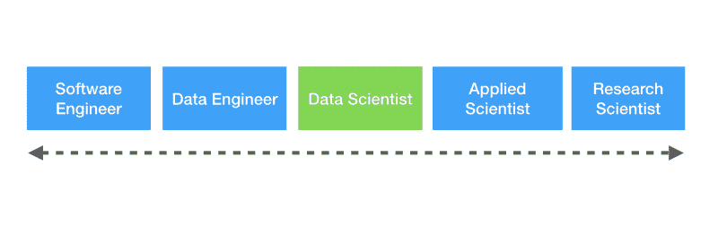
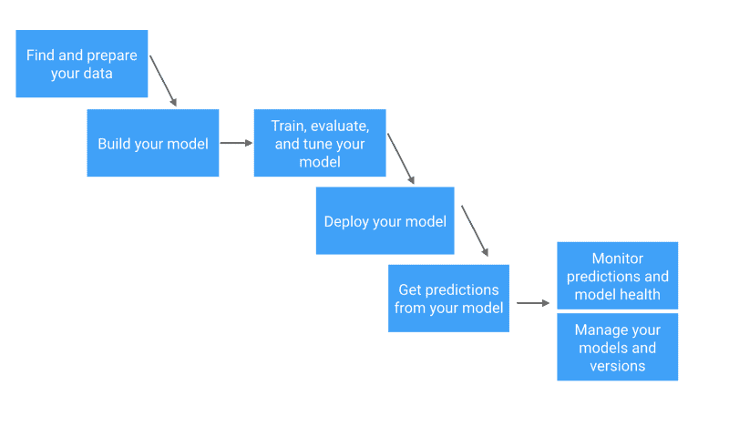
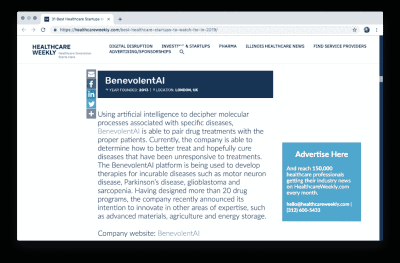
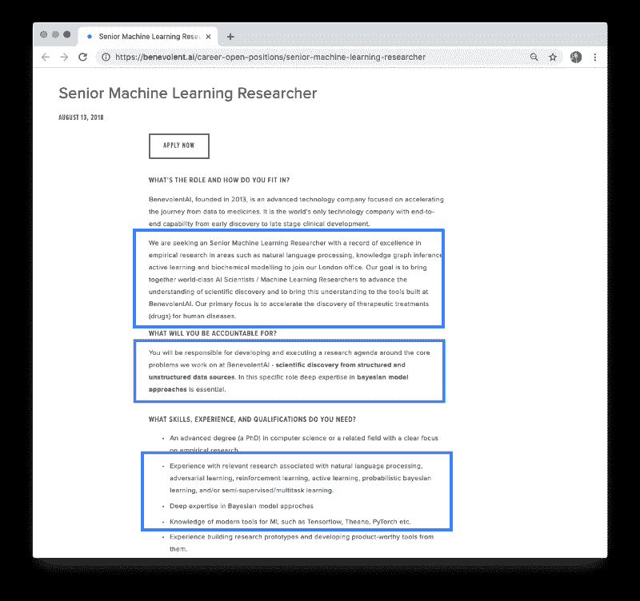
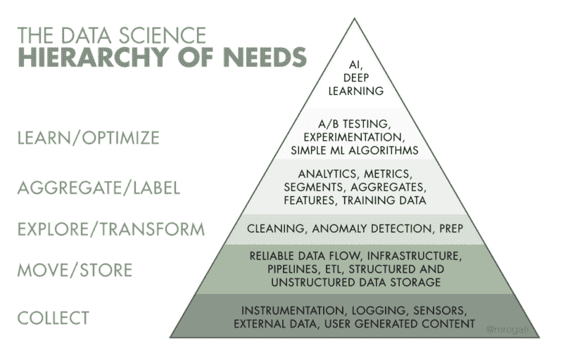

# 如果您是一名正在向数据科学过渡的开发人员，以下是您的最佳资源

> 原文：<https://www.freecodecamp.org/news/if-youre-a-developer-transitioning-into-data-science-here-are-your-best-resources-c31928b53cd1/>

作者:邵

如今，似乎每个人都想成为数据科学家——从博士生到数据分析师，再到一直在 Linkedin 上给你发信息“喝咖啡”的大学老室友。

也许你已经有了同样的暗示，你至少应该探索一些数据科学的职位，看看宣传的是什么。也许你已经看过像 Vicki Boykis 的文章[数据科学现在不同了](https://veekaybee.github.io/2019/02/13/data-science-is-different)它说:

> **越来越清楚的是，在炒作周期的后期，数据科学正逐渐向工程靠拢，数据科学家前进所需的[技能不再那么可视化和基于统计，而](https://www.youtube.com/watch?v=frQeK8xo9Ls)[更符合传统的计算机科学](https://tech.trivago.com/2018/12/03/teardown-rebuild-migrating-from-hive-to-pyspark/)……:**

> 像单元测试和持续集成这样的概念很快就进入了从事 ML 工程的数据科学家和数值科学家常用的行话和工具集中。

或者像蒂姆·霍普一样发推文:

不清楚的是，你如何将你作为软件工程师的经验运用到数据科学职位中。您可能会问的其他一些问题包括:

我应该优先学习什么？

对于数据科学家来说，是否有不同的最佳实践或工具？

*我目前的技能组合会延续到数据科学职位上吗？*

本文将提供数据科学家角色的背景，以及为什么您的背景可能非常适合数据科学，以及作为开发人员，您可以采取的切实可行的逐步行动，以提高数据科学水平。

> 想看看最新的数据科学角色吗？订阅双周刊 [ML 工作简讯](https://www.getrevue.co/profile/mljobs)，在您的收件箱中获取新的数据科学职位空缺。

### 数据科学家对数据工程师

首先，我们应该区分两个互补的角色:数据科学家和数据工程师。虽然这两个角色都处理机器学习模型，但他们与这些模型的交互以及数据科学家和数据工程师的工作要求和性质有很大不同。

> 注意:专门用于机器学习的数据工程师角色也可以在工作描述中表现为“软件工程师、机器学习”或“机器学习工程师”

作为机器学习工作流程的一部分[，数据科学家将执行所需的统计分析，以确定使用哪种机器学习方法，然后开始原型制作和构建这些模型。](https://skymind.ai/wiki/machine-learning-workflow)

机器学习工程师通常会在这个建模过程之前和之后与数据科学家合作:(1)建立数据管道，将数据输入这些模型；(2)设计一个服务于这些模型的工程系统，以确保模型的持续健康。

下图是查看这一系列技能的一种方式:

关于数据科学家和数据工程师之间的区别，有大量的在线资源，请务必查看:

*   [Panoply:数据工程师和数据科学家的区别是什么？](https://blog.panoply.io/what-is-the-difference-between-a-data-engineer-and-a-data-scientist)
*   [跳板:机器学习工程师 vs 数据科学家](https://www.springboard.com/blog/machine-learning-engineer-vs-data-scientist/)
*   [奥莱利:数据工程师 vs 数据科学家](https://www.oreilly.com/ideas/data-engineers-vs-data-scientists)

作为免责声明，本文主要涵盖了数据科学家的角色，并对机器学习工程方面有所了解(如果你正在寻找一个小公司的职位，在那里你可能必须同时担任这两个角色，这一点尤其重要)。如果你有兴趣看看如何过渡到成为一名数据工程师或机器学习工程师，请在下面的评论中告诉我们！

### 你作为开发者的优势

对每个人都不利的是，围绕机器学习的课程，如“Python 中的数据科学导论”或吴恩达的 Coursera 课程，没有*而不是*涵盖软件工程的概念和最佳实践，如单元测试、编写模块化可重用代码、CI/CD 或版本控制。甚至一些最先进的机器学习团队仍然没有为他们的机器学习代码使用这些实践，导致了一种令人不安的趋势…

Pete Warden 将这种趋势描述为“[机器学习再现性危机](https://petewarden.com/2018/03/19/the-machine-learning-reproducibility-crisis/)”:

> 当谈到跟踪变化和从零开始重建模型时，我们仍然处于黑暗时代。这太糟糕了，有时感觉就像回到了没有源代码控制的时候。

虽然你可能没有在数据科学家的工作描述中明确提到这些“软件工程”技能，但作为你背景的一部分，很好地掌握这些技能将会对你作为数据科学家的工作有 10 倍的帮助。此外，当你在数据科学面试中回答编程问题时，它们也会派上用场。

从另一个角度来看一些有趣的观点，请查看 [Trey Causey](https://www.freecodecamp.org/news/if-youre-a-developer-transitioning-into-data-science-here-are-your-best-resources-c31928b53cd1/undefined) 的文章“[数据科学家的软件开发技能](http://treycausey.com/software_dev_skills.html)”，他建议数据科学家应该学习这些技能，“编写更好的代码，更好地与软件开发人员互动，并最终节省您的时间和麻烦”。

### 提升数据科学

你有良好的软件工程背景，这很好，但成为数据科学家的下一步是什么？乔希·威尔(Josh Will)关于数据科学家定义的半开玩笑的推文惊人地准确:

如果你有兴趣从事数据科学家的工作或职业，它暗示了你应该补上的一个话题:统计学。在下一节中，我们将介绍以下方面的重要资源:

*   **构建特定于 ML 的知识**
*   **建筑行业知识**
*   **ML 堆栈中的工具**
*   **技能和资格**

#### **构建特定于 ML 的知识**

最有效的方法是围绕概率和统计建立基于理论的知识的组合，以及在 GPUs 分布式计算上的数据争论或训练模型等方面的应用技能。

框定你正在获得的知识的一种方法是参照机器学习工作流程。

A simplified view of the machine learning workflow

> 请看来自 Skymind AI 的详细工作流程

在这里，我们列出了一些你可以找到的关于机器学习的最佳资源。不可能有一个详尽的列表，为了节省空间(和阅读时间),我们没有提到非常受欢迎的资源，如吴恩达的 Coursera 课程或 Kaggle。

**课程:**

*   [Fast.ai MOOC](https://www.fast.ai/) (免费课程，教授程序员实用深度学习、前沿深度学习、计算线性代数和程序员机器学习入门等非常实用的技能)
*   可汗学院
*   [3Blue1Brown](https://www.youtube.com/channel/UCYO_jab_esuFRV4b17AJtAw) 和[Mathematica monk](https://www.youtube.com/channel/UCcAtD_VYwcYwVbTdvArsm7w)YouTube 频道
*   Udacity 课程(包括 Python 中机器学习的[预处理](https://www.datacamp.com/courses/preprocessing-for-machine-learning-in-python)
*   [跳板 AI/ML 专用](https://www.springboard.com/blog/ai-machine-learning-career-track/)赛道

**教科书:*** *试图在网上找到大部分免费的 pdf 文件**

*   [概率编程&黑客的贝叶斯方法](http://camdavidsonpilon.github.io/Probabilistic-Programming-and-Bayesian-Methods-for-Hackers/)
*   [概率和随机过程](https://www.amazon.com/Probability-Random-Processes-Geoffrey-Grimmett/dp/0198572220/)
*   [统计学习的要素](https://web.stanford.edu/~hastie/Papers/ESLII.pdf)
*   [线性代数做对了](http://148.206.53.84/tesiuami/S_pdfs/Linear%20Algebra%20Done%20Right.pdf)
*   [线性代数入门](http://math.mit.edu/~gs/linearalgebra/)
*   [算法设计](http://www.cs.sjtu.edu.cn/~jiangli/teaching/CS222/files/materials/Algorithm%20Design.pdf)

**指南:**

*   [谷歌开发者机器学习指南](https://developers.google.com/machine-learning/guides/rules-of-ml/)
*   [机器学习精通指南](https://machinelearningmastery.com/start-here/)(关于一个好的起点，请参见[这个关于 Python 机器学习的迷你课程](https://machinelearningmastery.com/python-machine-learning-mini-course/))
*   [Pyimagesearch](https://www.pyimagesearch.com/) (用于计算机视觉)

**聚会:****主要是纽约的聚会**

*   [我们喜爱的论文](https://paperswelove.org/)
*   [NYC 人工智能&机器学习](https://www.meetup.com/NYC-Artificial-Intelligence-Machine-Learning/)
*   [DataCouncil.ai](https://www.meetup.com/DataCouncil-AI-NYC-Data-Engineering-Science/)
*   [NY 人工智能](https://www.meetup.com/NYAImeetup/)

> 作为一个很酷的起点，看看 Will Wolf 的'[开源机器学习大师'](http://willwolf.io/2018/02/03/practical-guide-open-source-ml-masters/),看看你如何在学习特定主题和从事项目的过程中安排时间，以在低成本的偏远地区展示专业知识。

#### 构建特定行业的知识

如果你有一个暗示，你想成为一个特定的行业，如医疗保健，金融服务，消费品，零售等…，这是非常宝贵的，以赶上该行业的痛点和发展，因为它与数据和机器学习有关。

你可以浏览垂直领域人工智能初创公司的网站，看看他们如何定位自己的价值主张，以及机器学习在哪里发挥作用。这将为您提供要研究的机器学习特定领域的想法，以及展示您工作的项目主题。

我们可以看一个例子:假设我对医疗保健行业感兴趣。

1.  通过在谷歌上快速搜索“*机器学习医疗保健”，*我找到了这份来自 Healthcareweekly.com 的关于 2019 年[最佳医疗保健初创公司的名单](https://healthcareweekly.com/best-healthcare-startups-to-watch-for-in-2019/)

> 你也可以以“医疗保健”为关键词在 [Crunchbase](https://www.crunchbase.com/hub/health-care-startups#section-leaderboard) 或 [AngelList](https://angel.co/jobs#find/f!%7B%22keywords%22%3A%5B%22Healthcare%22%5D%7D) 上进行快速搜索

2.让我们以其中一家上榜公司 [BenevolentAI](https://benevolent.ai/) 为例。

3.BenevolentAI 的网站声明:

> 我们是一家 AI 公司，拥有从早期药物发现到后期临床开发的端到端能力。BenevolentAI 将计算医学和高级人工智能的力量与开放系统和云计算的原则相结合，以改变药物的设计、开发、测试和上市方式。

> 我们建立了慈善平台，从大量的生物医学信息中更好地了解疾病，设计新的治疗方法，并改进现有的治疗方法。我们相信，我们的技术能让科学家更快、更经济地开发药物。

> 每 30 秒就有一篇新的研究论文发表，然而科学家们目前只利用了现有知识的一小部分来了解疾病的原因并提出新的治疗方法。我们的平台从书面文件、数据库和实验结果中吸收、“阅读”大量信息，并将这些信息置于上下文中。它能够对这些不同的、复杂的数据源进行无限多的推断和推论，识别和创建关系、趋势和模式，这对于人类来说是不可能的。

4.你可以立即看到 BenevolentAI 正在使用自然语言处理(NLP ),如果他们在确定疾病和治疗研究之间的关系，可能会使用一些知识图表

5.如果你查看 BenevolentAI 的职业页面，你可以看到他们正在招聘一名高级机器学习研究员。这是一个高级职位，所以这不是一个完美的例子，但看看下面他们要求的技能和资格:

**注:**

*   自然语言处理、知识图推理、主动学习和生化建模
*   结构化和非结构化数据源
*   贝叶斯模型方法
*   了解现代 ML 工具

**这应该给你一些下一步的步骤:**

*   使用结构化数据
*   使用非结构化数据
*   对知识图中的关系进行分类(参见这里的好资源)
*   学习贝叶斯概率和建模方法
*   从事 NLP 项目(文本数据)

我们并不建议你申请你通过搜索找到的公司，而是要看看他们如何描述他们客户的痛点，他们公司的价值主张，以及他们在工作描述中列出什么样的技能来指导你的研究。

#### ML 堆栈中的工具

在 BenevolentAI 高级机器学习研究员的职位描述中，他们要求*“了解现代的 ML 工具，如 Tensorflow、PyTorch 等……”*

学习这些现代的 ML 工具似乎令人生畏，因为空间总是在变化。为了将学习过程分成可管理的部分，请记住围绕上面的机器学习工作流来思考——“什么工具可以帮助我完成工作流的这一部分？”？

要了解这个机器学习工作流程的每一步都伴随着哪些工具，请查看 [Roger Huang](https://www.freecodecamp.org/news/if-youre-a-developer-transitioning-into-data-science-here-are-your-best-resources-c31928b53cd1/undefined) 的“[对机器学习堆栈的介绍](https://hackernoon.com/introduction-to-the-machine-learning-stack-f5b64bba7602)，其中涵盖了像 [Docker](https://www.docker.com/) 、 [Comet.ml](http://www.comet.ml) 和 [dask-ml](https://dask-ml.readthedocs.io/en/latest/) 这样的工具。

从战术上来说， [Python](https://www.python.org/) 和 [R](https://www.r-project.org/about.html) 是数据科学家最常用的编程语言，你会遇到为数据科学应用设计的附加包，比如 [NumPy](http://www.numpy.org/) 和 [SciPy](http://www.scipy.org/) 以及 matplotlib。这些语言是解释的，而不是编译的，让数据科学家可以专注于问题而不是语言的细微差别。花时间学习面向对象编程来理解数据结构作为类的实现是值得的。

为了赶上 ML 框架，如 Tensorflow、Keras 和 PyTorch，请确保阅读它们的文档并尝试端到端地实现它们的教程。

在一天结束时，您希望确保您正在构建的项目展示了这些用于数据收集和争论、机器学习实验管理和建模的现代工具。

为了给你的项目带来一些灵感，请查看 Edouard Harris 关于“[冷启动问题:如何建立你的机器学习组合](https://towardsdatascience.com/the-cold-start-problem-how-to-build-your-machine-learning-portfolio-6718b4ae83e9)”的文章

#### **技能和资格**

我们将这一部分留到了最后，因为它汇总了前几部分的大部分信息，但专门针对数据科学面试准备。数据科学家面试中有六个主要话题:

1.  编码
2.  产品
3.  结构化查询语言
4.  A/B 测试
5.  机器学习
6.  概率(参见一个好的定义与统计[这里](https://www3.cs.stonybrook.edu/~skiena/jaialai/excerpts/node12.html)

您会注意到其中一个主题与其他主题(产品)不同。对于数据科学职位，[关于技术概念和结果](https://medium.com/comet-ml/a-data-scientists-guide-to-communicating-results-c79a5ef3e9f1)以及业务指标和影响的沟通至关重要。

> **一些有用的数据科学面试问题汇总:**

> ？？ht[TPS://github . com/koji no/120-数据-科学-面试-问题](https://github.com/kojino/120-Data-Science-Interview-Questions)

> [？？ht](https://github.com/kojino/120-Data-Science-Interview-Questions)[TPS://github . com/iamtodor/data-science-interview-question-and-answers](https://github.com/iamtodor/data-science-interview-questions-and-answers)

> [？？？？http](https://github.com/iamtodor/data-science-interview-questions-and-answers)[s://hookedondata . org/red-flags-in-data-science-visities/](https://hookedondata.org/red-flags-in-data-science-interviews/)

> [？？ht](https://hookedondata.org/red-flags-in-data-science-interviews/)[TPS://medium . com/@ xiaohan Zeng/I-在五天内面试了五家硅谷顶级公司并幸运地获得了五份工作机会-25178cf74e0f](https://medium.com/@XiaohanZeng/i-interviewed-at-five-top-companies-in-silicon-valley-in-five-days-and-luckily-got-five-job-offers-25178cf74e0f)

[你会注意到，我们在数据科学面试](https://medium.com/@XiaohanZeng/i-interviewed-at-five-top-companies-in-silicon-valley-in-five-days-and-luckily-got-five-job-offers-25178cf74e0f)中的“ [红旗”中加入了 Hooked on Data 的文章——当你面试职位时，你会遇到一些公司仍在构建他们的数据基础设施，或者可能对他们的数据科学团队如何融入更大的公司价值没有深刻的理解。](https://hookedondata.org/red-flags-in-data-science-interviews/)

这些公司可能仍然在下面的需求层次中向上爬。

The popular AI Hierarchy of Needs from Monica Rogati

对于围绕数据科学面试的一些期望，我建议阅读蒂姆·霍珀的文章“[关于被许多数据科学工作](https://tdhopper.com/blog/some-reflections-on-being-turned-down-for-a-lot-of-data-science-jobs/)拒绝的一些思考”

#### 感谢阅读！我们希望本指南能帮助您了解数据科学是否是您应该考虑的职业，以及如何开始这一旅程！

*想看看最新的数据科学职位吗？订阅双周 [ML 工作简讯](https://www.getrevue.co/profile/mljobs)，在您的收件箱中获得新的数据科学职位空缺:*

[**ML Jobs 时事通讯- Revue**](https://www.getrevue.co/profile/mljobs)
[*注册即可获得这份业内最佳公司数据科学职位空缺双周策划列表。角色…*www.getrevue.co](https://www.getrevue.co/profile/mljobs)