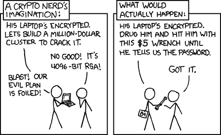
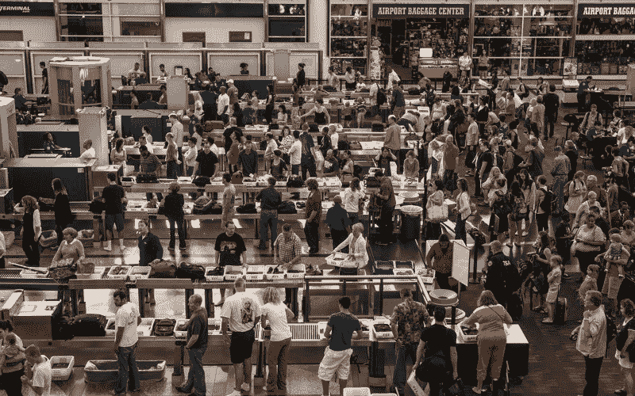

# 我再也不会把手机带上国际航班了。你也不应该。

> 原文：<https://www.freecodecamp.org/news/ill-never-bring-my-phone-on-an-international-flight-again-neither-should-you-e9289cde0e5f/>

几个月前，我写了一篇关于如何在不到一个小时的时间内加密你的一生的文章。好吧，如果有人实际拥有你的手机或笔记本电脑，世界上所有的安全措施都救不了你，并且可以威胁你说出你的密码。

Image credit: [XKCD](https://xkcd.com/538/)

几周前，这正是发生在一名从国外回国的美国公民身上的事情。

1 月 30 日，美国宇航局喷气推进实验室的美籍科学家 Sidd Bikkannavar 从智利圣地亚哥飞回德克萨斯州休斯顿。

在他通过机场的路上，海关和边境巡逻人员把他拉到一边。他们搜了他的身，然后把他和一群睡在帆布床上的人关在一个房间里。他们最终返回，并表示如果他告诉他们解锁手机的密码，他们就会释放他。

Sidd Bikkannavar’s hobbies include racing solar-powered cars. [Photo by The Verge](http://www.theverge.com/2017/2/12/14583124/nasa-sidd-bikkannavar-detained-cbp-phone-search-trump-travel-ban)

Bikkannavar 解释说，这部手机属于美国宇航局，上面有敏感信息，但他的请求被置若罔闻。他最终屈服并解锁了手机。探员带着他的手机离开了。半小时后，他们回来了，把手机交给他，然后放了他。

我们将讨论所有这一切的合法性，以及在 Bikkannavar 的手机被解锁并且不在他拥有范围内的那 30 分钟里可能发生了什么。

但在此之前，花点时间想想你手机上的所有应用程序。邮件？脸书？Dropbox？你的浏览器？信号？你曾经做过的所有事情的历史——你曾经搜索过的所有事情，你曾经对任何人说过的所有事情——都在这些应用程序中。

> “我们应该像对待武器级钚一样对待个人电子数据——它是危险的、持久的，一旦泄露就无法挽回。”—科利·多克托罗

你家里有多少潜在的罪证？如果你和大多数人一样，答案很可能是零。然而，警察在获得搜查你家的搜查令之前，需要去见法官并确定可能的原因。

我们现在看到的是，任何人都可能在通过海关的路上被抓住，并被迫交出他们数字生活的全部内容。

像 Elcomsoft 这样的公司制造“取证软件”,它可以在几分钟内吸走你所有的照片、联系人，甚至是你的电子邮件和社交媒体账户的密码。他们的客户包括各国的警察部队、军队和私人保安部队。他们可以使用这些工具来永久保存所有关于你的信息。他们只需要你解锁的手机。

> “如果有人给我六行由最诚实的人亲笔写的字，我会在其中找到一些东西来绞死他。”—1641 年红衣主教黎塞留

如果海关和边境巡逻队成功拿到你的解锁手机，最糟糕的事情会是什么？嗯…

*   想想所有你打过电话或发过邮件的人，以及所有你在脸书和 LinkedIn 上联系过的人。其中一人犯下严重罪行或未来会犯下严重罪行的可能性有多大？
*   你有没有在抗议活动中拍过照片，在亚马逊上买过有争议的书，或者向心爱的人发泄过与警察的遭遇？这些信息现在是你永久记录的一部分，如果你最终上了法庭，可能会被拿出来作为对你不利的证据。
*   政府内部有一个运动，让所有部门的所有数据对地方、州和联邦一级的所有工作人员可用。您的数据到达的地方越多，黑客的“攻击面”就越大，也就是说，您的数据就越容易受到攻击。一个偏僻的警察局的安全漏洞可能会导致你的数据落入黑客手中，并可能在你的余生中被用来对付你。

### 等一下。我的第四和第五修正案权利呢？这不是违法的吗？

第四修正案保护你免受不合理的搜查和扣押。第五修正案保护你免受自证其罪。

如果一名警察在美国街头拦住你，要求你打开手机并交给他们，这些修正案将为你拒绝这样做提供有力的法律依据。

但不幸的是，严格来说，美国边境并不是美国，在边境你没有这些权利。

美国海关和边境巡逻官员要求你解锁手机并交给他们是完全合法的。如果你不这样做，他们可以无限期拘留你。即使你是美国公民。

严格来说，边境不在美国管辖范围内，处于某种法律上的无人区。你在那里没有什么权利。除非使用“过度暴力”，否则特工可以对你为所欲为。

所以我的建议是照他们说的做，尽快通过海关进入美国。

### 美国不是唯一这样做的国家。

下载人们手机的内容成为进入每个国家的标准程序只是时间问题。这已经在加拿大发生了。你可以打赌，像中国和俄罗斯这样的国家也不会落后太多。

> “永远不要在电子邮件中说任何你不希望出现在明天早上《纽约时报》头版头条的话。”—美国国防高级研究计划局信息处理技术办公室前主任大卫·鲁赛尔上校

由于在大多数国家对个人旅行者进行侧写是违法的，海关官员将很快要求每个人都这样做。

开发从你的手机上下载数据的软件的公司将会从政府那里得到大量的资金注入。他们的软件会变得更快——也许只需要几秒钟就可以从你的手机上下载所有最相关的数据。

如果我们不做任何抵抗，很快每个人都将不得不解锁他们的手机，并把它交给海关人员，而他们的护照被刷。

随着时间的推移，这种对你个人隐私的无与伦比的侵犯可能会变得像脱鞋放在传送带上一样习以为常。

有了这个新的程序，苹果和谷歌在加密你手机上的数据方面投入的所有努力——以及在法庭上为你的隐私而战——都将变得毫无意义。

政府将成功地完全绕过几十年来在安全和隐私保护方面的创新。所有这一切都是通过要求你把开启你生活的万能钥匙——你解锁的手机——交给他们来实现的。

### 你不能交出你没有的设备。

当你进行国际旅行时，你应该把手机和笔记本电脑留在家里。您可以在大多数包含数据套餐的国际机场租用电话。

如果你有家人在海外，你可以买第二部手机和笔记本电脑，把它们留在家里。

如果你是一名雇主，你可以制定一项政策，规定员工在国际旅行期间不得携带设备。一旦他们进入这个国家，你就可以发给他们“租借”的笔记本电脑和手机。

由于我们的大部分私人数据存储在云中——而不是存储在个人设备上——你也可以在登机前将手机重置为出厂设置。这个过程还会删除解密手机上任何残留数据所必需的密钥(iOS 和 Android 会完全加密你的数据)。

通过这种方式，你可以随身携带你的手机，然后重新安装应用程序，并在到达后重新验证。如果你在边境被要求交出解锁的手机，手机上不会有任何个人数据。在脸书、谷歌、苹果、Signal 和所有其他公司使用的世界级安全措施的保护下，你所有的数据都是安全的。

这些都不方便吗？绝对的。但是，当你考虑到数据落入不法之徒手中的严重性时，这是唯一明智的做法。

如果你晚上懒得锁门，你应该在国际旅行中注意保护手机数据。

这可能会让海关和边境巡逻人员感到不安，他们可能足够聪明，意识到现在 85%的美国人都有智能手机，而且可能 100%的国际旅行的美国人都有智能手机。他们可能会选择拘留你，并强迫你手动给他们各种账户的密码。但是他们很难知道你使用哪些服务，不使用哪些服务，或者你是否有多个账户。

我们生活在一个大规模监控的时代，世界各地的政府每年都在通过可怕的新反隐私法。

> “那些愿意为了安全而放弃自由的人总是要求，如果他们放弃充分的自由，也应该从那些不准备这样做的人那里剥夺他们的自由。”—弗里德里希·哈耶克

在我们的努力下，开悟将会胜利。隐私将被恢复。我们将击退当前的恐惧气氛，这种气氛使人们不必要地放弃他们的权利。

与此同时，遵循美国童子军的座右铭:时刻做好准备。下次你打算越境时，把手机留在家里。

我只写编程和技术。如果你在推特上关注我，我不会浪费你的时间。？