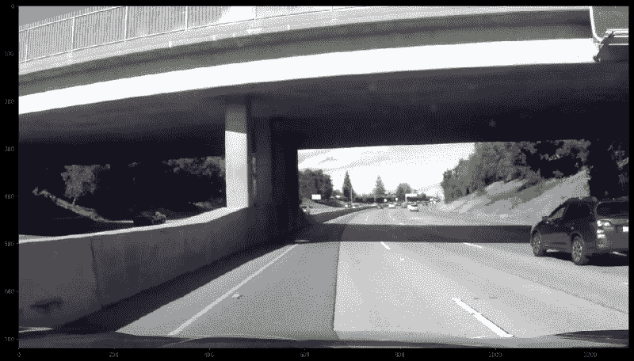
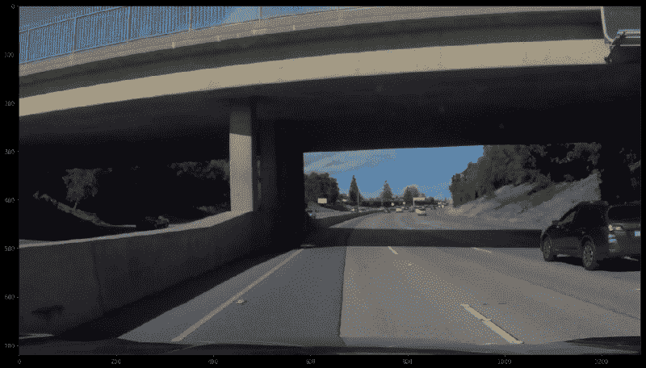
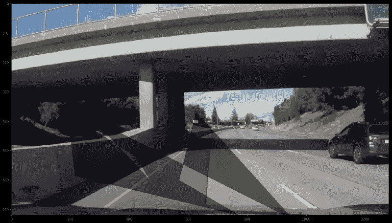
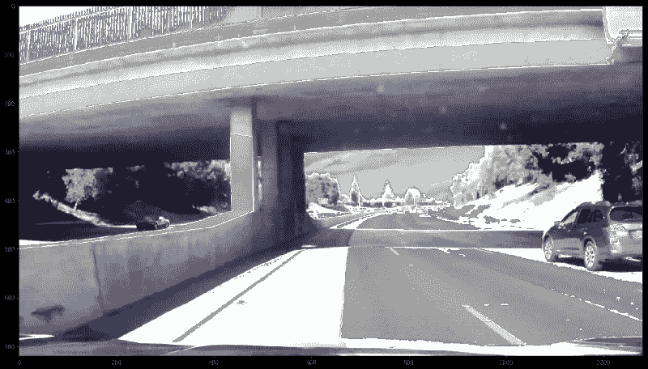
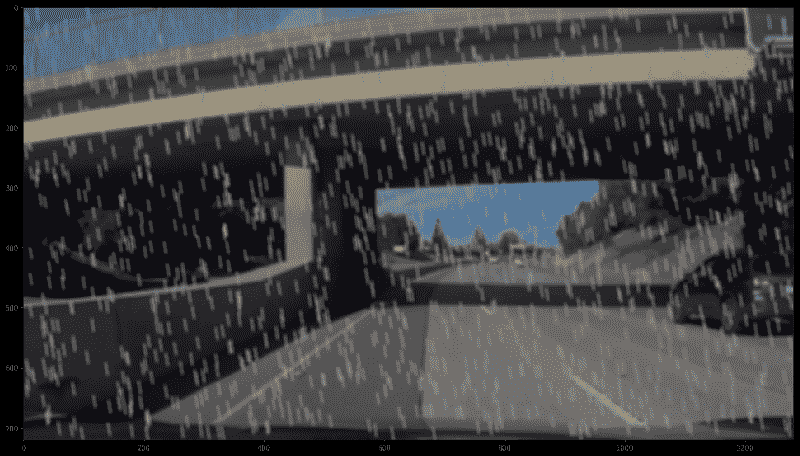
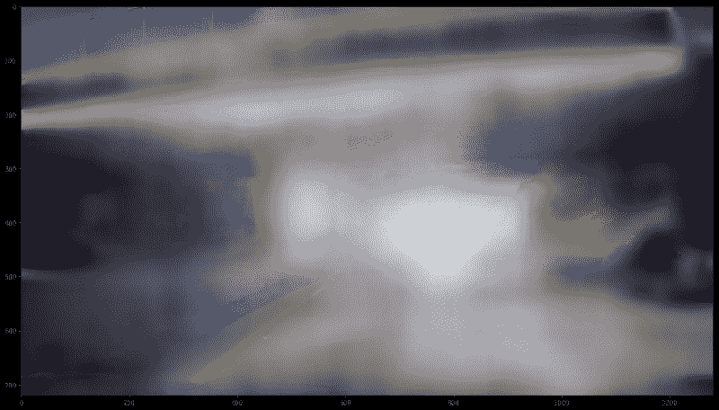
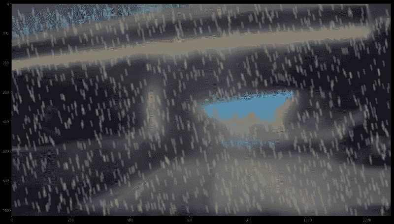

# 图像增强:让它下雨，让它下雪。如何修改照片来训练自动驾驶汽车

> 原文：<https://www.freecodecamp.org/news/image-augmentation-make-it-rain-make-it-snow-how-to-modify-a-photo-with-machine-learning-163c0cb3843f/>

作者:Ujjwal Saxena

# 图像增强:让它下雨，让它下雪。如何修改照片来训练自动驾驶汽车

图像增强是一种拍摄图像并使用它生成新图像的技术。这对于训练自动驾驶汽车等事情很有用。

想象一个人在阳光明媚的日子里开着车。如果开始下雨，他们最初可能会发现在雨中开车很困难。但是慢慢的他们就习惯了。

人工神经网络也发现在一个新的环境中驾驶令人困惑，除非它以前见过它。他们有各种增强技术，如翻转，翻译，添加噪声，或改变颜色通道。

在这篇文章中，我将探索天气部分。我使用了 OpenCV 库来处理图像。过了一段时间后，我发现这非常容易，并且能够将各种天气场景引入到图像中。

我已经在 [GitHub](https://github.com/ujjwalsaxena) 上推出了一款完全实现的 **Jupyter 笔记本**。

让我们看一看。

我将首先向您展示一个原始的测试图像，然后再对其进行放大。


### **阳光明媚，背阴蔽日**

添加随机阳光和阴影效果后，图像的亮度发生变化。这是一个简单快速的转换。

```
def add_brightness(image):    image_HLS = cv2.cvtColor(image,cv2.COLOR_RGB2HLS) ## Conversion to HLS    image_HLS = np.array(image_HLS, dtype = np.float64)     random_brightness_coefficient = np.random.uniform()+0.5 ## generates value between 0.5 and 1.5    image_HLS[:,:,1] = image_HLS[:,:,1]*random_brightness_coefficient ## scale pixel values up or down for channel 1(Lightness)    image_HLS[:,:,1][image_HLS[:,:,1]>255]  = 255 ##Sets all values above 255 to 255    image_HLS = np.array(image_HLS, dtype = np.uint8)    image_RGB = cv2.cvtColor(image_HLS,cv2.COLOR_HLS2RGB) ## Conversion to RGB    return image_RGB
```

通过改变 HLS 颜色空间中图像的“明度”通道 1 的像素值，可以改变图像的亮度。将图像转换回 RGB 会使相同的图像具有增强或抑制的光照。



Sunny



Shady

### **阴影**

对汽车来说，阴影只不过是图像的黑暗部分，有时也会很亮。所以自动驾驶汽车应该总是学习有阴影或没有阴影的驾驶。如果训练不当，在山上或树林中随机改变亮度经常会扰乱汽车的感知。这种现象在阳光明媚的日子和城市中不同高度的建筑中更加普遍，允许光束透过。

亮度有利于感知，但不均匀、突然或过多的亮度会产生感知问题。让我们产生一些假的阴影。

```
def generate_shadow_coordinates(imshape, no_of_shadows=1):    vertices_list=[]    for index in range(no_of_shadows):        vertex=[]        for dimensions in range(np.random.randint(3,15)): ## Dimensionality of the shadow polygon            vertex.append(( imshape[1]*np.random.uniform(),imshape[0]//3+imshape[0]*np.random.uniform()))        vertices = np.array([vertex], dtype=np.int32) ## single shadow vertices         vertices_list.append(vertices)    return vertices_list ## List of shadow vertices
```

```
def add_shadow(image,no_of_shadows=1):    image_HLS = cv2.cvtColor(image,cv2.COLOR_RGB2HLS) ## Conversion to HLS    mask = np.zeros_like(image)     imshape = image.shape    vertices_list= generate_shadow_coordinates(imshape, no_of_shadows) #3 getting list of shadow vertices    for vertices in vertices_list:         cv2.fillPoly(mask, vertices, 255) ## adding all shadow polygons on empty mask, single 255 denotes only red channel        image_HLS[:,:,1][mask[:,:,0]==255] = image_HLS[:,:,1][mask[:,:,0]==255]*0.5   ## if red channel is hot, image's "Lightness" channel's brightness is lowered     image_RGB = cv2.cvtColor(image_HLS,cv2.COLOR_HLS2RGB) ## Conversion to RGB    return image_RGB
```

OpenCV 的`fillPoly()`函数在这种情况下确实很方便。让我们创建一些随机的顶点，并用`fillPoly()`将多边形叠加到一个空的蒙版上。完成这些后，剩下唯一要做的就是检查热点像素的遮罩，并降低 HLS 图像中发现这些热点像素的“亮度”。



Random shadow polygon on the road

### **雪**

这是新的东西。我们经常想知道我们的车在雪地里会有什么表现。测试的一种方法是获取积雪覆盖的道路的照片，或者在图像上做一些事情来获得类似的效果。这种效果并不能完全替代积雪路面，但却是一种值得尝试的方法。

```
def add_snow(image):    image_HLS = cv2.cvtColor(image,cv2.COLOR_RGB2HLS) ## Conversion to HLS    image_HLS = np.array(image_HLS, dtype = np.float64)     brightness_coefficient = 2.5     snow_point=140 ## increase this for more snow    image_HLS[:,:,1][image_HLS[:,:,1]<snow_point] = image_HLS[:,:,1][image_HLS[:,:,1]<snow_point]*brightness_coefficient ## scale pixel values up for channel 1(Lightness)    image_HLS[:,:,1][image_HLS[:,:,1]>255]  = 255 ##Sets all values above 255 to 255    image_HLS = np.array(image_HLS, dtype = np.uint8)    image_RGB = cv2.cvtColor(image_HLS,cv2.COLOR_HLS2RGB) ## Conversion to RGB    return image_RGB
```

没错。就是这样。此代码通常会白化图像中最暗的部分，主要是道路、树木、山脉和其他景观特征，使用上述其他方法中使用的相同 HLS“亮度”增加方法。这种技术不适合暗图像，但是你可以修改它来实现。以下是您得到的结果:



winter is here

你可以调整代码中的一些参数来获得更多或更少的雪。我也在其他图像上测试过，这种技术让我不寒而栗。

### **下雨**

是的，你没听错。为什么不下雨？当人类在雨中驾驶遇到困难时，为什么车辆可以幸免？事实上，这是我最希望我的自动驾驶汽车接受训练的情况之一。湿滑的道路和模糊的视野是有风险的，汽车应该知道如何处理它们。

```
def generate_random_lines(imshape,slant,drop_length):    drops=[]    for i in range(1500): ## If You want heavy rain, try increasing this        if slant<0:            x= np.random.randint(slant,imshape[1])        else:            x= np.random.randint(0,imshape[1]-slant)        y= np.random.randint(0,imshape[0]-drop_length)        drops.append((x,y))    return drops            def add_rain(image):        imshape = image.shape    slant_extreme=10    slant= np.random.randint(-slant_extreme,slant_extreme)     drop_length=20    drop_width=2    drop_color=(200,200,200) ## a shade of gray    rain_drops= generate_random_lines(imshape,slant,drop_length)        for rain_drop in rain_drops:        cv2.line(image,(rain_drop[0],rain_drop[1]),(rain_drop[0]+slant,rain_drop[1]+drop_length),drop_color,drop_width)    image= cv2.blur(image,(7,7)) ## rainy view are blurry        brightness_coefficient = 0.7 ## rainy days are usually shady     image_HLS = cv2.cvtColor(image,cv2.COLOR_RGB2HLS) ## Conversion to HLS    image_HLS[:,:,1] = image_HLS[:,:,1]*brightness_coefficient ## scale pixel values down for channel 1(Lightness)    image_RGB = cv2.cvtColor(image_HLS,cv2.COLOR_HLS2RGB) ## Conversion to RGB    return image_RGB
```

我在这里做的是，再次在整个图像上生成随机点，然后使用 OpenCV 的`line()`函数在整个图像上生成小线条。我也在雨滴中使用了随机的倾斜，来感受真实的雨。我也降低了图像的亮度，因为雨天通常是阴暗的，也因为下雨而模糊。你可以改变模糊滤镜的尺寸和雨滴的数量来获得想要的效果。

结果如下:



Fake rain but not much blur

### **雾**

这是另一个严重阻碍自动驾驶汽车愿景的场景。图像中模糊的白色绒毛使得很难看清一定范围以外的东西，并降低了图像的清晰度。

雾的强度是一个重要的参数，用来训练汽车应该给多大的油门。为了编写这样一个函数，你可以从整个图像中随机选取一些小块，并在这些小块中增加图像的亮度。通过简单的模糊，这给了一个很好的朦胧效果。

```
def add_blur(image, x,y,hw):    image[y:y+hw, x:x+hw,1] = image[y:y+hw, x:x+hw,1]+1    image[:,:,1][image[:,:,1]>255]  = 255 ##Sets all values above 255 to 255    image[y:y+hw, x:x+hw,1] = cv2.blur(image[y:y+hw, x:x+hw,1] ,(10,10))    return image
```

```
def generate_random_blur_coordinates(imshape,hw):    blur_points=[]    midx= imshape[1]//2-hw-100    midy= imshape[0]//2-hw-100    index=1    while(midx>-100 or midy>-100): ## radially generating coordinates        for i in range(250*index):            x= np.random.randint(midx,imshape[1]-midx-hw)            y= np.random.randint(midy,imshape[0]-midy-hw)            blur_points.append((x,y))        midx-=250*imshape[1]//sum(imshape)        midy-=250*imshape[0]//sum(imshape)        index+=1    return blur_points    def add_fog(image):    image_HLS = cv2.cvtColor(image,cv2.COLOR_RGB2HLS) ## Conversion to HLS    mask = np.zeros_like(image)     imshape = image.shape    hw=100    image_HLS[:,:,1]=image_HLS[:,:,1]*0.8    haze_list= generate_random_blur_coordinates(imshape,hw)    for haze_points in haze_list:         image_HLS[:,:,1][image_HLS[:,:,1]>255]  = 255 ##Sets all values above 255 to 255        image_HLS= add_blur(image_HLS, haze_points[0],haze_points[1], hw) ## adding all shadow polygons on empty mask, single 255 denotes only red channel    image_RGB = cv2.cvtColor(image_HLS,cv2.COLOR_HLS2RGB) ## Conversion to RGB    return image_RGB
```

编写这样的代码是上面所有函数中最难的。我尝试了一种径向方法来生成补丁。因为在有雾的日子里，通常大多数雾都在道路的远端，当我们靠近时，视觉会不断地清晰起来。



Foggy Highway

对于一台机器来说，在这样一个有雾的条件下检测附近的汽车和车道是一项非常困难的任务，这是一种训练和测试驾驶模型鲁棒性的好方法。

### 强降雨

我想把雾和雨结合起来，让雨的部分更好一点。因为下雨的时候总会有一些阴霾，所以训练赛车也是很好的。这不需要新的功能。我们可以通过顺序调用两者来达到效果。



右边的车在这张图片中几乎看不到，这是一个真实的场景。大雨中我们几乎看不清路上的任何东西。

希望这篇文章对你在各种天气条件下训练模型有所帮助。关于我的完整代码，你可以访问我的 [GitHub 简介](https://github.com/UjjwalSaxena)。我还写了很多其他文章，你可以在[媒体](https://medium.com/@er.ujjwalsaxena)和我的 [WordPress 网站](https://erujjwalsaxena.wordpress.com/)上看到。

尽情享受吧！