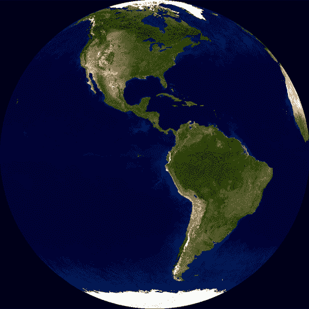
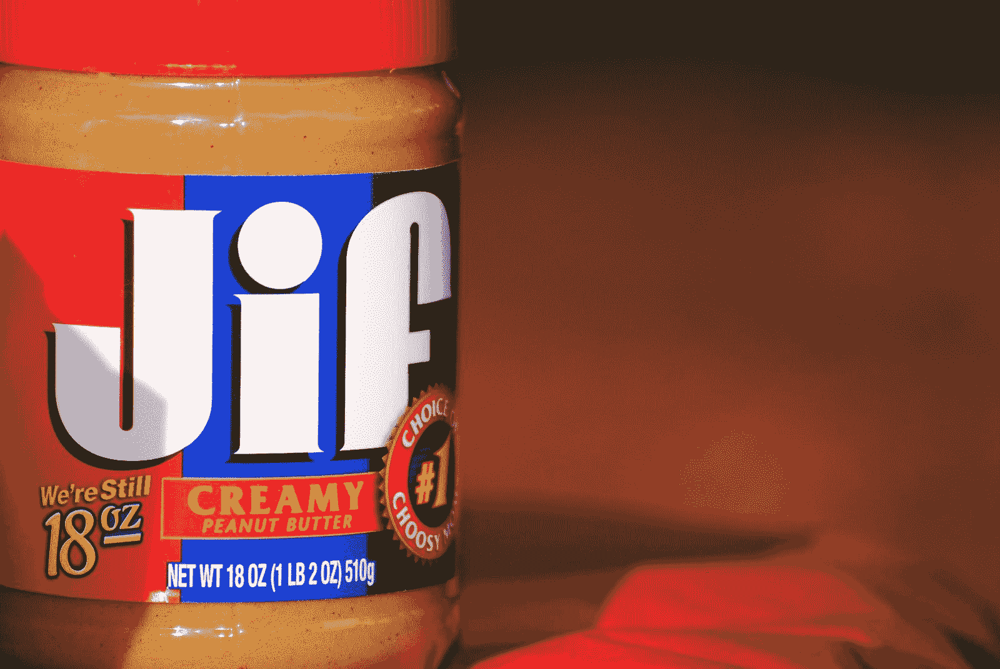

# 图像文件类型。jpeg，。svg 和。png 图片格式扩展说明

> 原文：<https://www.freecodecamp.org/news/image-file-types-picture-format-extensions-jpeg-gif-png-svg-tiff/>

当您处理图像时，了解不同的文件类型很重要。哪种格式最适合哪种应用？

在本教程中，我们将解释最常见的图像文件类型，以及何时应该使用它们。

请注意，这是一篇简短的非技术性文章。如果你想更深入地了解性能方面的东西，请阅读这些关于如何优化你的网站图片的指南。

首先，快速解释一下图像压缩是如何工作的。

## 无损与有损–这两种压缩类型有什么区别？

无损压缩是一类数据压缩算法，它允许从压缩数据中完美地重建原始数据。

在你开始丢弃文件包含的一些信息之前，你只能压缩这么多。

这就是“有损”压缩的用武之地。因为它丢失了一些信息。

有损压缩只允许重建原始数据的近似值(尽管通常压缩率会大大提高)。

当我们描述不同的图像文件格式时，你会看到术语“无损”和“有损”出现在下面。

## JPEG 格式是什么？(.jpg 和。jpeg 文件扩展名)

JPEG 是最常见的图像文件类型。它最适合用于照片和其他色彩丰富的图像。

顺便说一下，JPEG 代表联合摄影专家组——开发该标准的团队。

JPEG 文件比其他文件类型小，因此易于下载和共享。

### JPEGs 可以透明或者背景透明吗？

不。与 gif、SVG 和 png 不同，JPEGs 不能有透明背景。你需要把你的 JPEG 文件转换成不同的文件格式。

### 是。jpeg 和。jpg 都一样？

是的–唯一的区别是，传统上，文件扩展名只有 3 个字符长。".jpg“是”的简称。jpeg”。

## 什么是巴布亚新几内亚？PNG 文件格式(。png 文件扩展名)

PNG 是数字图像的无损压缩格式。PNG 是作为 GIF 的改进替代品而创建的。它已经成为网络上最广泛使用的无损图像压缩格式。

PNG 是一种最适用于透明图像(如徽标)的文件类型。PNG 文件通常比 JPEGs 大，所以不适合大图像。

png 可以有透明的背景。

## 什么是 GIF？GIF 图像格式(。gif 文件扩展名)

GIF 格式是网络上常用的另一种图像文件。GIF 文件通常比其他图像文件类型小，因此非常适合在 web 上使用。

gif 可用于静态图像。但它们更常与动画联系在一起——一系列自动播放的图像。例如，这里有一个公共域 GIF。

A public domain GIF of the spinning globe

这实际上只是一系列循环播放的十几幅图像。

请注意，gif 也可以有透明背景。

### GIF 怎么发音？

GIF 格式的创造者 Stephen Wilhite 说，他把“jif”读作“Jif”花生酱。

Jif peanut butter. Creative Commons photo by Brian Cantoni.

也就是说，我认识的几乎所有开发人员都把它发音为“gif ”,比如“gift ”,我认为这将继续是最流行的说法。

> 它的发音是“GIF”还是“JIF”？[#法伦特之夜](https://twitter.com/hashtag/FallonTonight?src=hash&ref_src=twsrc%5Etfw)
> 
> — The Tonight Show (@FallonTonight) [June 27, 2018](https://twitter.com/FallonTonight/status/1011823951167750144?ref_src=twsrc%5Etfw)