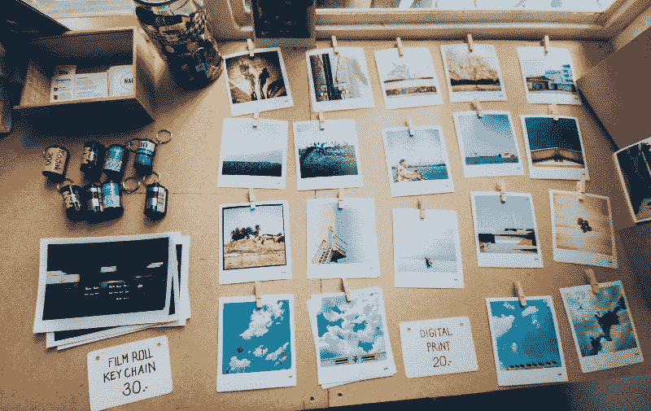
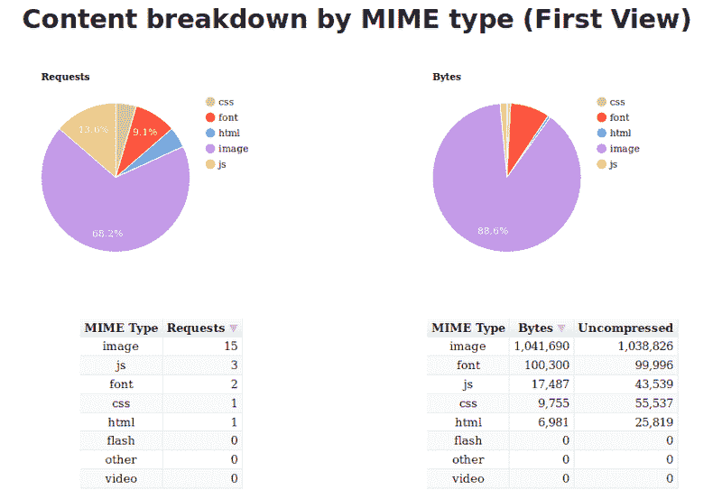
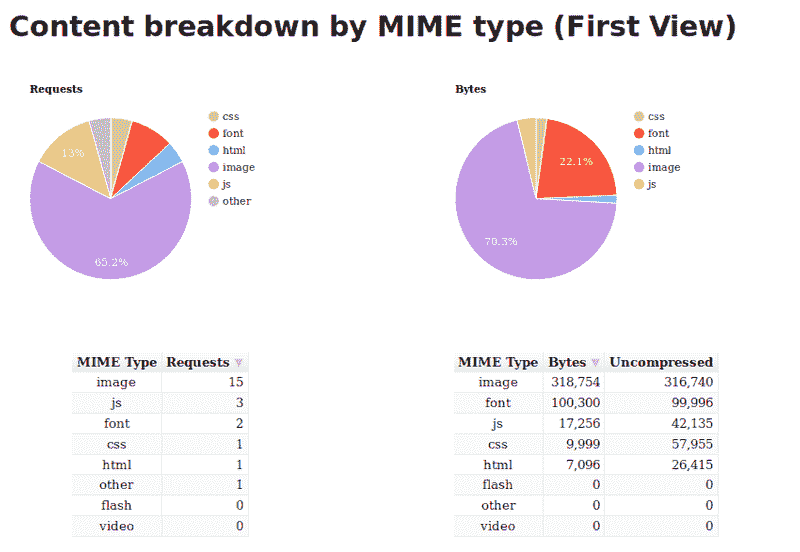
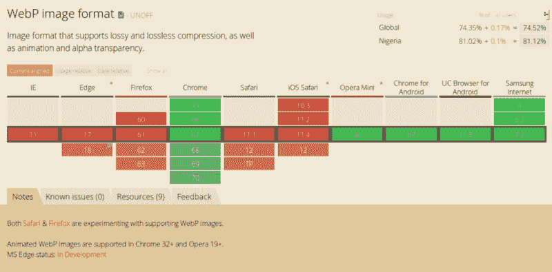
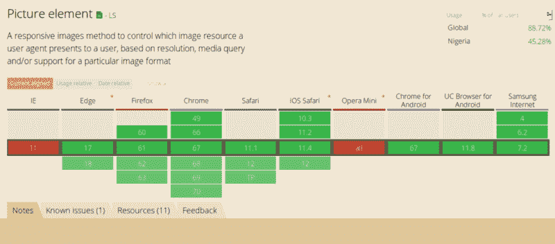

# 图像优化如何将我网站的页面权重降低 62%

> 原文：<https://www.freecodecamp.org/news/image-optimization-558d9f449e3/>

作者 Ayo Isaiah

# 图像优化如何将我网站的页面权重降低 62%



Photo by [Soragrit Wongsa](https://unsplash.com/@invictar1997?utm_source=medium&utm_medium=referral) on [Unsplash](https://unsplash.com?utm_source=medium&utm_medium=referral)

图像是 web 上提供的最基本的内容类型之一。他们说一张图片胜过千言万语。但是如果你不小心的话，它也可能值好几兆字节。

因此，尽管 web 图像需要清晰明了，但它们也必须以可管理的大小交付，以便保持较小的加载时间，并将数据使用保持在可接受的水平。

在我的网站上，我注意到我主页的页面权重超过了 1.1MB，而图片占了 88%。我还意识到我提供的图像比实际需要的要大(就分辨率而言)。显然，还有很大的改进空间。



我从阅读 Addy Osmani 的优秀的[基本图像优化](https://images.guide/)电子书开始，并在我的网站上实施他的建议。然后我做了一些关于响应图像的研究，并应用了这些。

这使得页面重量减少到 445kb。页面重量减少约 62%！



这篇文章是关于描述我采取的步骤，使我的主页的页面权重达到一个更容易管理的水平。

### 什么是图像压缩？

压缩图像就是在保持可接受的视觉质量的同时减小文件大小。为了压缩我网站上的图片，imagemin 是我选择的工具。

要使用`imagemin`，请确保您已经安装了 [Node.js](https://nodejs.org/en/download) ，然后打开一个终端窗口，`cd`进入您的项目文件夹并运行以下命令:

```
npm install imagemin
```

然后创建一个名为`imagemin.js`的新文件，并粘贴以下内容:

```
const imagemin = require('imagemin');const PNGImages = 'assets/images/*.png';const JPEGImages = 'assets/images/*.jpg';const output = 'build/images';
```

随意更改`PNGImages`、`JPEGImages`和`output`的值，以匹配您的项目结构。

要执行任何压缩，您需要根据您想要压缩的图像类型来引入一些插件。

### 用 MozJPEG 压缩 JPEG

为了压缩 JPEG 图像，我使用了 Mozilla 的 [MozJPEG](https://github.com/mozilla/mozjpeg) 工具，该工具可以通过 [imagemin-mozjpeg](https://www.npmjs.com/package/imagemin-mozjpeg) 作为 Imagemin 插件获得。您可以通过运行以下命令来安装它:

```
npm install imagemin-mozjpeg
```

然后将以下内容添加到您的`imagemin.js`文件中:

```
const imageminMozjpeg = require('imagemin-mozjpeg');
```

```
const optimiseJPEGImages = () =>  imagemin([JPEGImages], output, {    plugins: [      imageminMozjpeg({        quality: 70,      }),    ]  });
```

```
optimiseJPEGImages()  .catch(error => console.log(error));
```

您可以通过在终端中运行`node imagemin.js`来运行脚本。这将处理所有的 JPEG 图像，并将优化的版本放在`build/images`文件夹中。

我发现将`quality`设置为`70`在很大程度上可以产生足够好的图像，但你的里程数可能会有所不同。当你认为合适的时候，尝试这个值。

默认情况下，`MozJPEG`生成[渐进 JPEG](https://cloudinary.com/blog/progressive_jpegs_and_green_martians),使图像从低分辨率到高分辨率渐进加载，直到图片完全加载。由于编码方式的原因，它们往往比基准 JPEGs 略小。

你可以使用 Sindre Sorhus 的这个漂亮的[命令行工具](https://www.npmjs.com/package/is-progressive-cli)来检查 JPEG 图像是否是渐进的。

艾迪·奥斯马尼已经很好地记录了使用渐进式 JPEGs 格式的利与弊。对我来说，我觉得利大于弊，所以我坚持使用默认设置。

如果您更喜欢使用基线 JPEGs，您可以在 options 对象中将`progressive`设置为`false`。此外，一定要重新访问 [imagemin-mozjpeg 页面](https://www.npmjs.com/package/imagemin-mozjpeg)，看看其他可用的设置，你可以修补。

### 使用 pngquant 优化 PNG 图像

[pngquant](https://pngquant.org/) 是我优化 PNG 图片的首选工具。您可以通过 [imagemin-pngquant](https://www.npmjs.com/package/imagemin-pngquant) 使用它:

```
npm install imagemin-pngquant
```

然后将以下内容添加到您的`imagemin.js`文件中:

```
const imageminPngquant = require('imagemin-pngquant');
```

```
const optimisePNGImages = () =>  imagemin([PNGImages], output, {    plugins: [      imageminPngquant({ quality: '65-80' })    ],  });
```

```
optimiseJPEGImages()  .then(() => optimisePNGImages())  .catch(error => console.log(error));
```

我已经找到了一个`65-80`的`quality`级别，在文件大小和图像质量之间提供了一个很好的折衷。

有了这些设置，我可以从 913 KB 到 187 KB 获得我的网站的截图，而没有任何明显的视觉质量损失。**惊人的 79%降幅！**

这是两个文件。看一看，自己判断:

*   [原始图像](https://freshman.tech/assets/dist/images/articles/freshman-1600-original.png) (913 KB)
*   [优化图像](https://freshman.tech/assets/dist/images/articles/freshman-1600.png) (187 KB)

### 将 WebP 图像提供给支持它们的浏览器

WebP 是谷歌推出的一种相对较新的格式，旨在通过以[无损](https://en.wikipedia.org/wiki/Lossless_compression)和[有损](https://en.wikipedia.org/wiki/Lossy_compression)格式编码图像来提供更小的文件大小，使其成为 JPEG 和 PNG 的一个很好的替代品。

WebP 图像的视觉质量通常与 JPEG 和 PNG 相当，但通常文件大小要小得多。例如，当我将上面的截图转换为 WebP 时，我得到了一个 88 KB 的文件，其质量与 913 KB 的原始图像相当。减少了 90%!

看一下这三张图片。你能看出区别吗？

*   [原始 PNG 图像](https://freshman.tech/assets/dist/images/articles/freshman-1600-original.png) (913 KB)
*   [优化的 PNG 图像](https://freshman.tech/assets/dist/images/articles/freshman-1600.png) (187 KB)
*   [WebP 图片](https://freshman.tech/assets/dist/images/articles/freshman-1600.webp) (88 KB，可在 Chrome 或 Opera 中查看)

个人觉得视觉质量不相上下，你得到的节省也很难忽略。

既然我们已经确定尽可能使用 WebP 格式是有价值的，重要的是要注意到——目前——它不能完全取代 JPEG 和 PNG，因为浏览器中的 WebP 支持并不普遍。

在撰写本文时，Firefox、Safari 和 Edge 是不支持 WebP 的著名浏览器。



然而，根据 caniuse.com 的调查，全球超过 70%的用户使用支持 WebP 的浏览器。这意味着，通过提供 WebP 图片，你可以为大约 70%的客户提供更快的网页。

让我们看看在 web 上提供 WebP 图像的具体步骤。

### 将您的 JPEGs 和 png 转换为 WebP

使用 [imagemin-webp](https://www.npmjs.com/package/imagemin-webp) 插件将 JPEG 和 PNG 图像转换成 WebP 非常容易。

通过在终端中运行以下命令来安装它:

```
npm install imagemin-webp
```

然后将以下内容添加到您的`imagemin.js`文件中:

```
const imageminWebp = require('imagemin-webp');
```

```
const convertPNGToWebp = () =>  imagemin([PNGImages], output, {    use: [      imageminWebp({        quality: 85,      }),    ]  });
```

```
const convertJPGToWebp = () =>  imagemin([JPGImages], output, {    use: [      imageminWebp({        quality: 75,      }),    ]  });
```

```
optimiseJPEGImages()  .then(() => optimisePNGImages())  .then(() => convertPNGToWebp())  .then(() => convertJPGToWebp())  .catch(error => console.log(error));
```

我发现将`quality`设置为`85`会产生质量与 PNG 相当的 WebP 图像，但是要小得多。对于 JPEGs，我发现将`quality`设置为`75`可以让我在视觉质量和文件大小之间获得一个不错的平衡。

老实说，我仍然在试验这些价值观，所以不要把它们当作建议。请务必再次查看 imagemin-webp 页面,查看您可以使用的其他选项。

### 提供 HTML 格式的 WebP 图像

一旦有了 WebP 图像，就可以使用以下标记将它们提供给可以使用它们的浏览器，同时为不支持 WebP 的浏览器提供等效的(优化的)JPEG 或 PNG 后备。

```
<picture>    <source srcset="sample_image.webp" type="image/webp">    <source srcset="sample_image.jpg" type="image/jpg">    </picture>
```

有了这个标记，理解`image/webp`媒体类型的浏览器将下载 WebP 变体并显示它，而其他浏览器将下载 JPEG 变体。

任何不理解`<pictu` re >的浏览器将跳过所有`l the` 源，并在底部加载任何被定义为`n t`他的 src 属性或`f t`他的 img 标签。因此，我们通过为所有类别的浏览器提供支持，逐步增强了我们的页面。



请注意，在所有情况下，`img`标记是实际呈现给页面的内容，因此它确实是语法中必需的一部分。如果您省略了`img`标签，则不会呈现任何图像。

内定义的`<pictu` re >标签和 al `l the` source 就在那里，以便浏览器可以选择使用图像的哪个变体。一旦源图像被选中，它的 URL 就会被输入到 img 标签中，这就是显示的内容。

这意味着您不需要设计`<pictu` re & g `t; or` source 标签的样式，因为浏览器不会呈现这些标签。所以你可以像以前一样继续设计 jus `t t`和 img 标签。

### 包裹

正如您所看到的，优化网页图片的过程并不复杂，而且通过减少页面加载时间，将为您的客户带来更好的用户体验。所以今天花几分钟时间，对你的网站进行一些图片优化。如果你有其他建议，请务必在评论中或在 [Twitter](https://twitter.com/ayisaiah) 上提及。

感谢阅读！

最初发表于 2018 年 7 月 15 日[newspaper . tech](https://freshman.tech/image-optimisation/)。