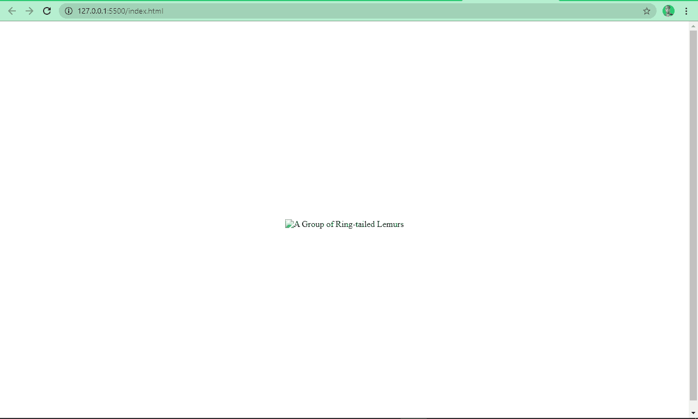
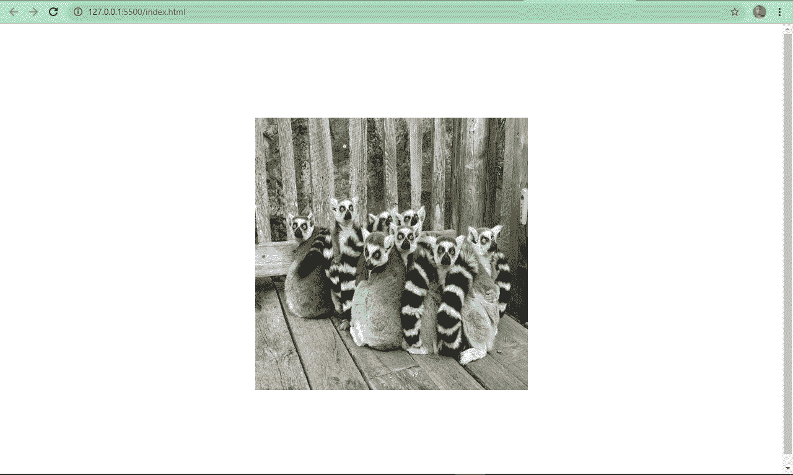
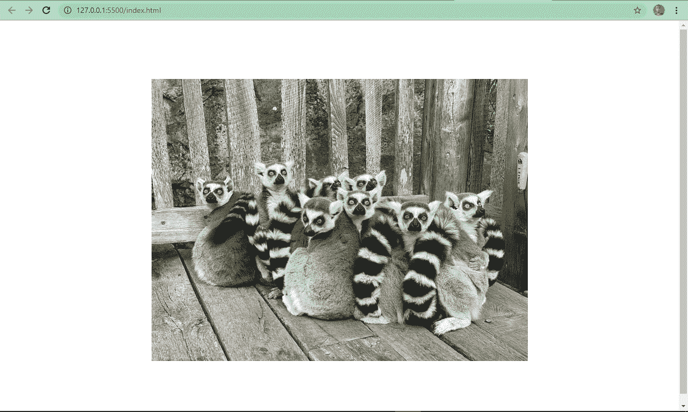
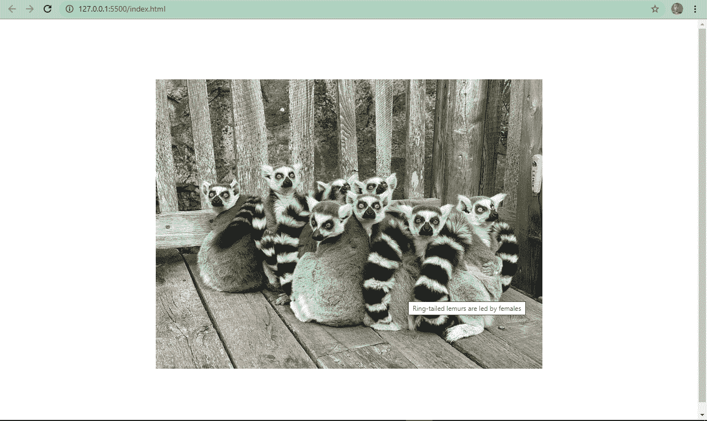
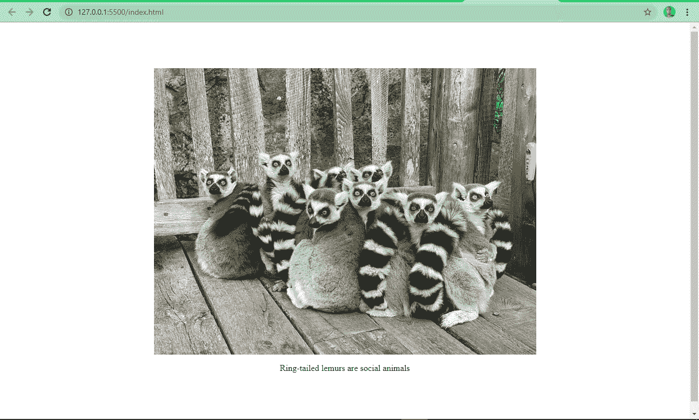
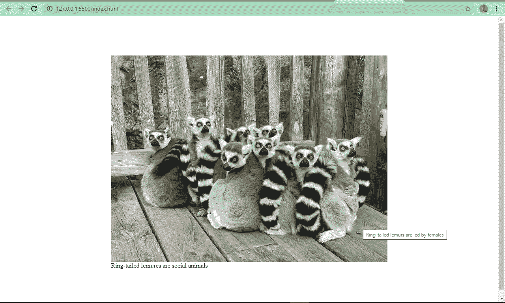

# HTML–图像标签教程

> 原文：<https://www.freecodecamp.org/news/img-html-image-tag-tutorial/>

在 HTML 中，你使用``标签给网站添加图片。它是一个内联的空元素，这意味着它不从新行开始，也没有结束标记(例如，不像 paragraph ( `<p>`)标记)。

``标签有几个属性，其中`src`、`height`、`width`和`alt`是最重要的。

了解``标签的来龙去脉以及一些最佳实践是至关重要的，因为图像会对网站的加载时间和 SEO 产生负面影响。

因此，在本教程中，我们将了解如何使用``标签向网站添加图像，如何使用其属性，一些最佳实践，以及使用``的现代方法。

## 基本 HTML ``标签语法

下面是向 HTML 添加``标签的基本语法:

```
 
```

现在我们来谈谈它的属性和工作原理。

## HTML ``标签属性

### `src`属性

`src`属性表示图像来源。没有它，标签本身在现实世界中就不会起作用。

它向浏览器指示在哪里可以找到图像。因此，如果图像是本地托管的，它需要一个相对路径；如果图像是在线托管的，它需要一个绝对 URL。

### `alt`属性

alt 属性指定图像的可选文本。例如，这可能是网络故障期间显示的文本。或者当图像来源被错误地指定时，它可以显示一些东西，这样用户就知道图像是关于什么的了。

在下面的代码片段中，错误地指定了图像源，向您展示了`alt`属性所扮演的角色:

```
 
```

这是使图像水平和垂直居中的 CSS:

```
body {
   display: flex;
   align-items: center;
   justify-content: center;
   flex-direction: column;
   height: 100vh;
  } 
```

而且看起来是这样的:


alt 属性非常重要还有两个原因:

*   SEO:它向网络爬虫指示图像是关于什么的
*   可访问性:它帮助屏幕阅读器知道图像是关于什么的，这样他们可以向有视觉障碍的人报告。此外，它还能让低带宽用户了解图像的内容。

### `width`和`height`属性

您可以使用这些属性为图像指定特定的宽度和高度。使用这些属性，您可以上下调整图像的大小。

不过，理想情况下，您不应该使用这些属性来调整图像的大小。我们将在最佳实践中详细讨论这一点。

## HTML ``标签最佳实践

### 不要用宽度和高度属性调整图像的大小。

这是一种不好的做法，因为它会使图像看起来失真，并会影响质量。

相反，您可以使用照片编辑软件(如 Photoshop)将图像优化到您想要的尺寸。

在下面的代码片段中，我指定了图像的宽度和高度——这是一个糟糕的做法:

```
 
```

图像是这样的:


不使用宽度和高度属性，图像看起来像这样:


看起来更好？是啊！

### 给你的图片起个合适的名字

恰当地命名图像可以帮助搜索引擎理解图像的内容。例如，将图像命名为`ring-tailed-lemurs.webp`而不是`photo-1580855733764-084b90737008.webp`。后者对于搜索引擎优化(SEO)是不够的。

### 减小图像文件大小

就页面速度而言，图像的文件大小至关重要。较小的图像尺寸(保持图像质量)可以减少加载时间，而较大的图像加载时间会很长。

有几个工具和各种软件可以帮助你做到这一点。一些例子是 imageOptim、jStrip 和 PNGGauntet。如果你关心 SEO，你会想看看这些——因为页面速度是一个重要的排名因素。

### 带有 CDN 的主机映像

想象一下，如果一个网站位于美国，但是一个非洲的用户想要访问它。图像和图标等资产将不得不从美国运到非洲，这反过来会减慢下载时间。

使用 CDN(内容交付网络)将允许网站的图像被缓存在世界各地的几个地方。然后，CDN 可以从离用户最近的位置为他们提供服务，从而缩短加载时间并提供更好的用户体验。

Cloudflare 是一个流行的 CDN，许多开发人员使用它来托管他们的映像。

### 使用描述性替代文本

使用描述性的替代文本有助于搜索引擎理解图片的内容。但这并没有结束——替代文本还必须与图像相关。

例如，使用这个:

```
 
```

此处的 Insead:

```
 
```

### 使用`title`属性显示工具提示

就像`alt`属性一样，您可以使用`title`属性来显示关于图像的附加信息。当用户将鼠标悬停在图像上时，浏览器会将其显示为工具提示。

```
 
```



## ``标记现代方法

有多种方式可以让你使用更加现代的标签。现在让我们来看看其中的一些。

### 延迟加载图像

惰性加载是一个新的“加载需要的”概念。对于延迟加载，只有当用户滚动到图像的视口时，才会加载图像。

这与急切加载形成对比，后者在浏览器呈现页面后立即加载每个图像。

要应用惰性加载，将 loading 属性添加到``标签，并将值设置为“lazy”。

```
 
```

如今，图像通常质量很高，而且很大，但这会对用户体验和 SEO 产生负面影响——因此引入了延迟加载。

### 使用`<figure>`和`<figcaption>`标签

通常，您可能需要向用户指定图像的标题。许多开发人员通过在``之后放置一个`<p>`标签来实现这一点。

这可能没有错，但它违背了最佳实践，并且没有将标题与图像相关联，因此搜索引擎不会理解它是什么。

```

<p>Ring-tailed lemurs are social animals</p> 
```



很明显，在上面的例子中，图像和标题之间没有联系。

HTML5 引入了`<figure>`和`<figcaption>`元素来帮助解决这个问题。您将``标签包装在`<figure>`元素中，并在`<figcaption>`元素中指定标题。

这有助于搜索引擎将标题与图像联系起来，从而提高性能和 SEO。

下面的代码片段和截图向您展示了包含和不包含`<figure>`和`<figcaption>`元素的图像:

```
<figure>
   
<figcaption>Ring-tailed lemures are social animals</figcaption>
</figure> 
```



你现在可以看到图像和标题被很好地联系在一起。

### 使用。webP 图像格式

。webP 是 Google 创建的一种图像格式。根据创作者的说法，这是一种比 JPG、JPEG、PNG 尺寸更小的图像格式，但质量相同。

这种格式越来越被广泛接受，被认为是 web 的下一代图像格式。

## 结论

我希望这篇文章能帮助你理解``标签在 HTML 中是如何工作的，这样你就可以在你的项目中正确地使用它。如果你这样做，它将有助于改善您的用户体验和搜索引擎优化。

非常感谢阅读，并继续编码。