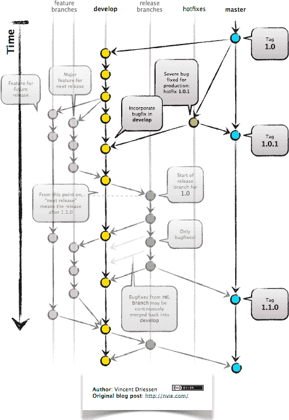

# 使用 Githooks 改进您团队的开发工作流程

> 原文：<https://www.freecodecamp.org/news/improve-development-workflow-of-your-team-with-githooks-9cda15377c3b/>

丹尼尔·多伊奇

# 使用 Githooks 改进您团队的开发工作流程

Photo by rawpixel on Unsplash — [https://unsplash.com/photos/erQu7dP0jCE](https://unsplash.com/photos/erQu7dP0jCE)

每个由不止一个程序员开发的产品都需要一些指导方针来协调工作流程。

例如，程序员之间的标准化软件开发工作流允许:

*   更快的工程，因为每个开发人员可以依赖一个习惯性的活动
*   更少的错误，因为工作流本身的结构应该避免一些错误
*   新成员的轻松融入
*   改进的历史记录

一个非常容易使用的特性是" [Githooks](https://git-scm.com/book/en/v2/Customizing-Git-Git-Hooks) "(如果你使用 Git 进行版本控制的话)。

在本文中，我想展示用 Githooks 建立一些工作流指南是多么容易。这将允许你的团队在开发软件时保持一致。

### 目录

*   为什么选择 Githooks？
*   [GitFlow 和 Checkout，Commit，Push](https://github.com/Createdd/Writing/blob/master/2018/articles/Githooks.md#gitflow-and-checkout-commit-push)
*   [结账后](https://github.com/Createdd/Writing/blob/master/2018/articles/Githooks.md#post-checkout)
*   [提交消息](https://github.com/Createdd/Writing/blob/master/2018/articles/Githooks.md#commit-msg)
*   [预推送](https://github.com/Createdd/Writing/blob/master/2018/articles/Githooks.md#pre-push)
*   [“强制”挂钩](https://github.com/Createdd/Writing/blob/master/2018/articles/Githooks.md#%22enforce%22-the-hooks)
*   [修复一个常见问题](https://github.com/Createdd/Writing/blob/master/2018/articles/Githooks.md#fix-one-common-problem)
*   [感谢](https://github.com/Createdd/Writing/blob/master/2018/articles/Githooks.md#thanks)

### 为什么是 Githooks？

顾名思义，Githooks 是一个用于 [Git](https://git-scm.com/) 命令的钩子。直觉上，这是有道理的。使用 Git，你实际上是在管理一个软件的工作流程。每一个分支都是整体的一部分。每次提交都是一个分支的构建块。

因此，为了标准化软件开发的质量，人们必须标准化产品构建过程中的行为。

有许多 Git 命令可以用来设置标准。记住，有不少:

*   appliypatch-msg
*   应用前补丁
*   应用后补丁
*   预提交
*   准备-提交-消息
*   提交消息
*   提交后
*   pre-rebase
*   结账后
*   合并后
*   预接收
*   预推
*   更新
*   更新后
*   预自动气相色谱
*   重写后

要建立一个改进的工作流程，你不必全部使用它们。把注意力集中在少数几个重要的问题上。根据我目前的经验，这些是:

*   提交消息/预提交
*   结账后
*   预推

我来解释一下原因。

### GitFlow 和签出、提交、推送

使用 Git 作为版本控制系统允许设置一个工作流。我使用 [GitFlow 方法](https://datasift.github.io/gitflow/IntroducingGitFlow.html)来完成这个任务。

它基本上是开发一个软件，其中每个特性由一个分支表示。

在下面的例子中，我将总是用正则表达式测试来检查命名，或者执行另一个脚本。

### 结账后

分支重要性的增加允许第一个挂钩“后结帐”。它是在用 Git 创建一个新分支后触发的。

通常使用命名约定来使分支具有可比性，并理解它们在整个产品中的用途。

您可以创建一个简单的 shell 脚本来确保命名:

### 提交消息

在 web 开发中，有多个库可以帮助设置提交挂钩。通常它们是不必要的，因为简单的脚本也可以由您自己编写。

例如，请参见 git 消息的验证:

### 预推

“Git 推送”是与团队“共享”你的分支的过程。这通常是打开与主分支合并的拉请求之前的最后一步。

这是检查其他准则的好时机，比如代码的“林挺”,或者是否所有测试都通过了。

执行另一个脚本的示例可能是:

### “强制”挂钩

另一个步骤是实际执行这些挂钩。

在 JavaScript 和 NPM/Yarn 包管理器中，已经内置了一个“安装后”脚本。它允许在安装过程之后执行脚本。但是到底应该执行什么呢？

创建您自己的安装脚本！比如:

### 解决一个常见问题

让我猜测了一段时间的一个问题是 Git 钩子在默认情况下是不可执行的。这意味着它们需要用

`chmod +x <pathToHo` ok >

参见此处的 StackOverflow 讨论。

### 谢谢

我希望这将有助于你们中的一些人调整开发团队的工作流程，并使每个人的生活更加轻松。:-)

感谢阅读我的文章！欢迎留下任何反馈！

Daniel 是一名软件开发人员，是商法专业的法学硕士，也是维也纳科技活动的组织者。他目前的个人学习努力集中在机器学习上。

关系

*   [LinkedIn](https://www.linkedin.com/in/createdd)
*   [Github](https://github.com/Createdd)
*   [中等](https://medium.com/@ddcreationstudi)
*   [推特](https://twitter.com/_createdd)
*   [Steemit](https://steemit.com/@createdd)
*   [哈希节点](https://hashnode.com/@DDCreationStudio)