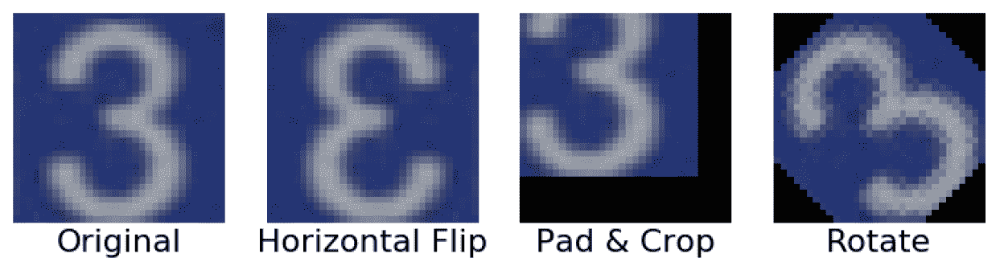
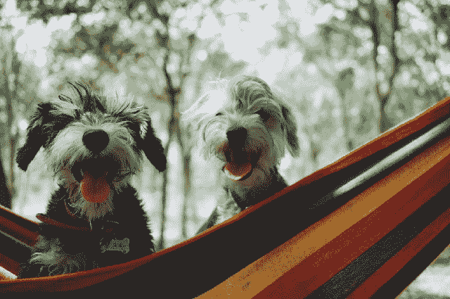
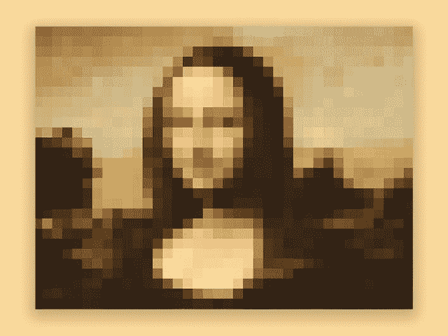
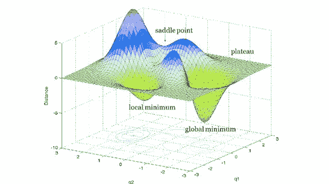
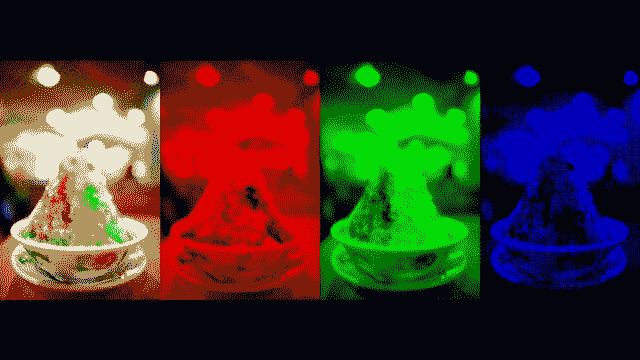
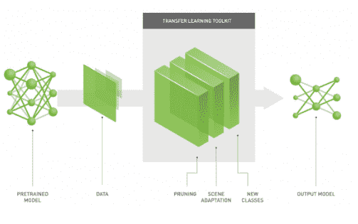

# 如何提高图像识别模型的准确性

> 原文：<https://www.freecodecamp.org/news/improve-image-recognition-model-accuracy-with-these-hacks/>

这 7 个技巧和提示将在几分钟内让你的图像识别模型达到 50%到 90%的准确率。

因此，您已经收集了数据集，构建了神经网络，并训练了您的模型。

但是，尽管你已经投入了数小时(有时是数天)的工作来创建这个模型，它却能以 50-70%的准确率做出预测。很可能，这不是你所期望的。

这里有一些策略或技巧，可以提高你的模型的性能指标。

## 1.获取更多数据

深度学习模型的强大程度取决于你带来的数据。提高验证准确性的最简单的方法之一是添加更多的数据。如果您没有太多训练实例，这尤其有用。

如果您正在处理图像识别模型，可以考虑通过使用数据扩充来增加可用数据集的多样性。这些技术包括从在轴上翻转图像和添加噪声到放大图像的任何内容。如果你是一个强大的机器学习工程师，你也可以尝试用 GANs 进行数据增强。

点击阅读更多关于[数据增强的信息。](https://bair.berkeley.edu/blog/2019/06/07/data_aug/)

Keras 有一个惊人的图像预处理类来执行数据增强: [ImageDataGenerator](https://keras.io/api/preprocessing/image/#imagedatagenerator-class) 。



Be careful that the augmentation technique you use changes the entire class of an image. For example, the image of a 3 flipped over the y-axis doesn’t make sense! [Source](https://bair.berkeley.edu/blog/2019/06/07/data_aug/)

## 2.添加更多层

向模型中添加更多图层可以增强模型更深入地了解数据集要素的能力。这意味着它将能够识别你作为一个人类可能没有发现的细微差别。

这个技巧完全依赖于你要解决的任务的性质。

对于复杂的任务，例如区分猫和狗的品种，添加更多的层是有意义的，因为你的模型将能够学习区分狮子狗和狮子狗的细微特征。

对于简单的任务，比如给猫和狗分类，一个简单的模型和几层就可以了。

更多层->更细致的模型。



Photo by [Alvan Nee](https://unsplash.com/@alvannee?utm_source=medium&utm_medium=referral) on [Unsplash](https://unsplash.com?utm_source=medium&utm_medium=referral)

## 3.更改您的图像大小

当您为训练和评估而预处理图像时，您可以对图像大小进行大量实验。

如果您选择的图像尺寸太小，您的模型将无法识别有助于图像识别的显著特征。

相反，如果图像太大，会增加计算机所需的计算资源，并且/或者您的模型可能不够复杂，无法处理它们。

常见的图像大小包括 64x64、128x128、28x28 (MNIST)和 224 x224(VGG 16)。

请记住，大多数预处理算法不考虑图像的长宽比，因此较小尺寸的图像可能会出现在某个轴上缩小。



Converting an image from a large resolution to a small size, like 28x28, usually ends up with a lot of pixelation that tends to have negative effects on your model’s performance. [Source](https://dribbble.com/shots/4829233-Pixelated-Mona-Lisa)

## 4.增加纪元

*时期*基本上就是你通过神经网络传递整个数据集的次数。用间隔为+25、+100 等的更多历元增量训练您的模型。

只有当数据集中有大量数据时，增加历元才有意义。但是，您的模型最终会达到一个点，在这个点上增加历元不会提高精度。

此时，您应该考虑调整模型的学习率。这个小超参数决定了你的模型是达到它的全局最小值(神经网络的最终目标)还是陷入局部最小值。



Global Minimum is the ultimate goal for neural networks. [Source](https://www.dna-ghost.com/single-post/2018/03/13/Neural-network-Escaping-from-variety-of-non-global-minimum-traps)

## 5.减少颜色通道

颜色通道反映了图像阵列的维度。大多数彩色(RGB)图像由三个颜色通道组成，而灰度图像只有一个通道。

颜色通道越复杂，数据集就越复杂，训练模型所需的时间就越长。

如果颜色在你的模型中不是一个重要的因素，你可以继续把你的彩色图像转换成灰度。

你甚至可以考虑其他颜色空间，比如 HSV 和 L*a*b。



RGB images are composed of three colour channels: red, green, and blue. [Source](https://www.youtube.com/watch?v=ZqUotba3V5Y)

## 6.迁移学习

迁移学习涉及使用预先训练好的模型，如 YOLO 和 ResNet，作为大多数计算机视觉和自然语言处理任务的起点。

预训练模型是最先进的深度学习模型，在数百万个样本上进行训练，通常需要几个月。这些模型具有惊人的巨大能力，可以发现不同图像中的细微差别。

这些模型可以用作您的模型的基础。大多数模型都非常好，以至于您不需要添加卷积层和池层。

阅读有关使用迁移学习的[的更多信息。](https://machinelearningmastery.com/transfer-learning-for-deep-learning/)



Transfer learning can greatly improve your model’s accuracy from ~50% to 90%! Source: [Nvidia blog](https://www.nvidia.com/content/dam/en-zz/en_sg/ai-innovation-day-2019/assets/pdf/9_NVIDIA-Transfer-Learning-Toolkit-for-Intelligent-Video-Analytics.pdf)

## 最后的想法

上面的技巧为你优化模型提供了基础。要真正微调模型，您需要考虑调整模型中涉及的各种超参数和函数，例如学习率(如上所述)、激活函数、损失函数等等。

这种攻击是一种“我希望你知道你在做什么”的警告，因为有更广泛的范围来搞乱你的模型。

### 总是保存你的模型

每次对深度学习模型进行更改时，都要保存模型。如果先前的模型配置提供了更高的准确性，这将有助于您重用该配置。

大多数深度学习框架像 Tensorflow 和 Pytorch 都有一个“保存模型”的方法。

```
# In Tensorflow
model.save('model.h5') # Saves the entire model to a single artifact

# In Pytorch
torch.save(model, PATH)
```

有无数其他方法可以进一步优化你的深度学习，但上面描述的技巧是深度学习优化部分的基础。

*[给我发微博](http://twitter.com/jasmcaus)* 让我知道你最喜欢的黑客是什么！