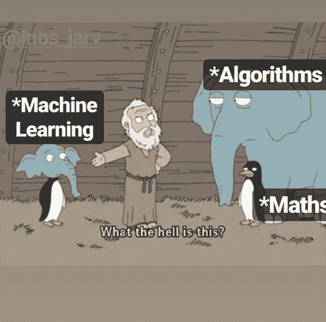

# 如何提高在家工作时的数据科学技能

> 原文：<https://www.freecodecamp.org/news/improve-your-data-science-skills-while-working-from-home/>

本文将作为在家工作时提高数据科学技能的指南。你可以用它来构建现实生活中的项目，充实你的投资组合，并为下一步做好准备。

冠状病毒爆发占据了头条。由于新冠肺炎病毒的传播，远程工作突然成为许多人的夜间需求。当你阅读这篇文章的时候，你可能正在家里工作。

> 随着数百万人在家工作数周，我们应该抓住这个机会来提高我们所关注领域的技能。

以下是我在家工作时学习数据科学的策略，只有很少的个人实际项目。

“那我们该怎么办？”

“应该从哪里开始学？”

当我解释你如何坐在家里学习数据科学的过程时，拿起你的咖啡。这个博客面向所有人，从初学者到专业人士。

Photo by [Nick Morrison](https://unsplash.com/@nickmorrison?utm_source=medium&utm_medium=referral) on [Unsplash](https://unsplash.com?utm_source=medium&utm_medium=referral)

## 先决条件

要开始这个旅程，您需要了解一些先决条件。无论你在哪个具体领域，你都需要学习以下数据科学的先决条件。

### 逻辑/算法:

在学习之前，知道为什么我们需要一个特定的先决条件是很重要的。算法基本上是给计算机的一组指令，让它完成特定的任务。

机器学习是从各种复杂的算法中建立起来的。因此，在进入机器学习所需的复杂算法之前，你需要了解算法和逻辑在基本层面上是如何工作的。

如果你能够用正确的步骤为任何给定的难题编写逻辑，你将很容易理解这些算法是如何工作的，你也可以为自己编写一个。

资源:[一些牛逼的免费资源深入学习数据结构和算法](https://www.freecodecamp.org/news/these-are-the-best-free-courses-to-learn-data-structures-and-algorithms-in-depth-4d52f0d6b35a/)。

### 统计数据:

统计是一组工具，您可以使用它们来获得有关数据的重要问题的答案。

机器学习和统计学是两个紧密相关的研究领域。以至于统计学家将机器学习称为“应用统计学”或“统计学习”。

Image source : http://me.me/

在开始机器学习之前，有抱负的数据科学家应该涵盖以下主题。

*   集中趋势的度量——均值、中值、众数等
*   可变性测量—方差、标准偏差、z 值等
*   概率——概率密度函数、条件概率等
*   准确性——真阳性、假阳性、灵敏度等
*   假设检验和统计显著性— p 值、零假设等

资源:[在这个免费的 8 小时课程中学习大学水平统计](https://www.freecodecamp.org/news/free-statistics-course/)。

### 商业:

这个要看你想专注哪个领域了。它基本上包括在进入数据科学项目之前，理解特定的领域并获得领域专业知识。这很重要，因为它有助于准确定义我们的问题。

资源:[商业数据科学](https://www.oreilly.com/library/view/data-science-for/9781449374273/)

## 温习你的基础知识

这听起来很容易，但我们往往会忘记一些重要的基本概念。没有扎实的基础知识，很难学习更复杂的概念和特定领域的最新技术。

这里有一些你可以开始修改的概念:

### Python 编程语言

Python 在数据科学中应用广泛。查看这个[伟大的 Python 教程集合](https://www.freecodecamp.org/news/best-python-tutorial/)和这些[有用的代码样本](https://www.freecodecamp.org/news/python-example/)开始吧。

Image source : *memecrunch.com*

你也可以看看这个 [Python3 Cheatsheet](https://in.pinterest.com/pin/558164947551611259/?autologin=true) ，它将帮助你学习 Python3 中发布的新语法。它还会帮助你复习基本语法。

如果你想要一个很棒的免费课程，请查看查克博士的 [Python for Everybody 课程。](https://www.freecodecamp.org/news/python-for-everybody/)

### 一般数据科学技能

想学习一门关于数据科学概念的伟大课程吗？这里有一系列数据科学课程，你可以在网上学习，根据成千上万的数据点进行排名。

资源:[初学数据科学-免费 6 小时课程](https://www.freecodecamp.org/news/data-science-course-for-beginners/)，[学数据科学应该学什么语言](https://www.freecodecamp.org/news/which-languages-should-you-learn-for-data-science-e806ba55a81f/)？

## 数据收集

现在是我们探索收集数据的所有方法的时候了。您永远不知道您的数据可能会藏在哪里。以下是几种收集数据的方法。

### 网页抓取

Web 抓取帮助您从 web 上收集结构化数据，选择其中的一些数据，并保留您所选择的数据以供您需要时使用。

你可以[开始学习 BeautifulSoup4](https://www.freecodecamp.org/news/better-web-scraping-in-python-with-selenium-beautiful-soup-and-pandas-d6390592e251/) 帮助你抓取网站并制作自己的数据集。

提前提示:您可以使用 [Selenium](https://www.selenium.dev/) 自动化浏览器并从 Firebase 等交互式网页获取数据。它对于自动化 web 应用程序和自动化枯燥的基于 web 的管理非常有用

资源:[Python 中的 Web 抓取 101](https://www.freecodecamp.org/news/p/51e02007-8108-4fb9-bbbb-f3b99e81d492/)

### 云服务器

如果你的数据存储在云服务器上，比如 S3，你可能需要熟悉如何从那里获取数据。下面的链接将帮助你理解如何使用亚马逊 S3 来实现它们。

资源:[亚马逊 S3 入门](https://aws.amazon.com/s3/getting-started/)，[如何使用 CloudFront 将您的网站或应用部署到 AWS S3](https://www.freecodecamp.org/news/how-to-host-and-deploy-a-static-website-or-jamstack-app-to-s3-and-cloudfront/)

### 蜜蜂

有数百万个网站通过 API 提供数据，如脸书、Twitter 等。因此，了解它们是如何使用的，并对它们是如何实现的有一个好的想法是很重要的。

资源:[什么是 API？英文请](https://www.freecodecamp.org/news/what-is-an-api-in-english-please-b880a3214a82/)、[如何用 Python 构建 JSON API](https://www.freecodecamp.org/news/build-a-simple-json-api-in-python/)、[Python API 入门](https://www.dataquest.io/blog/python-api-tutorial/)。

## 数据预处理

本主题包括从数据清理到特征工程的所有内容。这需要花费大量的时间和精力。所以我们需要投入大量的时间去真正的学习它。

Image source : [https://www.pinterest.com/pin/293648838181843463/](https://www.pinterest.com/pin/293648838181843463/)

**数据清理**根据问题和数据类型涉及不同的技术。需要清除数据中的无关数据、语法错误、数据不一致和缺失数据。以下指南将带您开始数据清理。

资源:[数据清理终极指南](https://towardsdatascience.com/the-ultimate-guide-to-data-cleaning-3969843991d4)

**数据预处理**是对数据进行转换或编码的重要步骤，这样机器就可以很容易地解析它。预处理包括数字、文本和图像数据在内的不同类型的数据需要时间和精力。

资源:[数据预处理:概念](https://towardsdatascience.com/data-preprocessing-concepts-fa946d11c825)、[关于 NLP 和机器学习的文本预处理](https://www.freecodecamp.org/news/all-you-need-to-know-about-text-preprocessing-for-nlp-and-machine-learning-bc1c5765ff67/)、[深度学习的预处理](https://www.freecodecamp.org/news/https-medium-com-hadrienj-preprocessing-for-deep-learning-9e2b9c75165c/)。

## 机器学习

最后，我们到达了数据科学中我们最喜欢的部分:机器学习。

Image source : [https://in.pinterest.com/pin/536209899383255279/](https://in.pinterest.com/pin/536209899383255279/)

我的建议是首先[温习你的基本算法](https://www.freecodecamp.org/news/these-are-the-best-free-courses-to-learn-data-structures-and-algorithms-in-depth-4d52f0d6b35a/)。

**分类** —逻辑回归、随机森林、SVM、朴素贝叶斯、决策树

资源:[机器学习中的分类算法类型](https://medium.com/@Mandysidana/machine-learning-types-of-classification-9497bd4f2e14)，[机器学习中的分类算法](https://medium.com/datadriveninvestor/classification-algorithms-in-machine-learning-85c0ab65ff4)

**回归** —线性回归、随机森林、多项式回归

资源:[线性回归简介](https://towardsdatascience.com/introduction-to-machine-learning-algorithms-linear-regression-14c4e325882a)、[利用线性回归模型预测二次、根、多项式函数](https://www.freecodecamp.org/news/learn-how-to-improve-your-linear-models-8294bfa8a731/)、[你应该知道的 7 种回归技术](https://www.analyticsvidhya.com/blog/2015/08/comprehensive-guide-regression/)、[为你的回归问题选择最佳的机器学习算法](https://towardsdatascience.com/selecting-the-best-machine-learning-algorithm-for-your-regression-problem-20c330bad4ef)、

**聚类** — K-Means 聚类、DBSCAN、凝聚层次聚类

资源:[聚类算法](https://towardsdatascience.com/the-5-clustering-algorithms-data-scientists-need-to-know-a36d136ef68)

**梯度增强** — XGBoost，Catboost，AdaBoost

资源:[从零开始的梯度增压](https://medium.com/mlreview/gradient-boosting-from-scratch-1e317ae4587d)，[了解梯度增压机](https://towardsdatascience.com/understanding-gradient-boosting-machines-9be756fe76ab)

我敦促你们理解这些算法背后的数学原理，这样你们就能清楚地知道它实际上是如何工作的。你可以参考我的这个博客，我从零开始实现了 XGBoost—[从零开始实现 XGBoost](https://towardsdatascience.com/implementing-xgboost-from-scratch-6b7f2eb593c)

现在你可以转向神经网络，开始你的深度学习之旅。

资源:[面向开发者的深度学习](https://www.freecodecamp.org/news/deep-learning-for-developers-tools-you-can-use-to-code-neural-networks-on-day-1-34c4435ae6b/)、[Tensorflow 深度学习简介](https://www.freecodecamp.org/news/tensorflowjs-full-course/)、[如何用 tensor flow 开发神经网络](https://www.freecodecamp.org/news/learn-to-develop-neural-networks-using-tensorflow-2-0-in-this-beginners-course/)、[了解深度神经网络如何工作](https://www.freecodecamp.org/news/how-deep-neural-networks-work/)

然后，您可以进一步深入了解 LSTM、暹罗网络、CapsNet 和 BERT 是如何工作的。

## 黑客马拉松

Image Source : [https://me.me/](https://me.me/)

现在我们需要在竞争层面上实现这些算法。你可以开始寻找在线数据科学黑客马拉松。以下是我尝试与其他数据科学家竞争的网站列表。

**分析维迪亚**——【https://datahack.analyticsvidhya.com/contest/all/】T2

**卡格尔**——【https://www.kaggle.com/competitions 

黑客帝国——【https://www.hackerearth.com/challenges/ T3

**machine hack**——【https://www.machinehack.com/ 

**tech gig**——【https://www.techgig.com/challenge 

完成比赛——【https://dare2compete.com/e/competitions/latest 

**Crowdanalytix**——【https://www.crowdanalytix.com/community 

为了了解一个成功的解决方案，这里有一个我的成功解决方案的链接，链接到一个关于分析 Vidhya 的在线黑客马拉松——[https://github.com/Sid11/AnalyticsVidhya_DataSupremacy](https://github.com/Sid11/AnalyticsVidhya_DataSupremacy)

## 项目:

我们看到人们在虚拟数据上工作，但仍然不知道实际数据是什么样的。在我看来，处理现实生活中的数据会让你非常清楚现实生活中的数据是什么样子的。清理现实生活中的数据所需的时间和精力大约占项目时间的 70%。

*   [这里是任何人都可以使用的最好的免费开放数据源](https://www.freecodecamp.org/news/https-medium-freecodecamp-org-best-free-open-data-sources-anyone-can-use-a65b514b0f2d/)
*   公开政府数据—[https://data.gov.in/](https://data.gov.in/)
*   由全球成千上万的用户和组织提供的有关 real 的数据—[https://data.world/datasets/real](https://data.world/datasets/real)
*   19 数据科学项目公共数据集—[https://www . springboard . com/blog/free-public-Data-sets-Data-Science-Project/](https://www.springboard.com/blog/free-public-data-sets-data-science-project/)

## 商业智能

从项目中获得结果后，现在是根据这些结果做出商业决策的时候了。商业智能是一套软件和服务，有助于将数据转化为可操作的情报和知识。

这可以通过从我们的模型的输出中创建一个仪表板来完成。 **Tableau** 是商业智能行业中使用的强大且发展最快的数据可视化工具。它有助于将原始数据简化为非常容易理解的格式。Tableau 的数据分析速度非常快，创建的可视化是仪表板和工作表的形式。

资源:[入门表格](https://www.tableau.com/learn/tutorials/on-demand/getting-started)，[数据科学课程表格](https://www.freecodecamp.org/news/tableau-for-data-science-and-data-visualization-crash-course/)

Image source : [https://imgflip.com/i/31dvdc](https://imgflip.com/i/31dvdc)

现在是你在家开始工作来提高你的技能的时候了。此外，如果你开始了这一旅程，需要我的建议或我上面提到的任何子部分的细节，请随时评论或发邮件给我。