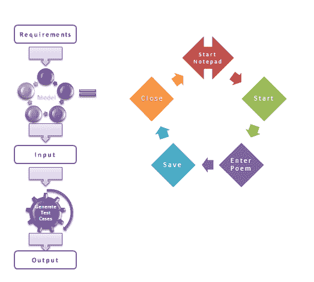
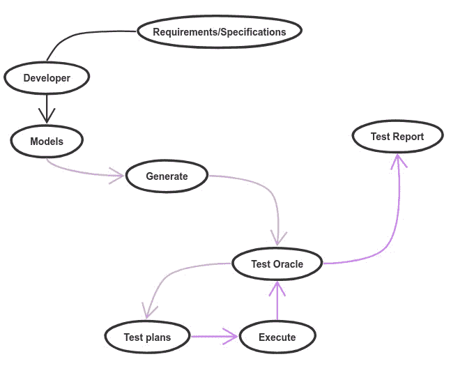
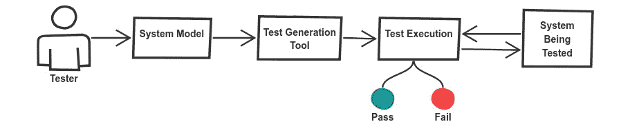
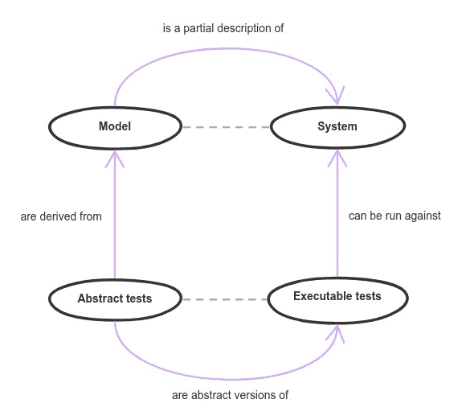
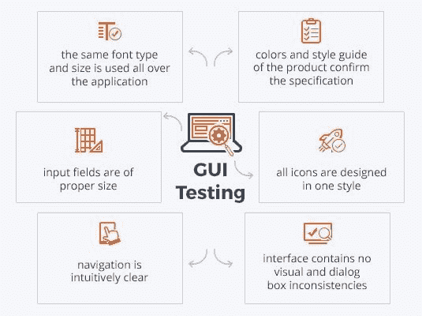

# 如何使用基于模型的测试来改进你的工作流程

> 原文：<https://www.freecodecamp.org/news/improve-your-workflow-using-model-based-testing/>

单元测试是不够的——所以让我们开始使用基于模型的测试来改进我们的工作流程。

软件测试是构建可伸缩软件系统的一个重要阶段，该系统通常具有关键功能、业务流程/逻辑和连接的外部实体。当为每个单元、功能或流程编写测试时，软件系统的这种分布式本质导致了一定程度的复杂性。

您可以使用各种类型的测试方法。您可以无缝采用的最佳方法是基于模型的测试。简单地说，这意味着创建一个你的系统模型(更像是一个描述系统各个方面的数字双胞胎)并根据这个模型生成一个测试。

## 什么是基于模型的测试？

首先，我们需要知道模型基本上是我们期望系统如何工作的描述和表示。系统的过程可以根据一系列的输入序列、动作、功能、输出和从输入到输出的数据流来定义。

我们必须能够在测试时确定所有这些行为，而模型可以帮助我们无缝地做到这一点。这样，我们就可以基于系统模型自动生成测试。

基本上，基于模型的测试是一种软件测试技术，其中测试用例是从描述被测系统功能方面的模型中产生的。这是一种新的软件测试方法，它采用了一种称为模型的软件构建的二级、轻量级、省时的实现。

我们将这个模型与系统需求结合起来，生成高效的测试用例。这种软件测试方法适用于硬件和软件测试。

## 为什么以及如何改进工作流程

自动化测试是不可避免的，因为它使得软件测试更快更有效。您可以简化您的工作流程，并使用最新的开发方法来改进它。

大多数软件开发人员和团队发现在不断变化的依赖关系和需求的环境中创建和更新测试用例很有挑战性。

从使用最简单的功能测试到像 E2E 这样的重量级方法，已经有许多测试方法被设计来提高测试的可靠性和有效性。

这些方法绝对没有错。然而，这些测试用例必须为每个场景手工编写。每当系统需求发生变化时，您必须更新受变化影响的每个测试用例。

下面，您会发现基于模型的测试过程的图形示例:

这些模型用于使用 MBT 工具生成自动化测试用例，因为它们描述了被测试系统的预期行为。

这里我们基本上有两个步骤:

1.  创建模型来描述系统的行为和过程。
2.  使用 MBT 工具，如 Spec Explorer、Graphwalker、fMBT 或 Modbat，来解释模型并为自动化测试生成测试脚本。

当使用基于模型的测试时，模型创建阶段应该是软件开发生命周期的一部分，并从需求规范阶段集成为产品设计的一部分。

这使得软件开发团队能够将他们的注意力集中在构建可测试的产品和模型上，从而增强用户体验。
基于模型的测试可以通过以下方式改进我们的工作流程:

1.  减少花费在编写测试上的时间，并允许开发人员专注于编写只涵盖系统需求的模型，并从一开始就构建可测试的应用程序。
2.  减少测试套件维护并生成更多测试。
3.  当与测试工具和自动化框架一起使用时，帮助团队创建自动化脚本并增加测试覆盖率。

## 如何实现基于模型的测试

实现基于模型的测试不能突然引入一个系统，因为它必须逐步完成。把它介绍给整个系统的流程和操作就太多了。

它最适合产品的初始阶段，因为事物仍然非常微小。这就很容易与系统需求集成，因为随着事情变得越来越大，您只需更新模型。

要实现基于模型的测试，您必须从创建模型开始。模型可以覆盖任何层次的需求，从业务逻辑到用户故事，并且可以相互连接。

然后，一旦他们完成创建，您就可以基于模型自动生成测试用例。当然，如果您对模型进行任何更改，测试将会自动更新。

一旦您能够从模型中生成自动化测试，您就可以轻松地将这些测试集成到您的 CI 流程和工具中。

## 基于模型的测试的优势

1.  优化软件测试时间和成本
2.  只需按一下按钮，您就可以为每个场景生成测试脚本。
3.  这确保了软件测试团队能够交流预期的系统行为。
4.  支持早期发现需求异常。
5.  自动化的测试用例生成和执行使得整个测试解决方案更加有效，并且更不容易出错。
6.  它有助于生成最少数量的测试用例来验证给定的功能或数据流，以确保测试下的系统完美地工作，并且不会做任何不期望的事情。
7.  项目维护非常简单。

## 基于模型的测试的缺点

1.  需要大量的投资和努力。
2.  需要熟练和训练有素的软件测试人员。
3.  第一个测试用例需要更长的时间来生成，因为它比传统的手工测试需要更多的前期工作。
4.  基于模型的测试的学习曲线非常陡峭，其复杂性使得初学者更难理解。

## 它与 UI 测试有何不同

基本上我们现在知道什么是基于模型的测试，并且我们已经发现了使用它比使用传统测试方法的好处。

UI(用户界面/前端测试)是一种[软件测试](https://en.wikipedia.org/wiki/Software_testing)的类型，它简单地涉及测试用户界面功能的过程，确保系统的界面按照预期做出反应。

这个过程包括手工测试，每个测试场景都必须手工编写。对 UI 的任何更改都会破坏整个测试用例，除非它随着更改一起更新。它使用 WebDrivers 和 Selenium 来完全模拟用户与界面交互的方式，并验证预期的输出。

UI 测试可以在产品的任何阶段使用，因为它显然没有太多的要求，与 MBT 相比，学习曲线非常容易。

测试成本很低，甚至可以降到零。花费的时间也可以很少。根据产品界面的复杂程度，维护成本可能非常高。

它不需要非常熟练的开发人员或软件。任何具有基本测试知识的开发人员都可以理解这一点。当你深入了解这一点时，会发现有很多不同之处，然而，两者都适用于不同的用例。

## 结论

从长远来看，基于模型的测试对于大型企业来说是一种强大的、成本有效的、有利可图的技术。

然而，将这种方法引入大公司的过程可能是一个很大的挑战，尤其是当它涉及到对软件开发和测试的整个方法进行彻底改革的时候。

基于模型的测试必须成为[开发工作流程](https://hackernoon.com/how-do-we-setup-a-proper-development-workflow-f708031370d9)的一部分，但是这也带来了挑战，包括对整个基础设施的改变。这也让本已陡峭的学习曲线变得更具挑战性。

幸运的是，有一些东西可以帮助识别基于模型的测试何时真正有用。例如，如果您有一个无限的系统集合，您可以用不同的方式来满足这些需求。或者，如果您有一个分布式或反应式系统，这也可能是考虑这种方法的一个原因。

基于模型的测试可以在测试中走很长的路，并在正确实现时节省大量的时间和精力。