# 深度 Q 学习的改进:决斗双 DQN，优先体验重放，并修复…

> 原文：<https://www.freecodecamp.org/news/improvements-in-deep-q-learning-dueling-double-dqn-prioritized-experience-replay-and-fixed-58b130cc5682/>

托马斯·西蒙尼尼

# 深度 Q 学习的改进:决斗双 DQN，优先体验重放，固定 Q 目标

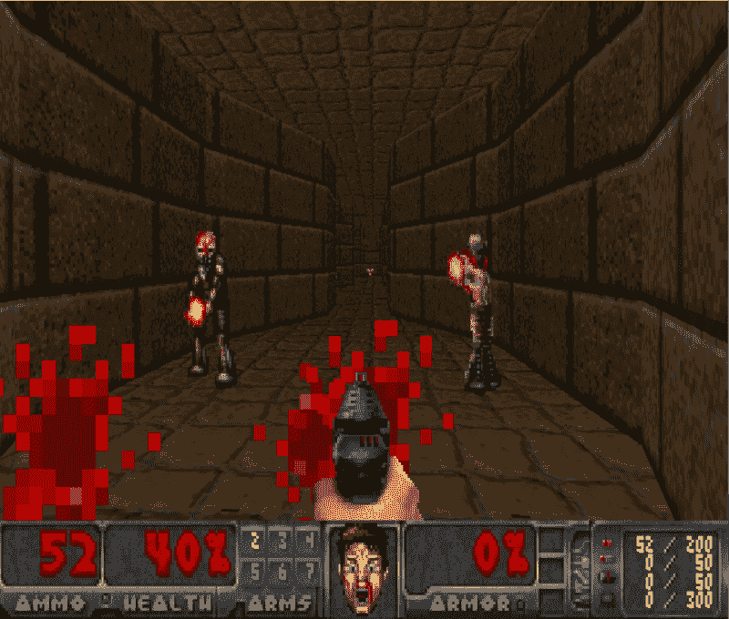

> 本文是 Tensorflow 深度强化学习课程的一部分？️.查看这里的教学大纲。

在我们上一篇关于用 Tensorflow 进行[深度 Q 学习的文章中，我们实现了一个代理，它学习玩一个简单版本的 Doom。在视频版本中，](https://medium.freecodecamp.org/an-introduction-to-deep-q-learning-lets-play-doom-54d02d8017d8)[我们训练了一个扮演太空入侵者](https://www.youtube.com/watch?v=gCJyVX98KJ4)的 DQN 特工。

然而，在培训过程中，我们看到了很多可变性。

深度 Q-Learning 于 2014 年推出。从那以后，已经做了很多改进。因此，今天我们将看到四项战略，它们极大地改善了我们 DQN 代理商的培训和成果:

*   固定 Q 目标
*   双 dqn
*   决斗 DQN(又名 DDQN)
*   优先体验重放(又名 PER)

我们将实现一个学习玩毁灭战士致命走廊的代理。我们的人工智能必须导航到基本目标(背心)，并确保他们在杀死敌人的同时生存下来。

### 固定 Q 目标

#### 理论

我们在深度 Q 学习文章中看到，当我们要计算 TD 误差(又名损失)时，我们计算 TD 目标(Q_target)和当前 Q 值(Q 的估计)之间的差值。

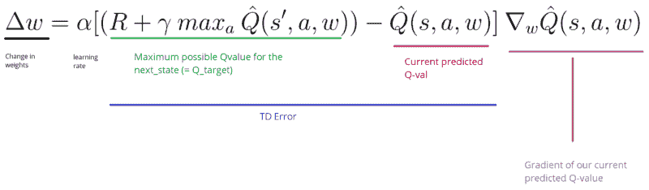

但是我们不知道真正的 TD 目标是什么。我们需要估算一下。使用贝尔曼方程，我们看到 TD 目标只是在该状态下采取行动的回报加上下一个状态的贴现最高 Q 值。

然而，问题是我们使用相同的参数(权重)来估计目标值**和**的 Q 值。因此，TD 目标和我们正在改变的参数(w)之间有很大的相关性。

因此，这意味着在训练的每一步，**我们的 Q 值会发生变化，但目标值也会发生变化。**我们离目标越来越近，但目标也在移动。就像追一个移动的目标！这导致训练中的大振荡。

这就像如果你是一个牛仔(Q 估计)，你想抓住牛(Q 目标)，你必须更接近(减少误差)。

在每一个时间步，你试图接近牛，它也在每一个时间步移动(因为你使用相同的参数)。

这就导致了一个很奇怪的追的路径(训练中的大振荡)。

相反，我们可以使用 DeepMind 引入的固定 Q 目标的想法:

*   使用具有固定参数(姑且称之为 w-)的独立网络来估计 TD 目标。
*   在每个 Tau 步骤中，我们从我们的 DQN 网络中复制参数来更新目标网络。

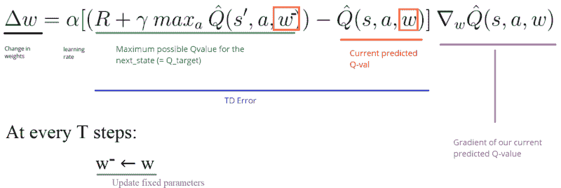

由于这个过程，我们将有更稳定的学习，因为目标函数在一段时间内保持不变。

#### 履行

实现固定的 q 目标非常简单:

*   首先，我们创建两个网络(`DQNetwork`、`TargetNetwork`)

*   然后，我们创建一个函数，它将接受我们的`DQNetwork`参数，并将它们复制到我们的`TargetNetwork`

*   最后，在培训期间，我们使用我们的目标网络计算 TD 目标。我们每隔`tau`步用`DQNetwork`更新目标网络(`tau`是我们定义的超参数)。

### 双 dqn

#### 理论

Hado van Hasselt 提出了双 DQNs，或双学习。这个方法**处理了高估 Q 值的问题。**

要理解这个问题，请记住我们是如何计算 TD 目标的:

通过计算 TD 目标，我们面临一个简单的问题:我们如何确定下一个状态的最佳行动是具有最高 Q 值的行动？

我们知道 q 值的准确性取决于我们尝试了什么动作**和**我们探索了什么邻近状态。

因此，在培训开始时，我们没有足够的信息来了解应该采取的最佳行动。因此，将最大 q 值(有噪声)作为最佳操作可能会导致误报。如果非最佳动作通常被赋予比最佳动作更高的 Q 值，学习将会变得复杂。

解决方案是:当我们计算 Q 目标时，我们使用两个网络将动作选择与目标 Q 值生成解耦。我们:

*   使用我们的 DQN 网络来选择下一个状态的最佳行动(具有最高 Q 值的行动)。
*   使用我们的目标网络来计算在下一个状态采取行动的目标 Q 值。

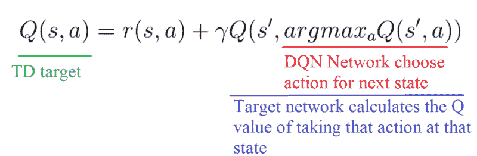

因此，双 DQN 帮助我们减少对 q 值的高估，从而帮助我们更快地训练和更稳定地学习。

#### 履行

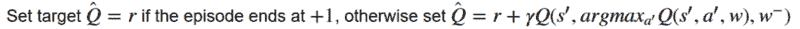

### 决斗 DQN(又名 DDQN)

#### 理论

请记住，Q 值对应于在该状态下有多好，并在该状态下采取行动 Q(s，a)。

因此，我们可以将 Q(s，a)分解为以下各项之和:

*   **V(s)** :处于该状态的值
*   **A(s，a)** :在那个状态下采取那个动作的优势(采取这个动作比在那个状态下所有其他可能的动作好多少)。

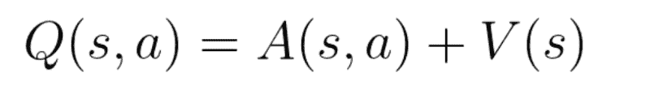

对于 DDQN，我们希望使用两个新的流来分离这两个元素的估计量:

*   一个估计**状态值 V(s)**
*   一个是估计每个行动 A(s，a) 的**优势**

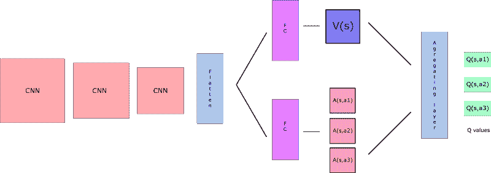

然后我们通过一个特殊的聚合层将这两个流**合并，得到一个 Q(s，a)的估计。**

等等？但是如果我们把这两个元素结合起来，为什么我们需要分别计算它们呢？

通过解耦估计，我们的 DDQN 可以直观地了解哪些状态是(或不是)有价值的**，而**不必了解每个状态下每个动作的效果(因为它也在计算 V(s))。

有了正常的 DQN，我们需要计算在那个状态下每个行为的价值。但是如果国家的价值是坏的，那又有什么意义呢？当所有这些行动都导致死亡时，在一个状态下计算所有行动有什么意义？

因此，通过去耦，我们能够计算 V(s)。这对于那些其行为不会以相关方式影响环境的国家来说尤其有用。在这种情况下，没有必要计算每个动作的值。例如，只有在有碰撞风险的情况下，向左或向右移动才重要。而且，在大多数国家，行动的选择对发生的事情没有影响。

如果我们以论文[中的深度强化学习的决斗网络架构](https://arxiv.org/pdf/1511.06581.pdf)为例，会更清楚。

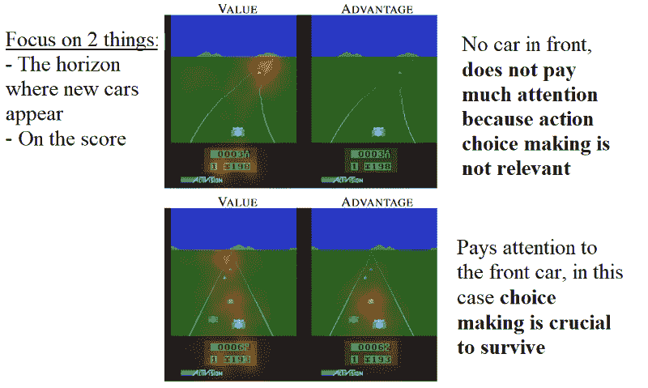

我们看到价值网络流关注(橙色模糊)道路，尤其是汽车产生的地平线。它也注重分数。

另一方面，右侧第一帧中的优势流并不太关注道路，因为前面没有车(因此动作选择实际上无关紧要)。但是，在第二帧中，它注意到了，因为有一辆车就在它的前面，做出行动的选择是至关重要的，也是非常相关的。

关于聚合层，我们希望为该状态下的每个动作生成 q 值。我们可能会尝试将这些流合并如下:

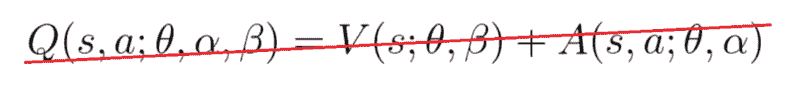

但如果我们这样做，我们就会陷入**的可识别性**问题，也就是说——给定 Q(s，A)我们无法找到 A(s，A)和 V(s)。

给定 Q(s，A)而找不到 V(s)和 A(s，A)将是我们反向传播的一个问题。为了避免这个问题，我们可以强制我们的优势函数估计量在所选的动作上具有 0 优势。

为了做到这一点，我们减去国家所有可能行动的平均优势。

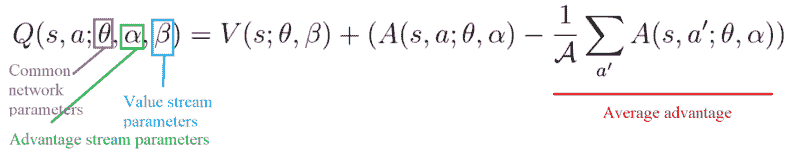

因此，这种架构有助于我们加速训练。我们可以计算一个状态的值，而无需计算该状态下每个动作的 Q(s，a)。并且通过解耦两个流之间的估计，它可以帮助我们为每个动作找到更可靠的 Q 值。

#### 履行

唯一要做的就是通过添加这些新流来修改 DQN 架构:

### 优先体验重放

#### 理论

2015 年， [Tom Schaul](https://arxiv.org/search?searchtype=author&query=Schaul%2C+T) 引入了优先体验回放(PER)。这个想法是，对于我们的训练来说，有些经历可能比其他经历更重要，但发生的频率可能会更低。

因为我们对这一批进行统一抽样(随机选择体验)，所以这些很少发生的丰富体验实际上没有机会被选择。

这就是为什么在 PER 中，我们试图通过使用一个标准来定义每个体验元组的优先级，从而改变采样分布。

我们希望优先考虑我们的预测和 TD 目标之间存在巨大差异的经验，因为这意味着我们还有很多要学习的。

我们使用 TD 误差幅度的绝对值:

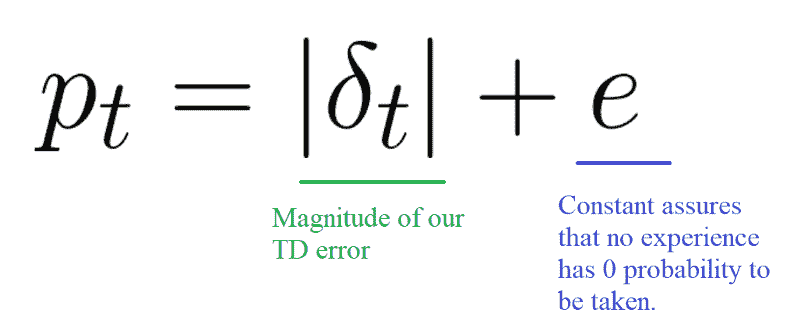

我们**将优先级放入每个重放缓冲区的体验中。**

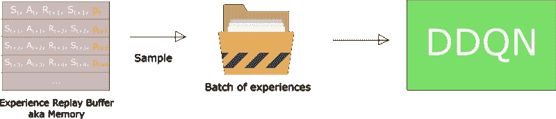

但是我们不能只做贪婪的优先排序，因为这将导致总是训练相同的经验(具有大的优先级)，从而过度拟合。

因此，我们引入了随机优先级排序，**,它产生了被选中进行重放的概率。**

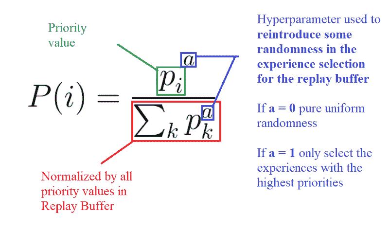

因此，在每个时间步骤中，我们将获得一批具有该概率分布的样本，并在此基础上训练我们的网络。

但是，我们还有一个问题。请记住，对于正常的经验重放，我们使用随机更新规则。因此，我们对体验进行取样的方式必须与它们来自的潜在分布相匹配。

当我们有正常的经历时，我们选择正态分布的经历——简单地说，我们随机选择我们的经历。不存在偏见，因为每一次经历都有相同的被取机会，所以我们可以正常更新权重。

**但是**，因为我们用的是优先抽样，所以放弃了纯粹的随机抽样。因此，我们引入了对高优先级样本的偏好(更多的机会被选择)。

而且，如果我们正常地更新我们的权重，我们就有过度拟合的风险。与低优先级经验相比，具有高优先级的样本很可能被多次用于训练(=偏差)。因此，我们将只更新一小部分我们认为真正有趣的经历的权重。

为了纠正这种偏差，我们使用重要性采样权重(is ),通过减少经常看到的样本的权重来调整更新。

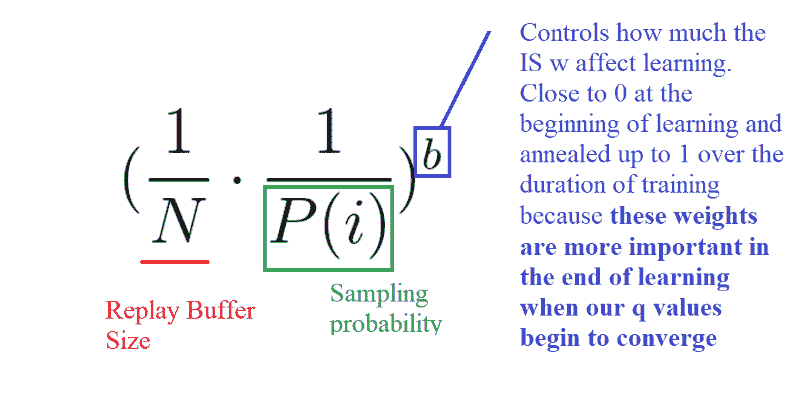

对应于高优先级样本的权重几乎没有调整(因为网络将多次看到这些经验)，而对应于低优先级样本的权重将完全更新。

**b** 的作用是控制这些重要性采样权重对学习的影响程度。在实践中，b 参数在训练期间被退火到 1，因为当我们的 q 值开始收敛时，这些权重在学习结束时更加重要**。**更新的无偏性在接近收敛时最为重要，正如这篇[文章](http://pemami4911.github.io/paper-summaries/deep-rl/2016/01/26/prioritizing-experience-replay.html)中所解释的。

#### 履行

这一次，实现会更好一点。

首先，我们不能仅仅通过将所有的体验回放缓冲区按照优先级排序来实现 PER。由于用于插入的 O(nlogn)和用于采样的 O(n ),这根本不是有效的。

正如这篇非常好的文章中所解释的，我们需要使用另一种数据结构来代替对数组排序——一种未排序的 **sumtree。**

sumtree 是一种二叉树，即每个节点最多只有两个子节点的树。树叶(最深的节点)包含优先级值，指向树叶的数据数组包含经验。

更新树和采样将会非常高效(O(log n))。

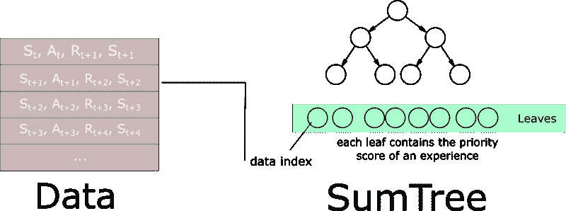

然后，我们创建一个包含 sumtree 和数据的内存对象。

接下来，为了对大小为 k 的小批量进行采样，范围[0，total_priority]将被分成 k 个范围。从每个范围均匀采样一个值。

最后，从 sumtree 中检索对应于每个采样值的转换(经验)。

当我们深入研究笔记本中的全部细节时，就会清楚得多。

### doom deathmatch 探员

这个代理是一个具有 PER 和固定 Q 目标的决斗双深度 Q 学习。

> 我们制作了一个实现的视频教程:

> 笔记本在[这里](https://github.com/simoninithomas/Deep_reinforcement_learning_Course/blob/master/Dueling%20Double%20DQN%20with%20PER%20and%20fixed-q%20targets/Dueling%20Deep%20Q%20Learning%20with%20Doom%20(%2B%20double%20DQNs%20and%20Prioritized%20Experience%20Replay).ipynb)

仅此而已！你刚刚创造了一个学习玩毁灭战士的更聪明的代理人。厉害！记住，如果你想拥有一个性能非常好的代理，你需要更多的 GPU 时间(大约两天的训练)！

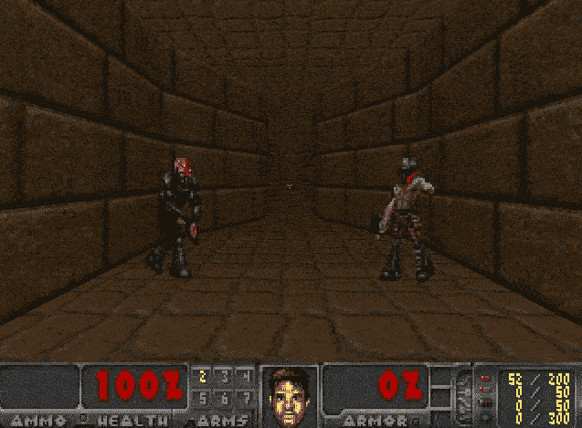

**然而，由于只接受了 2-3 个小时的 CPU** (是的 CPU)培训，我们的特工明白他们需要在前进之前杀死敌人。如果他们前进时没有杀死敌人，在拿到防弹衣之前就会被杀死。

不要忘记自己实现代码的每一部分。尝试修改我给你的代码真的很重要。尝试添加纪元，改变架构，添加固定的 Q 值，改变学习速率，使用更硬的环境…等等。实验，玩得开心！

记住这是一篇大文章，所以一定要真正理解我们为什么使用这些新策略，它们是如何工作的，以及使用它们的优势。

在下一篇文章中，我们将了解基于价值和基于策略的强化学习算法之间的一种令人敬畏的混合方法。这个 **是最先进算法的基准**:优势演员评论家(A2C)。您将实现一个代理，它学习玩 Outrun！

如果你喜欢我的文章，请点击？下面是你喜欢文章的次数，所以其他人会在媒体上看到它。别忘了跟着我！

如果你有任何想法，评论，问题，欢迎在下面评论或者给我发邮件:hello@simoninithomas.com，或者发推特给我。

不断学习，保持牛逼！

#### Tensorflow 深度强化学习课程？️

？S [yllabus](https://simoninithomas.github.io/Deep_reinforcement_learning_Course/)

？视频版本

第一部分:[强化学习简介](https://medium.com/p/4339519de419/edit)

第 2 部分:[用 Q-Learning 更深入地研究强化学习](https://medium.freecodecamp.org/diving-deeper-into-reinforcement-learning-with-q-learning-c18d0db58efe)

第 3 部分:[深度 Q 学习简介:让我们玩毁灭战士](https://medium.freecodecamp.org/an-introduction-to-deep-q-learning-lets-play-doom-54d02d8017d8)

第 3 部分+: [深度 Q 学习的改进:决斗双 DQN，优先体验重放，固定 Q 目标](https://medium.freecodecamp.org/improvements-in-deep-q-learning-dueling-double-dqn-prioritized-experience-replay-and-fixed-58b130cc5682)

第 4 部分:[关于厄运和翻转的政策梯度的介绍](https://medium.freecodecamp.org/an-introduction-to-policy-gradients-with-cartpole-and-doom-495b5ef2207f)

第五部分:[优势演员介绍评论方法:我们来玩刺猬索尼克吧！](https://medium.freecodecamp.org/an-intro-to-advantage-actor-critic-methods-lets-play-sonic-the-hedgehog-86d6240171d)

第 6 部分:[刺猬索尼克 2 和 3 的近似策略优化(PPO)](https://towardsdatascience.com/proximal-policy-optimization-ppo-with-sonic-the-hedgehog-2-and-3-c9c21dbed5e)

第七部分:[好奇心驱动的学习变得简单第一部分](https://towardsdatascience.com/curiosity-driven-learning-made-easy-part-i-d3e5a2263359)