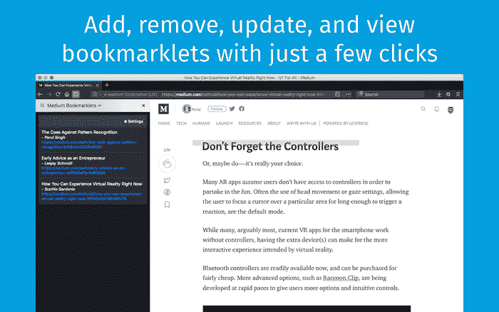
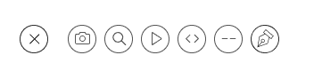
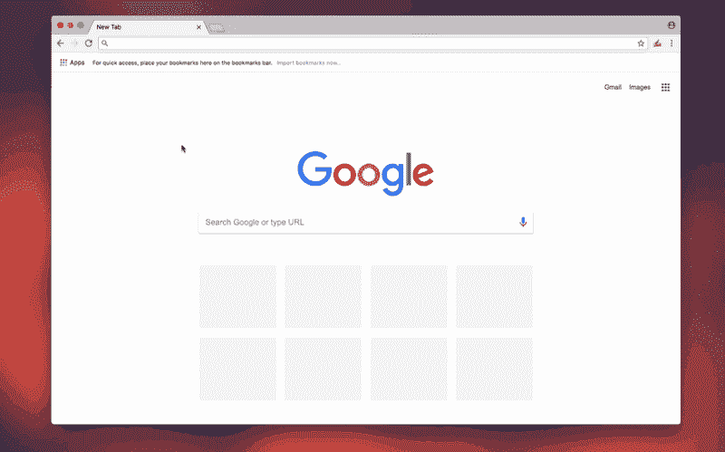

# 改善媒体体验

> 原文：<https://www.freecodecamp.org/news/improving-the-medium-experience-one-browser-extension-at-a-time-7df7e233c984/>

塞德里克·阿玛亚

# 改善媒体体验

#### 一次一个浏览器扩展。

Photo by [Barn Images](https://unsplash.com/@barnimages?utm_source=medium&utm_medium=referral) on [Unsplash](https://unsplash.com?utm_source=medium&utm_medium=referral)

我喜欢中号。作为一名消费者，它为我提供了无数的文章，帮助我在个人和专业两个方面提升自己。作为一名制作人，它为我提供了一个平台，在这个平台上，我可以通过文字尽可能真实地表达自己。

然而，自从使用 Medium 以来，我注意到了发布平台的一些不足之处，或者还有改进的空间。作为一名 web 开发人员和修补人员，我喜欢自己想出这些问题的解决方案。这里有几个我创建的扩展，让你的媒体体验更好。

### 中型书签？

我第一次尝试改善媒体体验是用我的 Firefox WebExtension， [Medium Bookmarklets](https://medium-bookmarklets.com/) (在给产品命名后，我发现它实际上并不是 Bookmarklets)。

这旨在带来真正的书签功能，在某种意义上，你可以在文章中保存你的位置，而不需要记住或滚动到该部分。这解决了一个我经常面临的问题，我认为其他人也可能会这样。

#### 它是如何工作的

因为我知道中型文章中的 HTML 元素包含一个独特的`id` 属性，所以我开发了一个解决方案，在选中的元素上添加一个标记/荧光笔。这将对应于文章中的一个段落、标题或引文，用户希望保存它们的位置，这反过来保存了该元素的`id`。

通过使用保存的`id`的片段标识符，可以直接导航到文章中的那个位置。例如，如果这个段落有一个“3b75”的`id`，那么打开这篇文章，这个特定的段落在页面的顶部，URL 将看起来像`https://blog.cedricamaya.me/improving-medium-experience-7df7e233c678**#3b75**` **。**注意结尾的片段标识符(`#3b75`)。

作者/编辑通常使用相同的功能在他们的文章中加入目录。这里有一个很好的解释和更详细的操作指南。

考虑到这个功能，我编写了一个 Firefox 插件，创建了一个可点击卡片的侧边栏，代表用户保存的*书签，我称之为*。每张卡上的 click 事件处理程序会将当前页面导航到 *bookmarklet 的* URL。因此，如果你在一篇长文章的中间放置了一个*书签*，就完全不需要滚动到你上次停下的那一节了。

Promo image showcasing the Medium Bookmarklets sidebar and a bookmarklet highlight in an article.

中型书签包含了更多的功能，例如需要将您想要保存的出版物加入白名单(出于安全原因)，以及当添加或删除*书签*时的通知。除此之外，这是一个非常简单的扩展，旨在提高您的书签功能。

从 Mozilla 插件中查看 [**中型书签**](https://addons.mozilla.org/en-US/firefox/addon/medium-bookmarklets/) 。

### 签名

如果 Medium Bookmarklets 是为 Medium 的消费者开发的，那么 [Signature](https://chrome.google.com/webstore/detail/signature/hgabbjfneihcmbbcnbnfdnfdcbpodnhp) 是为那些在 Medium 上创建内容的人开发的。

Signature 的目的很简单:让作者和编辑只需点击一个按钮，就可以立即添加他们博客的签名/结束——消除了每次复制粘贴或重新键入的需要。

签名的想法起源于在一个特定的出版物上看到许多文章，这些文章都以相同的文本/副本结尾。它通常是一个带有超链接的行动号召，并使用粗体或斜体文本来突出它。

我心想，“人们每次写一篇新的博文时，是键入签名还是从以前的文章中复制粘贴？”无论如何，重新键入或复制粘贴需要时间，并且想要简化这个过程，我开发了另一个浏览器扩展(这次是针对 Chrome 和 Firefox)来解决这个问题。

#### 它是如何工作的

安装 Signature 后，用户只需在扩展设置页面的编辑器中填写他们博客的签名。这个编辑器是 [Quill](https://quilljs.com/) 的一个实例，是一个富文本编辑器，这意味着任何文本格式(即粗体、斜体、引用、标题、代码等等)都可以很容易地转换并应用到一个中等大小的博客文章草稿中，它也利用了富文本功能。

一旦在设置页面中定义了签名，用户就可以点击内嵌工具提示中的“签名”按钮(带有笔尖图标)，如下所示。然后，单击该按钮将在草稿的设置页面中定义的签名粘贴到草稿中。

“Signature” button, on the far right.

关于它是如何工作的，我们已经说得够多了——让我们来看看它是如何工作的！

Signature added in settings page, then “signature” button used to add signature in Medium draft.

从 [Mozilla 插件](https://addons.mozilla.org/en-US/firefox/addon/medium-signature/)和 [Chrome 网上商店](https://chrome.google.com/webstore/detail/signature/hgabbjfneihcmbbcnbnfdnfdcbpodnhp)查看**签名**。

#### 外卖食品

像所有的产品一样，Medium 也有它的缺点。然而，通过创造性地运用你的想象力和自己动手的态度，你可以通过一点编程来极大地改善这些问题。

我现在鼓励*你*以自己的方式改善媒体体验，并使用# MediumExperience 分享结果。如果你想不出自己的想法，或者刚刚开始编程，请随意实现一个新功能或修复 Medium Bookmarklets 或 Signature 中的一个 bug 这两者都是开源的，可以在 GitHub 上找到。

[**cedricium/medium-bookmarkets**](https://github.com/cedricium/medium-bookmarklets)
[*？medium-bookmarklets -保存您在 medium 文章中的位置并在以后返回它们的简单方法。例如*ithub.com](https://github.com/cedricium/medium-bookmarklets)[**cedricium/signature**](https://github.com/cedricium/signature)
[*✍️signature-简化的 Medium signatures。*github.com](https://github.com/cedricium/signature)

感谢您的阅读，我期待看到您如何选择改善媒体体验！

**~安凯臣 amaya**
？喜欢用代码
G[itHub](https://github.com/cedricium)| L[ink edin](https://www.linkedin.com/in/cedricamaya)| T[witter](https://twitter.com/cedricamaya)创造东西的使用者