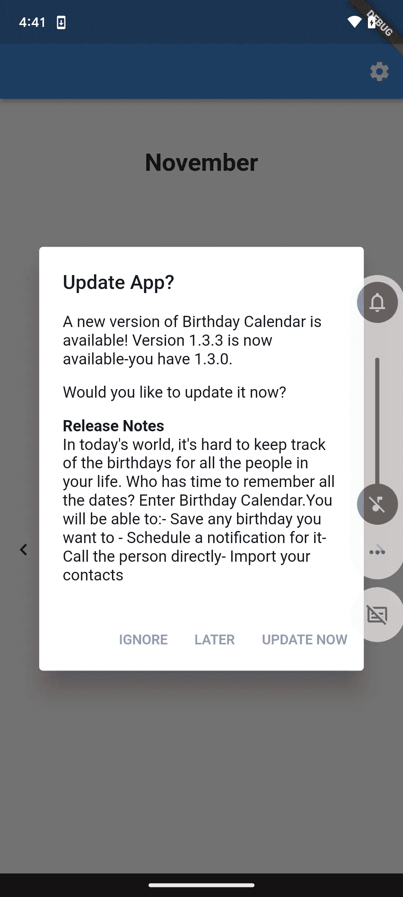
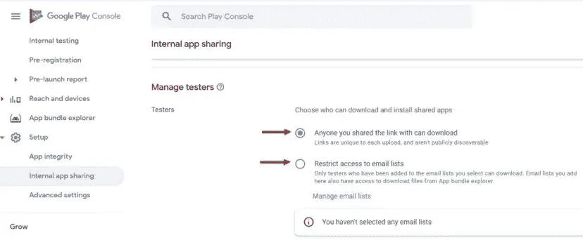
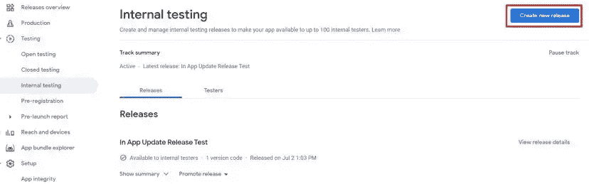
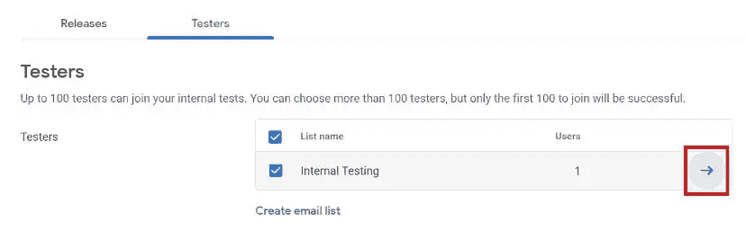
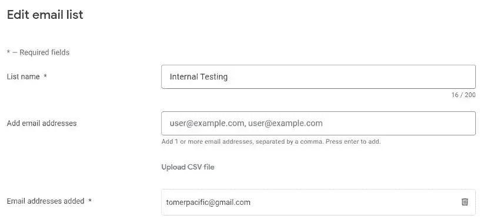
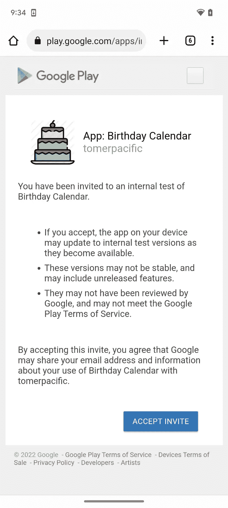

# 在应用程序更新中——如何在 Flutter 中通知用户应用程序更新

> 原文：<https://www.freecodecamp.org/news/in-app-update-the-flutter-way/>

当您推出应用程序的新版本时，您希望您的用户了解它。你是否修复了一个关键的 bug，添加了一个新的特性，或者应用程序只是运行得更流畅或更快——他们需要知道。

作为应用程序开发人员，我们希望所有用户都使用最新版本的应用程序。

但是我们如何确保用户知道我们应用程序的新版本呢？

这个问题的答案很简单:为什么不在应用程序的新版本发布时通知他们呢？

您可以通过多种方式做到这一点:

*   使用推送通知
*   当应用程序启动时让他们知道

在本文中，我们不会讨论推送通知。相反，我们将重点展示如何(使用一两个包)向用户显示一个对话框，通知他们应用程序的新版本已经发布，以及如何处理更新。

## 等等，这个不是已经包含了吗？

你可能认为这种功能应该已经包含在现代移动操作系统中了。你可能是对的——但仅限于安卓系统。

iOS(目前)不允许开发者查看应用程序是否有新版本并通知用户。在 Android 中，你有[应用内更新库](https://developer.android.com/guide/playcore/in-app-updates/kotlin-java)，它是 Google Play 库的一部分。

因为这个原因，也因为 Flutter 支持这两个平台，我将介绍两个重要的软件包，它们可以帮助您处理应用程序的版本更新:

1.  [升级者](https://pub.dev/packages/upgrader)
2.  [在应用更新中](https://pub.dev/packages/in_app_update)

两者都可以让你得到想要的结果，但是他们在如何做上有很大的不同。

在我们开始之前， ****了解您必须有一个直接从 Google Play 商店**** 安装的应用程序版本是至关重要的。这是必需的，因为这两个包都依赖于 Google Play 服务及其验证应用程序所有者的能力。

如果不这样做，在尝试使用其中一个软件包时，您将会看到以下错误:

> **安装错误(-10):该应用不属于此设备上的任何用户。如果一个应用程序是从 Play 获得的，它就是“拥有的”。(https://developer . Android . com/reference/com/Google/Android/play/core/install/model/install ERROR code # ERROR _ APP _ NOT _ OWNED)**

## 如何使用应用程序中的更新包

马上你应该知道这个包只能在 Android 上运行。这是因为它的内部工作依赖于应用程序更新库。

这个包基本上是 Android 库的包装器。以下是其公开的 API 方法:

*   `Future<AppUpdateInfo> checkForUpdate()`:检查是否有可用的更新
*   `Future<AppUpdateResult> performImmediateUpdate()`:执行即时更新(全屏)
*   `Future<AppUpdateResult> startFlexibleUpdate()`:开始灵活更新(后台下载)
*   `Future<void> completeFlexibleUpdate()`:实际安装可用的灵活更新

✋如果你想了解更多关于即时更新和灵活更新的区别，点击这里。

### 如何设置软件包

首先，将包添加到您的 pubspec.yaml 文件中:

```
dependencies:
  flutter:
    sdk: flutter
  in_app_update: ^3.0.0
```

然后执行 pub get。

在您的应用程序中，在您打算执行逻辑以处理应用程序更新的地方，添加以下导入:

```
import 'package:in_app_update/in_app_update.dart';
```

我们首先需要添加逻辑来检查我们的应用程序是否有更新。为此，我们将使用 ****checkForUpdate**** 方法。它的返回值是一个未来的< AppUpdateInfo >，其中包含关于应用程序更新的可用性和进度的信息。

我们可以通过使用 [updateAvailability](https://developer.android.com/reference/com/google/android/play/core/install/model/UpdateAvailability) 属性来检查更新是否可用。如果更新可用，它将具有值 ****UPDATE_AVAILABLE**** 。因此，您的方法可能如下所示:

```
InAppUpdate.checkForUpdate().then((updateInfo) {
  if (updateInfo.updateAvailability == UpdateAvailability.updateAvailable) {
      //Logic to perform an update 
  }
});
```

接下来，我们需要决定我们想要触发哪种更新——灵活更新还是立即更新。

立即更新应该留给对用户来说至关重要的应用程序更新。这可能意味着一个版本修复了一个关键的错误或提供了一个新的功能。

要开始即时更新，我们可以使用****performImmediateUpdate*****方法。该方法返回一个 [AppUpdateResult](https://developer.android.com/reference/com/google/android/play/core/ktx/AppUpdateResult) 枚举，让您知道更新是否成功。*

*在调用这个方法之前，我们需要检查是否允许我们运行即时更新。我们通过访问 AppUpdateInfo 对象上的****immediateUpdateAllowed****标志来实现这一点。*

*如果我们想要触发灵活的更新，我们使用****startFleixbleUpdate****方法。这在后台运行，类似于即时更新方法。它还返回 AppUpdateResult 枚举。*

*如果在这个场景中更新成功，我们需要调用****completeFlexibleUpdate*****方法来将更新安装到我们的应用程序中。**

**因此，如果我们查看上面的代码片段，并为不同类型的更新添加逻辑，它将如下所示:**

```
**`InAppUpdate.checkForUpdate().then((updateInfo) {
  if (updateInfo.updateAvailability == UpdateAvailability.updateAvailable) {
      if (updateInfo.immediateUpdateAllowed) {
          // Perform immediate update
          InAppUpdate.performImmediateUpdate().then((appUpdateResult) {
              if (appUpdateResult == AppUpdateResult.success) {
                //App Update successful
              }
          });
      } else if (updateInfo.flexibleUpdateAllowed) {
        //Perform flexible update
        InAppUpdate.startFlexibleUpdate().then((appUpdateResult) {
              if (appUpdateResult == AppUpdateResult.success) {
                //App Update successful
                InAppUpdate.completeFlexibleUpdate();
              }
          });
      }
  }
});`**
```

## **如何使用升级程序包**

**与第一个选项相反，这个选项为 iOS 和 Android 都提供了一个解决方案。它依赖于从存储中收集数据，并对照应用程序本身的当前数据进行检查。**

**这个包没有使用 API 来查询数据，而是使用小部件来执行底层逻辑。**

### **如何设置软件包**

**首先，将包添加到您的 pubspec.yaml 文件中:**

```
**`dependencies:
  flutter:
    sdk: flutter
  upgrader: ^5.0.0`**
```

**然后执行 pub get。**

**在您的应用程序中，在您打算执行逻辑以处理应用程序更新的地方，添加以下导入:**

```
**`import 'package:upgrader/upgrader.dart';`**
```

**这两个选项之间的主要区别只是一个 UI，所以选择一个最适合你的。**

**要集成这个包，您需要用 ****UpgradeAlert**** 或 ****UpgradeCard**** 来包装您的 body 小部件。下面是一个例子:**

```
**`class MyApp extends StatelessWidget {

  @override
  Widget build(BuildContext context) {
      return MaterialApp(
        title: applicationName,
        home: UpgradeAlert(                  /// <------------------
          child: MainPage(
              key: Key("YOUR_KEY"),
              title: applicationName
          ),
        )
      );
    }
}`**
```

**如果商店中有新版本的应用程序，您将会看到:**

****

**要进行测试，请确保添加以下内容:**

```
**`await Upgrader.clearSavedSettings()`**
```

**在 main.dart 文件的 main 方法中。**

**如您所知，您可以为升级程序包设置大量配置。我强烈建议你去看看这些。**

## **如何测试包**

**无论您选择使用哪个包，您都需要知道您的逻辑功能是否正常。**

**但是，如果不发布应用程序的正式版本，又如何做到这一点呢？您可以使用 Google Play 控制台中的内部测试选项。通过向内部测试人员发布您的应用程序的新版本，它将不是一个公共版本，而是允许您测试升级功能。**

**你需要做的是:**

1.  **登录您的 Google Play 控制台帐户，进入您正在使用的应用程序，查看更新逻辑**
2.  **在设置→内部应用共享下，转到管理测试人员，并确保允许测试人员下载和安装共享应用。您可以选择通过链接或电子邮件来完成。**

****

**3.然后，转到 Testing → Internal Testing，点击 Create new release 按钮(右上角)。**

****

**4.一旦您执行了一个发布，您就可以返回到主要的内部测试页面，并点击 Testers 选项卡。您将看到一个包含测试人员电子邮件的列表(目前为空)。单击蓝色箭头图标。**

****

**5.在此屏幕中，您可以将自己添加为内部测试员(在添加电子邮件地址中)。**

****

**6.完成后，您可以返回内部测试窗口。向下滚动到底部，你会看到 ****测试人员如何加入你的测试**** ，你会看到一个复制链接按钮。**

**现在，您可以单击该按钮并向自己发送链接，这样您就可以下载应用程序的新版本。**

**如果您未能执行上述任何一个步骤，生成的链接将导致“not found ”(错误 404)页面:**

****

**如果您成功地完成了所有操作，当您单击生成的链接时，将会看到以下内容:**

****

**如果您看到此错误:**

> ****安装错误(-6):由于当前设备状态(如电池电量低、磁盘空间不足等)，不允许下载/安装。(https://developer . Android . com/reference/com/Google/Android/play/core/INSTALL/model/INSTALL ERROR code # ERROR _ INSTALL _ NOT _ ALLOWED)****

*这可能意味着您正在仿真设备上运行您的应用程序，您需要在该设备上安装谷歌 Play 商店并登录。*

## *包扎*

*我写这篇文章是因为我在将应用程序更新包与我自己的应用程序集成时必须经历相同的过程。*

*欢迎您到谷歌 Play 商店参观:*

**

*点击此处查看完整源代码:*

*[GitHub - TomerPacific/BirthdayCalendar: An application written in Flutter that helps you remember birthdays 🎂An application written in Flutter that helps you remember birthdays 🎂 - GitHub - TomerPacific/BirthdayCalendar: An application written in Flutter that helps you remember birthdays 🎂TomerPacificGitHub](https://github.com/TomerPacific/BirthdayCalendar)*

*感谢您的阅读！*