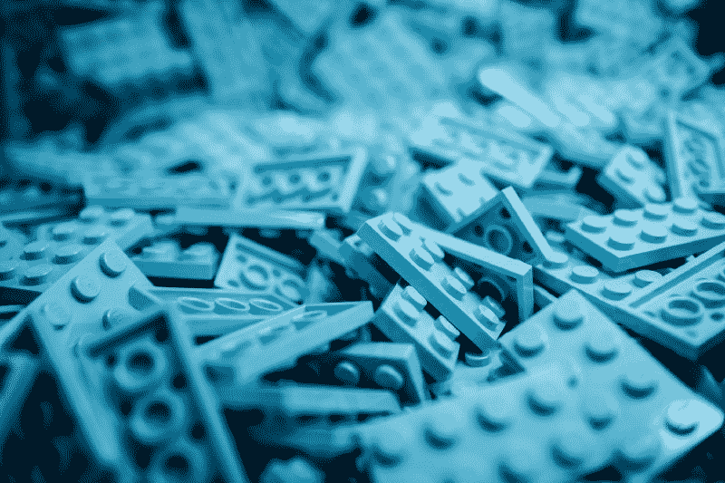

# 为效用第一的 CSS 辩护

> 原文：<https://www.freecodecamp.org/news/in-defense-of-utility-first-css-4f406acee6fb/>

莎拉·达扬



Photo by [Iker Urteaga](https://unsplash.com/photos/TL5Vy1IM-uA?utm_source=unsplash&utm_medium=referral&utm_content=creditCopyText) on [Unsplash](https://unsplash.com/search/photos/lego%20bricks?utm_source=unsplash&utm_medium=referral&utm_content=creditCopyText)

# 为效用第一的 CSS 辩护

***【重作文轻遗产】*** 。

这段来自 [*设计模式*](https://en.wikipedia.org/wiki/Design_Patterns) 的智慧，是最有影响力的软件工程书籍之一，是 **utility-first CSS** 的基础。它也和**函数式编程**分享了许多原则:不变性、可组合性、可预测性和避免副作用。所有这些花哨术语背后的目标是编写更易于维护和扩展的代码。

尽管它越来越受欢迎，实用优先的 CSS 仍然没有说服每个人。当一些人称赞这种做法时，另一些人则被 T2 生动地批评。**我曾经属于后一组**。我是 BEM 的粉丝，被我采用的一种方法的优点所吸引，并最终像我们支持一支运动队一样支持它。我拒绝实用优先，因为这意味着我所钟爱和熟悉的方法不再是好的了。

从那以后，我对这个话题更加深入了。我学习了设计模式和函数式编程。这让我**彻底修正了我的判断**。

CSS 技巧和[亚当·瓦森](https://adamwathan.me/css-utility-classes-and-separation-of-concerns)在带领我们从“常规”CSS 到实用优先的旅程中做了出色的工作，并解释了其背后的“为什么”。我不会转述，而是将重点放在**对效用至上**反复出现的批评上，并揭穿常见的误解。

### “最好使用内嵌样式”

人们经常将效用优先的 CSS 比作通过`style`属性将 CSS 规则应用于 HTML 节点。这种样式化的方式被一致认为是一种不好的实践，从那以后，我们就转向了单独的样式表和类抽象。

**效用至上的 CSS 也不例外**。所有样式都是单独定义和维护的。这允许代码重用、使用伪类、伪元素、预处理器和浏览器缓存。

然而，原子 CSS 的批评者匆忙将其与内联样式联系起来。原子类很小，它们通常只有一个规则，并且它们是以一种*功能*的方式命名的，而不是以*语义*命名的。

话虽如此，只是因为它*看起来*一样，并不意味着它*就是*一样。理解这两种实践的不同是理解实用优先的好处的关键。

**内联样式允许你做任何你想做的事情**。你不必遵循任何预先存在的定义。每次设计一个新的 HTML 节点时，您都要从头开始重写所有的内容。相似的元素以重复的代码结束，这使得页面变得不必要的沉重。如果不小心，很容易忽略已有的解决方案，每次都要重新发明轮子。

```
<h2 style="font-size: 16px; font-weight: bold; color: purple">Stranger Things<;/h2&gt;<p style="font-size: 13px; font-style: italic">Stranger Things is an American science fiction-horror web television...</p><h2 style="font-size: 16px; font-weight: bold; color: purple">;Game of Thrones</h2><p style="font-size: 13px; font-style: italic">Game of Thrones is an American fantasy drama television...</p>
```

不必要的冗长、沉重的文件、单一设计概念的多个事实来源。

```
<button style="padding: 5px 8px; font-size: 13px">Button</button><button style="padding: 0 8px; font-size: 13px; line-height: 23px">Button</button><button style="display: flex; padding: 0 8px; font-size: 13px; height: 23px; align-items: center">Button</button>
```

解决同一问题的三次尝试。这很容易因缺乏单一的真实来源而引发，并可能导致视觉上的不一致。

实用程序类公开了一个定义良好的 API，你可以用它来组成更复杂的组件。你没有重写风格；相反，你依赖于定义样式和行为的类。

```
// HTML
```

```
<h2 class="font-16 font-bold font-purple">Stranger Things</h2><p class="font-13 font-italic">Stranger Things is an American science fiction-horror web television...</p><h2 class="font-16 font-bold font-purple">Game of Thrones</h2><p class="font-13 font-italic">Game of Thrones is an American fantasy drama television...</p>
```

```
// CSS
```

```
/* Font sizes */
```

```
.font-13 { font-size: 13px } .font-16 { font-size: 16px }...
```

```
/* Font styles */
```

```
.font-bold { font-weight: bold }.font-italic { font-style: italic }...
```

```
/* Font colors */
```

```
.font-purple { color: purple }...
```

使用一组已定义的现有 CSS 规则，无论多么原子化，都会迫使你从有限的列表中选择样式。你不能像使用内嵌样式那样完全自由。你维护了一个*允许的*风格的一致目录，并使用它们*组成*更大的组件。

这种方法通过限制设计元素样式的方式来加强一致性。您只能访问主题中定义的颜色数量，而不能访问 1600 多万种颜色。

**它还提供了单一的真理来源。**不用为每个使用它的元素重新声明同一个`color`，而是在一个类中定义一次，然后在任何需要的地方使用这个类。此外，使用单独的样式(有或没有原子类)可以让您访问伪类和伪元素、预处理器、缓存…这是内联样式所没有的全部好处。

你可能会争辩说，原子样式是否受限并不重要:不小心混合它们可能会导致不一致的布局，就像内联样式一样。但那是人类的问题，而不是技术问题。无论你是否能够确定范围，任何方法和语言都会遇到同样的问题。如果你不遵循你的团队制定的规则、风格指南和最佳实践，你就是罪魁祸首。不是程序，不是语言，也不是架构。

### “它违反了关注点分离”

反对函数式 CSS 的最大理由之一是它违背了关注点的分离。CSS 应该严格负责样式，HTML 应该从语义上构建页面。通过在 HTML 中使用原子类和组合组件，你在某种程度上把样式委托给了 HTML，而不是在 CSS 中。

对于“关注点分离”的含义，这是一种极端的、最终扭曲的观点。

几年前，我参加一个前端开发人员的工作面试，他告诉我他对 Bootstrap 完全不屑一顾。按照他的说法，使用额外的标记来创建网格是一种异端邪说:那是 CSS 的工作，而且只属于 CSS。HTML 应该 100%不关心它是如何呈现的。

这种想法的问题在于它非常不切实际。它将设计原则提升到了教条的高度，忽略了具体的用例及上下文。这促使你更加关注检查所有的“良好实践”复选框，而不是解决实际问题。

Adam Wathan [解释得很好(见:《关注点分离》是个稻草人)](https://adamwathan.me/css-utility-classes-and-separation-of-concerns):说到 HTML 和 CSS，不能从严格的“关注点分离”角度来看。**这是一种“相依相偎”的关系**。

**不要搞错:**仅仅因为样式合成是在 HTML *文档*中执行的，并不意味着它是在 HTML 中完成的*。我们没有在 HTML 节点上使用*样式*或*对齐*属性。我们正在组装我们在适当的样式表中定义的片段，CSS 中的*。我们的 HTML 变成了 CSS“API”的消费者正如 Vue.js 在他们的[文档](https://vuejs.org/v2/guide/single-file-components.html#What-About-Separation-of-Concerns)中解释的那样，关注点的分离不等于文件类型的分离。你的样式可以在 HTML 节点上组成，**这仍然是一个 CSS 任务**。**

### *“它膨胀了 HTML”*

*当人们提到代码膨胀时，他们通常指两件事情中的一件(或两件):难以阅读的[](https://frontstuff.io/in-defense-of-utility-first-css#its-ugly-and-hard-to-read)**代码，以及更重的**代码库**。***

***你的布局的复杂性必须存在于某个地方。组件优先的方法并没有消除“膨胀”，它只是将“膨胀”转移到样式表中。即便如此，因为您的大型组件重用了与其他组件相同的原子风格，**您不可避免地会以重复代码**告终。***

```
***`$green: #74b759;`***
```

```
***`.component {  &-title {    color: $green;    font-weight: bold;  }}`***
```

```
***`.widget {  &-title {    color: $green;    font-style: italic;  }}`***
```

```
***`.footer {  &-links {   color: $green;   text-decoration: underline;  }}`***
```

***即使使用 Sass，您也会在源代码中得到重复的规则。有所帮助，但是在编译后的 CSS 中仍然会出现重复。***

***现在我知道你在想什么了。我们得到了`@extend`。这是 it 的理想用例，对吗？***

***没那么快。***

***`@extend`可能会避免编译后的 CSS 中规则集的重复，但是它将生成的大量逗号分隔的选择器最终可能会比复制规则时的**重得多。避免膨胀到此为止。*****

***您还将连接不相关的类**，并将它们全部移动到顶层**，第一个`@extend`发生在这里。这可能很快导致特殊性问题和奇怪的覆盖。更不用说您不能从媒体查询中`@extend`一个外部类或占位符。所以，是的，绝对不是银弹。***

***从文件大小的角度来看，**你不应该担心 HTML** 中重复的类名。Gzip 就是干这个的。 *deflate* 算法是[专门为处理重复字符串而设计的](http://www.gzip.org/algorithm.txt)，所以没有必要在 HTML 中删除字符。无论您使用几个还是许多类，最终的文件大小将使**几乎没有差别**。***

***另一方面，一个*选择器*在样式表中重复得越多，**浏览器解析所有样式的工作就越多**。如果给定的样式只有一个`.title-green`类，那么它只需匹配页面中的所有`.title-green`。但是如果你有许多类做同样的事情(使用`@mixin`)或者相似的选择器做不同的事情(使用`@extend`)，浏览器匹配的代价就越大。***

***HTML“膨胀”没关系，**但是 CSS 有关系**。网络和引擎并不关心你的 HTML 中有多少个类，而是你写 CSS 的方式。如果你的决策过程围绕着表现，确保你把注意力集中在正确的事情上。***

### ***“BEM 就够了”***

***OOCSS 和所有派生的方法(SMACSS、BEM 等。)极大地改进了我们处理 CSS 的方式。实用优先的 CSS 继承了这种方法:它也定义了可重用的*对象*。***

***BEM 的问题在于它首先关注构建组件。你不是在寻找最小的、不可分割的模式，而是在构建*块*和它们的子*元素*。BEM 在命名空间和防止风格泄露方面做得很好，但是它的组件优先的本质不可避免地导致了[过早的抽象](http://wiki.c2.com/?PrematureAbstraction)。您为某个特定的用例制作了一个组件，但最终却没有重用它(例如，一个 navbar 组件)。***

***BEM 鼓励你使用*修饰符*来处理组件变化。这乍一看似乎很聪明，但不幸的是会导致其他问题。您最终会创建大量的修饰符，而这些修饰符对于一个特定的用例只使用一次。更糟的是:从一个组件到另一个组件，你可能会以相似的修饰语结束，进一步违反了[干](https://en.wikipedia.org/wiki/Don%27t_repeat_yourself)原则。***

```
***`.card {  background: white;  border: 1px solid grey;  text-align: justify;}`***
```

```
***`.card--left {  text-align: left;}`***
```

```
***`.card--right {  text-align: right;}`***
```

```
***`.tooltip {  background: black;  color: white;  text-align: center;}`***
```

```
***`/* Oops, looks like duplicate rules down there! */`***
```

```
***`.tooltip--left {  text-align: left;}`***
```

```
***`.tooltip--right {  text-align: right;}`***
```

***在大规模情况下，如果不破坏整个项目中的实例，组件可能会变得难以更改。过早的抽象会阻止组件在需要的时候演化和分裂成独立的实体。修改器成倍增加试图修复它，导致 unicorn 用例不可重用的变化，并且当我们意识到我们的组件做得太多时撤销创可贴。***

***BEM 是修复 CSS 固有问题的一个很好的尝试，但是如果把它作为项目的核心 CSS 方法，就会带来你在偏好继承而不是组合时遇到的所有问题。***

### ***“这是在 CSS 基础上学习的另一种语言”***

***这句话适用于任何特定项目的任何命名系统，无论您选择什么方法。你的 CSS 类名生态系统是纯 CSS 之上的一个抽象层。无论你是使用语义名称如`.card`还是功能名称如`.bg`，新的贡献者将需要熟悉什么做什么以及何时使用它。***

***除非你愿意用 CSS 描述精确的标记或者编写内联样式，否则你无法避免在 HTML 和 CSS 之间使用命名接口。最终，函数类名[更容易理解](https://frontstuff.io/in-defense-of-utility-first-css#its-ugly-and-hard-to-read)，因为它们描述了风格。你不用查找实际的样式就知道它们在做什么，而语义名称迫使你要么查看渲染，要么浏览代码。***

### ***“不可维护”***

***当人们说实用第一的 CSS 不可维护时，他们经常提到当设计中的某些东西改变时，你必须到处改变它。你有规则角的按钮，你决定把它们做成圆形，所以你需要在代码中的每个按钮上添加`.rounded-corners`实用程序类。然而，utility- *first* 的全部意义在于，当你开始识别重复模式时，你开始用 utility 类组合，然后创建组件。***

***按钮是被抽象成自己的组件的理想和最明显的候选者。在这种情况下，您甚至不需要经历“先实用，后组件”的阶段。当涉及到更大的组件时，优先选择组合*优先选择*是可维护性的最佳选择。为什么？**因为在特定的 HTML 节点上添加或移除类比在应用于许多元素的类中添加或移除样式更安全。*****

***太多次了，我不得不改变设计，不得不复制现有的组件，使它们有不同的行为，因为我没有其他选择。即使一个设计师在项目开始时提供所有的设计，即使你在编码前在识别组件方面做得很好，**你也不能预测未来**。***

***假设最初的设计是白色卡片，有一个嵌入的方框阴影，在角落里有一个小丝带。***

```
***`// CSS`***
```

```
***`.card {  position: relative;  background: white;  padding: 22px;  border: 1px solid lightgrey;  text-align: justify;  border-radius: 5px;  box-shadow: 0 0 5px 0 rgba(0, 0, 0, .2);  overflow: hidden;}`***
```

```
***`.card::after {  position: absolute;  top: -11px;  right: 9px;  display: block;  width: 10px;  height: 50px;  background: red;  transform: rotateZ(-45deg);  content: '';}`***
```

```
***`// HTML`***
```

```
***`<div class="card">...</div>`***
```

***这个解决方案是简单的、语义的和可重用的。你用 CSS 处理所有的事情，只需要编写最少的 HTML。但是突然你得到了新页面的新设计，他们使用没有丝带的卡片。现在，你必须找到一种方法来删除这些新卡的丝带。***

```
***`.card-no-ribbon::after {  display: none;}`***
```

***问题是，这个类*撤销了*之前设计的东西。不得不*添加*一个类来*移除*一个特性是反模式的:**它违背直觉并且难以维护**。当你决定改变基类的行为时，你需要留意撤销修饰符以确保它仍然有效。***

***我们现在需要添加另一个丝带到左下角。***

```
***`.card::before,.card::after {  /* shared code */}`***
```

```
***`.card::before {  top: -11px;  right: 9px;}`***
```

```
***`.card::after {  bottom: -11px;  left: 9px;}`***
```

***但是现在我们需要更新`.card-no-ribbon`！***

```
***`.card-no-ribbon::before,.card-no-ribbon::after {  display: none;}`***
```

***这里，**就是脆弱的基类反模式**。因为你的基类抽象得太快，做得太多，现在需要发展，你不能编辑它而不担心可能的副作用。如果有新人开始为项目做贡献，这些风险会增加十倍。***

***你离开这个阶段的唯一选择是做一个重构:有一个裸体`.card` 作为基类，并添加带有`.card--top-ribbon`和`.card--bottom-ribbon`修改器的丝带。但是现在你必须编辑你的代码中所有现存的`.card`，这些*需要*有一个丝带。***

***早期重构是不可维护性的一个很好的指标。***

***你可能会说，一个聪明的开发者*会*预见到它的到来。他们*应该*从一开始就创建了一个裸`.card`基类和一个`.card--ribbon`修饰符。***

*****这实际上是在为*支持*实用优先和组合**做准备。***

***您决定分解您认为过于单一的给定设计元素，这样更容易扩展。这是个好主意。走得越多，你越会意识到这导致了效用至上。***

***你可能认为不会，你的工作是*预见*给定组件的最低限度是多少。但除非你拥有一个水晶碗，否则这是一个有风险的评估。这也是短视的。如果您的组件的某些部分需要扩展到其他组件，该怎么办？例如，如果你现在需要带缎带的纽扣呢？如果你复制了`.card--ribbon`类，你的代码就不再枯燥，这使得它更加不可维护。那又怎样？制作一个混音并导入到两个修改器中？同样，这是额外的工作和“湿”的代码。***

***这个用例的最佳解决方案是为 ribbon 编写一个单独的实用程序类，并在必要时为大小和颜色编写修饰符。这允许你拥有**一个单一的真相来源**并且在你想去的任何地方使用丝带。如果你需要在头像、面板、无序列表、模态上使用丝带，你可以不用写一行额外的 CSS 代码。***

*****这就是可扩展性和可维护性的定义**。你所要做的就是积极地重用你写的可用代码*，而不是被动地修改现有代码*。*****

```
*****`.ribbon {  position: relative;  overflow: hidden;}`*****
```

```
*****`.ribbon::after {  position: absolute;  display: block;  top: -11px;  right: 9px;  width: 10px;  height: 50px;  background: red;  transform: rotateZ(-45deg);  content: '';}`*****
```

*****通过将设计分解成小的元素，我们写出了更多可重用的代码。*****

*****称实用至上的 CSS 为“不可维护”是绝对不准确的。事实上，它可能是迄今为止最容易维护和扩展的 CSS 方法。*****

*****你无法预测未来。这就是为什么你应该总是偏爱组合而不是继承。**健康和可伸缩的代码库的一个好标志是当你需要改变它时事情会怎样发展。*******

*****如果一个新的变化让你焦虑，因为你可能会打破一些东西，这是一个糟糕的设计的标志。但是我想更进一步说，如果你需要编写新的 CSS 来让一个现有的组件做另一个组件已经在做的事情，你的代码并不像你想象的那样可伸缩。*****

*****如果你需要重用某个地方已经存在的行为，**你不应该必须写新的代码**。你应该能够信任和使用你已经写好的东西，并从那里开始。你有一个可以依赖的真理来源，而不是两个或更多的细微变化，你不能忘记保持更新。**这就是可维护性的定义。*******

### *****“又丑又难读”*****

*****你还记得 BEM 开始流行时的喧嚣吗？我知道。我记得很多人因为它的语法而拒绝了它。称赞该模型，但对链接两个下划线或两个连字符的想法感到厌恶。*****

*****作为人类，我们很容易对自己不熟悉的东西感到厌烦。然而，让主观的修饰性考虑妨碍潜在有用的技术是开发人员应该划清的界限。我们的工作是解决问题。我们主要关心的应该是终端用户**。*******

*******看看很多大项目的源代码:大部分最后都采用了 BEM。他们的前端开发人员并不都是一开始就被卖掉的。*******

*******当你把一个项目的成功放在第一位时，克服最初的感觉并不难，尤其是在个人偏好的驱使下。*******

*******现在关于易读性的话题，我知道当你第一次打开一个文件时，一长串的类可能会“令人害怕”。不过，这并不是一项不可完成的任务。更冗长的代码是组合的一种折衷，但这比不可伸缩性带来的不便要少得多。*******

*******我在自己的代码中没有使用像`.pt-8`或`.bb-lemon`这样的缩写。我更喜欢像`.padding-top-8`和`.border-bottom-lemon`这样的全称类名，它们更容易阅读。Autocomplete 解决了必须键入长类名的问题，并且有一些工具可以用来将类名重新散列成更小的类名以用于生产。我怀疑这是否会对你的表现有任何重大的改变，但是嘿，如果这让你感觉很好，那就把你自己干掉吧？*******

*******最终，函数类名的本质实际上可能是**更富于表现力**。你的大脑很容易将这样的课程和屏幕上发生的事情联系起来。即使你看不到它是如何渲染的，你也能很好地理解`.hidden`或`.opacity-6`应该做什么。*******

```
*******`<blockquote class="border-thick-left-red padding-left-medium font-navy">  <p>You know how they call a Quarter Pounder with Cheese in Paris?</p></blockquote>`*******
```

*******从文体上来说，很容易知道这里发生了什么。*******

*******语义类名不传达同样的东西。它适用于像按钮或警告这样的小组件，这些小组件很常见，很容易识别。然而，组件越大越复杂，就越不容易知道什么类名映射到屏幕上的什么元素，或者它看起来像什么。*******

```
*******`<div class="entry">  <h2 class="entry-title">The Shining</h2>  <div class="widget widget-lead">    <div class="widget-content">      <p>His breath stopped in a gasp. An almost drowsy terror stole through his veins...</p>    </div>    <div class="author">            <h3 class="author-name">Stephen King</h3>      <p>Stephen Edwin King (born September 21, 1947) is an American author of horror, supernatural fiction, suspense, science fiction, and fantasy...</p>      <div class="btn-group">        <a class="btn" href="#">;Website</a>        <a class="btn" href="#">Twitter</a>      </div>    </div>  </div></div>`*******
```

*******不通过样式表很难知道什么类做什么。*******

*******这样，功能类比语义类名更容易理解。他们要求更少的追赶时间和更少的文件交换。最终，他们会给你你正在寻找的信息。*******

### *******“这不是你如何写 CSS”*******

*******CSS 特异性是一个*特性*，而不是一个 bug。正确使用，它会给你惊人的控制力。*******

******当又一篇关于特殊性危险的文章出现时，CSS 老手们会这么说。从技术上来说**他们是对的**:CSS 优先系统不是偶然的。通常会因为范围不够而困扰没有掌握 CSS 的人。但是一种语言不会因为它不像你习惯的那样表现而崩溃。嵌套的 CSS 规则就像`!important`:它们很方便，但是多年来一直没有得到很好的使用，以至于我们现在把它看作是*避免*的东西。******

******特异性应该主动使用，而不是被动使用。它们应该是设计决策，而不是当你的风格不适用时的权宜之计。Harry Roberts 在 [CSS 指南](https://cssguidelin.es/#specificity)中对此做了很好的解释:******

> ******“特异性的问题不一定在于它的高或低；事实是，它是如此多变，不能被排除在外:处理它的唯一办法是逐步变得更加具体”。******

******特定性是一个强大的工具，但是它需要以最大的谨慎和对项目良好的长期愿景来使用。用错了，你会感到不得不回去的痛苦。保持较低的特异性可以完全避免问题:它只依赖于源代码顺序，这比管理容易得多。使用原子 CSS，如果一个样式不适用，修复它就像在 HTML 节点上添加或删除一个类一样简单。您不必质疑样式表的结构，这样管理起来更容易也更安全。******

```
****`// CSS`****
```

```
****`.color-navy {  color: navy;}`****
```

```
****`.color-red {  color: red;}`****
```

```
****`// HTML`****
```

```
****`<div class="color-red color-navy">  <p>- Whose motorcycle is this?</p>  <p>- It's a chopper baby.</p>  <p>- Whose chopper is this?</p>  <p>- It's Zed's.</p>  <p>- Who's Zed?</p>  <p>- Zed's dead baby, Zed's dead.</p></div>`****
```

*******想文海军？不需要接触 CSS。简单地从包含的`<d` iv >中移除`.color-red`类。如果你需要一个孩子是红色的，那么移动`e the .col`或者-红色*就可以了。******

> ******如果某项功能有时很危险，并且有更好的选项，那么请始终使用更好的选项—道格拉斯·克洛克福特******

******使用或不使用特异性并不是为了显示你对 CSS 的掌握程度，以及你如何*不像其他人那样*能够控制住它。这是关于**理解你所掌握的特性的优点和缺点**，并做出对项目最有利的选择。******

### ******“你最终会得到大量未使用的 CSS”******

******假设您正在使用 Sass 映射来[生成您的实用程序类](http://frontstuff.io/generate-all-your-utility-classes-with-sass-maps)。颜色，字体大小，背景，一切都被自动编译成适当的，随时可用的 CSS。问题是，如果你不*使用*所有东西，你会在生产中留下无用的额外字节。这很容易用 [UnCSS](https://github.com/giakki/uncss) 解决。******

******UnCSS 在清除样式表方面很棒，但是它有两个警告:它只对 HTML 文件有效(因此，没有 PHP 和模板文件)，并且它只考虑页面加载时执行的 JavaScript(例如，不考虑用户交互时添加的类)。如果使用 PHP 之类的语言来呈现页面，可以在部署工作流中添加一个作业，将页面编译成临时 HTML 并在其上运行 UnCSS。对于第二个问题，您可以使用`ignore`选项列出添加到用户交互中的类。******

******现在思考这个问题也很重要。未使用的类的代价是更重的样式表(下载时间更长)和更长的解析时间。如果你有很多，我指的是你所有风格中的很大一部分，没有使用的类，**这会影响性能**。如果你只是在这里和那里有几个，**影响将是微不足道的**。******

******维护 CSS 代码库是开发人员的工作。无论您选择什么方法，您都必须关注项目，并确保在事情发生变化时删除死代码。******

******不注意这一点会导致大量未使用的类，而不是因为你在生成它们。******

******需要一个只针对主色的文本颜色类？只给这一个上课。需要主题中大多数颜色的背景，但不确定你会马上使用它们？生成该死的类。它们会在你需要的时候准备好，当你添加新的颜色时，你不必维护它们，额外的代码也不会花费什么。**这不是你的应用程序的瓶颈所在**。如果你有性能问题，在研究你的 CSS 之前，还有很多其他的事情要考虑。******

### ******“很难知道有什么可用的”******

******当你的 CSS 代码库是一个小型实用程序类的大集合时，阅读源代码不会帮助你很好地了解可用的样式。但是**到底是不是源代码的作用**？******

******当然不是。这就是**风格指南**的用途。******

******探索源代码远远不足以很好地理解一个完整的 API 是如何设计的。这不仅限于原子 CSS: OOCSS 或 BEM 项目，即使是小项目，也可以达到至少需要一个`README`的复杂程度。******

******您能想象每次不记得这是`.col-md-offset-6`还是`.col-offset-md-6`时，都不得不回到主引导样式表的未提交版本中吗？如果没有一点关于网格如何工作的文献，Bootstrap 新手会理解这样一个类意味着什么吗？文档、风格指南和 API 参考旨在帮助我们理解复杂的系统。当然，这并不意味着文档应该证明糟糕的设计和不清楚的命名约定是正确的，但是认为只通过阅读源代码就可以理解整个项目纯粹是幻想。******

******有很多工具可以帮助您直接从代码中生成文档。我在我的大多数项目中使用 [KSS](http://warpspire.com/kss/syntax) ，但是 CSS-Tricks 共享一个[备选列表](https://css-tricks.com/options-programmatically-documenting-css)。试试看！******

### ******“实用程序类应该与组件一起使用”******

******是的。绝对的。这就是为什么它被称为效用- *第一*而不是效用- *唯一*的原因。******

******实用第一并不意味着完全抛弃组件。这意味着您应该从实用程序类开始，充分利用它们，并且只有在看到重复模式时才进行抽象。当模式开始出现时，您允许您的项目在保持灵活性的同时增长，并随着时间的推移识别实际的组件。******

******理解一个组件不仅仅是你可以重用的看起来相似的“块”是很重要的。这是一种与您的特定项目紧密相关的模式。当然，你可能会使用大量的`.btn`和`.modal`，所以尽早抽象它们是有意义的。但是你确定你会重用`.testimonial`吗？或者至少重用它*足够多*让它值得成为一个新的组件？是在每个语境下都会一直这样，还是具体到首页？保留你的选择。稍后将一个复合样式抽象成一个组件要比试图撤销一个组件容易得多。******

### ******“这让重新设计/主题变成了一场噩梦”******

******因为原子 CSS 与您的设计紧密相关，所以当您必须重新设计或开发替代主题时，这会使事情变得更加困难。不过这也不是不可能的，你可以做一些事情来让你的实用至上的 CSS 更适合这些需求。******

******您可以从保持类名不太具体开始。不用`.margin-bottom-8`，可以用一个更抽象的名字，比如`.margin-bottom-xxs`。这样，您可以在不使名称无效的情况下更改值。******

******另一种方法是创建**别名**。想象你正在构建一个有明暗模式的应用程序:一些颜色会改变，一些不会。我们不想让我们所有的颜色工具都与上下文相关:`.background-primary`和`.background-secondary`不要告诉我们类后面是什么颜色。你不会想要那样的一整套颜色系统。然而，你仍然可以用正确的颜色名称(`.background-lime`或`.background-red`)来创建颜色工具，并为那些需要改变主题的颜色工具生成别名。******

```
****`// CSS`****
```

```
****`/* Backgrounds */`****
```

```
****`.background-lime {  background: #cdf2b0;}`****
```

```
****`.background-off-white, .background-light {  background: #ebefe8;}`****
```

```
****`.background-dark-grey, .background-dark {  background: #494a4f;}`****
```

```
****`/* Colors */`****
```

```
****`.color-lime {  color: #cdf2b0;}`****
```

```
****`.color-off-white, .color-light {  color: #ebefe8;}`****
```

```
****`.color-dark-grey, .color-dark {  color: #494a4f;}`****
```

```
****`// HTML`****
```

```
****`<div class="background-light">  <h2 class="color-lime">Ezekiel 25:17</h2>  <p class="color-dark">The path of the righteous man is beset on all sides by the inequities of the selfish and the tyranny of evil men...</p></div>`****
```

******从这里开始，您所要做的就是编写一个 JavaScript 函数来切换所有的`.*-light`和`.*-dark`类。而对于不需要改变的元素，可以使用原来的颜色类。******

******这种方法效果很好，但是如果你有很多类要切换，它可能会损害性能。DOM 操作是昂贵的。如果可以的话，你想尽可能地减少它们。幸运的是，有一种涉及 CSS 变量的巧妙技术(感谢 Adam Wathan 提出了这种技术)使一切变得更简单。******

```
****`// CSS`****
```

```
****`:root {  --green: #42f49b;  --off-white: #ebefe8;  --dark-grey: #494a4f;}`****
```

```
****`.theme-dark {  --background: var(--dark-grey);  --text: var(--off-white);}`****
```

```
****`.theme-light {  --background: var(--off-white);  --text: var(--dark-grey);}`****
```

```
****`.color-lime {  color: var(--green);}`****
```

```
****`.color-theme {  color: var(--text);}`****
```

```
****`.background-theme {  background: var(--background);}`****
```

```
****`// HTML`****
```

```
****`<div class="theme-light">  <div class="background-theme">  <h2 class="color-lime">Ezekiel 25:17</h2>  <p class="color-theme">The path of the righteous man is beset on all sides by the inequities of the selfish and the tyranny of evil men...</p>  </div></div>`****
```

******我们用 CSS 变量定义颜色，并为每个上下文分配不同的值。根据所包含的类，[所有的颜色都会由于祖先的继承](https://jsfiddle.net/hurmktbz)而改变。如果你允许主题切换，你所要做的就是把父`<d` iv >上的`.theme-light`改成`.theme-dark`，所有的颜色都会适应。******

******这种技术只有在你不必支持 15 版以下的 Internet Explorer 和 Edge 的情况下才有效。否则，采用第一种技术，使用 CSS 祖先继承系统来避免切换太多变量。如果你必须给整个块分配一个文本颜色，**在父块而不是子块**上设置它。******

```
****`/* Nope */<div class="background-light">  <h2 class="color-lime">Ezekiel 25:17</h2>  <p class="color-dark">The path of the righteous man is beset on all sides by the inequities of the selfish and the tyranny of evil men.</p>  <p class="color-dark">Blessed is he, who in the name of charity and good will, shepherds the weak through the valley of darkness, for he is truly his brother's keeper and the finder of lost children.</p>  <p class="color-dark">And I will strike down upon thee with great vengeance and furious anger those who would attempt to poison and destroy my brothers.</p>  <p class="color-dark">And you will know my name is the Lord when I lay my vengeance upon thee.</p></div>`****
```

```
****`/* Yes */<div class="background-light color-dark">  <h2 class="color-lime">Ezekiel 25:17</h2>  <p>The path of the righteous man is beset on all sides by the inequities of the selfish and the tyranny of evil men.</p>  <p>Blessed is he, who in the name of charity and good will, shepherds the weak through the valley of darkness, for he is truly his brother's keeper and the finder of lost children.</p>  <p>And I will strike down upon thee with great vengeance and furious anger those who would attempt to poison and destroy my brothers.</p>  <p>And you will know my name is the Lord when I lay my vengeance upon thee.</p></div>`****
```

### ******在合理的范围内拥抱变化******

******有强烈的观点是很好的。不是所有的事情都必须通过找到一个中间立场来解决。但是在固执己见的**和不愿意改变的**之间有一条清晰的界限。******

******我们，作为开发者，**必须是第一个拥抱变化的人**。回顾我对实用优先 CSS 的第一反应，我意识到保持开放的心态而不是匆忙选择立场是多么重要。**我们认为我们是**并不重要。经验是伟大的，但它也能让我们相信我们已经拥有了做出判断所需的一切，不需要更深入地去理解新概念。******

********软件开发每天都在变化**。我们的行业还很年轻，我们正在摸索中。这并不意味着我们应该抛弃过去，并不断重构我们所有的项目以跟上最新的趋势。过去的知识是今天发现的基础。但是仅仅因为一些事情被证明是真实的，并不意味着它是一成不变的。重要的是，我们要用批判性思维来对待新奇事物。******

******我们可能会在某个时候从实用至上的 CSS 继续前进，比如我们是如何超越许多我们过去认为是前端开发的顶峰的东西的。与此同时，让我们尽量保持开放的态度，做对行业、项目和用户最有利的事情。******

******想了解更多关于实用优先的 CSS 以及如何在项目中使用它吗？去阅读一下关于原子 CSS 日益流行的[关于 CSS 技巧的](https://css-tricks.com/growing-popularity-atomic-css/)和亚当·瓦森博客上的 [CSS 实用程序类和“关注点分离”](https://adamwathan.me/css-utility-classes-and-separation-of-concerns)。你也可以在这个由 CSS 技巧[策划的列表](https://css-tricks.com/need-css-utility-library/)上查看实用优先的库。******

******最初发布于 [frontstuff.io](https://frontstuff.io/in-defense-of-utility-first-css) 。******