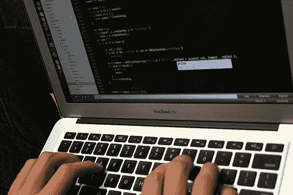

# 为了纪念国家语法日

> 原文：<https://www.freecodecamp.org/news/in-honor-of-national-grammar-day-f62930407f4b/>

皮特·康西丁

# 为了纪念国家语法日

Photo credit: MIT

#### …或者代码作为语言的快乐和痛苦

当我不编码、不阅读有关编码的书籍或解决编码问题时，我是太平洋西北部一家商业技术相关教育机构的执行编辑。因此，我每天至少花八个小时在艺术和科学迎头相撞的地方，对由此造成的伤亡扮演文字医生的角色。相信我，有很多。幸运的是，我似乎是那些不需要太多努力就能跨越右脑/左脑分界线的人之一(尽管我承认我非常喜欢右脑的功能)，所以我很乐意呆在它们之间的中间空间。

这也意味着我每天至少花八个小时思考语言。语言和清晰度。清晰高效。效率和效果。有效性和…你明白了。

所有这些想法让我对“语言”这个词有了更广泛的理解。例如，在教育出版领域工作的几年让我学会了数学的语言学性质——如何书写问题的语法、使用的特定词汇，以及有多少数学性质实际上可以被解释为简单地找到不同“单词”的同义词。

### 言归正传…

前段时间在一个自学程序员的在线论坛上，有人问了一个问题，为什么学习基础知识(我们一般可以认为是 HTML、CSS、JavaScript)这么难；或者说，为什么对一些人来说很难，而对另一些人来说却不是。我回答说，我们基本上是想同时学习三种外语。不仅如此，还有三种外语使用相似但不完全相同的词汇。我想如果*不像*这么难的话，那就更奇怪了。

那么这有什么区别呢？我们已经知道我们在学习语言，对吗？我的意思是，它就在名字里——编程语言。对于不奋斗的编码员来说，如果有区别的话，也没多大区别。但是对于那些觉得自己“永远也不会明白”的人来说，他们的大脑“天生就不是这样的”，他们“不适合编码”，这可能会让世界变得不同。所以这篇文章的其余部分就是为他们写的。

Photo by [Matylda Czarnecka](https://twitter.com/matylda).

### 从头开始学习说话

让我们从一个简单的问题开始——你上一次学习一门新语言是什么时候？对许多美国人来说，那是小学，那时他们学了几年西班牙语、德语等等。然而，对一些人来说，那可能是他们学会走路的时间。没有玩笑。如果从那以后你没有被强迫学习一门外语，你最后一次学习外语——在你开始编码之前——是在你学习母语的时候。

想一想。大多数人在 10 到 15 个月的时候会说第一个单词。他们直到 8 到 10 岁时才会牢牢掌握拼写和语法。那些真正掌握这门语言的人通常是在大学几年后才掌握的。

你期望在四个月内掌握 JavaScript。以及 HTML5 和 CSS3。

[ *在此插入怀疑的表情*

所以是的，你要做的事情很难。

#### *(对语言热爱的一个旁证)*

我讨厌成为那些家伙中的一员，因为我认为这与自学成才的程序员风气有些格格不入，但*为什么*也很重要。你为什么学习编码？没有多少人为了找工作而学习说话。事实上，每个人都开始学习说话，因为他们需要交流一些东西，并发现语言比声嘶力竭地哭泣更有效，直到有人发现它。

同样的，我经常怀疑那些在学习编码上最挣扎的人是那些没有任何他们想要交流的东西的人。他们学习这门语言的原因更加务实。实用主义没有错。实际上，我认为这个世界需要更多这样的东西。如果没有学习的热情或某种更内在的动机，学习就会变得更加困难。这就是为什么我微积分学得很好，但基础代数学得不太好——我对微积分更有热情。我不需要被迫学习它的语法、词汇和标点符号。我想知道如何回答只有微积分才能回答的问题。

### 关于工具的最后一件事

Photo by [Terry Madeley](http://href=”https://www.flickr.com/photos/terry/6156784804).

正如我所了解的，我已经看到了大量关于框架、库和文本编辑器的问题，以及所有与编码相关但不是实际代码的问题。当我主持一个在线评论小组时，我在摄影方面看到了同样的事情——初学者感到太不安全，无法参与关于事物本质的对话，而是选择谈论工具和规则。我完全明白。问题是，它经常会分散人们对手头实际事务的注意力，因为就像对相机的真正测试是摄影师使用它拍摄的照片一样，对框架、库或文本编辑器的真正测试是编码人员用它生成的代码。

据我所知，我已经尝试了一些不同的框架、库和工具。有了像 [Codepen](http://codepen.io/) 和 [Cloud9](https://c9.io/) 这样的环境，路试新东西是毫不费力的。我看得最多的是那些简化编码语法的，而不是倾向于书本本身的。

我开始认为，使编码如此困难的一个原因是，像 HTML 这样的一些语言大约 75%是语法和标点符号，只有 25%是有意义的词汇。例如，这是我的 [Freecodecamp 项目](http://codepen.io/pete_considine/full/XdmbEJ/)中的一行 HTML:

这是用玉石写的同一行字:

按钮。adjust . add(type = ' button ')
I . fa . fa-fw . fa-arrow-circle-up

自然是爱玉版。它清晰、简洁、高效且有效。它让我心中的医生这个词因其简单而微笑。

另一方面，像 NPM 这样的东西让我发疯。他们基本上就像有一个编辑助理，他唯一的工作就是在你每次坐下来写东西的时候跑来跑去收集你的字典——即使你实际上并不需要它们。当然他是有用的，但是当他对红牛充满热情并开始打破东西时，他完全是一个分心的人。

有时候编辑助理来了，你不能解雇他，因为他是总裁的侄子。就这样吧。你尽你所能和他合作，不要把他从 12 楼的窗户推下去。但是如果没有必要的话，你肯定不会去雇佣你自己的人。

当然，这些都是一个中等水平、自学成才的代码猴子的观点，他对编程的兴趣更多的是激情项目，而不是雄心勃勃的职业道路，所以用“这符合我的经验吗？”的健康剂量来看待我所说的一切

就像佛陀说的，“不要靠理论，要靠经验。”

*(本文始于[新手程序员仓库](https://www.facebook.com/groups/1594816820775537/)脸书小组的一次讨论。如果你是一个自学的程序员，这是一个极好的资源。)*