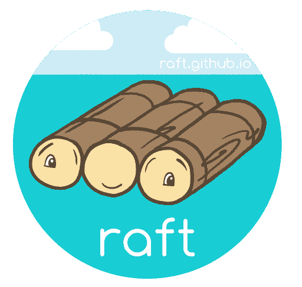
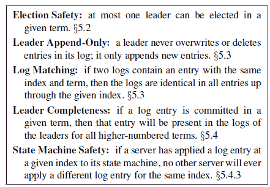
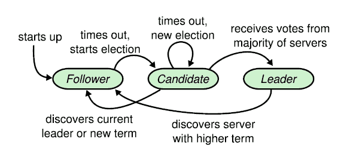

# 理解 Raft 共识算法:学术文章摘要

> 原文：<https://www.freecodecamp.org/news/in-search-of-an-understandable-consensus-algorithm-a-summary-4bc294c97e0d/>

这篇文章总结了 Diego Ongaro 和 John Ousterhout 在论文[中提出的 Raft 共识算法，以寻找一种可理解的共识算法](https://www.usenix.org/system/files/conference/atc14/atc14-paper-ongaro.pdf)。所有的引用都来自那份报纸。

[Credit](https://github.com/raft/logo/tree/3d2c4d5ca0d9c4fb8d5c28a82c4a43e576673b06)

#### 筏子:

Raft 是一种分布式一致性算法。它被设计得易于理解。它解决了即使在出现故障时也能让多个服务器同意共享状态的问题。共享状态通常是复制日志支持的数据结构。只要大多数服务器都在运行，我们就需要系统完全正常运行。

Raft 通过在集群中选举一个领导者来工作。领导者负责接受客户端请求，并管理日志到其他服务器的复制。数据只向一个方向流动:从领导者到其他服务器。

Raft 将共识分解为三个子问题:

*   领袖选举:在现有领袖失败的情况下，需要选举新的领袖。
*   日志复制:领导者需要通过复制保持所有服务器的日志与自己的日志同步。
*   安全性:如果其中一个服务器在特定索引处提交了一个日志条目，那么没有其他服务器可以为该索引应用不同的日志条目。

Raft ensures these properties are true at all times.

#### 基础知识:

每个服务器都有三种状态:领导者、追随者或候选人。

State changes of servers

> 在正常操作中，正好有一个领导者，所有其他服务器都是追随者。追随者是被动的:他们不主动发出请求，只是简单地回应领导者和候选人的请求。领导者处理所有客户端请求(如果客户端联系追随者，追随者将其重定向到领导者)。第三个状态是候选人，用于选举新的领导人。

Raft 将时间分成任意长度的**项**，每一项都以选举开始。如果一名候选人赢得选举，他将在余下的任期内保持领先地位。如果投票是分裂的，那么这个任期结束时将没有领袖。

**项号**单调增加。每个服务器存储当前术语号***，该术语号也在每次通信中交换。***

> *..如果一台服务器的当前项小于另一台服务器的当前项，则它会将其当前项更新为较大的值。如果候选人或领导者发现自己的任期已经过时，就会立即回到追随者状态。如果服务器收到带有过期术语编号的请求，它会拒绝该请求。*

*Raft 使用两个远程过程调用(RPC)来执行它的基本操作。*

*   *候选人在选举中使用 RequestVotes*
*   *AppendEntries 由 leaders 用于复制日志条目，也用作心跳(检查服务器是否启动的信号——它不包含任何日志条目)*

#### *领导人选举*

*领导者定期向其追随者发送心跳以维护权威。当追随者在等待领导者的心跳后超时时，领导者选举被触发。该跟随器转换到候选状态，并增加其**项号**。在为自己投票后，它并行地向群集中的其他成员发出 RequestVotes RPC。三种结果是可能的:*

1.  *候选人得到大多数服务器的投票，成为领导者。然后，它向集群中的其他成员发送心跳消息以建立权威。*
2.  *如果其他候选人收到 AppendEntries RPC，他们将检查术语编号。如果任期数大于他们自己的，他们接受服务器作为领导者，并返回到追随者状态。如果任期人数较少，他们拒绝 RPC，仍然是一个候选人。*
3.  *候选人既不输也不赢。如果一个以上的服务器同时成为候选服务器，投票可能会被分割，没有明确的多数。在这种情况下，一个候选人超时后，新的选举开始。*

> *Raft 使用随机选举暂停来确保分裂投票很少发生，并且很快得到解决。为了首先防止分裂投票，选举超时是从固定的时间间隔(例如 150-300 毫秒)中随机选择的。这分散了服务器，因此在大多数情况下，只有一台服务器会超时；它赢得选举，并在任何其他服务器超时之前发送心跳。相同的机制用于处理分裂投票。每个候选人在选举开始时重新启动其随机选举超时，并在开始下一次选举之前等待该超时过去；这降低了新一轮选举中再次出现分裂投票的可能性。*

#### *日志复制:*

*现在假设客户端请求是只写的。每个请求包含一个命令，理想情况下由所有服务器的复制状态机执行。当领导者收到客户请求时，它会将其作为新条目添加到自己的日志中。日志中的每个条目:*

*   *包含客户端指定的命令*
*   *有一个索引来标识条目在日志中的位置(索引从 1 开始)*
*   *具有一个**术语编号**来逻辑地识别条目何时被写入*

*它需要将条目复制到所有的追随者节点，以保持日志的一致性。领导者并行地向所有其他服务器发出 AppendEntries RPCs。领导者对此进行重试，直到所有追随者安全地复制新条目。*

*当条目被创建它的领导者复制到大多数服务器时，它被认为是已提交的。所有以前的条目，包括由早期领导者创建的条目，也被视为已提交。一旦条目被提交，leader 就执行它，并将结果返回给客户机。*

*领导者在其日志中维护它知道要提交的最高索引，并将其与 AppendEntries RPCs 一起发送给其追随者。一旦跟随者发现条目已经被提交，它就按顺序将条目应用到它的状态机。*

> *Raft 维护以下属性，这些属性共同构成了日志匹配属性*

> *如果不同日志中的两个条目具有相同的索引和术语，则它们存储相同的命令。*

> *如果不同日志中的两个条目具有相同的索引和术语，则这些日志在所有前面的条目中都是相同的。*

*当发送 AppendEntries RPC 时，leader 包括紧接在新条目之前的条目的**术语号**和索引。如果跟随者在自己的日志中找不到这个条目的匹配项，它将拒绝追加新条目的请求。*

*这种一致性检查让领导者断定，无论何时 AppendEntries 从跟随者成功返回，它们都有相同的日志，直到索引包含在 RPC 中。*

*但是当领导者崩溃时，领导者和追随者的日志可能会变得不一致。*

> *在 Raft 中，领导者通过强迫追随者复制自己的日志来处理不一致。这意味着追随者日志中的冲突条目将被领导者日志中的条目覆盖。*

*领导者试图找到其日志与跟随者的日志相匹配的最后一个索引，删除额外的条目(如果有的话)，并添加新的条目。*

> *领导者为每个跟随者维护一个 nextIndex，这是领导者将发送给该跟随者的下一个日志条目的索引。当领导者第一次掌权时，它将所有 nextIndex 值初始化为其日志中最后一个值之后的索引。*

*每当 AppendRPC 为跟随者返回一个失败时，领导者递减 **nextIndex** 并发出另一个 AppendEntries RPC。最终，nextIndex 将达到对数收敛的值。当这种情况发生时，AppendEntries 将成功，它可以删除无关的条目(如果有的话)并从 leaders 日志中添加新的条目(如果有的话)。因此，来自追随者的成功的 AppendEntries 保证领导者的日志与其一致。*

> *通过这种机制，领导者在掌权时不需要采取任何特殊措施来恢复日志一致性。它只是开始正常的操作，并且响应于附加条目一致性检查的失败，日志自动聚合。领导者从不覆盖或删除自己日志中的条目。*

#### *安全性:*

*Raft 确保一个术语的领导者已经在其日志中提交了所有先前术语的条目。这是确保所有日志一致和状态机执行同一组命令所必需的。*

*在领导人选举期间，RequestVote RPC 包含有关候选人日志的信息。如果投票人发现自己的日志比候选人的更新，就不会投票给它。*

> *Raft 通过比较日志中最后条目的索引和术语来确定两个日志中哪一个更新。如果日志的最后条目具有不同的术语，则具有较晚术语的日志是最新的。如果日志以相同的术语结尾，则时间越长的日志越新。*

#### *群集成员资格:*

> *为确保配置变更机制的安全性，在过渡期间，不得出现两个领导人可能当选为同一任期的情况。不幸的是，任何服务器直接从旧配置切换到新配置的方法都是不安全的。*

*Raft 使用两阶段方法来改变集群成员。首先，它切换到一个称为**联合共识的中间配置。**然后，一旦提交，它就切换到新的配置。*

> *联合共识允许单独的服务器在不同的时间在配置之间转换，而不损害安全性。此外，联合共识允许集群在整个配置更改过程中继续为客户端请求提供服务。*

*联合共识将新旧配置组合如下:*

*   *日志条目被复制到两种配置中的所有服务器*
*   *任何新旧服务器都可以成为领导者*
*   *协议需要来自新旧配置的单独多数*

*当领导者接收到配置改变消息时，它存储并复制加入共识的条目 *C < old，n* ew >。服务器总是使用其日志中的最新配置来做出决策，即使它没有被提交。当联合共识被提交时，只有在其日志中具有 C<old、new >的服务器*可以成为领导者。**

> *现在，领导者可以安全地创建描述 C <new>的日志条目，并将其复制到集群。同样，一旦看到此配置，它将在每台服务器上生效。当新配置已经在 C <new>的规则下提交时，旧配置是不相关的，并且不在新配置中的服务器可以被关闭。</new></new>*

*Raft 如何工作的精彩视觉效果可以在这里找到。*

*更多材料如演讲、演示、相关论文和开源实现可以在[这里](https://raft.github.io/)找到。*

*我只研究了构成 Raft 的基本算法的细节和它提供的安全保证。这篇论文包含了更多的细节，而且非常通俗易懂，因为作者的主要目标是让人理解。我绝对推荐你读它，即使你以前从未读过任何其他的论文。*

*如果你喜欢这篇文章，请点击下面的按钮，让更多的人看到它。谢谢你。*

*附:如果你已经做到了这一步，并且想在我发表这些帖子的时候收到邮件，请在这里注册。*