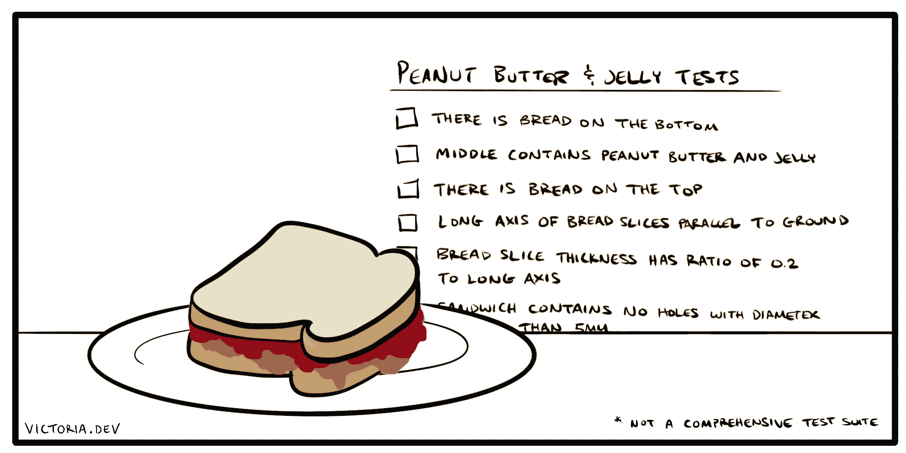

# Django 测试套件介绍——如何增加你作为 Python 开发者的信心

> 原文：<https://www.freecodecamp.org/news/increase-developer-confidence-with-a-great-django-test-suite/>

一些开发人员认为编写测试是一个蹩脚的复选框任务——但是事实并非如此。如果做得正确，测试是应用程序最有价值的资产之一。

Django 框架尤其为您的团队提供了一个基于 Python 标准库`unittest`创建高效测试实践的机会。

Django 中正确的测试编写起来很快，运行起来也更快，并且可以为您提供一个无缝的持续集成解决方案，为您的开发应用把脉。

通过全面的测试，开发人员在推动变更时有了更高的信心。我在我自己的团队中亲眼看到，良好的测试可以提高开发速度，这是更好的开发人员体验的直接结果。

在本文中，我将分享我自己为 Django 应用程序构建有用测试的经验，从基础到最佳执行。如果您正在使用 Django 或在您的组织中使用它进行构建，您可能会喜欢阅读我的关于 Victoria.dev 的 [Django 系列文章](https://victoria.dev/series/django/)

## 测试什么

测试极其重要。测试不仅仅是让你知道一个功能是否工作，它还可以成为你的团队理解你的应用程序如何工作的基础。

这里是主要目标:如果你撞了头，忘记了明天你的应用程序如何工作的一切，你应该能够通过阅读和运行你今天写的测试来重新获得你的大部分理解。

当您决定要测试什么时，以下是一些可能有帮助的问题:

*   你的客户应该能做什么？
*   你的客户*不*应该能做什么？
*   这个方法、视图或逻辑流程应该实现什么？
*   这个特性应该何时、如何或在哪里执行？

对您的应用程序有意义的测试可以帮助建立开发人员的信心。

有了这些合理的保护措施，开发人员可以更容易地进行改进，并有信心引入创新的解决方案来满足产品需求。结果是一个应用程序更快地组合在一起，而且功能经常发布，让人充满信心。



A cartoon created by a programmer and a mathematician, if you couldn't tell.

## 在哪里进行测试

如果你只有几个测试，你可以把它们都放在一个名为`tests.py`的文件中，以类似于 [Django 的默认应用模板](https://docs.djangoproject.com/en/3.1/ref/django-admin/#startapp)的方式组织你的测试文件。这种简单的方法最适合小型应用程序。

随着应用程序的增长，您可能希望将测试分成不同的文件或测试模块。一种方法是使用一个目录来组织你的文件，比如`projectroot/app/tests/`。该目录中每个测试文件的名称应该以`test`开头，例如`test_models.py`。

除了恰当地命名，Django 将使用基于`unittest`模块的[内置测试发现](https://docs.python.org/3/library/unittest.html#unittest-test-discovery)来找到这些文件。应用程序中所有以`test`开头的文件都将被收集到一个测试套件中。

这种方便的测试发现允许您将测试文件放在对您的应用程序有意义的任何地方。只要它们被正确命名，Django 的测试工具就可以找到并运行它们。

## 如何记录测试

使用 [docstrings](https://www.python.org/dev/peps/pep-0257/) 来解释测试在高层次上想要验证什么。例如:

```
def test_create_user(self):
    """Creating a new user object should also create an associated profile object"""
    # ... 
```

这些 docstrings 帮助您快速理解测试应该做什么。除了导航代码库之外，这有助于在测试没有验证 docstring 所说的内容时变得明显。

测试运行时还会显示文档字符串，这对日志记录和调试很有帮助。

## 测试需要做什么

Django 测试可以使用在 [`setUpTestData()`方法](https://docs.djangoproject.com/en/3.1/topics/testing/tools/#django.test.TestCase.setUpTestData)中创建的数据快速设置。您可以使用各种方法来创建您的测试数据，比如利用外部文件，或者甚至硬编码愚蠢的短语或者您的员工的名字。

就个人而言，我更喜欢使用假数据生成库，比如 [`faker`](https://github.com/joke2k/faker/) 。

任意测试数据的正确设置可以帮助您确保您正在测试您的应用程序功能，而不是意外地测试测试数据。因为像`faker`这样的生成器给你的输入增加了某种程度的不可预料性，所以它更能代表真实世界的使用。

下面是一个为测试设置的示例:

```
from django.test import TestCase
from faker import Faker

from app.models import MyModel, AnotherModel

fake = Faker()

class MyModelTest(TestCase):
    def setUpTestData(cls):
        """Quickly set up data for the whole TestCase"""
        cls.user_first = fake.first_name()
        cls.user_last = fake.last_name()

    def test_create_models(self):
        """Creating a MyModel object should also create AnotherModel object"""
        # In test methods, use the variables created above
        test_object = MyModel.objects.create(
            first_name=self.user_first,
            last_name=self.user_last,
            # ...
        )
        another_model = AnotherModel.objects.get(my_model=test_object)
        self.assertEqual(another_model.first_name, self.user_first)
        # ... 
```

测试通过或失败取决于断言方法的结果。你可以使用 [Python 的`unittest`方法](https://docs.python.org/3/library/unittest.html#assert-methods)，以及 [Django 的断言方法](https://docs.djangoproject.com/en/3.1/topics/testing/tools/#assertions)。

关于编写测试的更多指导，请参见 Django 中的[测试。](https://docs.djangoproject.com/en/3.1/topics/testing/)

## 运行测试的最佳可能执行

Django 的测试套件是通过以下方式手动运行的:

```
./manage.py test 
```

我很少这样运行我的 Django 测试。

最好的，或者最有效的测试实践是，你或者你的开发人员从来没有想过，“我需要首先运行测试。”

Django 几乎毫不费力的测试套件设置的美妙之处在于，它可以作为常规开发活动的一部分无缝运行。这可以在预提交挂钩中，或者在持续集成或部署工作流中。

我以前写过如何使用预提交钩子来[改善你的开发人员工效学](https://victoria.dev/blog/technical-ergonomics-for-the-efficient-developer/)并为你的团队节省一些脑力。Django 的快速测试可以这样运行，如果你能[并行运行测试](https://docs.djangoproject.com/en/3.1/ref/django-admin/#cmdoption-test-parallel)，它们会变得特别有效。

作为 CI/CD 工作流的一部分运行的测试，例如，[带有 GitHub 操作](https://victoria.dev/blog/django-project-best-practices-to-keep-your-developers-happy/#continuous-testing-with-github-actions)的 pull 请求，根本不需要您的开发人员定期努力去记住运行测试。我不知道我能说得多直白——这是一个显而易见的问题。

## 测试一个优秀的 Django 应用程序

测试是极其重要的，但却被低估了。它们可以捕捉应用程序中的逻辑错误。他们可以帮助解释和验证你的产品的概念和功能实际上是如何运作的。最重要的是，测试可以提高开发人员的信心和开发速度。

最好的测试是那些相关的，有助于解释和定义你的应用程序，并且不加思索地连续运行的测试。我希望我已经向您展示了 Django 中的测试是如何帮助您为您的团队实现这些目标的！