# GitHub 回购指南——如何增加你的公共 GitHub 库的参与度

> 原文：<https://www.freecodecamp.org/news/increase-engagement-on-your-public-github-repositories/>

GitHub 是一个基于网络的工具集合，可以帮助你使用`version control`和`Git`方法。

在 GitHub 的帮助下，您可以与多个其他团队成员一起创建、管理和协作项目。您将项目文件夹和文件保存在 GitHub 上的一个存储区(文件系统)中。这家店叫做`repository`。

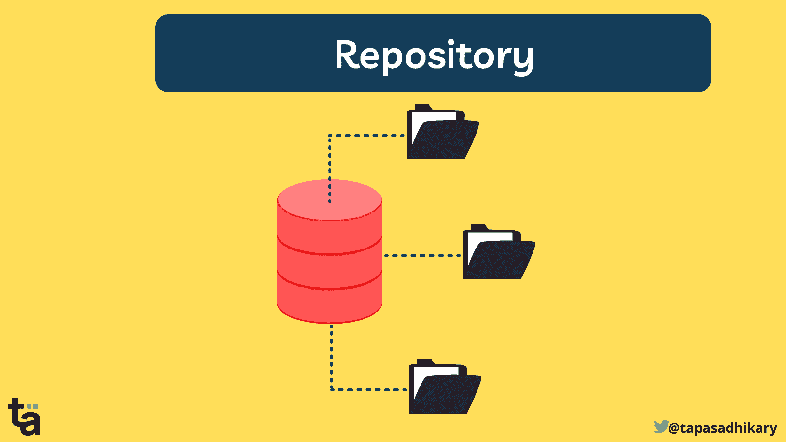

A repository may contain multiple folders and files

一个`repository`可能包含多个文件夹和文件。您的 GitHub 帐户可能有多个存储库。您可以创建一个存储库，并将其设置为`public`(拥有存储库 URL 的所有人都可以看到)或`private`(只有您和您想访问的少数人可以看到)。

如果你有公共知识库，你会想继续读下去。

在本文中，您将了解到 10 个基本技巧，让您的公共 GitHub 库对开发人员社区的人更加可见。这将帮助您:

*   让您的回购获得更多参与
*   查找更多代码贡献者
*   获得对你工作的认可(比如明星和赞助商)
*   在 GitHub 上积累追随者

但是在我们开始之前，请注意:

> 饭桶！= GitHub

这两个工具是不一样的。是一个版本控制系统，你可以用它来管理和跟踪你的文件和文件夹，维护一个历史记录。`GitHub`是一个强大的工具，帮助您轻松完成所有这些工作。

好吧，让我们深入这 10 个技巧。

如果您也喜欢从视频内容中学习，本文也可以作为视频教程在此处获得:🙂

[https://www.youtube.com/embed/gREqA2U-7Is?feature=oembed](https://www.youtube.com/embed/gREqA2U-7Is?feature=oembed)

# 1.设置存储库元数据

创建具有清晰`description`和意图的存储库。描述告诉用户关于存储库中正在进行的工作。这是你创造第一印象的地方，有助于任何人对你的工作产生兴趣。

总是选择添加一个`README MD`文件。自述文件是存储库的外观。您需要将所有相关的细节添加到这个文件中(我们稍后会看到如何做)。

接下来，选择一个`LICENSE`类型。如果您不确定选择哪种许可证类型，[此链接可以帮助](https://choosealicense.com/)解决这个问题。

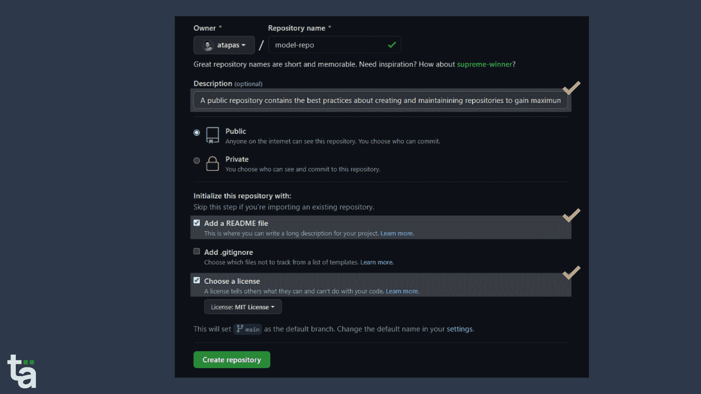

创建存储库之后，添加您的`website/portfolio`链接(如果有的话)和相关的`keywords`。这些关键字可以帮助人们基于搜索找到您的存储库。

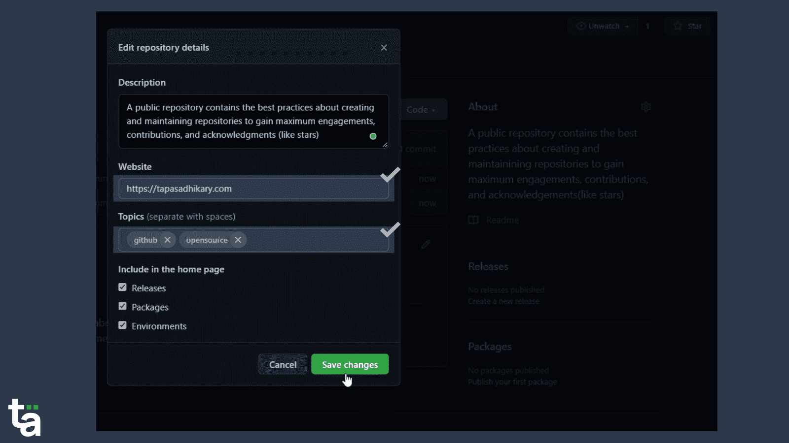

# 2.设计并记录`Readme.md`文件

除了源代码之外，`readme`文件是存储库中最重要的工件。如果源代码是存储库的心脏，那么自述文件就是它的表面。您使用 [markdown 格式](https://guides.github.com/features/mastering-markdown/)来记录这个文件中的信息。

至少，您应该在自述文件中包含以下信息:

*   项目名称、徽标(如果有)。
*   项目介绍(如有可能，带图片)
*   如何在本地运行项目？测试后提供所有步骤。
*   演示链接(如果有)
*   项目支持什么样的特性？提供它们的列表。
*   如果可能的话，列出即将推出的高级功能。
*   描述项目中使用的技术。
*   提供部署信息。在这里，您有机会添加 deploy 按钮，以便在 Vercel、Netlify 等服务上部署您的项目。
*   提供关于存储库的统计信息。您可以使用 [shields](https://img.shields.io) 创建直观的按钮来显示星星、叉子、许可证和许多其他细节。
*   提供关于如何为你的项目做贡献的清晰信息。
*   感谢所有观星人(给你的回购上了星的人)。
*   在你的自述文件中随意使用[表情符号](https://emojipedia.org/)，但不要过度使用。

你在找例子吗？以下是一个[示例](https://github.com/TryShape/tryshape/blob/main/README.md)自述文件，其中包含了大部分要点:

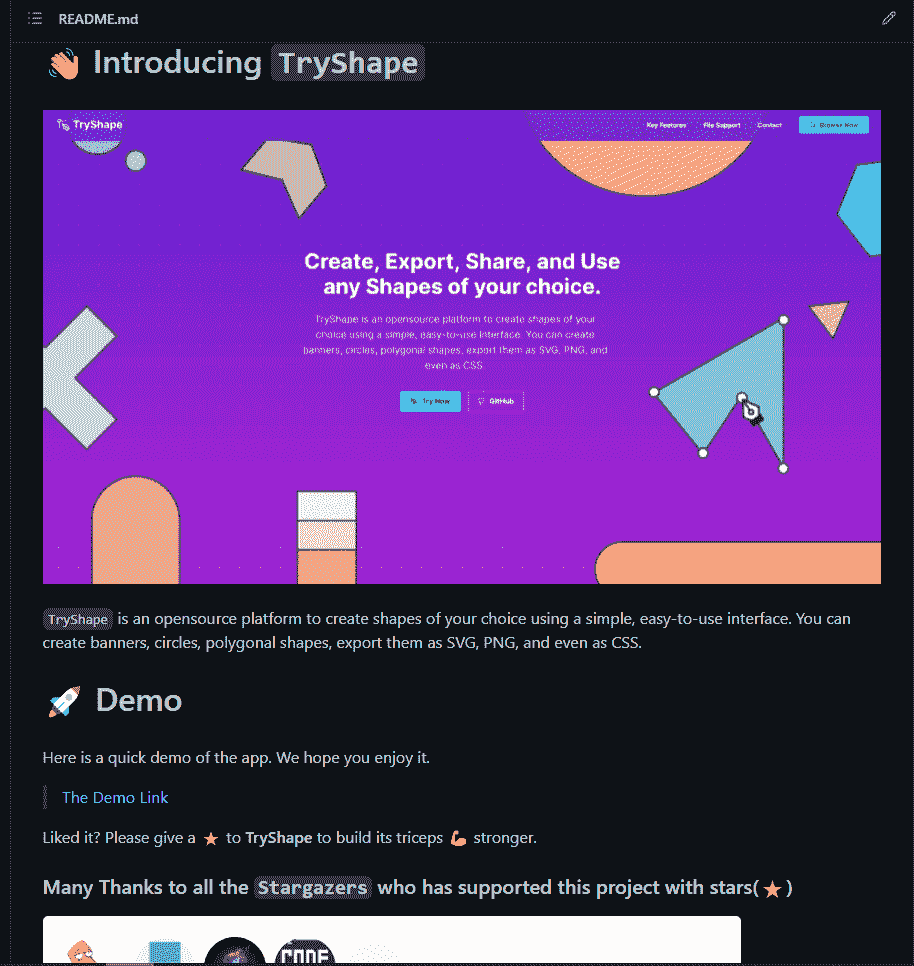

# 3.建立您的社区档案

一个`community profile`帮助开源仓库的维护者回顾你的工作，并学习如何帮助它成长。做得好将会引起人们的兴趣，做出贡献，并有助于建立信任。

要开始，请转到`Insights`选项卡，并从左侧导航窗格中选择`Community`菜单项。现在你应该看到了`Community profile`。

如果您没有看到所有选项的绿色勾号，这意味着它是不完整的。让我们完成它。

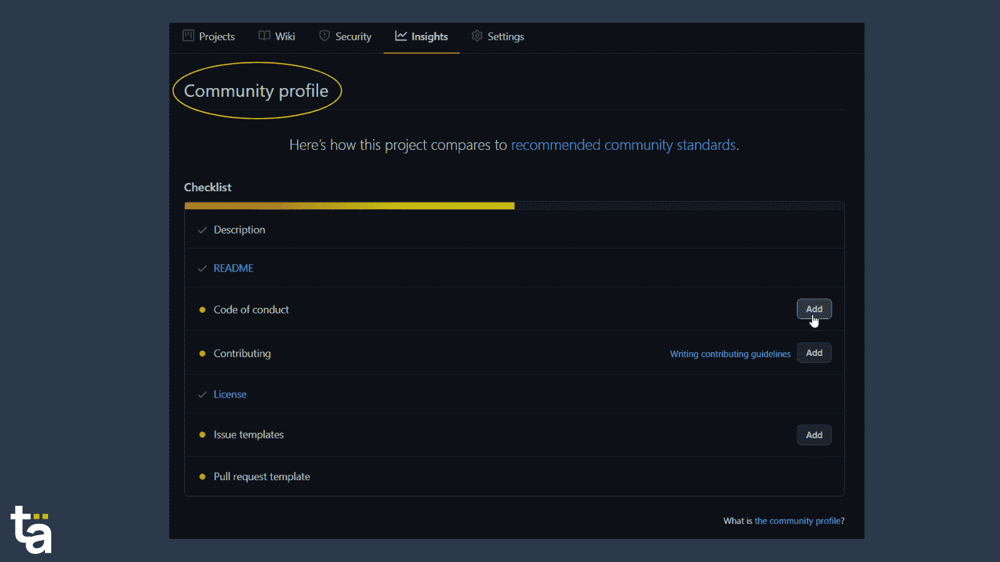

# 4.建立行为准则

一个`CODE of CONDUCT` (CoC)文档有助于定义参与项目或社区的标准。随着社区的发展，来自不同地域、文化和思维方式的人加入进来。作为存储库的所有者，您有责任为贡献者的行为提供一些指导。

GitHub 提供了几个选项供选择。你也可以选择写你自己的或者从一些现有的中获取灵感。这里有几个例子，

*   [推特 CoC](https://github.com/twitter/.github/blob/main/code-of-conduct.md)
*   [角度系数](https://github.com/angular/code-of-conduct)
*   [铁锈 CoC](https://www.rust-lang.org/policies/code-of-conduct)

不要忘记提及负责倾听和处理任何问题的个人/组织的电子邮件 id。

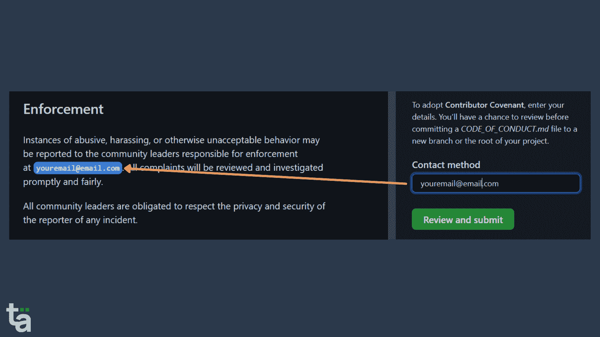

# 5.创建投稿指南

接下来是投稿指南。您可能想要为存储库的贡献者设置一些期望。在这里，您可以解释如何创建问题或拉式请求，在什么情况下拉式请求(PR)可能被拒绝或接受，等等。

从您的`Community profile`创建一个`Contributing.md`文件。不像`Code of Conduct`文件，你不会找到任何关于投稿文件内容的建议。但是网上有很多模板可供使用，比如[这个](https://github.com/atapas/model-repo/blob/main/CONTRIBUTING.md)。

同样，不要忘记在文档的`Enforcement`部分提供存储库所有者的电子邮件 id。

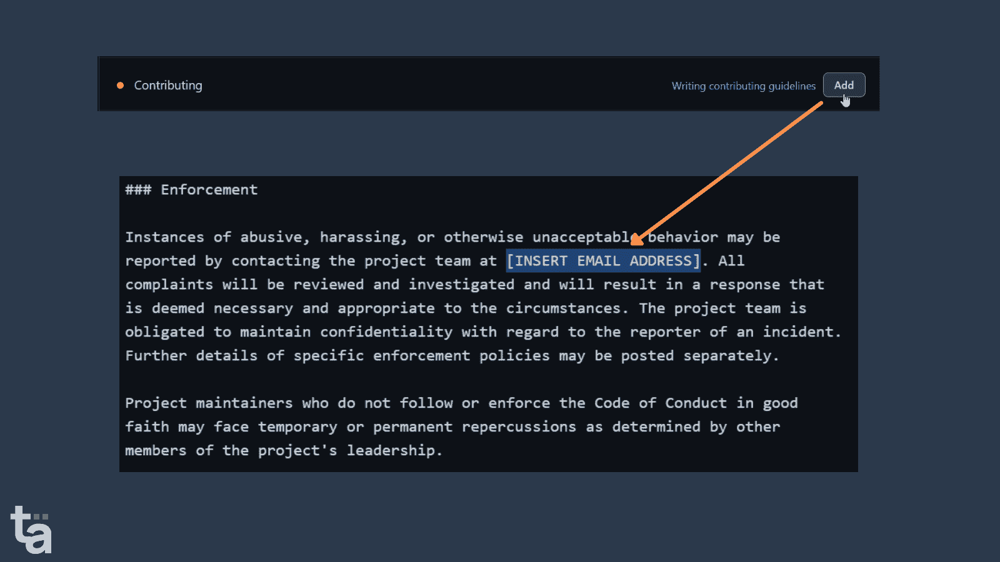

最棒的是，任何试图在您的存储库上打开问题或提出请求的人都会被要求先阅读这些指南。很酷，对吧？

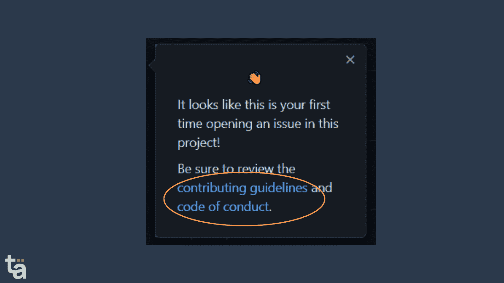

# 6.决定问题模板

看到一个问题用一行程序提出来可能会令人沮丧。您可能希望贡献者向社区更全面地解释它。

管理它的最好方法是在处理 bug 和创建库增强的同时，用指针来指导您的贡献者。

为此，您可以使用 GitHub 的模板并创建自己的定制问题模板。

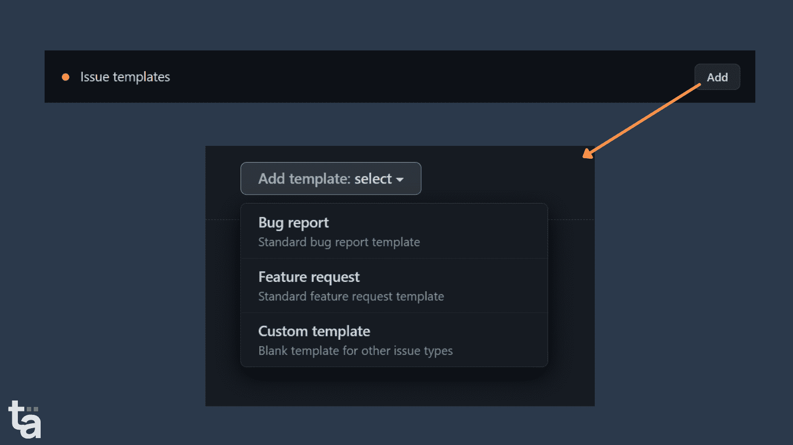

默认情况下，这些模板将被放置在`.github`存储库中。创建模板后，它会在存储库中创建问题时出现。

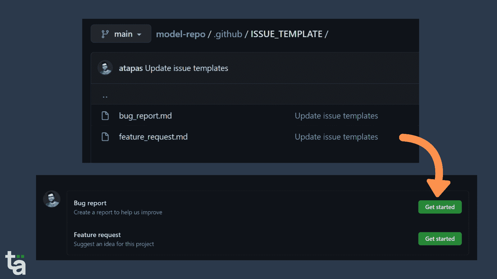

[这里是一个自定义模板的示例](https://github.com/atapas/youtube/issues/new/choose)。

# 7.创建拉式请求(PR)模板

像问题模板一样，你也应该通过创建一个`Pull Request` (PR)模板来指导你的贡献者。

为了做到这一点，

*   点击`Add file`下拉菜单。
*   点击`Create new file`选项。
*   添加模板文件名为`pull_request_template.md`(我更喜欢把它放在。github 文件夹)
*   添加您的 PR 模板内容。

就是这样！下次有人试图创建一个公关，他们会得到这个模板填写。

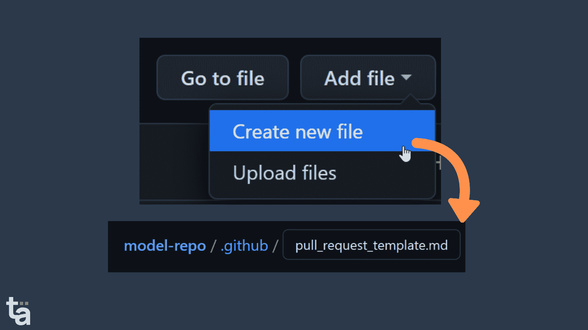

很好，现在检查一下你的`Community profile`。恭喜你！它是完整的。

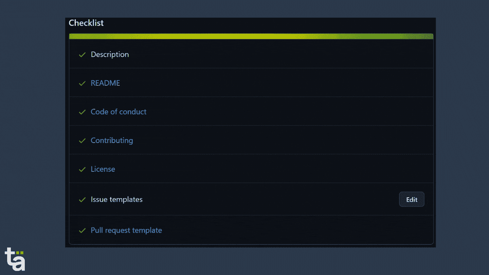

# 8.走向社交——增加社交形象

您可以将社交图像添加到您的存储库中，这样当您在社交媒体上共享或将其嵌入您的文章时，它会看起来更好。它向消费者和未来的贡献者传达了关于回购的重要信息。

为了做到这一点，

*   转到存储库的`Settings`选项卡。
*   点击`Options`菜单并移至`Social preview`部分。
*   现在上传你选择的图片。只要确保维持页面上提到的图像所需的尺寸。

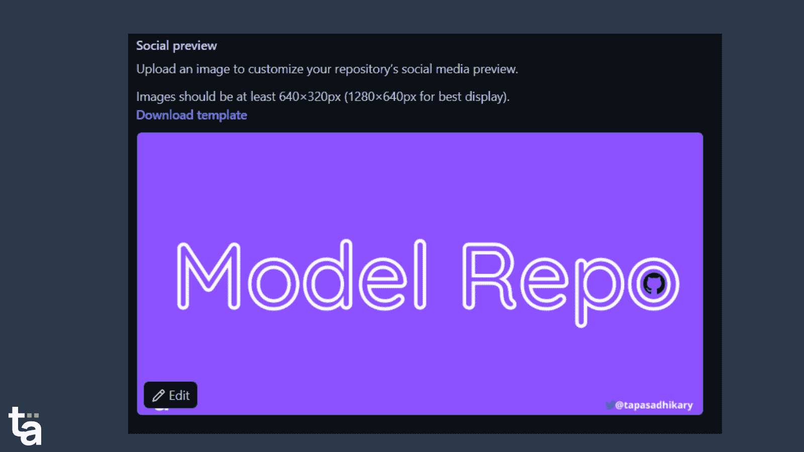

# 9.激活 GitHub 赞助商(如果你愿意)

如果你希望人们能够在经济上支持你，你可以为你的存储库激活`Sponsors`按钮。人们可能会喜欢你的工作，并决定赞助你一定的金额。

为了获得赞助，

*   转到`Settings`
*   勾选`Sponsorships`复选框
*   按照说明添加`funding`链接。

您还可以添加自定义资金链接，如下图所示:

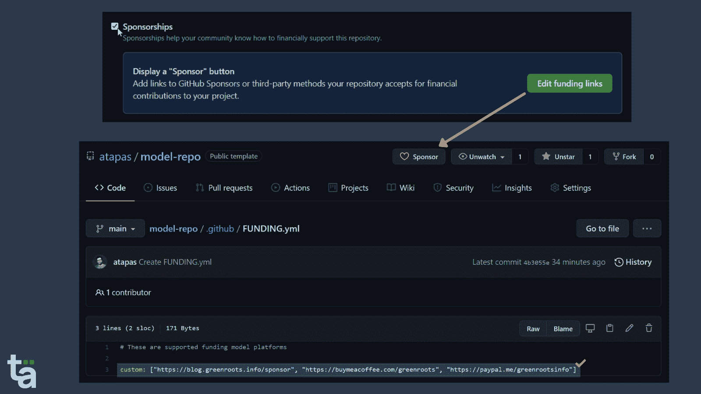

# 10.将回购作为模板，以便可重复使用

您知道吗，您可以将自己的存储库设为`template`以便其他人可以基于您的存储库创建他们的存储库。

*   转到`Settings`
*   勾选`Template repository`复选框

现在，每个人在创建自己的存储库时，都会在您的存储库中看到`Use this template`按钮。

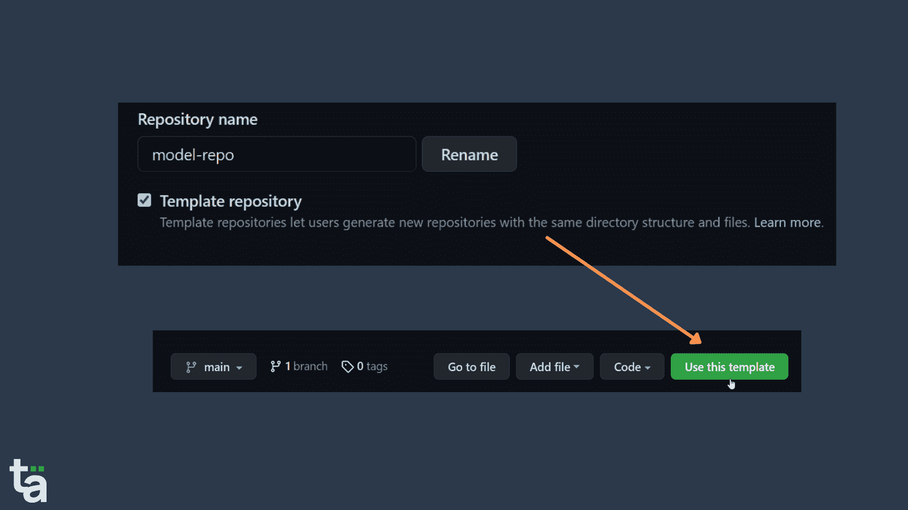

# 适合您的模型库

我希望你能利用这些技巧来展示你的作品。

我已经创建了一个`template`存储库，其中包含了我们到目前为止讨论过的所有要点。您可以使用它作为模板来创建一个带有`MIT license`、`README`结构、`Code of Conduct`指南、`Contributing`指南、`Issue`和`PR`模板以及`funding.yml`文件的存储库。

从模板创建存储库后，您可以进行进一步的修改，使其成为您自己的存储库。请随意使用/修改/贡献它。

[GitHub - atapas/model-repo: A public repository contains the best practices about creating and maintaining repositories to gain maximum engagements, contributions, and acknowledgments (like stars, sponsors).A public repository contains the best practices about creating and maintaining repositories to gain maximum engagements, contributions, and acknowledgments (like stars, sponsors). - GitHub - atapas...atapasGitHub](https://github.com/atapas/model-repo)

Don't forget to give a ⭐. It motivates.

几天前，我在推特上简单分享了这 10 点。如果有兴趣，请查看任何其他评论/讨论。

> 你有公共的 GitHub 库吗？
> 
> 这里有 10 个小技巧可以帮你，
> 
> 🤝获得更多的约定
> 💻代码贡献
> ⭐作品致谢(比如明星，也许是赞助商)
> 🔥在 GitHub 上建立追随者
> 
> 一个兆线程
> 
> 🧵👇
> 
> — Tapas Adhikary (@tapasadhikary) [September 21, 2021](https://twitter.com/tapasadhikary/status/1440296182396309513?ref_src=twsrc%5Etfw)