# 如何使用 Sketch 和 Vuetify.js 的材质主题插件在创纪录的时间内创建原型

> 原文：<https://www.freecodecamp.org/news/incredibly-fast-prototyping-with-material-theme-plugin-for-sketch-and-vuetify-js-366ef25ce9b3/>

作者:亚当·瓦蒂斯

# 如何使用 Sketch 和 Vuetify.js 的材质主题插件在创纪录的时间内创建原型


当开发一个 MVP(最小可行产品)时，你打算尽可能快地从想法到原型。你越快原型化你的想法，你就能越快迭代它。

当你从抽象的想法转移到工作原型时，当你应该关注应用程序的功能时，你通常不想花很多时间去创建一个定制的设计。为了解决这个问题，我们使用 Bootstrap 之类的框架来快速实现一个结构化的布局，其 UI 看起来“相当不错”,而不需要太多的努力。

就设计而言，我们真正想要实现的是**快速**创建一个**可识别**和**连贯的用户界面。**

我将向你们展示一种从抽象概念到设计，再到用材料设计制作原型的超快速方法。材料设计是谷歌的开源设计系统，他们用于所有的应用程序。这使得它很容易识别，因为它很直观，易于导航，而且大多数人已经熟悉它了。如果你还没有，你一定要看看[材料设计](https://material.io/)是怎么回事。

通过使用草图的材质设计插件，我们将创建我们自己的可定制的材质设计系统。这将包括一个伟大的组件集，使我们能够快速地为我们的原型应用程序创建连贯的设计。我们要做的应用程序是一个简单的提醒应用程序。

我们将使用前端框架 Vue.js 和材料设计组件库 Vuetify.js 来实现我们的应用程序设计。我们开始吧！

### 创建设计系统

[下载](https://material.io/tools/theme-editor/)这个插件用于素描。一旦安装完毕，只需进入插件>材质>打开主题编辑器查看材质设计主题编辑器。点击“创建新主题”，我们选择从基线主题开始。

现在，我们看到了草图组件的材料设计系统。

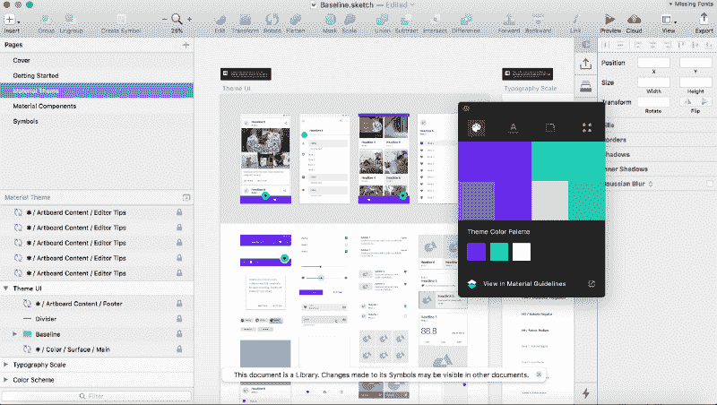

Your component library.

在主题编辑器中，您可以更改主要和次要颜色，更改字体，更改元素角的形状，以及包含自定义图标。在这个例子中，我们不会改变任何一项，只使用默认值。

我们现在已经创建了我们的设计系统。如您所见，它表示该文档是一个**库**。这意味着您对此草图文件所做的任何更改都将影响您的实体模型，并使用这些更改更新您的所有设计。多棒啊。

在我们继续之前，我们还将安装草图材质插件，它将添加一些我们很快就会用到的模块。

### **实体模型**

让我们首先打开一个新的草图文档，然后创建一个新的 iPhone 画板，并将其保存为 **MaterialReminders.sketch** 。这是我们为应用程序创建设计的地方。但是首先，让我们探索一下我们所拥有的丰富的组件库。

在 **Insert > Symb** ols 下，你应该会看到我们刚刚创建的组件库。

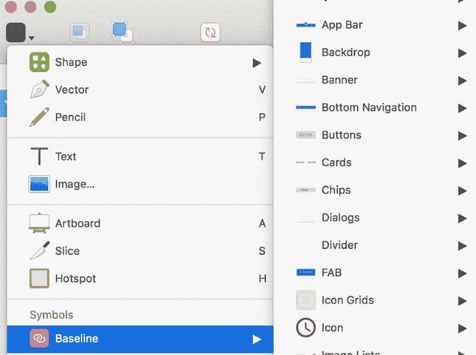

Explore all the components in our library and imagine the possibilities!

就这么多组件！我们现在可以开始设计了。但首先我们必须分解我们希望这个提醒应用程序有什么功能。我们保持简单，只是增加了以下功能:

*   添加新提醒
*   删除提醒
*   从你的待办事项列表中勾选一个提醒
*   取消选中已完成列表中的提醒

太棒了，让我们加快速度，开始将一些组件放入我们的第一个 iPhone 画板。

我们从顶部导航条开始。将它放入并放置，然后调整大小以适合屏幕。我们必须将菜单图标的第一个图标改为“图标/添加/填充”,并将图标颜色改为白色。然后把其他的图标都改成无，因为我们不需要它们。我们还将标题改为提醒。

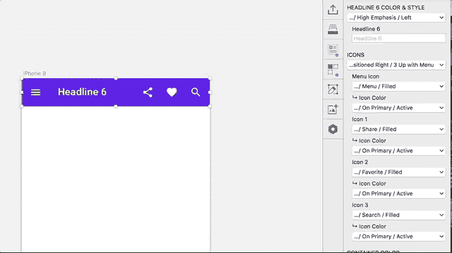

Customizing for your needs becomes super easy with symbol overrides.

我们现在开始放一些虚拟的提醒。我们将创建类似列表的提醒，所以让我们找到一个合适的组件。我们将使用“列表/单行/缩进/正文 2”。

现在我们将列表对象居中，去掉底部分隔线，将文本设置为“杂务”，最后将图标更改为“图标/选中的圆/轮廓”。

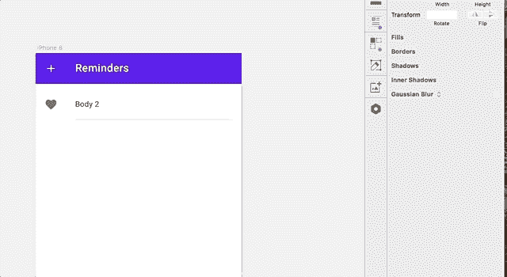

通过插入文本字段来添加标题，然后使用“插件”>“草图材质”>“排版”模块将样式更改为“副标题”。

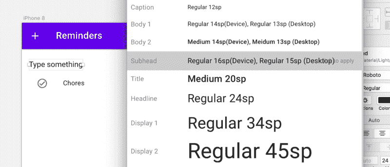

When selecting a text field and going to the Typography module you can click on a style to apply it.

到目前为止开始看起来相当不错！但是我们现在面临一个问题。我们还想在每个列表对象的右侧包含列表控件，因为我们想在那里添加一个删除按钮。但是谷歌的开发者并没有在草图组件中包含任何覆盖。不过不用担心，我们会通过进入我们的库文件并将我们的图标添加到符号中来解决这个问题，从而在整个项目中更新它。

转到库并找到我们在材料组件页面中使用的列表组件。然后，双击它以转到它的符号。单击左侧的图标使其成为焦点，然后复制粘贴并将其移到右侧。成交。

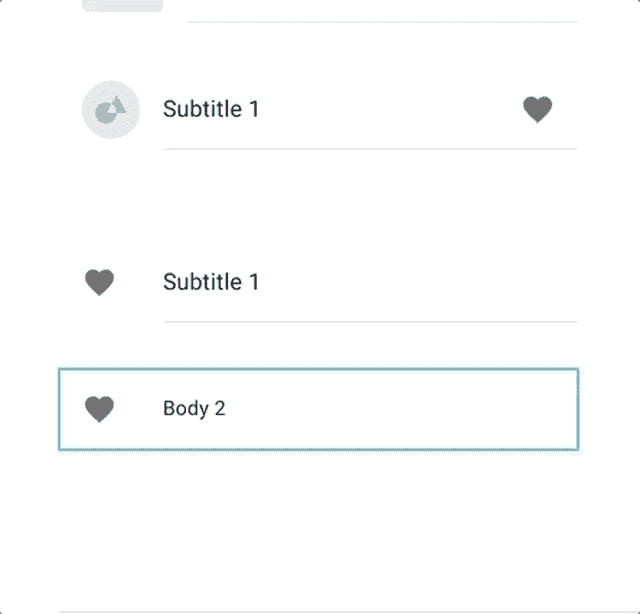

当我们切换回我们的项目时，我们现在可以看到在右上角显示“库更新可用”。

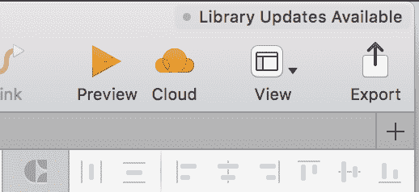

Changes have been detected in the library. You may choose to update your designs with these new changes.

现在，我们应该能够将右侧图标更改为“图标/关闭/已填充”,这将是从列表中完全删除提醒的按钮。

要创建提醒列表，我们只需复制粘贴一堆列表对象，更改它们的文本，然后更改添加到 Todo 中的标题。

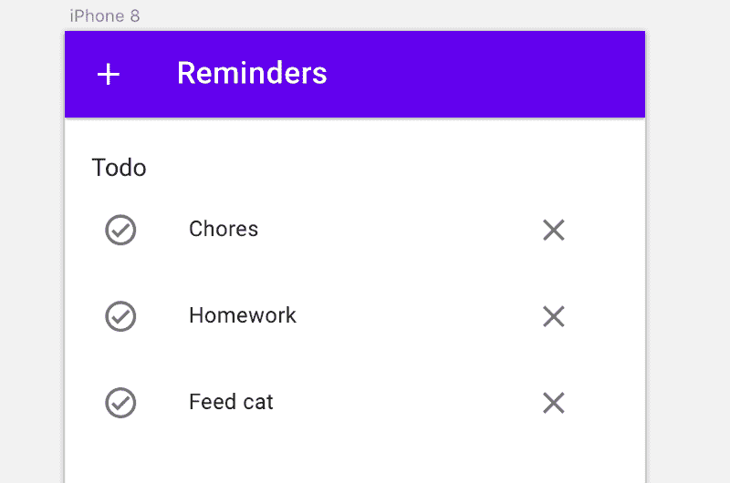

Todo list is complete.

然后我们复制粘贴整个列表来创建完整列表。在这个新列表中，您必须将标题更改为“Completed ”,然后将左侧的所有图标更改为填充而不是轮廓。

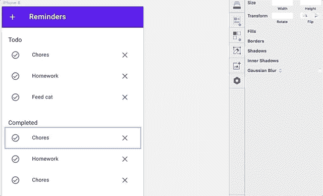

Select all the list items to change the icons to them all at the same time.

几乎完成了我们的模型。为了加快进度，我把画板的颜色改成了#FAFAFA，并在每个列表后面加了一个“Shadow / 00dp”。

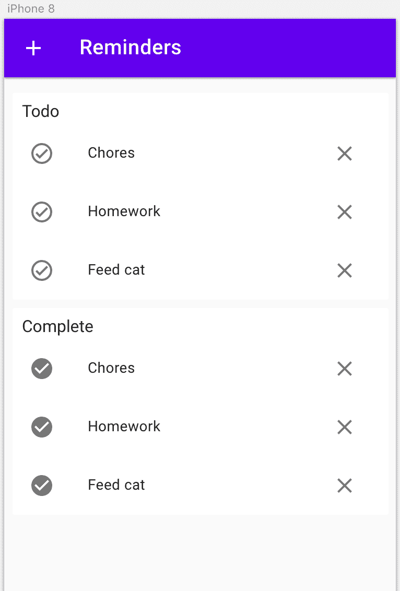

Completed mock-up.

这个模型视图现在已经完成。下一个我们需要创建的是当你按下 add 按钮时出现的对话框。

我们开始复制粘贴我们一直在工作的画板，以创建一个精确的副本。然后，我们使用“插件/草图材料”下的对话和表单模块分别创建一个对话和一个表单。然后将这些组合起来，在后面放一个不透明的盒子。我把对话中的透明动作按钮换成了原色按钮。

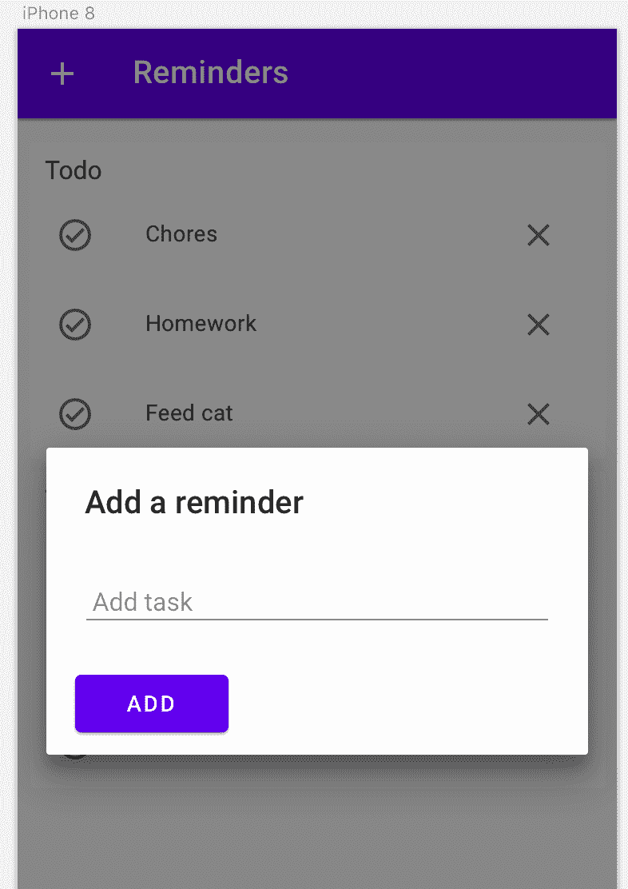

我们现在完成了素描。当然，我们可以添加更多的功能，甚至扩展我们的模型，但我们现在将保持简单。下一步是编写将成为我们的应用程序的代码！

### Vue with Vuetify

现在是有趣的部分——编码。我们将使用 Vue.js，这是一个用 JavaScript 编写的前端 UI 库。这真的很容易学，查看他们的网站是第一步。为了实现材质设计，我们将使用 [Vuetify.js](https://vuetifyjs.com/en/getting-started/quick-start) 组件库，它包括一组 Vue 组件和一个网格系统，可以轻松地组织你的布局。

我们从简单地复制粘贴 Vuetify starter 页面上的示例标记开始。让我们看看这对我们有什么帮助。

当你看 HTML 的时候，从外部开始，然后向内看。

我们有我们的`<head>`</h`ead> and &`lt；body > < /bo `dy> tags.` 里面的& l `t;head` > < /head >标签我们已经将<林`k> tags that`拉进了所需的 vuetify.min.css 文件和 Google 字体。

在`<body>&`lt；/body>`; we have a`<div></div>其中我们有一些虚拟化`components, for`考试`ple <v-app></v` -app >和<v-content></v-content>，它们的名字中用“v-”表示。

再往下你有两个`<script><`；/script >标签将 Vue.js 和 Vuetify.js 模块导入我们的页面。

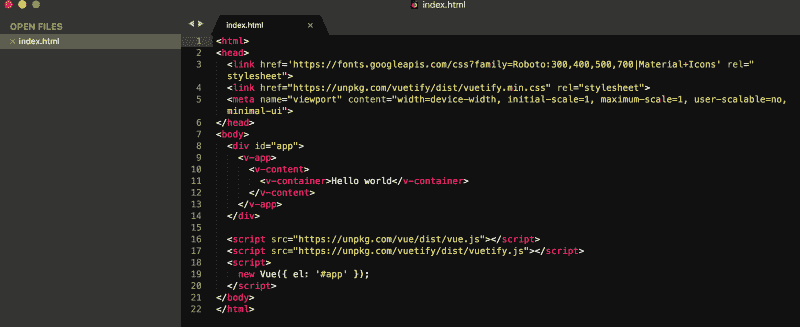

最后，在 import 语句之后，还有第三个`<script><`；/script >标记哪个 cr `eates`是新的 Vue()实例。这是我们编写所有 JavaScript 代码的地方。

我们可以看到该实例正在挂钩到`‘#app’`，这是我们的 HTML 中的`<div>` < /div >标签的 ID。这让我们的 Vue 实例知道在哪里注入我们的 UI。

在`<v-content></v` -content >标签内部，我们将很快放置所有的 Vuetify 组件。但是首先我们将保存我们现在拥有的 index.html，然后在我们的浏览器中打开文件，在那里我们将看到“Hello world”。

我们继续在 Vuetify 文档中查找顶部 navbar 组件所需的 HTML。我们正在寻找的标签是`<v-toolbar app></v`-工具栏>。我们还会有`ve to add a <`；v-btn > < /v-btn >在这个导航条里面，这样我们就可以按下它来显示对话框以添加新的提醒。

在这个按钮中，我们还将添加一个`@click=`事件，该事件会将`addModal`设置为`true`，从而调出对话模式。我们将它添加在`<v-content></v`-内容>标签之间:

```
<v-toolbar app color="primary">  <v-btn color="primary darken-1" icon @click="addModal = true">    <v-icon>add</v-icon>  </v-btn>  <v-toolbar-title>    Reminders  </v-toolbar-title></v-toolbar>
```

接下来，我们必须为对话添加 HTML。这将紧接在`<v-toolbar-title></v-toolb` ar-title >标签之后，但仍然是 `inside the <v-toolb` ar > < /v-toolbar >标签。对话如下:

```
<v-dialog v-model='addModal'>  <v-card>    <v-card-title>Add a reminder</v-card-title>    <v-card-text>      <v-container grid-list-md>        <v-layout wrap>          <v-flex md12>            <v-text-field v-model="newTask" label="New task"></v-text-field>          </v-flex>          <v-flex md12>            <v-btn color="primary" @click="add">Add</v-btn>          </v-flex>        </v-layout>      </v-container>    </v-card-text>  </v-card></v-dialog>
```

这里我们添加一个`<v-card-tit` le >以“添加提醒”为标题。然后我们使用 Vuetify 网格系统创建一个包含所有 12 列的列表。我们`add a <v-te` xt-field > th `at binds` 到“新任务”，并有一个标签写着“新任务”。还有一个按钮，`through`@ click = event，t`rigge`RS ' add '函数，我们马上就要写了。

保存对文档的更改后，当您在浏览器中刷新 index.html 页面时，您应该会看到如下内容:

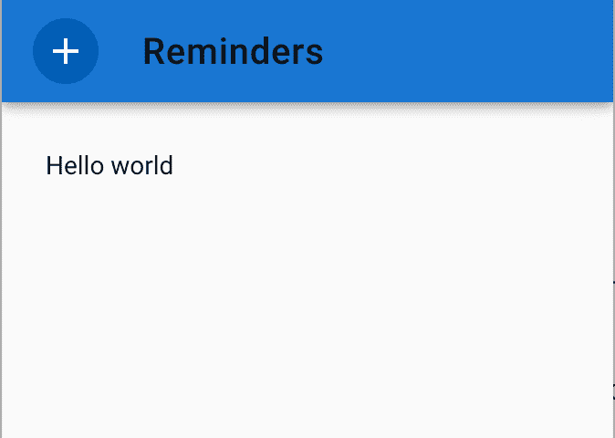

不要担心对话还没有工作——我们必须首先在我们的`Vue()`实例中为它添加功能。我们通过将以下内容添加到我们的实例中，紧接在`el: '#app'`之后，但是用逗号分隔:

```
el: '#app',data: {  addModal: false,  newTask: ''}
```

**数据**对象是我们存储应用程序状态的地方。经过这一调整，我们的对话现在应该可以工作了。保存并刷新页面。

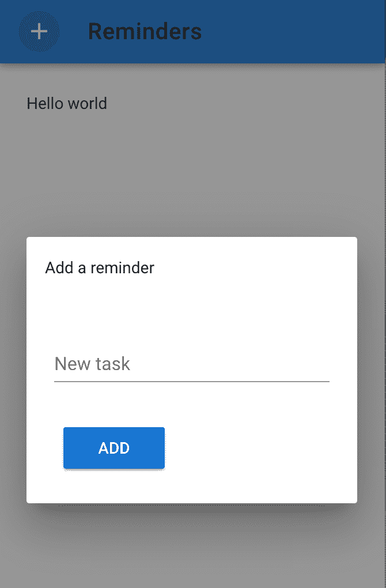

现在每当你点击打开你的对话模态时，`data: {}`中的内部状态被设置为`addModal: true`，然后显示模态。类似地，每当你在对话的文本输入中写下一条消息，它将被保存在`newTask`中，因为`<v-text-field></v-te`文本字段>被绑定到 `it thro` ugh v-model=。

我们现在将为`add`函数添加代码，该函数将把`newTask`中的内容保存到我们即将发布的提醒列表中。这个函数必须位于**方法**对象内部，我们将把它添加到 Vue 实例中的`data: {},`对象之后。

该函数将如下所示:

```
add() {  if (this.newTask !== '') {    this.tasks.unshift({text: this.newTask, completed: false})    this.addModal = false    this.newTask = ''  }}
```

在将函数包含在`method: {}`对象中之后，代码应该是这样的:

```
new Vue({  el: '#app',  data: {    addModal: false,    newTask: '',    },  methods: {    add() {      if (this.newTask !== '') {        this.tasks.unshift({text: this.newTask, completed: false})        this.addModal = false        this.newTask = ''      }    }  }});
```

当`add()`函数触发时，它会将我们的任务从`newTask`添加到我们尚未创建的任务列表中，除非它是空的。然后，它将通过设置`this.addModal = false`关闭对话，并再次将`newTask`设置为空。

让我们创建我们的任务列表，以便我们可以开始输入一些提醒。在`data`对象中，放置以下代码:

```
tasks: [   // Some dummy data   {    text: 'Chores',    completed: false   },   {    text: 'More chores',    completed: false   }]
```

这些将是我们的虚拟提醒。如你所见，我们有一个设置为`true`或`false`的`completed`键，这样我们就可以区分哪些任务已经完成，哪些没有完成。这也意味着我们不能像在 UI 中那样简单地显示我们的`tasks`列表，因为那样我们会一起显示已完成和未完成的任务。

我们解决这个问题的方法是用**计算属性。**它们的工作原理是不断观察应用程序中的变化，并根据这些变化返回一个计算值。

我们需要两个计算属性:一个用于`todo`列表，另一个用于`done`列表，分别分隔未完成和已完成的任务。我们在`methods: {},`后添加`computed: {}`，并加入`todo: function() {}`和`done: function() {}`计算属性。通过移除`task.completed`前面的`!`(表示“非”)，函数`todo`将`return this.tasks.filter(function(task) {return !task.completed})`和`done`将返回相反的结果。代码应该如下所示:

```
computed: {  done: function() {   return this.tasks.filter(function(task) {return task.completed})  },  todo: function() {   return this.tasks.filter(function(task) {return !task.completed})  }}
```

我们现在准备在 UI 中呈现这两个列表。这将是相当多的标记，但不要担心，我们将一起走过它。我们将通过选择容器>来替换它，然后将以下内容粘贴到它的位置:

```
<v-container grid-list-md>  <v-layout row wrap>    <v-flex xs12>      <v-list>        <v-subheader>Tasks to do</v-subheader>        <v-list-tile v-for="task in todo">          <v-list-tile-action>            <v-btn icon ripple @click="complete(task)">              <v-icon v-if="task.completed">check_circle</v-icon>              <v-icon v-else>check_circle_outline</v-icon>            </v-btn>            </v-list-tile-action>          <v-list-tile-title>            {{task.text}}          </v-list-tile-title>          <v-list-tile-action>            <v-btn icon ripple @click="remove(task)">              <v-icon color="grey lighten-1">cancel</v-icon>            </v-btn>          </v-list-tile-action>        </v-list-tile>      </v-list>    </v-flex>              <v-flex xs12>      <;v-list>        <v-subheader>Completed tasks</v-subheader>        <v-list-tile v-for="task in done">          <v-list-tile-action>            <v-btn icon ripple @click="complete(task)">              <v-icon v-if="task.completed">check_circle</v-icon>              <v-icon v-else>check_circle_outline</v-icon>            </v-btn>            </v-list-tile-action>          <v-list-tile-title>            {{task.text}}          </v-list-tile-title>          <v-list-tile-action>            <v-btn icon ripple @click="remove(task)">              <v-icon color="grey lighten-1">cancel</v-icon>            </v-btn>          </v-list-tile-action>        </v-list-tile>      </v-list>    </v-flex>  </v-layout></v-container>
```

首先，我们将`grid-list-md`添加到容器中。然后我们添加`<v-layout row wrap></`v-lay`out> and <v-fl`ex xs12></f`lex> and add o`ur 两个< v- `list></v-list> tag` s，每个都有一个<v-subheader></v-subheader>。这创建了两个列表形式的基本布局。

然后，我们将在 o`ur c`computered todo 属性中添加`<v-list-tile v-for="task in todo"></v-l`ist-tile>e v-for =语句迭代 t `hrou` gh 每个任务。同样的事情 g `oes` 为完成的财产。当我们遍历每个列表时，我们将呈现每个列表项。每个项目都将有两个按钮:一个用于 tri `ggering th` e complete()功能，一个用于`trigger` remove()功能。

让我们继续把这些写在我们的`method`对象中。

```
complete(task) {  task.completed ? task.completed = false : task.completed = true},remove(task) {  this.tasks = this.tasks.filter(function(x){return x !== task})},
```

`complete`函数体包含一个三元运算符，它将切换每个提醒上的完成按钮。每当提醒上的`task.completed`被设置为`true`时，整个 UI 将更新并将该提醒移动到“已完成”列表中。

您现在应该有了我们的提醒应用程序的真正的工作原型了！

### 最后的想法

在本文中，我并没有试图展示如何专门构建一个功能有限的无用提醒应用程序(尽管这正是我所做的)。相反，你可以使用我向你展示的这些工具，非常快速地构建一个模型集合，然后，通过最少的设置，从这些设计中创建一个真实的、工作的原型。

有了这些，您现在可以调整您的组件库，构建您的设计，然后在进行过程中快速地用代码实现它们。

你可以在这里找到完成的草图文件和代码[。我还强烈建议深入研究我谈到的工具，以充分实现它们的潜力。](https://github.com/adamwattis/MaterialReminders)

希望你喜欢这篇文章，并发现它有用。如果您有任何问题，请发表评论，或者让我知道您的想法。