# 基础设施很漂亮

> 原文：<https://www.freecodecamp.org/news/infrastructure-is-beautiful-cb0daa1aa76b/>

美国是一个大地方。它是陆地面积第三大的国家。连接它的基础设施同样巨大。

让我们惊叹这些人造系统的错综复杂。

我们将一起探索它的互联网、交通和能源分配基础设施——所有这些都通过快速数据可视化来实现。

### 宽带互联网基础设施

以下是所有下载速度至少为 1 兆的地方:

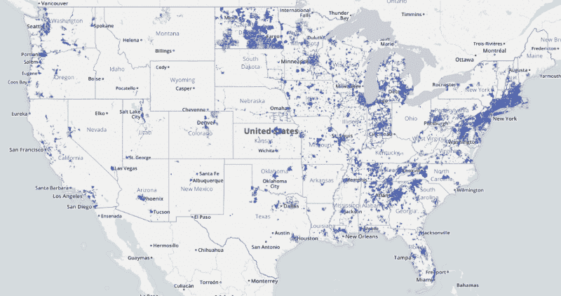

Source: [National Broadband Map](http://www.broadbandmap.gov/speedtest)

#### 宽带垄断

这里是所有消费者只有一个可用宽带提供商的地方。

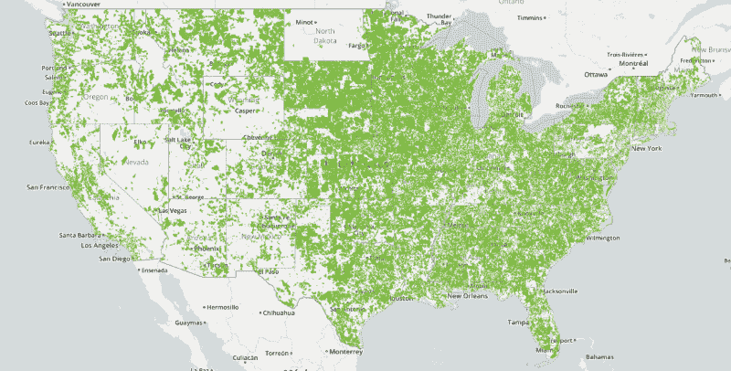

Source: [National Broadband Map](https://broadbandmap.fcc.gov/#/)

#### 宽带速度测试与广告

不足为奇的是，这些垄断企业并不总是坦诚他们的互联网有多快。粉红色越深，宽带公司就越夸大其互联网服务的速度。

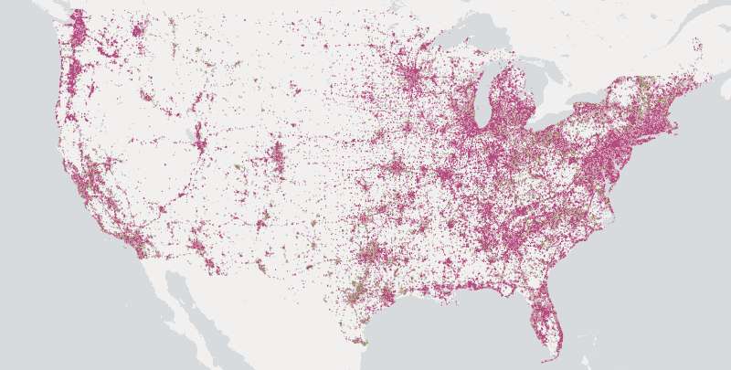

Source: [National Broadband Map](https://broadbandmap.fcc.gov/#/)

#### 互联网骨干网

互联网并不神奇——它基本上只是一大堆光缆。这是所有在美国传输互联网数据的长距离光纤。红色方块代表“长距离”光纤之间的连接。


Image credit: [InterTubes: A Study of the US Long-haul Fiber-optic
Infrastructure](http://pages.cs.wisc.edu/~pb/tubes_final.pdf)

#### 整个互联网

当然，在一个完美的世界里，互联网将是完全无国界和自由的。这是整个互联网 10 年前的样子(现在更复杂了)。各个辐条是 IP 地址:


Image credit: [opte.org](http://www.opte.org/maps/)

### 周游全国

美国州际公路系统是一个连接所有主要城市的 77，017 公里(47，856 英里)的高速公路网络。艾森豪威尔总统在 1956 年委托它作为运输军事装备和物资的一种方式。它花了 35 年时间和经通胀调整的 5000 亿美元才完成。

它看起来是这样的:

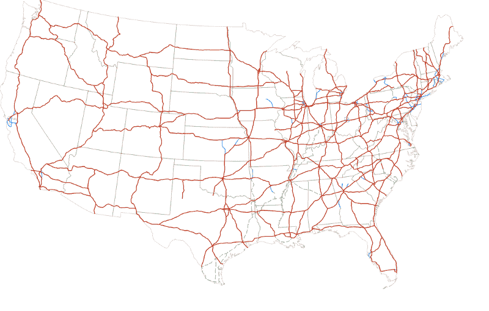

但我更喜欢这种风格化的表现:

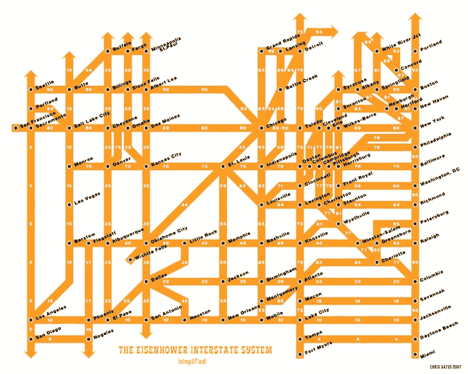

Image credit: [Chris Yates](http://www.chrisyates.net/reprographics/index.php?page=424)

#### 布里奇斯

桥梁是我们道路系统的重要组成部分。这是美国所有的 60 万座桥梁。其中大约 10%(红色的)是结构缺陷。

桥梁总是倒塌，经常导致人员死亡。它们在使用寿命结束时需要维护和更换，尽管这可能[相当昂贵](https://en.wikipedia.org/wiki/Eastern_span_replacement_of_the_San_Francisco%E2%80%93Oakland_Bay_Bridge)。

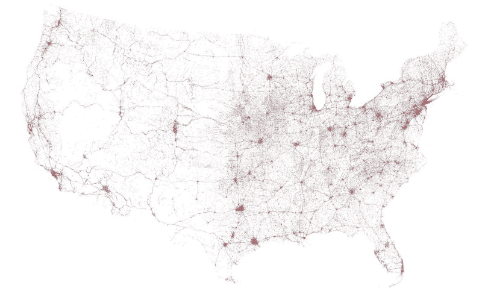

Image credit: [The Washington Post](https://www.washingtonpost.com/graphics/national/maps-of-american-infrastrucure/)

如今，大多数人都很匆忙，更喜欢坐飞机。

#### 机场和它们之间的航班

仅在美国大陆，去年就有超过 800 万次航班。那可是大量的二氧化碳排放啊！

这些航班看起来是这样的:

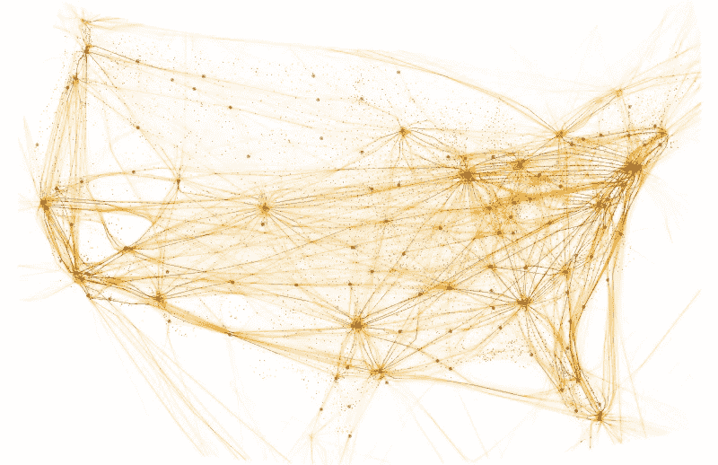

Image credit: [The Washington Post](https://www.washingtonpost.com/graphics/national/maps-of-american-infrastrucure/)

#### 乘火车

美国的另一种运输方式是通过其铁路网络。

下图中的圆圈是美国国家铁路客运公司的客运站。

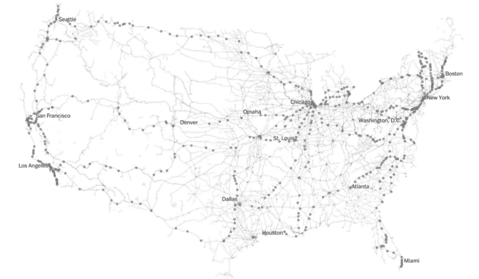

Image credit: [The Washington Post](https://www.washingtonpost.com/graphics/national/maps-of-american-infrastrucure/)

#### 港口和海上旅行

对于重型货物，通过海路运输仍然是最具成本效益的方式。

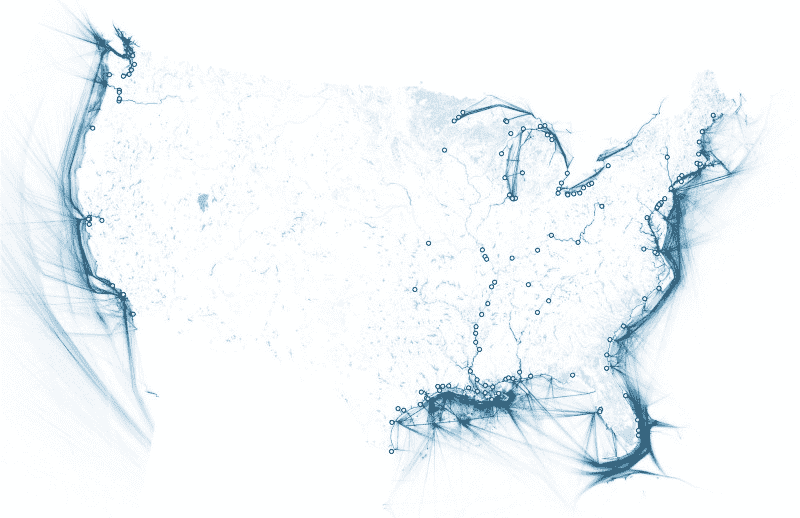

Image credit: [The Washington Post](https://www.washingtonpost.com/graphics/national/maps-of-american-infrastrucure/)

### 为国家供电

这是美国所有的发电厂，以及我们从中获取的能源:

```
+--------------+---------------+--------------------+
|    Color     |   Resource    | % of US energy mix |
+--------------+---------------+--------------------+
| Black        | Coal          | 37%                |
| Blue         | Natural gas   | 30%                |
| Not pictured | Nuclear       | 19%                |
| Not pictured | Hydroelectric | 7%                 |
| Gray         | Wind          | 3.5%               |
| Orange       | Oil           | 1%                 |
| Yellow       | Solar         | 0.1%               |
+--------------+---------------+--------------------+
```

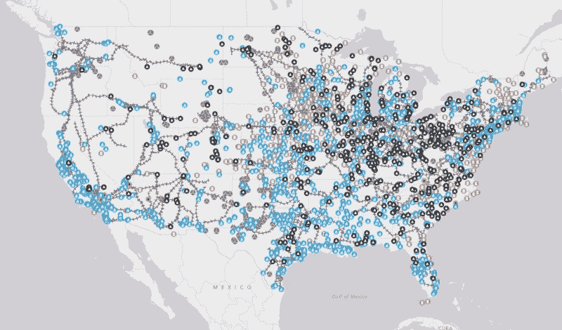

Image Credit: [Smithsonian Magazine](http://www.smithsonianmag.com/science-nature/tour-the-countrys-energy-infrastructure-through-a-new-interactive-map-8844967/)

#### 天然气管道

每一英里的州际公路，就有 6 英里的天然气管道。天然气提供了美国 30%的能源。

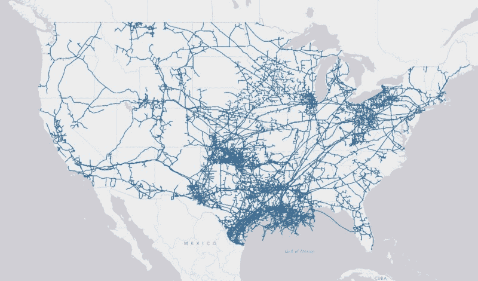

Image Credit: [Smithsonian Magazine](http://www.smithsonianmag.com/science-nature/tour-the-countrys-energy-infrastructure-through-a-new-interactive-map-8844967/)

#### 电力网

但是如果你没有分配它们的方法，这些电子有什么用呢？这是美国电网的样子:

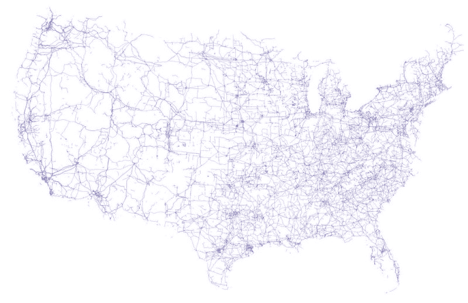

Image credit: [The Washington Post](https://www.washingtonpost.com/graphics/national/maps-of-american-infrastrucure/)

基础设施很复杂。改善美国的基础设施涉及方方面面，从填补大街上的坑洼到发射由数千颗低轨道通信卫星组成的新阵列，就像埃隆·马斯克计划做的那样。

这将涉及不断升级复杂系统中的数十亿个离散组件，就像我们身体中的细胞自我更新一样。

下次你驶上州际公路，打开电灯开关，或者发一篇文章，暂停片刻。

想象一下这些系统的宏大规模，以及数以百万计的头脑和身体使它们存在。

太美了。

如果你想了解互联网这一重要基础设施的历史，我强烈推荐你阅读凯蒂·哈夫纳的《巫师熬夜的地方》。

这本书追溯了互联网的创建，从早期仅仅连接四所大学——加州大学洛杉矶分校、斯坦福大学、UCSB 大学和麻省理工学院——开始，讲述了他们是如何设法扩大规模的。

[**奇才熬夜的地方:互联网的起源**](http://amzn.to/2hmpeFW)
[*编辑描述* amzn.to](http://amzn.to/2hmpeFW)

我只写编程和技术。如果你在推特上关注我，我不会浪费你的时间。？