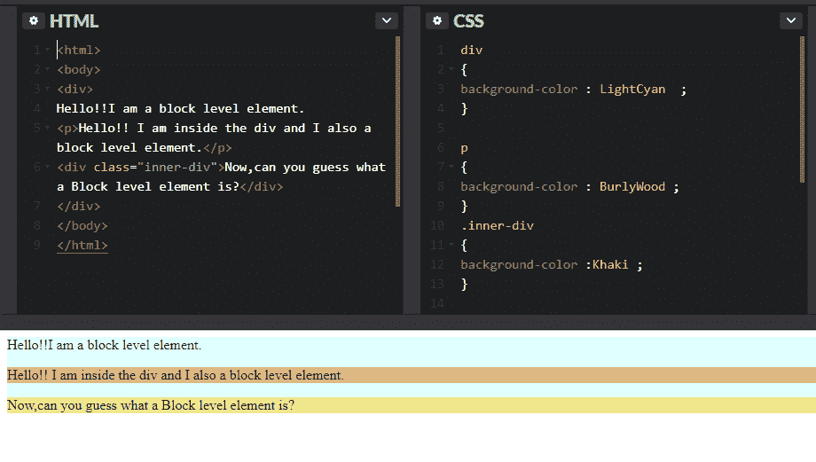
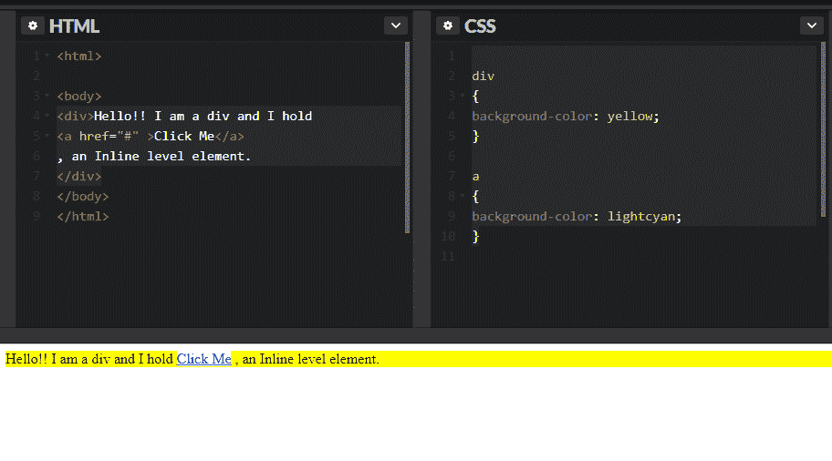

# HTML 中的行内元素和块元素-解释

> 原文：<https://www.freecodecamp.org/news/inline-elements-and-block-elements-in-html-explained/>

## **块和行内元素**

让我们用下面的例子来理解块和行内元素:

#### **带输出的代码示例:**

### 块级元素:

块级元素占据了父元素(容器)的整个空间，例如示例中的`
`和`
`。

注意`
`和`
`每次都从新的一行开始，形成一个 ****块状**** 结构。块级元素从新行开始。

常见的 ****块级元素**** 有`
`、`
`、`<article>`、`<section>`、`<figure>`、`<footer>`等。

### 内嵌元素:

内联，顾名思义就是“作为正文的一部分，而不是单独的一节”。内联元素根据需要在主元素定义的空间内占用空间。与块级元素不同，它们不从新行开始。

****内联元素**** 有`<a>`、``、``、`<code>`、`<cite>`、`<button>`、`<input>`等。

### 带有输出的代码示例:

*****注意***** :块级元素可能包含其他块级元素或者行内元素。内联元素 ****不能**** 包含块级元素。

### HTML5 中的变化

虽然理解块和内联元素仍然是相关的，但是您应该知道这些术语是在 HTML 规范的早期版本中定义的。

在 HTML5 中，一组更复杂的“内容类别”取代了块级和行内元素。在 HTML5 中，块级元素主要放在“流内容”类别中，而行内元素对应于“短语内容”类别。

有关 HTML5 中新内容类别的更多信息，包括流内容和短语内容，请参考 Mozilla 开发者网络上的[内容类别页面。](https://developer.mozilla.org/en-US/docs/Web/Guide/HTML/Content_categories)

点击阅读更多关于 HTML [的内容。](https://guide.freecodecamp.org/html)