# 在 Word 中插入复选框–如何在 Microsoft Word 中添加复选标记

> 原文：<https://www.freecodecamp.org/news/insert-a-checkbox-in-word-how-to-add-a-checkmark-in-microsoft-word/>

在 Microsoft Word 中，您可以创建数字表单、调查、待办事项列表和可打印表单。您可能需要在这些表格中添加一个复选框，以便您的回答者可以选择某些选项。

在本教程中，我将向您展示如何在 Microsoft Word 中为软拷贝文档插入交互式复选框，以及为硬拷贝(打印)文档插入非交互式复选框。然后，您可以开始在表单、调查和列表中使用它们。

在本指南中，我将使用 Microsoft Word 2016 桌面应用程序，因为这是我的个人偏好。如果您使用的是不同的版本，事情可能不完全一样，但您仍然可以继续。

## 如何在电子表格和调查等软拷贝文档中插入复选框

要在软拷贝文档中插入复选框(如您希望被调查者在 Word 文档中以数字方式填写的表单和调查)，您将使用菜单栏中的“开发人员”选项卡。

与文件、主页、插入、设计等其他选项卡不同，默认情况下,“开发人员”选项卡不会出现在菜单栏中。因此，我将从如何在菜单栏中显示 Developer 选项卡开始引导您。

### 如何显示开发人员选项卡

要在菜单栏中显示“开发人员”选项卡，首先点击“文件”:

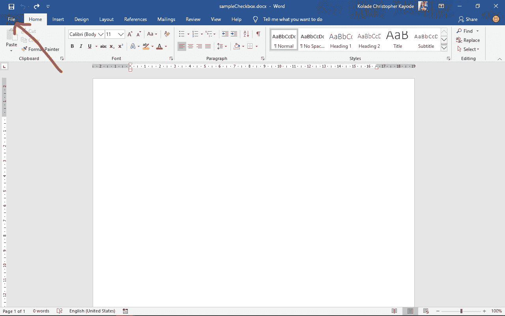

接下来，单击“选项”:

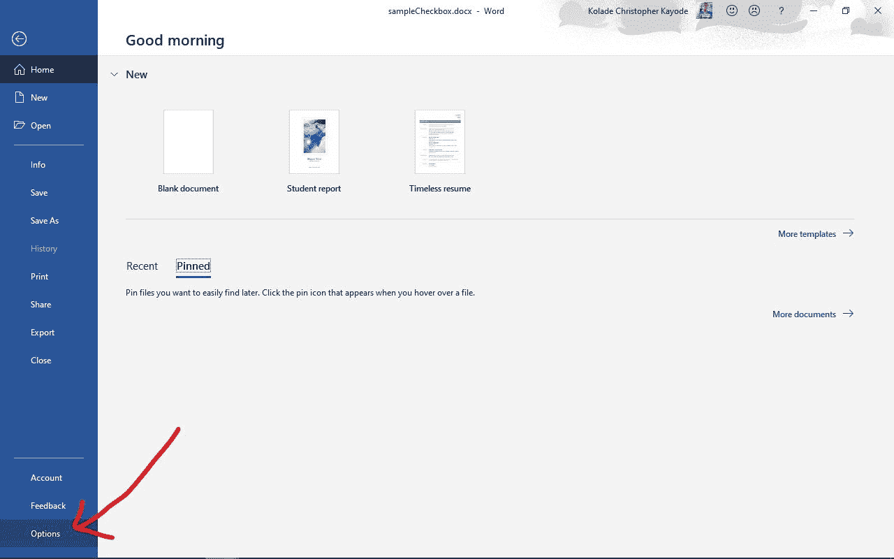

然后在弹出的窗口中选择“自定义功能区”:

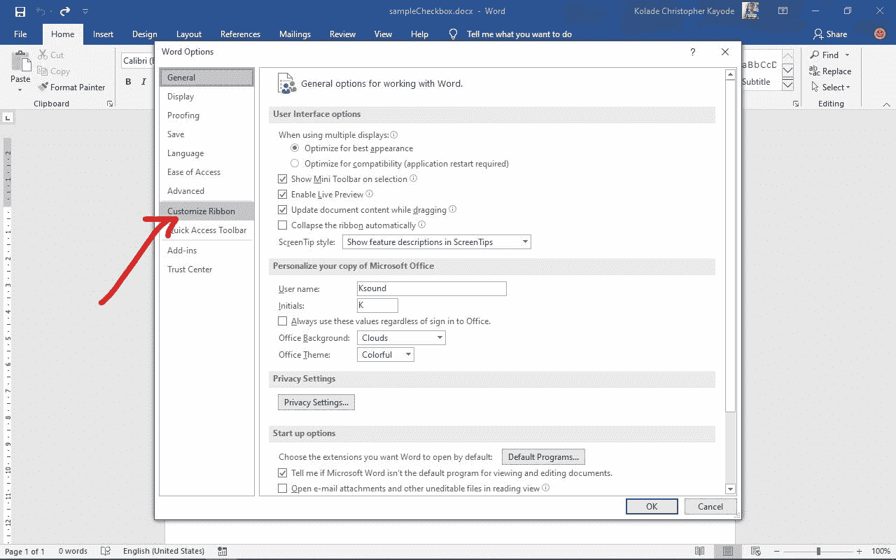

在“主选项卡”下，选中“开发人员”选项:

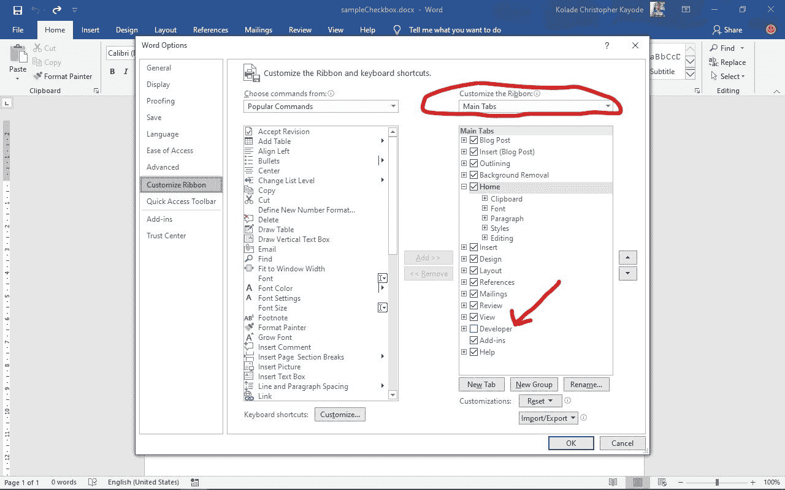

最后，点击“确定”:

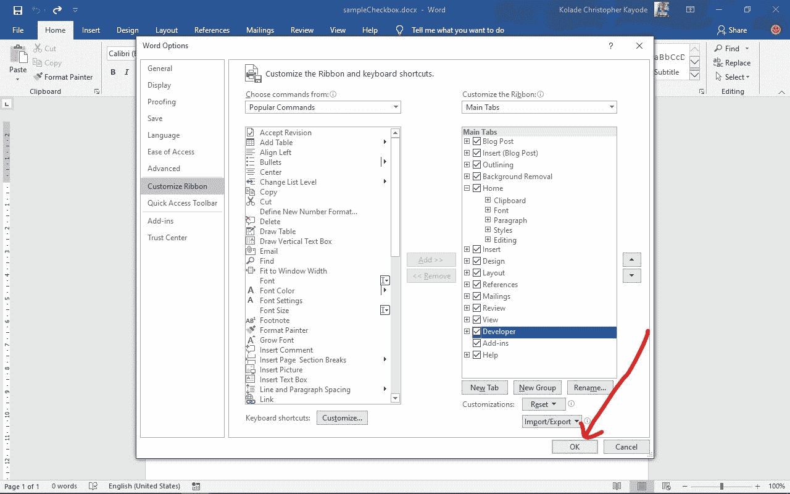

### 如何在 Word 文档中插入复选框

首先，将光标放在要插入复选框的位置。

接下来，单击菜单栏中的 Developer 选项卡。您将看到加载项、XML 映射窗格等选项，以及其他一些选项(将鼠标悬停在这些选项上时，您将看不到它们的名称)。

将鼠标悬停在带有勾号的图标上并选择它。

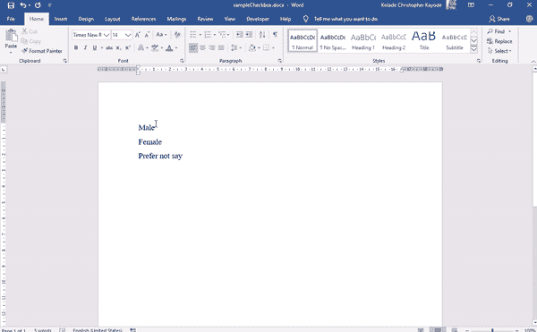

这将插入您的复选框。

### 如何更改复选框的选中状态的图标

插入复选框后，它会立即变成交互式的。唯一的问题是，默认情况下，在选中状态下会出现一个“X ”,您可能需要一个复选标记来代替它。

现在，我将向您展示如何将 X 更改为复选标记。

**步骤 1** :选中复选框，或将光标放在它的右边:

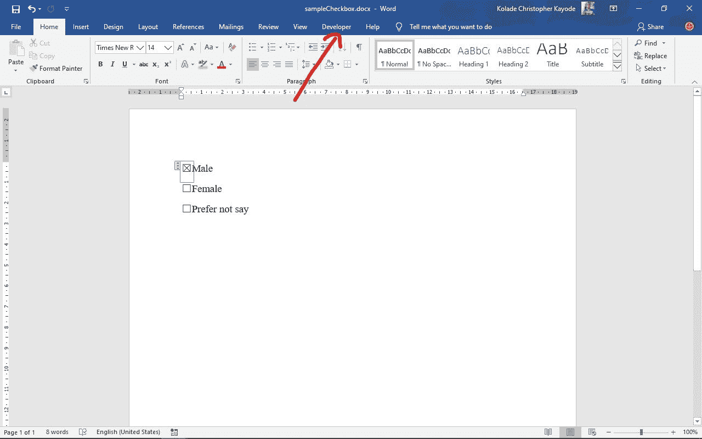

**第二步**:点击开发者选项卡，选择“属性”:

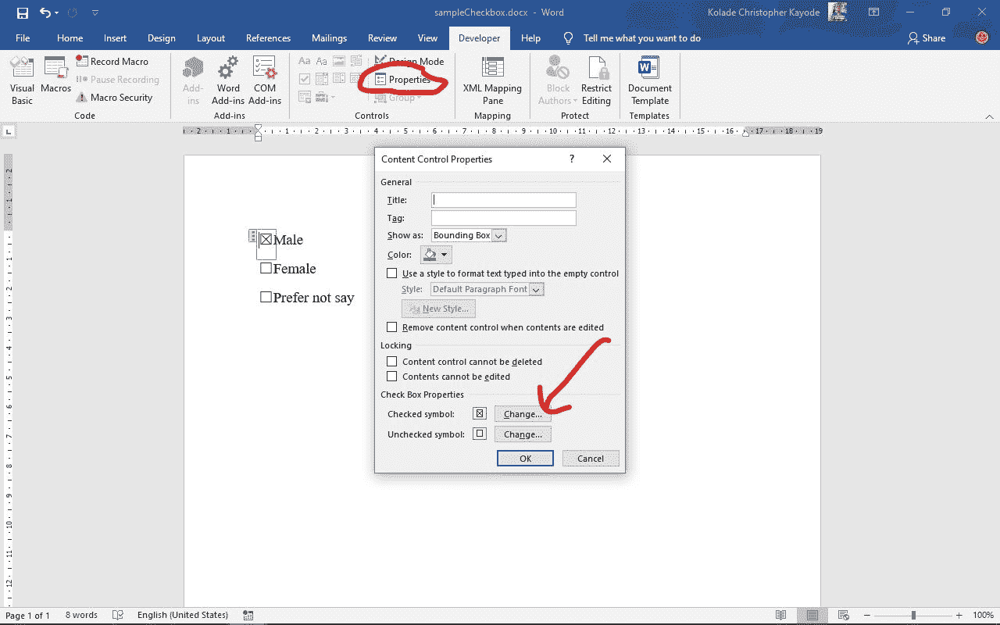

**第三步**:您将看到选中和未选中符号的默认符号。在“选中的符号”旁边，单击“更改”。

**第四步**:在弹出的窗口中，查找字体下的“winding2”并选中。您将看到用于复选框选中状态的常见复选标记图标。只需选择其中一个，点击“确定”，然后再次“确定”。

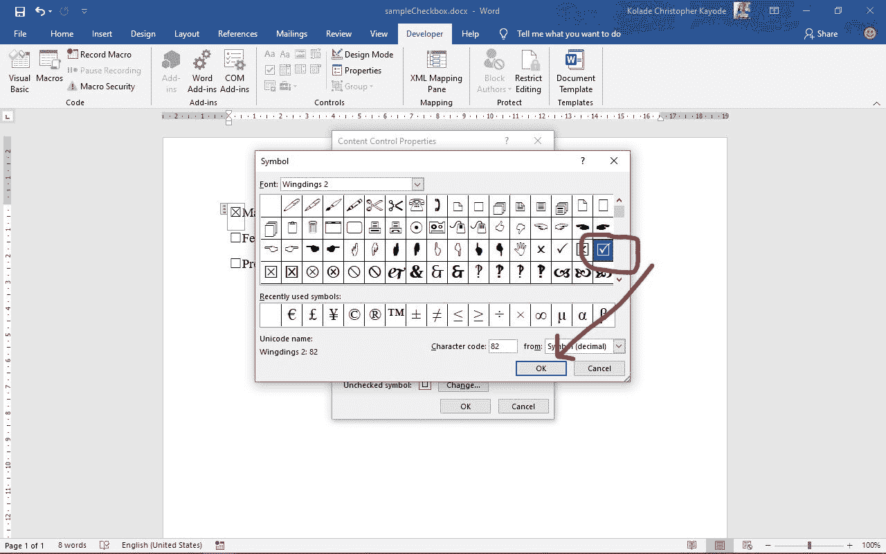

下面是演示如何更改选中图标的 gif:

您可以按照相同的过程来更改未选中状态，如下所示:

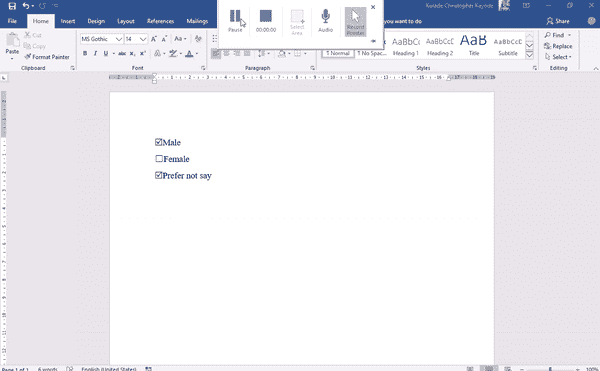

### 如何移除复选标记的边框

另一种使复选框看起来更好、更用户友好的方法是，删除复选框被选中或取消选中时以及光标位于其上时出现的边框。

**第一步**:将光标放在复选框上。

**第二步**:在菜单栏中选择开发者选项卡，点击“属性”。

**第三步**:在“显示为”的右边，点击下拉菜单，选择“无”。

下面的动画 gif 演示了上述 3 个步骤:

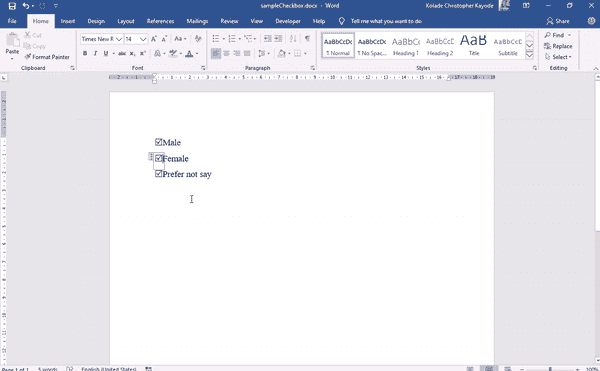

## 如何在硬拷贝(打印)文档中插入复选框

如果您正在处理打印文档，您不需要使用 Developer 选项卡来插入复选框。相反，您可以为此目的定义一个自定义项目符号。

**第一步**:确保你在菜单栏的主页选项卡上。

**第二步**:点击项目符号下拉图标:

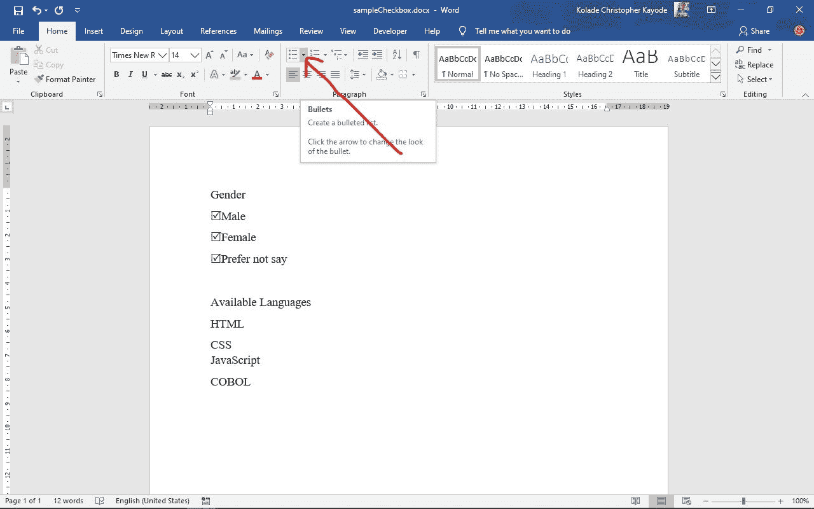

**第三步**:点击“定义新项目符号”:

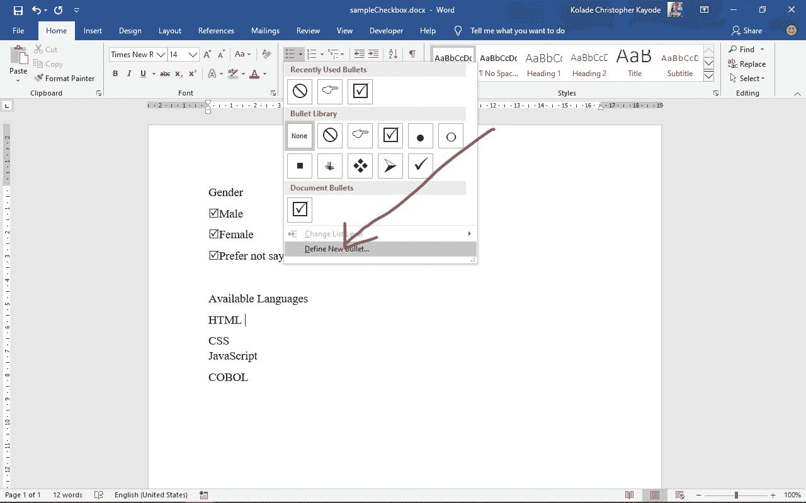

**第四步**:在弹出的菜单中选择“符号”:

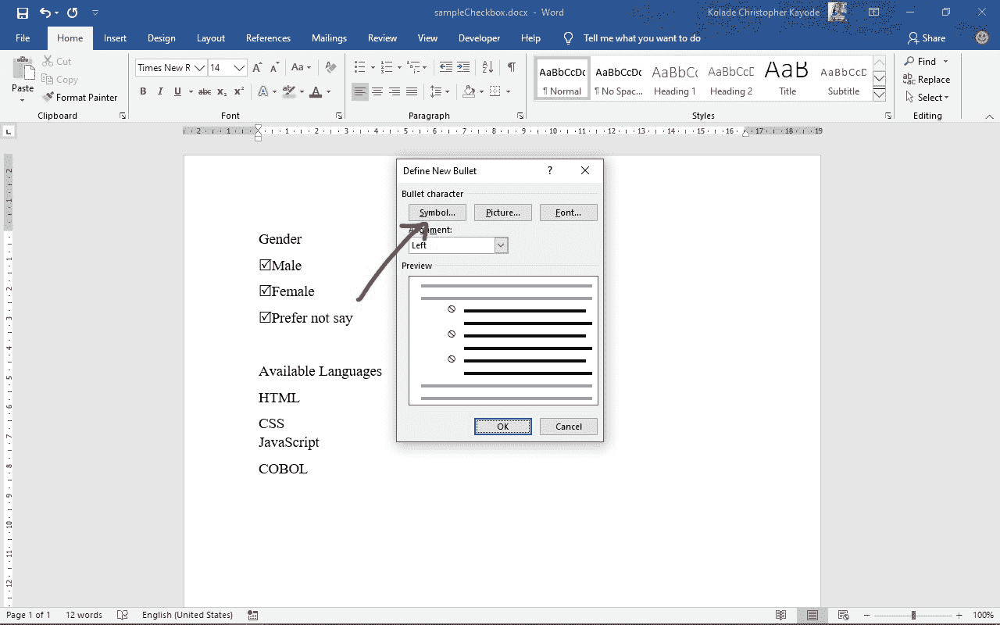

**第五步**:选择“Winding2”作为字体。

**第 6 步**:选择勾号图标，点击“确定”，再点击“确定”:

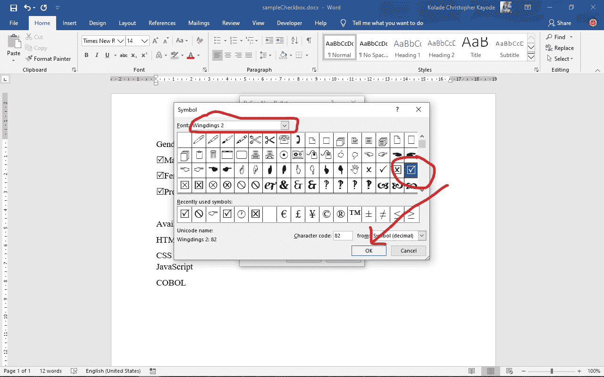

这就是全部是如何完成的:

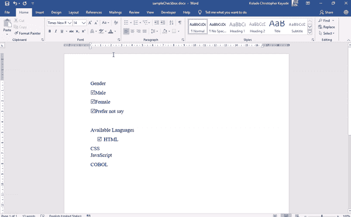

## 如何在 Word 中创建添加交互式复选框的快捷方式

如果你想继续插入更多的交互式复选框，你不需要浪费时间一直从开发者标签页插入。您可以通过以下步骤创建快捷方式。

**步骤 1** :确保复选框显示为边界框。
参考本教程“移除边界框”部分的步骤来更新如何做。

**步骤 2** :高亮显示复选框，点击菜单栏的文件选项卡:

**第三步**:点击“选项”:

**步骤 4** :在弹出的菜单中选择“校对”，然后点击“自动更正选项”:

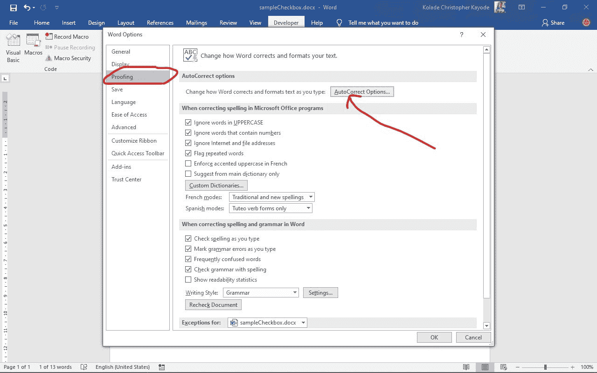

第五步:你应该看到几个选项被选中。确定“键入时替换文本”也已选中。

**第六步**:在“替换”下的编辑器中，输入你想用来插入复选框的快捷方式，点击“添加”。再次点击“确定”和“确定”。

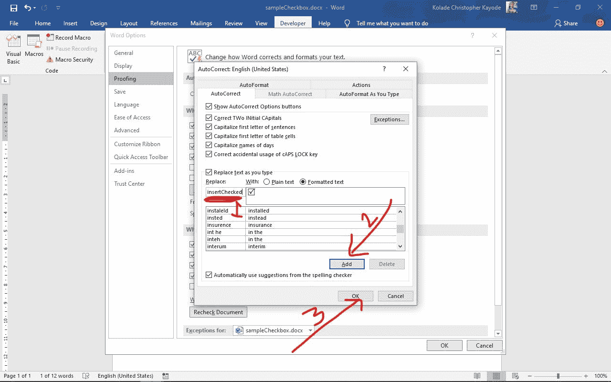

现在，要插入一个复选框，您只需输入您在步骤 6 中输入的单词，然后按空格键。

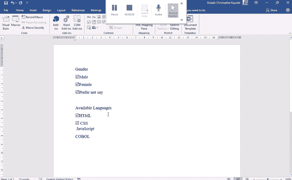

## 结论

复选框通常在使用软拷贝和打印文档的数据收集中起着至关重要的作用。我希望这篇教程能帮助你理解它们是如何工作的。

在本指南中，您学习了如何为可填写的数字文档(如表格和调查)插入交互式复选框，以及如何在打印文档中插入非交互式复选框。

感谢您的阅读，祝您愉快。