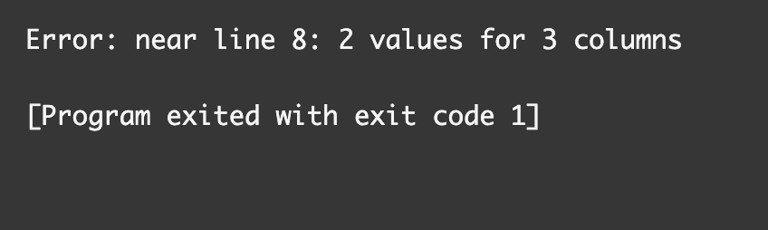
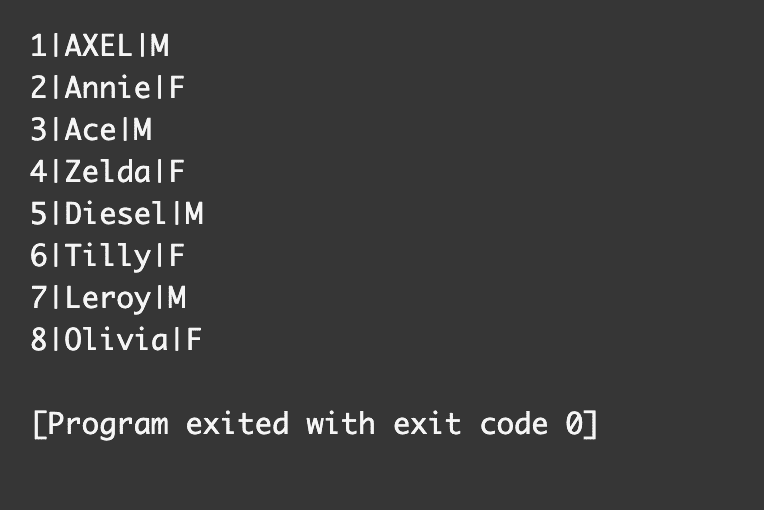

# Insert Into SQL–如何插入到表查询中[示例语句]

> 原文：<https://www.freecodecamp.org/news/insert-into-sql-how-to-insert-into-a-table-query-example-statement/>

如果您想向 SQL 表中添加数据，那么您可以使用`INSERT`语句。

在本文中，我将向您展示如何使用`INSERT`语句添加单行、多行，以及将行从一个 SQL 表复制到另一个 SQL 表。

## 基本插入语法

以下是在 SQL 中将行添加到表中的基本语法:

```
INSERT INTO table_name (column1, column2, column3,etc)
VALUES (value1, value2, value3, etc);
```

第一行代码使用了`INSERT`语句，后跟您想要添加数据的表的名称。在表名之后，应该指定列名。

第二行代码是为行添加值的地方。值的数量与指定的列的数量相匹配是很重要的，否则您将得到一个错误消息。

## 如何向 SQL 表中添加行

在这个例子中，我们有一个名为`dogs`的表，其中包含列`id`、`name`和`gender`。我们想增加一只叫`AXEL`的狗。

将`AXEL`添加到表中的代码如下所示:

```
INSERT INTO dogs(id, name, gender) VALUES (1, 'AXEL', 'M'); 
```

这是桌子的样子。


## 如果值的数量与列不匹配，会发生什么情况？

如前所述，列的数量必须与值的数量相匹配。

如果我修改代码来删除一个值，那么我会得到一个错误消息。

```
INSERT INTO dogs(id, name, gender) VALUES (1, 'AXEL');
```



因为我们指定了 3 列，所以我们需要为添加到表中的每一行提供三个值。

## 如果忽略列约束会发生什么？

创建 SQL 表时，将添加列约束，作为列的规则。

在我们的`dogs`表中，`name`和`gender`列有一个约束`NOT NULL`。这条规则意味着行中不能没有值。

当我试图为`gender`添加`NULL`时，我返回一条错误消息。

```
INSERT INTO dogs(id, name, gender) VALUES (1, 'AXEL', NULL); 
```


在添加行时，需要考虑您在创建 SQL 表时指定的任何约束。

## 如何在 SQL 中将多行添加到一个表中

如果您想一次向表中添加多行，可以使用以下语法:

```
INSERT INTO table_name (column1, column2, column3,etc)
VALUES 
	(value1, value2, value3, etc),
    (value1, value2, value3, etc),
    (value1, value2, value3, etc); 
```

记住每行之间的逗号是很重要的，否则你会得到一个错误信息。


将八只狗同时添加到表中的代码如下所示:

```
INSERT INTO dogs(id, name, gender) 
VALUES 
    (1, 'AXEL', 'M'),
    (2, 'Annie', 'F'),
    (3, 'Ace', 'M'),
    (4, 'Zelda', 'F'),
    (5, 'Diesel', 'M'),
    (6, 'Tilly', 'F'),
    (7, 'Leroy', 'M'),
    (8, 'Olivia', 'F');
```

这张桌子现在是这样的:



## 如何从一个表中复制行并将其插入到另一个表中

您可以使用`SELECT`和`INSERT`语句将行从一个 SQL 表复制到另一个 SQL 表。

这是基本语法:

```
INSERT INTO table_name1 (columns) 
SELECT columns FROM table_name2;
```

在这个例子中，我创建了一个包含三行的`cats`表，它们的列名与`dogs`表相同。


我们可以使用以下代码将所有的`cats`数据添加到`dogs`表中:

```
INSERT INTO dogs SELECT * FROM  cats; 
```

这是添加了`cats`的新`dogs`表的外观:


## 结论

如果您想向 SQL 表中添加数据，那么您可以使用`INSERT`语句。

以下是向 SQL 表添加行的基本语法:

```
INSERT INTO table_name (column1, column2, column3,etc)
VALUES (value1, value2, value3, etc);
```

第二行代码是为行添加值的地方。值的数量与指定的列的数量相匹配是很重要的，否则您将得到一个错误消息。

当您试图在向表中添加行时忽略列约束时，将会收到一条错误消息。

如果您想一次向表中添加多行，可以使用以下语法:

```
INSERT INTO table_name (column1, column2, column3,etc)
VALUES 
	(value1, value2, value3, etc),
    (value1, value2, value3, etc),
    (value1, value2, value3, etc);
```

您可以使用`SELECT`和`INSERT`语句将行从一个 SQL 表复制到另一个 SQL 表。

这是基本语法:

```
INSERT INTO table_name1 (columns) 
SELECT columns FROM table_name2;
```

我希望您喜欢这篇文章，并祝您的 SQL 之旅好运。