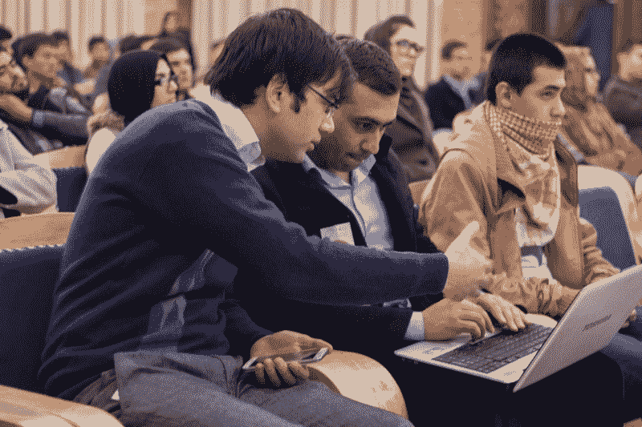
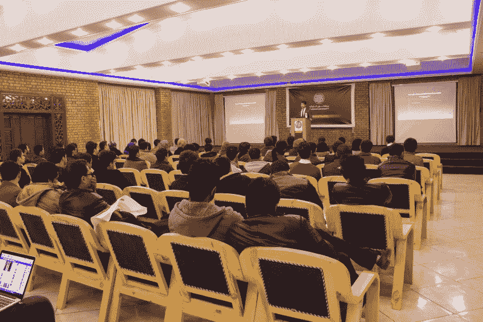
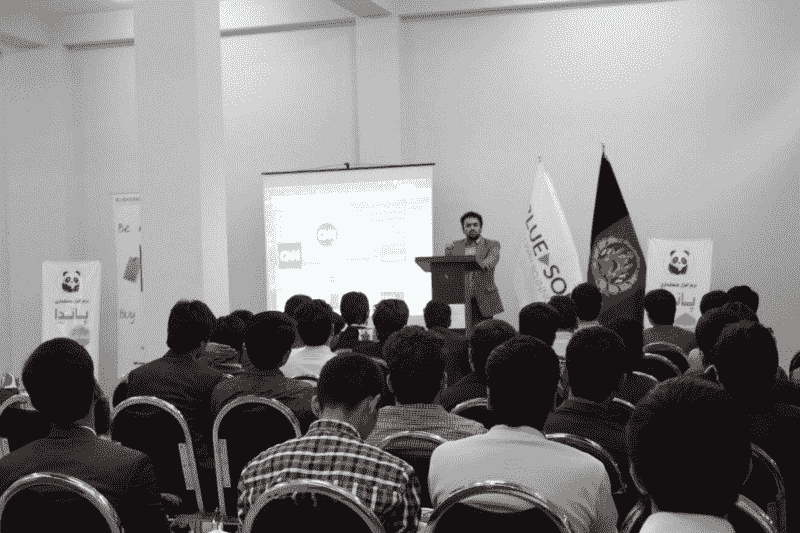
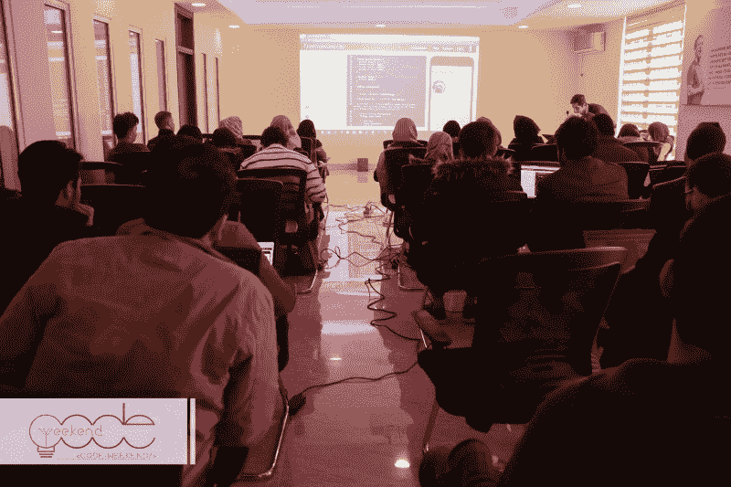

# 在阿富汗最友好的编码俱乐部里

> 原文：<https://www.freecodecamp.org/news/inside-afghanistans-friendliest-coding-club-d553719579e/>

当你想到阿富汗时，你可能会想到持续了 17 年的战争，这场战争夺去了成千上万人的生命。

但在所有的混乱中，一代软件开发人员正在努力将喀布尔——阿富汗的首都和 500 万人的家园——重新定义为全球技术中心。

每个周末，数十名雄心勃勃的开发人员会在喀布尔附近的办公室会面，一起编写代码，并互相分享他们的知识。

### 进入 code weekend——一个拓展喀布尔科技领域的草根组织

超过 3000 名阿富汗开发人员和培训中的开发人员是 CodeWeekend 的成员。

CodeWeekend 每个周末都会在喀布尔举办编码活动。

迄今为止，他们已经举办了 100 多场活动。

One participant helps another with their code.

CodeWeekend 吸收了自由代码营喀布尔研究小组，现在已经成为自己的非营利组织。它的重点是帮助喀布尔当地人提高他们的编程技能，并建立他们的专业网络。

他们通过举办免费的编程研讨会、提供交流机会以及帮助人们更容易获得技术来实现这一目标。

> “我们有两种类型的会议。我们每周一次的会议教编程新手。我们的每月活动将软件开发人员和其他技术专业人员聚集在一起，让他们可以分享知识，并提供交流的机会。”
> 
> ——贾韦德·曼苏尔，CodeWeekend 组织者

CodeWeekend 社区竭尽全力做到尽可能的包容。

它有一套严格执行的行为准则，在硅谷的科技会议上也同样适用。

行为准则鼓励以下行为:

*   使用欢迎和包容的语言
*   尊重不同的观点和经历
*   优雅地接受建设性的批评
*   关注对社区最有利的事情
*   对其他社区成员表示同情

Milad Mehraban gives a tech talk at Kardan university in Kabul

CodeWeekend 被分解成邻里级别的章节——每个章节都有章节领导。这些分会领导人联系当地公司和组织，为活动争取赞助商和场地。

> “我们不会在活动上花费太多。我们需要一个场地和一些点心，也许还需要一台投影仪。每当我们想举办活动时，我们会联系一家私营机构，让他们为我们提供空间和互联网。我们希望至少有一个小房间，我们可以在那里有一个专用的场地。”——Mustafa Ehsan，CodeWeekend 导师

每个事件大约 3 小时长。首先，老师们会对一个主题进行高层次的介绍。然后每个人都开始学习 freeCodeCamp.org 的课程。当人们遇到困难或有问题时，3 或 4 名导师会四处帮助他们。

> “我们每周都有热情高涨的员工前来。每当我们没有活动，人们就会打电话问我们为什么没有。他们真的想要这个。”——Mustafa Ehsan，CodeWeekend 导师

他们的志愿者努力正在发挥作用。来自 CodeWeekend 社区的人们开始从事开发工作。

他们的社区成员获得的许多工作都涉及为阿富汗政府以及当地和国际初创公司和公司提供建筑服务。

例如，他们的团队为人力资源部门和其他后台部门构建和维护 web 应用程序。

在这个过程中，他们开始使用令人兴奋的新工具，如 Vue.js 和 Laravel。

### “代码周末”和“喀布尔自由代码营”的幕后人员

freeCodeCamp Kabul teacher Mustafa Ehsan leads many of the CodeWeekend events.

Jamshid Hashimi 是 CodeWeekend 的创始人。13 岁时，他在自己长大的农村创办了一个足球俱乐部。

他继续在土耳其的 Dokuz Eylul 大学学习，然后在 Rumie 和 Alidrivers 等公司工作。

CodeWeekend 是他的两大激情——技术和社区建设——的完美结合，所以他在 2014 年创建了这个组织。

Shaheen Naikpay 的职业不是开发人员。他有教育心理学背景。他是该行业军事方面的项目经理。

但是沙欣说他喜欢为社会做贡献，而 CodeWeekend 是其中很大的一部分。他志愿担任 CodeWeekend 的活动管理协调员。

有些活动是由穆斯塔法的雇主 Netlinks 赞助的。Netlinks 的首席执行官积极鼓励 CodeWeekend 在公司的大厅举办活动。

贾韦德·曼苏尔在印度完成了他的计算机科学学位。他是一名数据库工程师。他在喀布尔帮助组织“代码周末”活动。

[Fazila Nazary](https://www.linkedin.com/in/fazila-nazary-076761134/) 是一位经验丰富的数据库开发人员和讲师。她是阿富汗另一个城市马扎里沙里夫的 CodeWeekend 主任。

该组织也有一个广泛的定期活动导师名单，包括[穆斯塔法·埃桑](https://www.linkedin.com/in/mustafaaloko/)、[贾拉勒·赛迪](https://www.linkedin.com/in/said-jalal-saidi/)、[塞迪克·汗](https://www.linkedin.com/in/sediq-khan-738660109/)、穆罕默德·阿里·阿巴西和[阿克毛·阿张](https://www.linkedin.com/in/akmal-arzhang-2a226b96/?lipi=urn%3Ali%3Apage%3Ad_flagship3_search_srp_people%3BtGg0uo7MS9qrxyOTLaw4%2BA%3D%3D&licu=urn%3Ali%3Acontrol%3Ad_flagship3_search_srp_people-search_srp_result&lici=ZmzGWSlKQeWRCjDAH2MImw%3D%3D)。

如果你要去卡布尔旅行，一定要参加脸书 CodeWeekend 组织，这样你就可以参加他们的活动。

你也可以支持全世界数百万正在学习编码的人。向 freeCodeCamp.org 进行免税捐赠。

我们可以一起创造更多的免费教育资源。我们可以支持 CodeWeekend 这样的社区，以及它们对社区中人们生活的影响。