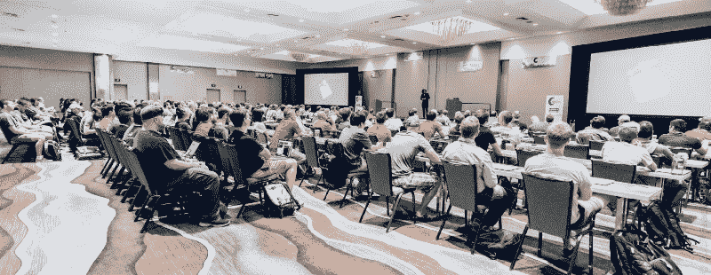
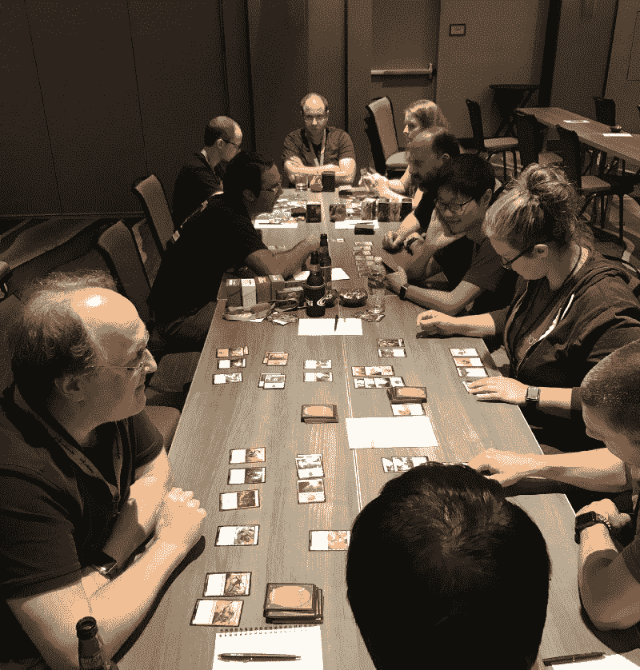
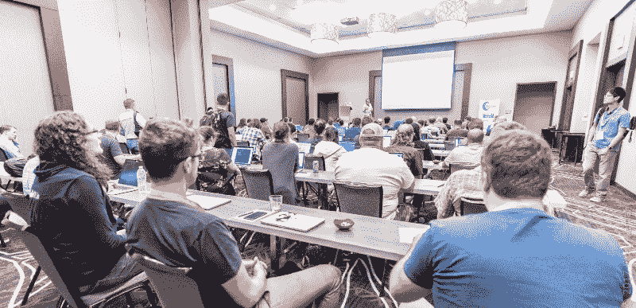
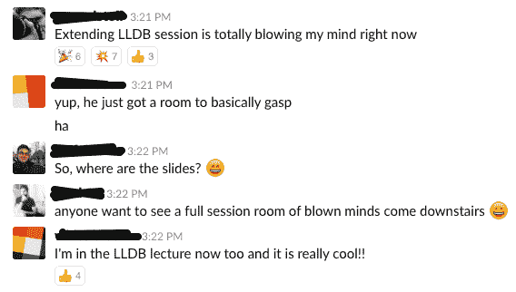

# 从新手的角度看 360iDev 会议

> 原文：<https://www.freecodecamp.org/news/inside-the-360idev-conference-through-the-eyes-of-a-first-timer-f1f639c7e52a/>

作者:陈庭威

# 从新手的角度看 360iDev 会议

Keynote by [@khanlou](https://twitter.com/khanlou) — Photo credit: Fuad Kamal [https://anaara.com/](https://anaara.com/)

我最近在丹佛参加了四天拥挤的 360 视频会议，这是世界上规模最大、持续时间最长的独立 iOS/Mac 会议。

作为一个 iOS 开发世界的新人，在聊天和了解了几十个与会者之后，我突然想到，我很可能是大会上最缺乏经验的 iOS 开发人员之一。

我认为，写下我的会议经历可以给那些刚刚开始使用 iOS 的人，以及那些从一开始就参加 360iDev 的人带来新的视角。

在过去的几年里，我一直是一名全栈工程师，但最近我决定辞职，去追求 iOS 领域的职业生涯。我现在已经在 iOS 和 Swift 工作了大约三个月，在这里写了一点我的经历。过去，我参加过 Python 和 web 会议，但从未参加过与 iOS 相关的会议。

360iDev 是我参加过的最有影响力的会议。

#### 环境

我过去参加的所有会议都吹嘘有成千上万的与会者。360iDev 要小得多——今年只有 270 人参加。你开始碰到同样的人。你开始建立联系。你开始建立友谊。

由于规模较小，会议感觉几乎是随意的，这完全是一件好事。许多活动都是通过大会 Slack 团队和 [Beacon app](http://beacon.party/) (由主题演讲人 [@khanlou](https://twitter.com/khanlou) 创建)非正式地自发组织的。

午餐时间，附近的快餐车和餐馆一片混乱。兴趣小组开始在 Slack 和 Beacon 中出现——有魔法:聚会、甜甜圈跑、Pokemon Go 突袭，以及去机场的拼车。我觉得这种随意拉近了我们的距离。

MTG FTW

由于会议的规模，所需的实际空间相对较小。今年，360iDev 在一家酒店举办。真的只有一个地方可以交流，查看公司展位，最重要的是，可以买到随时供应的咖啡(组织者，干得好！).

这确保了你经常会碰到人，并且很容易协调兴趣小组的会面点。这也为在会议间隙与其他人交流留出了充足的时间，而不是穿过会议中心匆忙赶往下一个会议。

#### 演讲者和与会者

据我统计，近四分之一的与会者是演讲者。我会和一个在电梯里偶遇的随机与会者聊天，或者一起去一个午餐点，结果发现他们正在做一个我计划在当天晚些时候参加的演讲。这种情况在我身上发生过好几次。

我想象 WWDC 会有很大的不同——演讲者(苹果员工)不会逗留太久，或者根本不会与与会者互动。但在 360iDev，我有很多机会(通过 Slack 或亲自)去接触演讲者并与他们交谈。

作为 iOS 社区中的一个受欢迎的会议，该会议吸引了业内一些最优秀和最聪明的人作为演讲者和与会者。作为一名新人，我必须警告你:这可能会变得超现实。你会看到你在 Twitter 上关注的人在大厅对面喝着可乐，在电梯里系鞋带，甚至在你旁边的小便池里撒尿(这发生在我身上！).

因此，你将看到他们做正常的、人类的事情，并有机会与他们交谈，而不是“把你的英雄放在基座上”。

#### 会谈

该会议有三个或四个轨道，这意味着通常有三个或四个会谈/会议同时进行。贴了这么多吸引人的谈话描述，很自然地，FOMO 进入了我的脑海。我应该参加哪些讲座？如果那个比这个好呢？

幸运的是，会议的录音将在未来几周内发布在网上，演讲者将幻灯片和其他材料发布在会议 Slack 频道上。

Full house for [@_aijaz_](https://twitter.com/_aijaz_)’s session on Advanced Debugging with Xcode — Photo credit: Fuad Kamal [https://anaara.com/](https://anaara.com/)

360iDev 的演讲者(至少我去过的演讲者)通常会以**为什么** 开始谈论他们的话题。然后，他们讨论了**为什么** 对他们个人或职业来说很重要，而不是直接进入他们正在谈论的***。***

***这种形式不同于在 WWDC 举行的会议。那些更关注未来和新的东西。看着 360iDev 的演讲者谈论他们现在正在做的事情**真的让我产生了共鸣。作为该领域的新人，它帮助我了解了他们作为 iOS 开发人员的日常斗争和思维过程。我听到了很多克服这些困难的建议和策略。*****

*****这些课程的结构也很合理，因此每个课程都适合所有专业水平的开发人员。当话题深入时，演讲的描述很清晰，我不觉得我参加的任何演讲太难懂。没有一个演讲者假定他们对自己的主题有广泛的先验知识。*****

*****

Did I mention the occasional mind-blowing talk? This is what the chatter in the conference Slack looked like during [@_aijaz_](https://twitter.com/_aijaz_)’s talk.***** 

*****想要更好地了解演讲要点，请看来自与会者、演讲者和播客 [@timmitra](https://twitter.com/timmitra) 的[这篇文章](https://www.raywenderlich.com/169338/360idev-2017-conference-highlights)。*****

#### *****(我的)主题和要点*****

*****《国情咨文》的主题演讲中有一张幻灯片对我来说是真实的。它只是说:“**帮助他人成为他们自己。*******

*****在整个会议期间，我会碰到我认识的与会者。然后他们会把我介绍给他们认为我应该认识的其他人。他们给我指出了他们认为我应该为我的项目检查的开源工具。我甚至被邀请校对你现在正在读的这篇文章。在那四天里，一直有一种乐于助人的气氛。*****

*****我还感受到了一种热情，这是我以前在会议上从未感受过的。晚上的社交活动充满了关于当前项目的对话、对下一个项目的想法、Swift 语言新发现的特性以及对 iOS 开发的普遍兴奋。*****

*****快节奏的应用行业的本质可能与此有很大关系。然而，离开 360iDev 时，很难不感受到社区的鼓舞和激励。*****

*****对于那些考虑将来参加 iOS 会议的人，我怎么推荐 360iDev 都不为过。对于像我这样内向的人来说，我知道整天的会议社交会让人筋疲力尽。但 360iDev 打破了许多障碍，为与会者创造了一个特别友好和有吸引力的环境。丹佛也是一个很酷的地方:)*****

*****下次见， [@360iDev](https://twitter.com/360iDev) ！*****

*****你可以通过 Twitter [@nathanwchan](https://twitter.com/nathanwchan) 联系我，或者在下面留言。*****