# 开放互联网的未来——以及我们的生活方式——掌握在你们手中

> 原文：<https://www.freecodecamp.org/news/inside-the-invisible-war-for-the-open-internet-dd31a29a3f08/>

这些天发生了很多可怕的事情，但下面是让我晚上睡不着的事情。一些公司正在把我们的开放互联网变成这样:

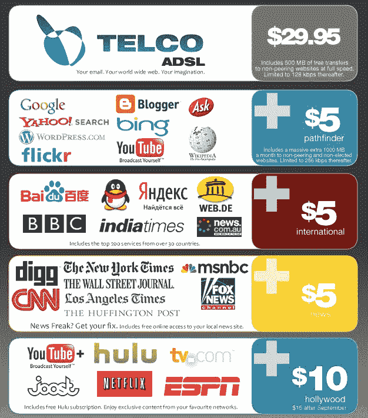

这些公司想封锁互联网，让我们只能进入几个有围墙的花园。他们想烧掉亚历山大图书馆，用杂志架取而代之。

为什么？因为那样他们会赚更多的钱。

这听起来可能像阴谋论，但这一进程正以惊人的速度向前发展。

#### 历史正在重演。

到目前为止，互联网的故事遵循了在过去 160 年中降临到其他信息技术身上的同样的悲剧叙事:

*   电报
*   电话
*   电影
*   收音机
*   电视机

每一个都有大致相同的故事情节:

1.  发明家发现了这项技术。
2.  业余爱好者率先应用了这项技术，并推广了它。
3.  公司注意到了。他们将技术商业化，提炼，并扩大规模。
4.  一旦这些公司足够强大，他们就欺骗政府帮助他们锁定技术。他们把自己定位为“自然垄断者”。
5.  经过长时间的停滞后，一种新技术出现了，它颠覆了旧技术。有时，这将打破旧的垄断。但有时这只会让他们更加坚定。

这个循环重复了太多次，以至于创造了“网络中立”这个术语的哈佛大学法学教授 Tim Wu 给它起了个名字:**这个循环**。

> “历史显示了信息技术的典型发展，从某人的爱好到某人的产业；从临时拼凑的装置到巧妙制作的奇迹；从自由进入的渠道到由单一公司或卡特尔严格控制的渠道——从开放系统到封闭系统。”—蒂姆·吴

现在，我们正处于开放互联网叙事的第四步。我们被垄断所包围。

问题是我们已经在第四步走了几十年了。而且看不到第五步。经济学家约瑟夫·熊彼特在 20 世纪初首次观察到的创造性破坏尚未实现。

互联网似乎很特别。这是终极信息技术——能够取代电报、电话、广播、电影、电视等等——而且没有明确的方法来破坏它。

但是争夺互联网制高点的战争远未结束。这个全球棋盘上有许多玩家。政府。电信垄断。像谷歌和脸书这样的互联网巨头。非政府组织。初创公司。黑客。而且——最重要的是——**你**。

开放互联网之战是我们这个时代的决定性问题。这是对人类交流结构的争夺。人类的交流是我们与几千代祖先慢慢带领我们走向的乌托邦——或者是奥威尔式、赫胥黎式、卡夫卡式的反乌托邦——的唯一区别。

在这篇文章结束时，你会明白发生了什么，推动这一现象的市场力量，以及你如何帮助阻止它。我们将谈论操纵封锁互联网的厚颜无耻的垄断者，为保持互联网开放而奋斗的好斗的理想主义者，以及对这场未来之战完全漠不关心的绝大多数人。

在第一部分中，我们将探索什么是开放互联网，并深入探究在此之前的技术革命的历史。

在第二部分，我们将讨论原子。互联网的物理基础设施。互联网骨干网。通信卫星。提供宽带互联网的铜缆和光缆的“最后一英里”。

在第 3 部分，我们将讨论 bits。互联网的开放、分布式特性，以及它是如何被世界上一些最大的跨国公司封锁在围墙花园中的。

在第四部分，我们将探索所有这些对消费者和创业公司的意义。你会看到你如何帮助拯救开放的互联网。我将分享一些你作为互联网公民可以采取的实际步骤，尽自己的一份力量，保持互联网的开放。

这是一篇很长的阅读。所以，拿起一杯热饮，准备好将大量的技术历史下载到你的大脑中。

### 第 1 部分:什么是开放的互联网？

“Number 31” by Jackson Pollock. 1950\. Household paints on canvas.

只有一个词可以形容开放的互联网:**混乱**。

开放的互联网是 30 亿个声音相互尖叫的杂音。这是一个尘土飞扬、杂乱无章的集市。而且很乱。但是它产生了我们这个时代一些最伟大的艺术和工业。

开放的互联网是一个米尔顿式的思想市场，由斯密式的自由市场资本主义的无形之手引导。

开放的互联网是分布式的。它一部分归每个人所有，一部分不归任何人所有。它在很大程度上存在于政府边界之外。它是这样设计的。

这反映了温顿·瑟夫、鲍勃·汗、J. C. R .利克里德以及所有熬夜的互联网先驱们的智慧。他们已经看到了降临在电报、电话、广播和电视上的反资本主义和社团主义的命运。他们不想在他们的发明中加入这些。

开放互联网是新墨西哥州绗缝者协会。这是一个[杰瑞米·雷纳粉丝俱乐部](http://www.jeremyleerenner.com/)。这是北卡罗莱纳州[的诗歌大满贯](https://www.poetryslamasheville.com/)。这是一个华盛顿特区的黑客空间。这是加利福尼亚州特拉基市的一个市政网站。这是一个[巴比伦 5 同人小说网站](http://www.b5-dark-mirror.co.uk/)。

开放的互联网是一个通用工具，任何人都可以发布内容，然后任何人都可以消费这些内容。这是思想和执行力的寒武纪大爆发。

这些网站能在自上而下、命令控制的封闭互联网中生存吗？他们会为类似有线电视的包装清单上的“货架空间”付费吗？他们会为拥挤的围墙花园中的一点关注付费吗？

#### 我们都被困在这个循环中

这里有一段互联网出现之前的信息技术的简史，以及公司和政府将它们整合的速度。

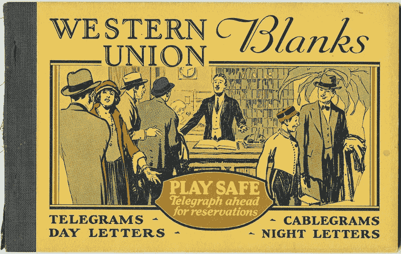

最初，任何人都可以系上一些电缆，然后开始向他们的朋友发送莫尔斯电码信息。电报是一个有趣的工具，也有一些实际应用。当地企业围绕着它出现了。

这种情况在 1851 年发生了变化，当时西联公司架设了横贯大陆的线路，并在它们之间建立了中继站。

如果小型电报公司想要参与竞争，他们需要接入西联的网络。很快，他们就被完全排挤出去了。

西联汇款一度强大到能够单枪匹马地安插一位美国总统。如果你在美国长大，你可能会记得这位总统小时候的名字:卢瑟福·b·海斯。

西联汇款不仅在经济上支持海斯的竞选，还利用其作为信息中枢的独特地位从事间谍活动。它能够读取海耶斯的政治对手发来的电报，并确保海耶斯总是领先一步。

西联汇款的主导地位——以及垄断定价——将持续数十年，直到亚历山大·格雷厄姆·贝尔用他新发明的电话扰乱了它的业务。

#### 电话是如何成为这个循环的牺牲品的

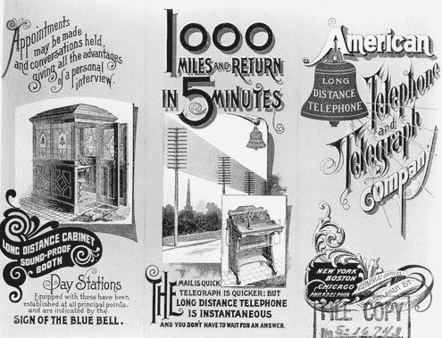

在经历了一段时间的电话专线和本地电话公司之后，美国电话电报公司在 JP 摩根的支持下建立了一个覆盖全美的长途电话网络。

为了让当地电话公司的客户能够给其他城市的人打电话，这些公司必须向美国电话电报公司支付长途网络使用费。

西奥多·维尔——一个仁慈的垄断者——认为完全控制美国的电话系统是避免混乱、浪费的资本主义竞争的最好方法。他认为他的方式对消费者更有利。平心而论，的确如此。至少在短期内是这样。

维尔能够利用美国电话电报公司的垄断利润来补贴农村电话线路的发展。这帮助他迅速连接了整个美国，并将其统一在一个单一的标准化系统下。

但是仁慈的垄断者的问题是他们不会永远活着。他们迟早会被第二代首席执行官取代，而第二代首席执行官往往缺乏他们前任的任何理想主义。他们只追求一件事——资本家的特权——最大化股东价值。这意味着获得利润，分配股息，并超过季度收益预期。这意味着从顾客身上榨取尽可能多的钱。

美国电话电报公司最终彻底挤走了他们的竞争对手。一旦美国电话电报公司的垄断变得明显，美国政府就采取行动对其进行监管。但美国电话电报公司比其监管者聪明得多，抓住机会成为国家支持的“自然垄断企业”

在 1982 年被联邦通信委员会打破之前，美国电话电报公司享受了几十年的垄断利润。

但是“小铃铛”不会分裂太久。1997 年，他们开始重新合并成一个比解散前更大的公司。

最终结果是这个星球上最强大的公司之一——强大到足以将其垄断从固定电话行业扩展到新兴的无线电信行业。

美国电话电报公司的职能类似于政府的一个分支，拥有广泛的研究实验室，但有一个主要的例外——它可以对任何它认为对其核心业务构成威胁的发明保密。

语音邮件——以及后来被用作计算机关键数据存储介质的数字磁带——实际上是 1934 年在美国电话电报公司的一个实验室里发明的。但是他们把它埋了。几十年后才被重新发明。

想象一下，如果有这样一种可靠的大容量数据存储介质，信息技术领域在这段时间里会取得多大的进步。

为了让你对美国电话电报公司的这个决定可能给人类带来的损失有所了解，想象一下一家公司故意将电子邮件的引入推迟了十年。对社会生产力的总体影响是什么？这样的行动会让我们损失多少万亿美元的经济活动？这是一个警示性的故事，告诉我们当你把科学研究和发展留给私营企业而不是公共实验室和大学时会发生什么。

当你给一个来自其他州的老年人打电话时，你仍然可以感受到美国电话电报公司垄断的遗产。他们会本能地尽量缩短通话时间，因为他们想避免历史上与此类通话相关的巨额长途费用，尽管这些费用已不再适用。

我以为这只是我的祖母，但它是每个人的祖母。整整几代人都受到了美国电话电报公司垄断定价的伤害。

#### 电影如何成为循环的牺牲品

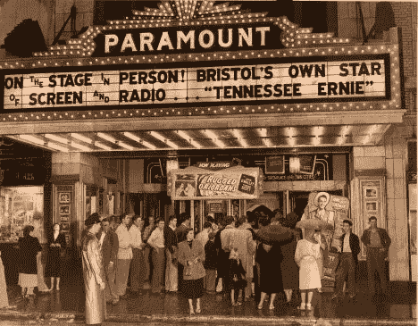

在电影发明后不久，美国有数千家电影院放映各种题材的独立制作的电影。任何人都可以制作一部电影，然后在当地影院放映。

阿道夫·祖克创立派拉蒙电影公司后，情况发生了变化。他开创了“批量预订”的做法。如果小型独立影院想放映，比如说，最新的梅·韦斯特电影，他们还需要购买和放映一系列其他出租电影。

这剥夺了剧院老板作为当地时尚引领者的地位，也削弱了他们迎合当地人口的能力。结果是电影院的商品化，并最终导致大片电影的兴起。

#### 无线电是如何成为这个循环的牺牲品的

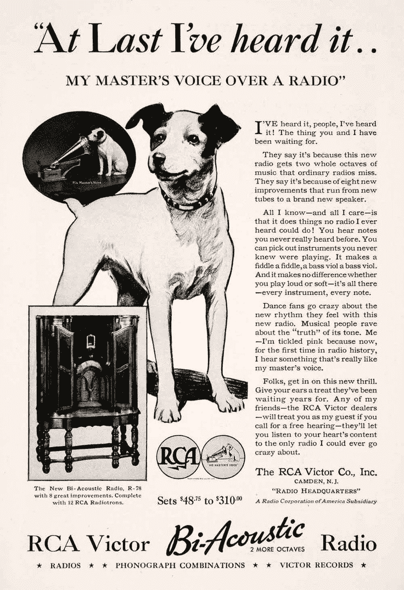

在马可尼或者特斯拉发明无线电后不久，一场大规模的业余爱好者运动围绕着无线电兴起。有数以千计的地方广播电台播放业余节目。

1986 年，大卫·沙诺夫接任美国无线电公司(RCA)总裁。他可能是 20 世纪最不择手段的首席执行官。

当时，RCA 正在生产无线电零件。当时的传统想法是，RCA 应该把重点放在硬件上，让尽可能多的无线电台运行，让尽可能多的收音机进入家庭。但是萨诺夫意识到真正的钱在于内容。他帮助推广了美国国家广播公司(NBC ),转而专注于通过广告赚钱。

然后，萨诺夫找到了联邦无线电委员会——现在的联邦通信委员会(FCC)——并说服他们，既然无线电频谱是一种稀缺商品，他们应该分割它并发放许可证。

很快，每个家庭都可以收看全国广播公司的节目，当地业余爱好者的广播电台被挤掉了。RCA 现在是垂直整合的——从无线电台的部分，到消费者收音机的部分，再到广播内容本身。

萨诺夫曾与电视的发明者交谈过，知道电视最终会扰乱无线电。但是他有一个计划。声称自己发明了电视。

#### 电视是如何成为这个循环的牺牲品的

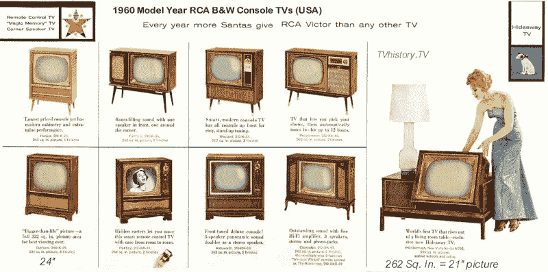

在这里，电视不同于其他形式的技术，因为它没有业余爱好者的舞台。在联邦通信委员会的帮助下，萨诺夫和美国无线电公司立即封锁了电视。结果是几十年来，美国人只有三个频道可供选择——NBC、CBS 和 ABC。

这是大众文化的巅峰——一半的美国人同时在看同一集《我爱露西》。电视的普及——加上这种垄断导致的节目缺乏多样性——带来的社会和政治后果至今仍困扰着我们。

#### 开放的互联网会成为循环的牺牲品吗？

我们已经完成了发明步骤。基础设施来自 DARPA，万维网本身来自 CERN。

我们已经经历了业余爱好阶段。每个人现在都知道互联网是什么，以及它的一些惊人的能力。

我们已经走过了商业化的一步。垄断出现了，完善了，扩大了互联网。

但问题依然存在:我们能与所有之前的信息帝国所遭遇的悲惨历史决裂吗？这一次会不同吗？

### 第二部分:原子之战

“IBM Cable Ball” by David Lan. 2007\. Cables.

> "任何足够先进的技术都和魔法没什么区别。"—亚瑟·C·克拉克第三定律

尽管我们可能认为互联网是一个无处不在的纯抽象领域，但它有一个物理结构。这不是魔法。每天都有越来越多的人意识到这一现实。

互联网是一系列穿过地面和海底隧道的铜缆和光缆。我们称之为互联网主干。它看起来是这样的:

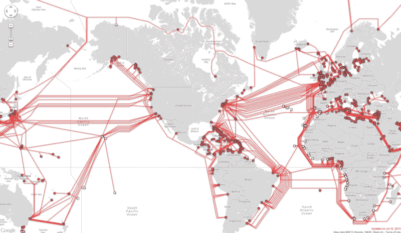

然后，互联网通过地区主干网进一步分布。这是在美国传输互联网数据的所有光纤。红色方块代表“长距离”光纤之间的连接。

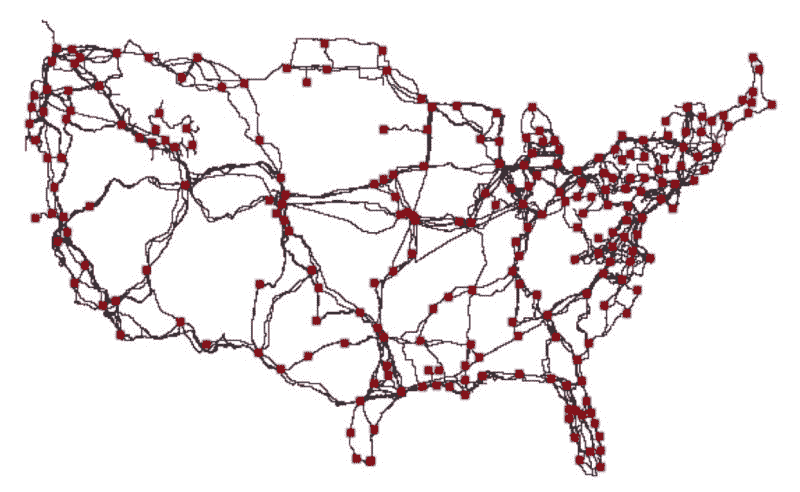

Image credit: [InterTubes: A Study of the US Long-haul Fiber-optic
Infrastructure](http://pages.cs.wisc.edu/~pb/tubes_final.pdf)

#### 互联网的隐形主力:主干网提供商

六大公司控制着主干网，它们在没有任何金钱交易的情况下相互“传递”流量:

*   三级通信
*   Telia 承运人
*   NTT
*   令人信服的
*   遗传性转化试验
*   塔塔通信公司。

在美国，主干网主要由老牌长途运营商控制，包括威瑞森和美国电话电报公司，它们还控制着美国 2000 亿美元无线产业的三分之二。

这些公司通过由其他公司控制的主干连接“对等”流量，或者通过“传输协议”互相付费。

尽管有这些大型电信公司的参与，互联网主干代表了一个相当健康的市场。大约 40%的互联网主干由你从未听说过的小型网络控制。

#### 互联网黑手党:互联网服务提供商

另一方面，宽带互联网市场一点也不健康。这是接入互联网主干网的电缆的“最后一英里”。到处都是丑陋的收费亭，由律师和游说者的厚板凳守卫着。

这一宽带互联网市场仅由三家极其强大且广为憎恨的互联网服务提供商(ISP)控制:

*   艇长
*   Charter(最近收购了另一家互联网服务提供商时代华纳)
*   还有美国最令人讨厌的公司康卡斯特，它控制了美国 56%的宽带

ISP 的另一种形式是无线提供商:

*   美国电话电报公司(American Telephone and Telegraph Company)
*   威瑞森(以前是美国电话电报公司的一部分)

这两家供应商控制了 2/3 的无线市场。如果你有一部手机，你很有可能每月向这些公司中的一家支付数据套餐费用。

这些 ISP 控制着上世纪 70 年代埋在地下的数百万英里铜缆，以及上世纪 90 年代发射到轨道上的卫星。他们不断地违反 T2 的法律、T4 的法律，让监管者陷入漫长的法庭之战，让任何人——甚至是谷歌——都无法进入他们的市场。

互联网服务提供商这么做只有一个原因:这样他们可以避免自由市场竞争——以及它需要的昂贵的技术升级——同时他们继续从 2/3 的美国人那里攫取垄断租金,这些美国人在他们的社区里只有一个宽带互联网的选择。

在过去的两年里，公众有了反对这些互联网服务提供商的武器。这不会对他们造成致命伤害，但它有助于击退他们的垄断倾向。这叫做网络中立。

#### 网络中立如何工作

互联网服务提供商的故事基本上可以归结为:他们曾经从电缆包中赚了一大笔钱。但人们发现，一旦有了互联网，他们就不再关心有线电视了——他们只想要数据套餐，这样他们就可以看 YouTube、网飞或任何他们想看的节目——他们也可以消费大量非视频内容。

然而，互联网服务提供商卖给你的数据套餐远不如卖给你的有线电视套餐那么多。因此，他们的目标是通过将互联网锁定为“频道”和“捆绑包”，然后强迫你购买它们，从而回到“美好的旧时光”。

我们如何防止这种情况发生？好消息是我们已经有了。2015 年，FCC 通过了一项法律，将 ISP 作为公用事业进行监管。这是基于“网络中立”的原则，即所有通过网络的信息都应得到平等对待。

作为其 2015 年关于网络中立的决定的一部分，FCC 要求公众就此话题发表意见。300 万美国人写信给联邦通信委员会。不到 1%的人反对网络中立。

在与电信公司进行了一场艰苦的斗争后，我们说服联邦通信委员会将网络中立写入法律。

FCC 的 Title II 法规创建了三条“明线”,防止 ISP 从事以下行为:

1.  阻止网站内容
2.  减慢网站内容的速度
3.  接受网站的钱来加速他们的内容

这些规则使得无论一家公司多么富有和强大——苹果和谷歌是世界上最大的公司，微软和脸书也紧随其后——他们都不能购买互联网的优先使用权。

每个人都必须在公平的环境中竞争。这些科技企业集团必须与斗志昂扬的初创公司、夫妻店、甚至在自己的领域运营 WordPress 的独立博客作者竞争。

没有人能超越网络中立。这是一个尽可能简单的工具，用来保护资本主义自由市场互联网，防止垄断者滥用权力。

现在，互联网服务提供商被视为公用事业。通过网络路由的数据包与通过地下管道输送的水或通过电网流动的电流有何不同？

自来水公司不应该管你是打开水龙头洗碗还是洗澡。

电力公司不应该关心你插的是电视还是烤面包机。

互联网服务提供商不应该关心你想要什么数据或者你用它做什么。

互联网服务提供商想要摆脱网络中立的原因很简单:如果我们不再像对待公用事业那样对待他们，他们就可以想办法收取更多的钱。

以下是美国电话电报公司前首席执行官展示他的邪恶计划:

> “现在他们想免费使用我的管道，但我不会让他们这么做，因为我们已经花了这笔资金，我们必须有回报。所以必须有一些机制让这些使用这些管道的人支付他们使用的部分。为什么允许他们用我的管子？从这个意义上来说，互联网不可能是免费的，因为我们和有线电视公司已经为谷歌或雅虎做了投资。或者 Vonage 或者任何期望免费使用这些管道的人都是疯子！”—爱德华·惠特克，美国电话电报公司首席执行官

他当然应该意识到的是，每个人都已经在为互联网接入付费了。你付钱是为了能看到这篇文章。我付钱把这篇文章放到网上。这个网站付费将流量从它的服务器传送到你的电脑上。

我们都已经付费使用这些 ISP 的最后一英里电缆。没有人免费使用这些管道。

但互联网服务提供商看到了二次探底的机会。他们想对带宽收费，也向网站收取黑手党所谓的“保护费”他们本质上希望能够对网站所有者说:“你那里有一些可爱的数据包。如果它们在传递给用户的过程中丢失了，那就太遗憾了。”

当然，大部分开放的互联网付不起这笔“保护费”给 ISP，所以 ISP 会封锁他们网站的流量，切断消费者与大部分开放互联网的联系。但是互联网服务提供商不需要屏蔽这些网站。ISP 需要做的只是引入一点延迟。

谷歌和微软都做过研究，表明如果你把一个网站的速度减慢 250 毫秒——大约眨眼的时间——大多数人都会放弃这个网站。

没错——速度不是特性，而是吸引观众的基本前提。我们人类极度缺乏耐心，并且随着时间的流逝变得越来越没有耐心。

这意味着，在实践中，如果一个 ISP 人为地降低一个网站的速度，实际上就像完全屏蔽这个网站一样有害。这两种行为会导致相同的结果——严重的流量损失。

流量是网站的命脉。没有流量，商品就卖不出去。服务不会被订阅。捐款是不会有的。

没有流量，开放的网络就会消亡——不管 ISP 是否屏蔽它。

#### 互联网服务提供商对网络中立性发起了全面攻击

随着 1 月份美国政府的更迭和第 45 任总统的当选，FCC 也发生了变化。

联邦通信委员会主席 Ajit Pai——一位前威瑞森律师——现在控制着互联网服务提供商唯一的监管机构。这是他的原话:

> “我们需要启动除草机，取消那些阻碍投资、创新和创造就业的规则。”公平竞争委员会主席 Ajit Pai

互联网服务提供商不会将他们的“保护费”再投资于基础设施。他们已经有了难以置信的垄断利润。以下是他们 2016 年的净收入(税后利润):

*   美国电话电报公司:160 亿美元
*   威瑞森:130 亿美元
*   康卡斯特 80 亿美元
*   宪章 80 亿美元

他们有大量的利润，可以用来改善基础设施。他们选择将这笔钱分给股东。

短短两个月，派主席已经对网络中立造成了不可思议的破坏。他撤销了对明显违反网络中立法律的四家垄断企业的零评级诉讼。现在，康卡斯特和美国电话电报公司可以继续传输他们自己的视频服务，而不用考虑用户的数据上限，联邦通信委员会对此也无能为力。

前 FCC 主席汤姆·惠勒(Tom Wheeler)尽最大努力接触 Pai 主席，并让他相信网络中立的好处。在惠勒任职的最后 18 个月里，两人计划每两周会面一次。但是 Pai 取消了所有的会议。

> “你必须拥有开放的网络——没有许可的创新。句号。讨论结束。他们对未来至关重要。”——前联邦通信委员会主席汤姆·惠勒

### 第三部分:比特之战

“Sweet as One” by Craig and Karl. 2016\. Candy.

后网络中立互联网看起来像什么？看看苹果应用商店就知道了。

app store 中有 200 万个应用，2016 年共分享了 280 亿美元。苹果从每笔销售中抽取 30%的佣金，仅 app store 一项就赚了 84 亿美元。

剩下的 200 亿美元中的大部分都流向了少数几家手机游戏公司:

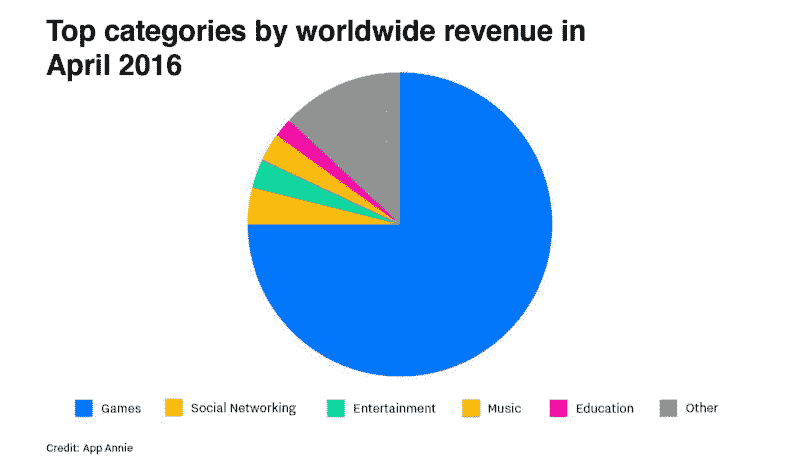

大多数 iPhone 用户每月下载的应用程序为零。

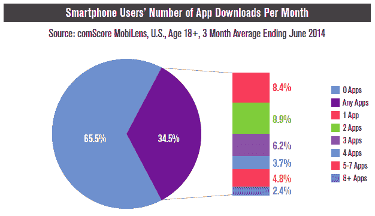

那些懒得下载新应用的少数人最终并没有下载很多。

app store 中排名前八的应用程序都由两家公司拥有:脸书和谷歌。

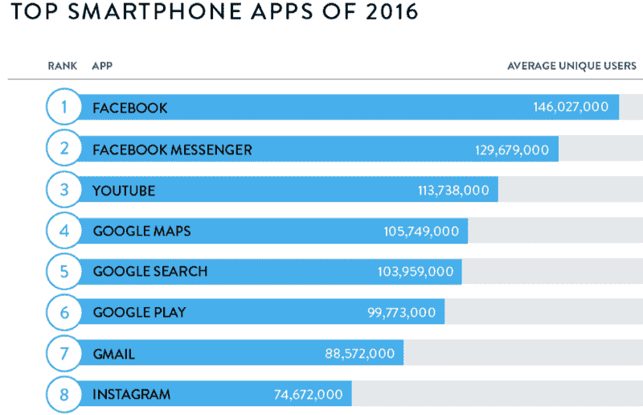

剩下的 200 万个应用中的绝大多数获得的流量很少——甚至更少的钱。

苹果应用商店不是一个公平的竞争环境。它不像它所基于的开放互联网。相反，这是一个围墙花园的例子。

有围墙的花园看起来很漂亮。它们是最受欢迎的植物群的家园。但是毫无疑问，你不可能在任何一个方向上冒险走得很远而不碰壁。

每一个有围墙的花园都有一个看门人，他铲除看起来像杂草的植物。如果你想在有围墙的花园里种东西，你必须得到看门人的批准。苹果是最积极的看门人之一。它将与自身利益相竞争的应用程序拒之门外，而 T2 则审查不符合其公司世界观的应用程序。

#### 围墙花园简史

首先是互联网最初的围墙花园，美国在线。

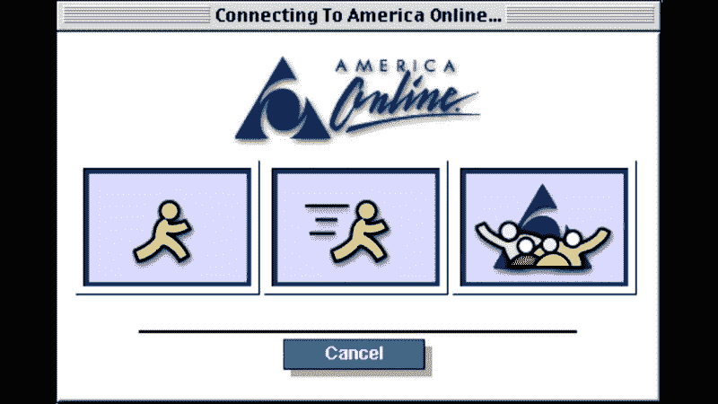

20 年后，AOL 仍有 200 万用户每月向他们支付 20 美元。建造有围墙的花园并把用户困在里面可以赚很多钱。

后来出现了雅虎，它不是一个被设计成围墙的花园，但无论如何它还是成为了一个花园，因为人们对互联网是如此陌生。

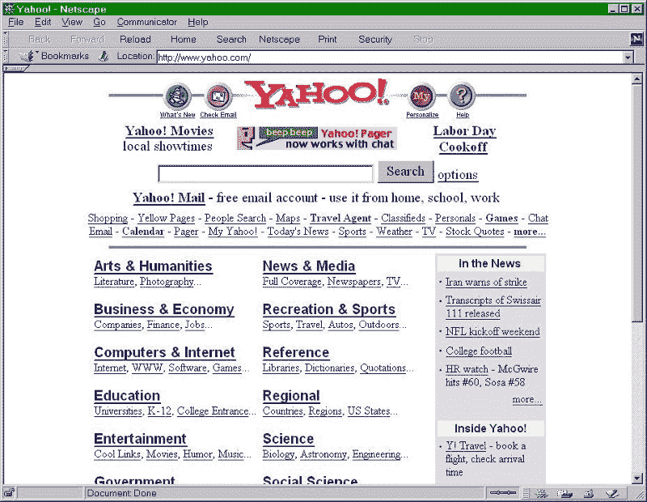

在 90 年代末，初创公司专门筹集资金，这样他们就可以在雅虎上购买横幅广告。这是他们接触潜在用户的最佳方式。

但与终极围墙花园脸书相比，雅虎就像阳光下的蜡烛。

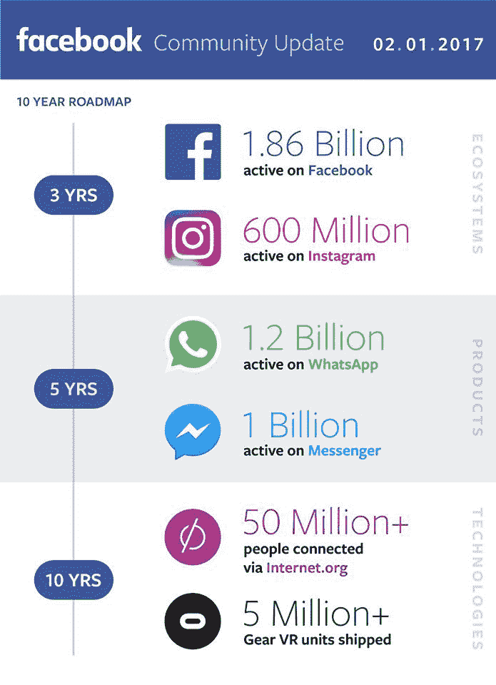

地球上四分之一的人平均每天使用脸书 50 分钟。

马克·扎克伯格吹嘘的与 Internet.org 有联系的 5000 万人呢？这些人来自极度贫穷的国家，他们有两个选择:要么付费使用开放的互联网，要么免费使用脸书。他们选择了脸书。

Internet.org 这个阴险的名字在印度和其他国家被拒绝是出了名的，在印度，活动家们能够让人们意识到，如果接受脸书而不是开放的互联网，印度人会放弃所有的东西。

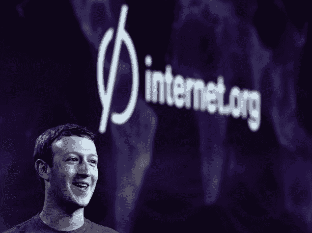

The zero in internet.org un-ironically stands for Zero Rating, an anti-Net Neutrality practice that’s illegal in most western countries.

马克·扎克伯格可能是好意，但他正在迅速摧毁开放的互联网。在他贪婪地寻求扩大脸书市场份额的过程中，他甚至建立了一个[复杂的审查工具](https://www.nytimes.com/2016/11/22/technology/facebook-censorship-tool-china.html)，这样脸书可以安抚那些目前被封锁的国家的政府，比如中国。

脸书只是几家从这种封闭源代码、封闭数据的花园平台中获利的互联网公司之一。

以下是全球市值最大的 10 家公司:

1.  苹果公司
2.  字母表(谷歌)
3.  微软
4.  埃克森美孚
5.  强生公司
6.  通用电气
7.  Amazon.com
8.  脸谱网
9.  富国银行
10.  美国电话电报公司(American Telephone and Telegraph Company)

它们都是总部设在美国的跨国公司。10 个里面有 5 个是互联网公司，还有一个是 ISP。

一旦你越过银行和石油公司的最后一口气，你就会清楚地看到，这些互联网公司就是新秩序。他们控制信息。他们控制了对话。他们控制政治。脸书赢得了新总统选举——[连总统和他的顾问都承认这一点](http://www.theverge.com/2016/11/13/13619148/trump-facebook-twitter-helped-win)。

那么，是什么让你认为他们不会来控制他们所主宰的互联网呢？

即使推出一个网站的成本下降了，接触受众的成本却在持续上升。

**脸书和谷歌占了[所有花费在网络广告上的新资金的 85%](https://www.nytimes.com/2016/04/18/business/media-websites-battle-falteringad-revenue-and-traffic.html)**。其他人——报纸、博客、视频网络——都在争夺面包屑——从脸书和谷歌嘴里掉下来的 15%。

[**一半的互联网流量**](https://www.wired.com/2014/06/net_neutrality_missing/) **现在只流向 30 个网站。**剩下的一半分散在目前由谷歌索引的 60 万亿个独立网页中。

如果你熟悉长尾分布的概念，你会把这种现象理解为一个极胖的脑袋和一条极长极细的尾巴。

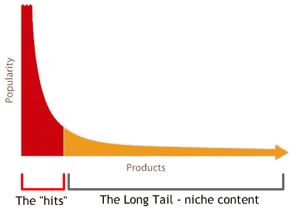

#### 我们盲目地相信科技创始人是仁慈的

你可能会认为马克·扎克伯格和拉里·佩奇会知道不要滥用他们的权力。但是这样的丑闻过去也发生过。

Reddit 是互联网上最受欢迎的网站之一。其创始人之一最近将公司的声誉置于危险之中。他承认他已经[修改了 Reddit 数据库](http://www.independent.co.uk/life-style/gadgets-and-tech/news/reddit-donald-trump-steve-huffman-spez-pizzagate-trolls-hillary-clinton-a7436406.html)中用户的评论——实质上是把话放进了批评他的人的嘴里。

我们不仅相信少数精英科技公司创始人的气质。我们也相信最终接管这些组织的其他行为者会是仁慈的。即使我们知道他们的股东——或政府——可以迫使他们心怀恶意，做出违背用户利益的事情。

无论你对马克·扎克伯格和他的意图有何看法，请记住这一点:就像 20 世纪初倡导美国电话电报公司农村通路的“慈善垄断者”西奥多·维尔一样，马克·扎克伯格总有一天会退休。接管脸书的人也不会像他那样有远见。最有可能的是，会有一些财务人员或销售人员向下游出售脸书用户及其海量数据。

#### 通过破坏网络中立性，ISP 垄断正在把我们都赶进围墙花园

如果我们失去网络中立性，那些曾经在开放互联网上自由运营的网站将面临三种选择:

1.  付钱给 ISP，让他们的客户可以访问他们的网站
2.  不付钱给 ISP，然后一落千丈
3.  成为围墙花园的一部分，代表他们向 ISP 付费

最后一个选择对大多数小企业来说是最有吸引力的。他们会选择免费选项。这样做的话，他们将把自己网站的部分控制权移交给围墙花园。

谷歌或脸书会介入，帮助确保你的客户能够访问你的企业网站。这些围墙花园将代表你向 ISP 付费，并在他们自己的域名上帮助提供你的内容。但作为回报，围墙花园可以:

*   在你的网站上植入广告(可能是给你的竞争对手的广告)
*   获取你的数据并出售(可能卖给你的竞争对手)
*   将你的客户重定向到愿意为你的受众付费的竞争对手的网站

就像谷歌广告或脸书广告一样，互联网将成为一场比赛，看谁能向围墙花园支付最多的钱，以便获得客户。而这其中的大部分消费者是完全看不到的。

所有这些都是有先例的。

脸书说服了数百万企业建立脸书网页。然后这些公司自己花钱宣传他们的脸书网页，让他们的顾客“喜欢”他们的网页。然后，脸书提出了一个诱饵和开关，使这些企业将不得不通过脸书做广告，如果他们想达到他们自己的客户以前喜欢他们的网页。

以下是像 [freeCodeCamp](https://www.freecodecamp.com) 这样的小型非营利组织拒绝为谷歌广告付费时会发生的情况:

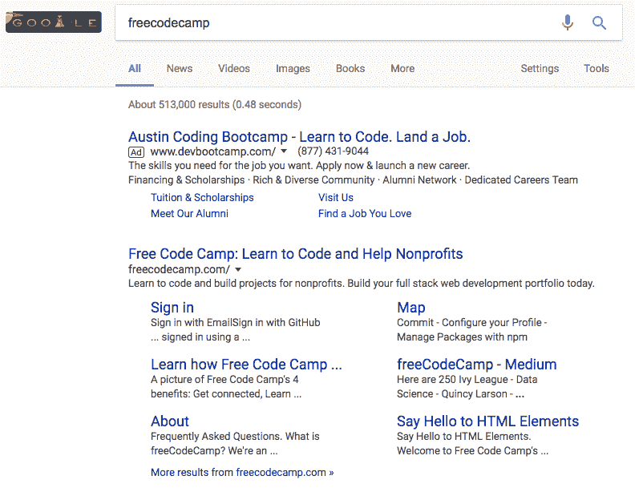

像这家公司这样资金雄厚的公司——它是全球最大的营利性教育集团之一 Kaplan 的子公司——可以向谷歌支付资金，这样他们就可以拦截我们的用户。

而这些广告会逐渐看起来越来越不像广告。以下是谷歌广告是如何随着时间的推移变得越来越像普通搜索结果的:

[Image credit](http://searchengineland.com/search-ad-labeling-history-google-bing-254332)

现在，那个小小的、绿色边框的、带有“ad”字样的盒子就是区分广告和合法搜索结果的唯一标志。也许不足为奇的是，55%的谷歌用户甚至没有意识到这些是广告。

最终，围墙花园可能会趋同于中国最大的搜索引擎百度，百度在很长一段时间内根本不标记广告。

百度去年陷入困境，因为一名大学生使用他们的搜索引擎寻找一种常见可治疗癌症的治疗方法。这名学生去了一家他在百度搜索结果顶部找到的医院。

这位学生不知道的是，那家医院向百度支付了费用，让百度把它放在搜索结果的最前面，而这实际上是一个广告。但百度故意向用户隐瞒了这一事实，以便他们可以对广告收取更多费用。

医院继续推荐一种昂贵且未经证实的药物来代替标准的——也便宜得多——手术和化疗。

在为无效的治疗耗尽了家里 30，000 美元的积蓄后，这位 21 岁的学生写了最后一篇文章，讲述了他的情况以及百度是如何将他引入欺诈者手中的。然后他就死了。

这只是这些围墙花园对社会造成的人类损失的一瞥。在一个有围墙的花园环境中，只有付钱的人才能看到，消费者将面临更多的错误信息、更多的欺诈和更多不必要的痛苦。

不是开放的互联网的平衡力量，富人将变得更富，穷人将变得更穷。互联网对经济民主化的承诺将半途而废，我们将进入另一个农民生活在封建领主统治下的时代。

#### 将来，我们的互联网可能会像中国的一样被封锁

中国拥有世界上最先进的审查工具。以至于其他独裁政权许可使用这些工具来控制自己的人民。

14 亿中国人被困在一个封闭的互联网中，在中国的[防火长城后面。](https://en.wikipedia.org/wiki/Internet_censorship_in_China)

互联网服务提供商所追求的反网络中立议程要求他们使用一种叫做深度数据包检测的技术。如果不查看每个数据包的内容，ISP 就不可能决定有选择地降低哪些数据包的速度。

这意味着，除了通过他们的网络发送数据包之外，ISP 实际上还必须查看每个数据包的内部，并且很可能会记录这些数据包的内容。这将是昂贵的，但存储互联网每年产生的大量信息在大公司和政府的预算之内。

这也是有先例的。在& T 非法监控其所有流量达数年之久。

Monitoring internet traffic at this level of detail would make pervasive censorship possible. This is one of the techniques China uses to re-write its history. And it works. Despite the advances in information technology, to this day many Chinese still [don’t know that the Tiananmen Massacre happened](http://www.cnn.com/2013/09/15/world/asia/tiananmen-square-fast-facts/). And when they do learn of it, it’s ancient history — sapped of most of its perceived relevance.

> “思想比枪更有力量。我们不会让我们的敌人有枪，我们为什么要让他们有想法。”—约瑟夫·斯大林

如果互联网服务提供商成功了，开放的互联网崩溃了，公司和政府将有权审查人类历史上最强大的通讯工具——互联网。

### 第 4 部分:谁控制信息？谁控制未来？

“Ascension” by Nathan Sawaya. 2014\. Legos.

无论这些公司是通过监管捕获还是通过积累海量数据来积聚力量，它们都在稳步变得更加强大。他们正在利用不断增长的现金流收购竞争对手。

这不是资本主义——这是合作主义。资本主义是混乱的。太浪费了。但从长远来看，这比中央计划和政府试图挑选赢家要健康得多。

资本主义允许小企业进入舞台，实际上有机会。社团主义使得这不太可能。

如果你已经读到这里，我希望你明白这种情况的严重性。这不是投机。这真的发生了。这是有历史先例的。现在就有这样的例子。

如果你什么都不做，我们将会输掉这场开放互联网的战争。人类历史上最伟大的交流和创新工具将落入少数强大的公司和政府手中。

没有你的行动，企业将继续以对他们有利的方式封锁互联网——而不是公众。

好消息是我们的曾祖父控制了类似的垄断。在 20 世纪初，美国人面临着滥用石油，铁路和肉类行业的垄断。我们通过勇敢的新闻报道来提高人们的意识，并迫使政府采取行动，从而战胜了他们。

今天，我们手头最紧迫的任务是阻止 FCC 主席 Ajit Pai 拆除网络中立。

帮助我们打这场战争。我要你做的是:

1.  如果你负担得起，向为开放互联网而战的非营利组织捐款:[自由新闻](http://act.freepress.net/sign/internet_NN_pai/?source=frontslider)、[美国公民自由联盟](https://www.aclu.org/feature/what-net-neutrality)、[电子前沿基金会](https://www.eff.org/issues/net-neutrality)和[公共知识](https://medium.freecodecamp.com/inside-the-invisible-war-for-the-open-internet-dd31a29a3f08#.j6dqute5o)。
2.  让自己了解开放互联网的重要性。读一读蒂姆·吴的《总开关:信息帝国的兴衰》这是迄今为止这方面最好的书。
3.  [联系你的代表](http://www.whoismyrepresentative.com/)并询问他们正在做什么来捍卫网络中立。
4.  与你的朋友和家人分享这篇文章。我意识到让你使用围墙花园来传播消息的讽刺，但是在游戏的后期，这些是可用的最好的工具。[在脸书](https://www.facebook.com/sharer/sharer.php?u=https%3A//medium.freecodecamp.com/inside-the-invisible-war-for-the-open-internet-dd31a29a3f08)上分享这篇文章或者[在推特上发布这篇文章](https://twitter.com/intent/tweet?text=The%20future%20of%20the%20open%20internet%20is%20in%20your%20hands.%20https://medium.freecodecamp.com/inside-the-invisible-war-for-the-open-internet-dd31a29a3f08)。

只有我们，公众，才能结束封闭系统的循环。只有我们能拯救开放的互联网。

感谢你阅读这篇文章，感谢你关心我们开放的互联网的命运。

我只写编程和技术。如果你在推特上关注我，我不会浪费你的时间。