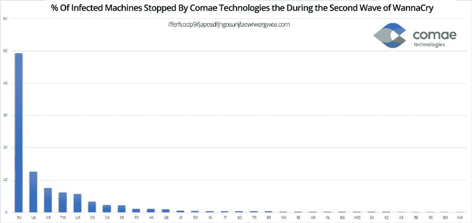

# Wannacry 内幕-史上最严重的勒索病毒爆发-以及如何保护自己

> 原文：<https://www.freecodecamp.org/news/inside-the-worst-ransomware-outbreak-in-history-and-how-to-protect-yourself-168e7028a236/>

上周末，数十万台电脑感染了“WannaCry”勒索病毒，国际刑警组织称这是历史上最大的勒索病毒爆发。

不幸被感染的人会在他们的计算机上看到一个类似于上图的威胁。

勒索软件的工作原理如下:

1.  有人意外地在他们的计算机上运行恶意代码(可能来自电子邮件附件)
2.  这种代码(称为“勒索软件”)加密硬盘上的许多文件(或做其他恶意的事情)。
3.  然后代码要求赎金。它通知这个人，如果他们不做些什么(在 WannaCry 的情况下，给攻击者发送价值 300 美元的比特币)，该软件将不会解密这些文件。

在 WannaCry 的案例中，3 天后，需求增加到 600 美元。一周后，它声称数据将永远丢失。也就是说，7 天还没有过去，所以我们还不知道攻击者是否会实施这一威胁。

据我们所知，只有运行 Windows 的计算机容易受到 WannaCry 的攻击。但这是一个特别令人讨厌的勒索软件，因为网络上只有一个人需要下载它。从那里，它可以通过本地网络自动传播，使用通常为网络文件共享保留的端口。

WannaCry 能够做到这一点要归功于一个名为 EternalBlue 的漏洞，该漏洞可能是由美国国家安全局(NSA)开发的，然后在上个月被黑客组织影子经纪人(Shadow Brokers)泄露。

由于其特别致命的性质，WannaCry 在周末关闭了几个组织，包括英国国民医疗服务系统的大部分机构——阻止医生使用核磁共振仪，甚至关闭了冷藏捐赠血液的冰箱。

今天早上，我参加了美国广播公司的早安美国节目。他们就勒索病毒采访我，问我普通人能做些什么来保护自己。

以下是我的基本建议:

1.  如果你担心你的文件，备份它们。Windows 和 MacOS 都有内置的备份工具。
2.  让您的软件保持最新。不要禁用自动更新。开发者在不断修复安全漏洞。即使这看起来很痛苦，也要安装他们推荐的更新。
3.  不要打开可疑的电子邮件附件。
4.  不要仅仅依靠杀毒软件这样的工具来保护你免受这类攻击。你个人需要提高警惕。安全性不是一种产品，而是一个过程。

如果你的电脑感染了勒索软件，而你又没有备份文件，你可能会想要支付赎金。虽然这奖励了罪犯，但对于保存不可替代的文件，如家庭照片，这是一个很小的代价。

请记住，没有密钥，即使是世界上最强大的政府也没有办法帮你解锁文件。

微软在三月份发现了 WannaCry 利用的漏洞，他们已经为所有最新的操作系统发布了补丁。在 WannaCry 的情况下，如果你有一个过去五年的 Windows 版本，并且自动更新是打开的，你的计算机应该不会有风险。

但是如果你还在使用旧版本的 Windows，比如 16 年前的 Windows XP，你绝对应该去下载补丁。以下是这方面的说明:( [2 分钟阅读](https://fcc.im/2rjW7IX))

WannaCry 对俄罗斯打击最大。网络安全咨询公司 Comae 估计将近一半的感染发生在那里。

昨天，WannaCry 的新变种开始出现:( [4 分钟阅读](https://blog.comae.io/wannacry-new-variants-detected-b8908fefea7e))。

NSA、CIA 和其他政府机构目前将大约 90%的网络安全资源用于攻击性网络攻击:( [4 分钟阅读](https://fcc.im/2rjJSfN))。

许多开发者感到愤怒的是，政府机构一直在积累这些漏洞，而不是提醒软件发行商，以便他们可以快速修补这些漏洞。

俗话说，有时候最好的进攻就是好的防守。这正是许多开发商希望政府采取的策略。

无论哪种情况，勒索软件的情况在好转之前都会变得更糟。所以在外面注意安全！

### 以下是另外三个值得你花时间的链接(也是关于勒索软件的):

1.  阅读一位开发人员如何在 WannaCry 的代码中发现后门，并能够暂时阻止其传播的故事:( [7 分钟阅读](https://fcc.im/2qKleYn)
2.  安全研究员 Troy Hunt 写了一篇关于 WannaCry 爆发的深度分析:( [12 分钟阅读](https://fcc.im/2qkTsRh))
3.  观看这些比特币钱包通过 Twitter 机器人( [2 分钟阅读](https://fcc.im/2qpd8Bv))从正在进行的全球网络攻击中接收勒索付款

我只写编程和技术。如果你在推特上关注我，我不会浪费你的时间。？