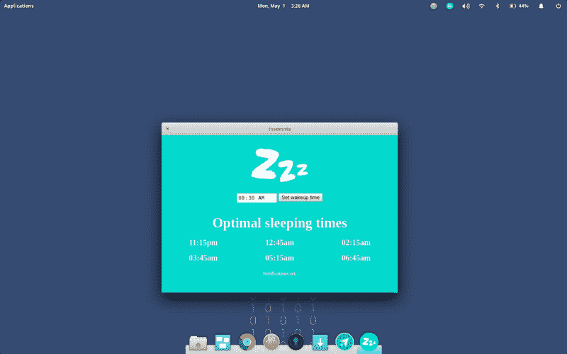
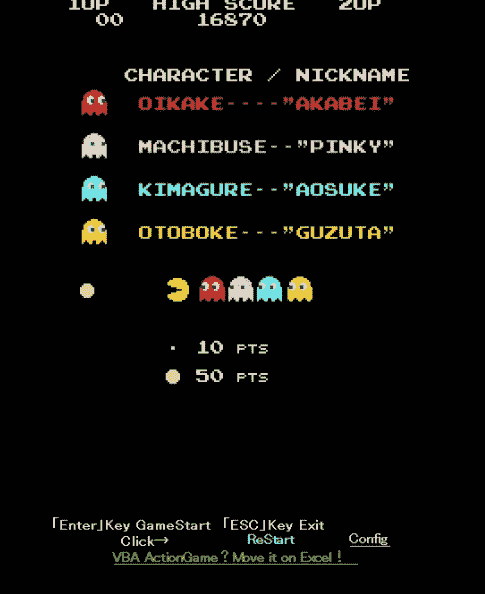
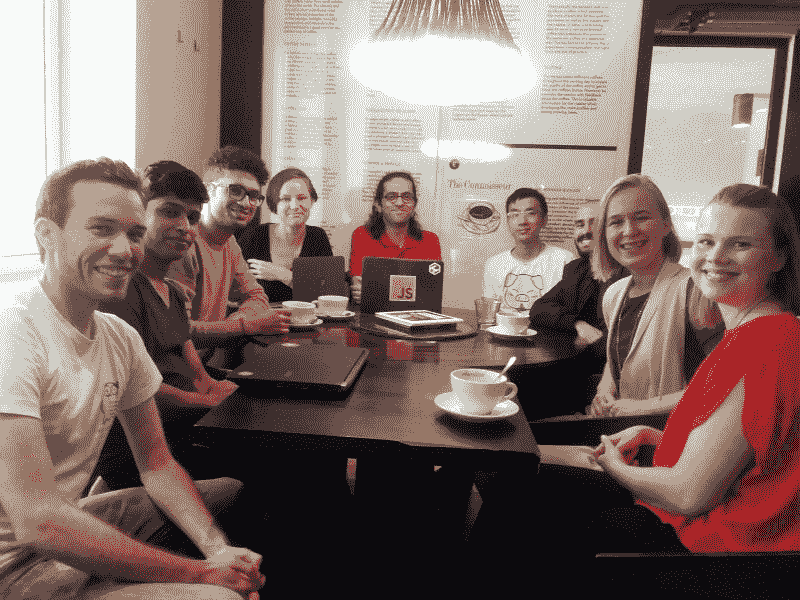

# 失眠:一个开源应用程序，根据睡眠周期告诉你什么时候睡觉

> 原文：<https://www.freecodecamp.org/news/insomnia-an-open-source-app-that-tells-you-when-to-sleep-based-on-sleep-cycles-9d9d545219d9/>

睡眠周期是一段 90 分钟的时间，在这段时间里，你的身体会经历不同的睡眠阶段——一直到深度快速眼动睡眠——然后再回来。一些健康专家认为，这 90 分钟的睡眠周期是宁静睡眠的关键。他们建议尽量睡足 7.5 个小时——或者甚至 9 个小时，如果你有时间的话。

考虑到这一点，波士顿计算机工程专业的学生阿里克斯·爱普斯坦开发了一款名为“失眠”的开源桌面应用程序，来帮助你充分利用睡眠周期。

根据你需要醒来的时间——假设你需要 15 分钟才能入睡——失眠会在整个晚上的特定时间通知你，你可以在特定时间入睡，并最大限度地增加你的完整睡眠周期数。

你可以直接从它的 [GitHub 页面](https://fcc.im/2qqzVN5)下载这个应用。

如果你晚上睡不着，你还可以下载流行的 [Flux 桌面应用](https://fcc.im/2qqAHcX)，它会在整个晚上改变你屏幕的颜色。这可以减少你的大脑将显示器的光误认为日光的倾向。

### 这里有三个值得你花时间的链接:

1.  JavaScript 数组和对象就像书籍和报纸一样( [5 分钟阅读](https://fcc.im/2oQGWcX)
2.  如何使用 Chromium 和 PyInstaller 将一个 Web 应用变成桌面应用
3.  在 30 分钟内学习数学符号工具 LaTeX([30 分钟阅读](https://fcc.im/2qlV7Xj))

### 想到这一天:

> “一个优秀的测试人员会给程序员及时的反馈，告诉他们做对了什么，做错了什么。信不信由你，测试者最有价值的特征之一是提供积极的强化。没有比 La Marzocco Linea espresso machine 更好的方法来提高程序员的士气、幸福感和主观幸福感，让专门的测试人员经常从开发人员那里获得发布，试用它们，并给出正面和负面的反馈。”乔尔·斯波尔斯基

### 每日一图:

Visual Basic 开发人员 Scott Spence 发现了这个可以在 Microsoft Excel 中运行的 PacMan 版本。每个像素是一个 Excel 单元格。

### 今日学习小组:

赫尔辛基自由代码营

编码快乐！

–昆西·拉森，自由代码营的老师

如果你从这些邮件中获得了价值，请考虑[支持我们的非营利组织](http://bit.ly/donate-to-fcc)。