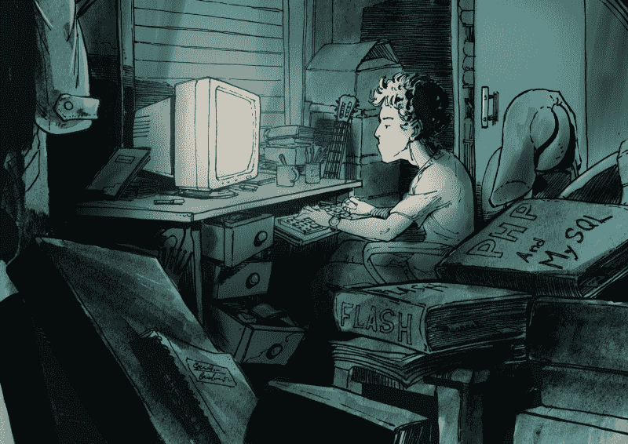
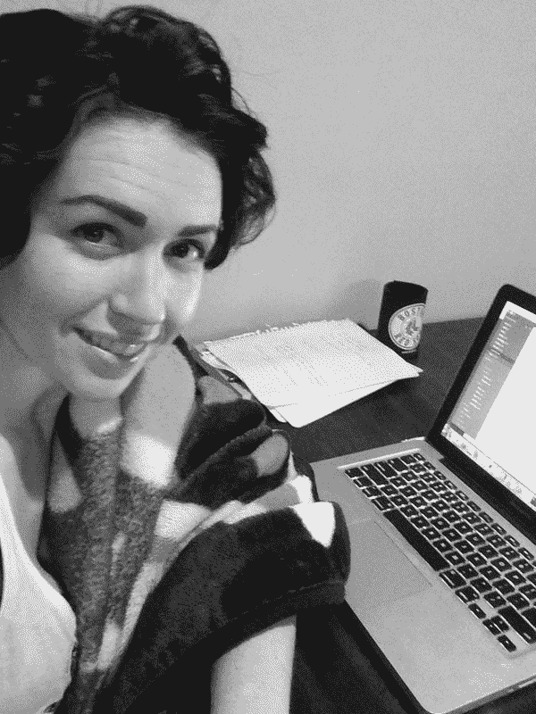
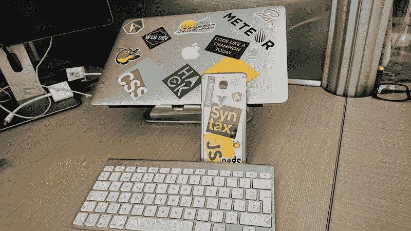
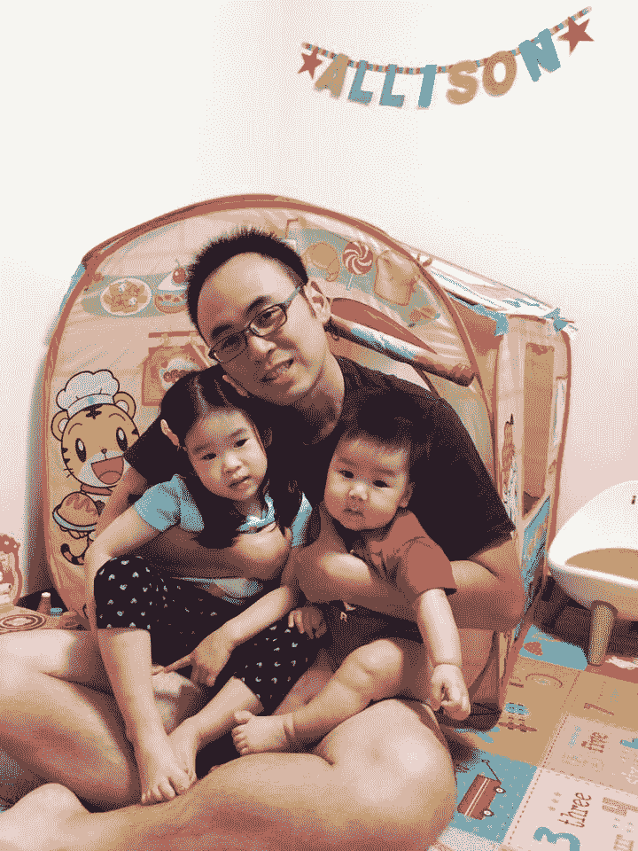

# 7 位自学成才的程序员的经验教训，他们现在全职工作，担任软件开发人员

> 原文：<https://www.freecodecamp.org/news/inspirational-success-stories-from-self-taught-web-developers-4f6f375cf17d/>

如何在学习编码的同时保持动力？

学习 web 开发是一条充满坎坷的道路。也许有一天你解决了一个难题，并且感觉非常棒。但是就在第二天，你被一个看似简单的问题困扰了几个小时。你最终会感到彻底失败。

通常很难看到隧道尽头的光明。但是当你处于那些艰难、黑暗的时刻，试着找到坚持下去的动力。

提醒自己学习编码的最终目标。也许是为了得到一份更好的工作，为了养家糊口，或者是为了找到一份更有目的性的工作。

你也可以从和你同病相怜的人那里找到鼓励。知道有人在为同样的问题而奋斗会是巨大的鼓舞。看着他们奋力拼搏，这可能就是你继续下去的全部动力。

因为你会知道你并不孤单。这是像 freeCodeCamp 这样的社区的最大好处之一。不仅仅是编码课。这是关于成为一个社区的一部分，在这个社区里，其他人和你有着相同的梦想和目标。

为此，我在 freeCodeCamp 上收集了一些故事。作者是像你一样的人，他们为自己的最终目标奋斗——找到一份网络开发工作。

看完这些故事，希望你找到灵感和鼓励。

### 故事

#### 故事#1: [我是如何从街头卖食品到为顶尖科技公司工作的](https://www.freecodecamp.org/news/become-how-i-went-from-selling-food-in-the-street-to-working-for-top-firms-in-tech-6aa61a2d0629/)

Illustration by Alvaro’s friend, Sebastián Navas.

阿尔瓦罗·维德拉通过当地的网吧和一个亲戚寄给他的一些书自学了 PHP。经过无数个夜晚的学习和练习，他在一家科技公司找到了一份工作。

如果你只看了这个列表中的一个故事，选择这个。这是一部写得很好的记叙文，讲述了当你真正用心去做某件事时可能发生的事情。

#### 故事#2: [我如何找到我的第一份工作，成为一名网络开发人员](https://www.freecodecamp.org/news/how-i-landed-my-first-job-as-a-web-developer-f991fe728b95/)格温多林·法拉第

Gwendolyn up late coding one night.

格温多林·法拉第在一家餐馆做全职工作，帮助她的祖母。2015 年，在漫不经心地涉猎了编码教程后，她决定全力以赴。

她加入了树屋，成为了自由代码营社区的常客。她不断地学习，让自己脱颖而出。帮助她找到工作的关键之一是扩大她的个人和在线网络。

#### 故事#3: [我从零开始成为一名没有计算机科学学位的 web 开发人员的旅程](https://www.freecodecamp.org/news/my-journey-to-becoming-a-web-developer-from-scratch-without-a-cs-degree-2-years-later-and-what-i-4a7fd2ff5503/)作者谢尔盖·加西亚

A photo by Sergei of his workstation.

谢尔盖·加西亚(Sergei Garcia)写了一篇非常深入的文章，讲述了他是如何开始学习 web 开发并找到一份全职工作的。

他不仅写了他的旅程，还写了他认为对他的旅程最有帮助的资源。他分享了自己第一份工作的经历和学到的教训。

#### 故事#4: [如何从业余爱好者变成专业开发人员](https://www.freecodecamp.org/news/how-to-go-from-hobbyist-to-professional-developer-11a8b8a52b5f/)作者:Ken Rogers

Ken unwinding after a hard day’s work coding.

肯·罗杰斯的故事既鼓舞人心又切合实际。他自学了网页开发，同时全职从事景观美化工作。在一家网站开发店请求信息面试后，他得到了一份全职工作。

Ken 分享了他的故事，并写下了如何成为专业 web 开发人员的路线图。

#### 故事#5: [我如何从用功能手机编程到为一家麻省理工学院的初创公司工作](https://www.freecodecamp.org/news/how-i-went-from-programming-with-a-feature-phone-to-working-for-an-mit-startup-40ca3be4fa0f/)

Elvis has since gotten a laptop to go with his new job.

Elvis Chidera 了解到持续的练习帮助他提高了在学校的阅读和写作能力。他将同样的想法应用于学习编程，并构建了自己的真实应用程序项目。

都是十几岁没有笔记本电脑！正如标题所示，埃尔维斯现在为一家麻省理工学院的初创公司工作。

#### 故事#6: [我如何说服一位雇主给我一个机会，并付钱让我学习编码](https://www.freecodecamp.org/news/getting-your-first-developer-job-whats-the-best-way-1737d0bcba7a/)

Rick setting up his desktop

在做水管工的时候，Rick West 开始自学 web 开发。他后来考虑参加一个训练营，但在计算了数字后，他意识到这对他和他的家人来说在经济上是不可行的。

所以他运用了一些聪明才智。他给一些公司发电子邮件进行信息面试，最终被其中一家公司录用了！

#### 故事#7: [我如何在 Danny Huang 的#100DaysOfCode challenge](https://www.freecodecamp.org/news/got-a-react-developer-job-during-my-100dayscodechallenge-f455175d3776/) 中获得 React 开发人员的工作

Danny hanging out with his kids

丹尼·黄一直想学编程。他从 freeCodeCamp 赛道开始，参加了 [100 天代码挑战](https://www.freecodecamp.org/news/the-crazy-history-of-the-100daysofcode-challenge-and-why-you-should-try-it-for-2018-6c89a76e298d/)。

他每天练习 2-4 个小时，并投资使他的 GitHub 简介吸引雇主。第 97 天，丹尼得到了他的第一份工作。

丹尼的故事与众不同之处在于他记录了自己的进步和成就。

### 你可以从这些故事中学到什么

在通读这些故事的过程中，我发现了相当多的共同点。这些都是他们为了达到目标而付诸实践的原则。

#### 致力于学习。

所有这些人都致力于学习编码，牺牲睡眠和社交生活。他们每天花几个小时(或晚上！)致力于学习和实践。

*   猫王每天放学后从 W3Schools 学习 HTML 和 CSS。
*   即使在找到工作后，Sergei 仍继续自学更多的 web 开发知识。
*   Gwendolyn 决定 2015 年是她学习编码的一年，并且每天留出几个小时来学习。
*   丹尼承诺每天至少学习一个小时的编码。
*   Ken 早上 6 点开始工作，晚上和周末学习 PHP 和 Laravel。

#### **遵循一个结构。**

无论是训练营、书籍还是在线课程，试着遵循一个已经存在的结构。这样做会让你的进步更容易被追踪，也会让最终目标更可行。

*   Sergei 根据最常见的工作列表要求创建了自己的学习路径。
*   Danny 参加了#100DaysOfCode 挑战。
*   阿尔瓦罗对本地地图应用有一个愿景，并给自己设定了一个截止日期，要求在年前完成。
*   格温多林完成了一个树屋音轨和 freeCodeCamp 的前端部分。

#### **建造东西。**

把你的课堂知识转化为实用知识的最好方法就是建造东西。它们可能很糟糕，充满了意大利面条式的代码。但重要的是你在现实世界中创造东西并从中学习。

*   Ken 边学边构建 PHP 和 Laravel 应用。
*   猫王建立了一个社交媒体应用程序、一个群组短信应用程序和 Android 应用程序。
*   Alvaro 创建了一个他在工作面试中使用的本地地图应用程序。

#### **要大胆。**

你永远不会觉得自己真正准备好了下一步。但这并不意味着你没有准备好。不要害怕承担风险，这会让你的职业发展有所回报。

*   肯和里奇都去公司进行信息面试，最终都得到了工作机会。
*   阿尔瓦罗请一位住在美国的亲戚帮他寄一些编程书籍，她买了并寄给了他。
*   埃尔维斯通过创建真正的实时应用程序并为其寻找用户而脱颖而出。

#### 建立你的人际网络。

如今找工作的最好方法之一就是通过你的人际网络。如果你今天对人和组织投资，他们将来可能会对你投资。

*   Gwendolyn 通过建立她的个人和在线网络收到了多份工作邀请。
*   阿尔瓦罗第一次听说他最终工作的科技公司是通过一个鼓励他申请的朋友。

#### 让它发挥作用。

事情不会总是如你所愿。但是不要放弃！总会有其他办法的。

*   在意识到训练营不可行后，里克并没有放弃他的抱负——他通过接触公司来解决这个问题。
*   埃尔维斯的第一个应用程序失败了，但他继续尝试，并找到了其他项目来构建。
*   当 CodeCloud.me 对 Gwendolyn 不起作用时，她继续前进，并最终使用 freeCodeCamp 进行学习。
*   Danny 曾尝试自学 web 开发，但失败了，但后来通过了#100DaysofCode 挑战。

### 这对你意味着什么？

阅读和欣赏别人的成功故事是很棒的。但是我们有时会因为通过他人的替代生活而变得无所作为。

试着向这些网站开发者学习。你能把他们的策略应用到你自己的生活中吗？他们的故事有没有激发出你可以尝试的想法？如果有，就在下面留言评论吧！

致这些帖子的原作者:感谢你与我们分享你的旅程！

#### 想要更多吗？

？在我的博客 c[oder-coder.com 上阅读更多教程。](https://coder-coder.com)
？点击此处获取关于新文章的电子邮件。T5？加入 25，000+其他人——在 Instagram 上关注@th [ecodercoder。](https://www.instagram.com/thecodercoder/)
？在我的 YouTube 频道上查看编码教程。