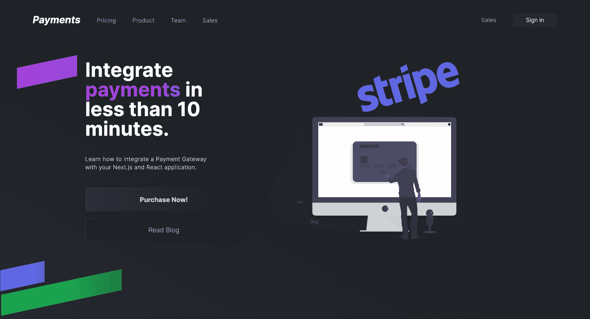
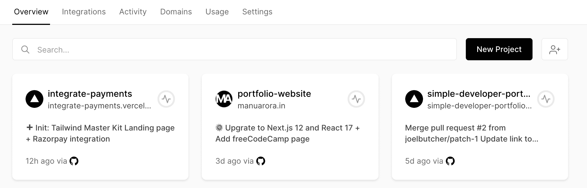
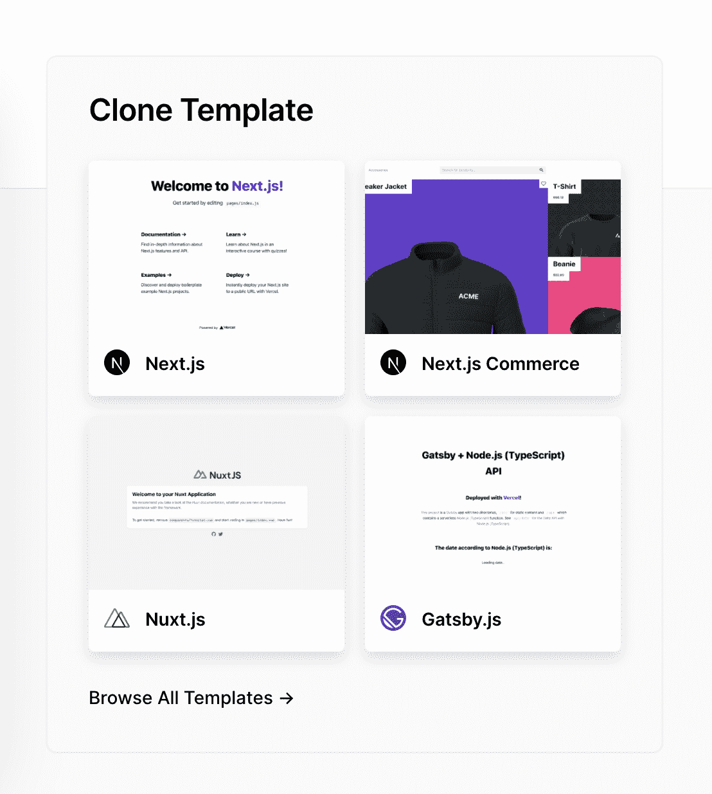
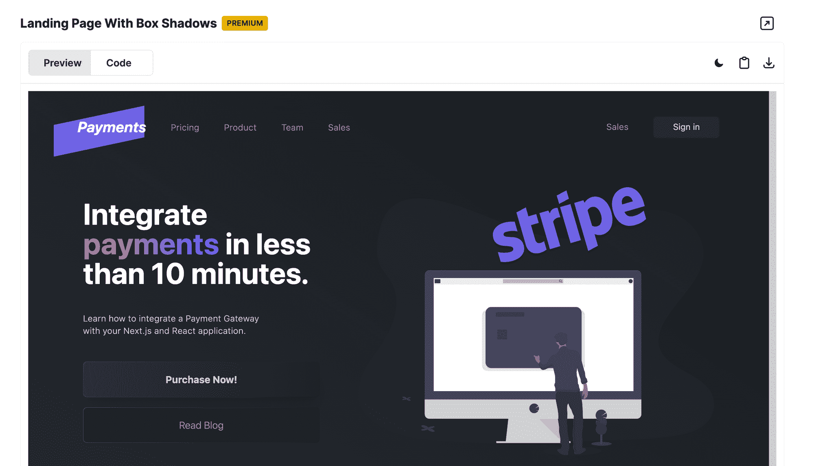

# 如何在 Next.js 中设置支付网关并与 Razorpay 和 TailwindCSS 反应

> 原文：<https://www.freecodecamp.org/news/integrate-a-payment-gateway-in-next-js-and-react-with-razorpay-and-tailwindcss/>

如果你有一个电子商务应用程序，支付网关可以让你在你的网站上即时处理支付。

如今，随着所有现代支付网关解决方案的出现，有许多方法可以整合支付并向用户收取产品或服务费用。在本教程中，我们将构建一个登录页面，让最终用户从 web 应用程序购买产品。页面看起来像这样:



现场演示:[集成支付](https://integrate-payments.vercel.app)
源代码:[集成支付源代码](https://github.com/manuarora700/integrate-payments.git)

一些流行的可用支付网关有:

*   [条纹](https://stripe.com)
*   [Gumroad](https://gumroad.com)
*   [PayPal](https://paypal.com)
*   [Razorpay](https://razorpay.com)

今天，我们将学习如何将 Razorpay 与 Next.js (React)应用程序集成，并了解流程实际上是如何工作的。

## **技术堆栈**

对于我们的堆栈，我们将使用以下技术:

*   next . js——React 的一个框架，提供了对无服务器功能和 React 架构的访问。
*   一个基于实用工具的 CSS 框架，用于简化样式
*   Razorpay -一个支付网关系统，允许用户使用支付。
*   [Vercel](https://vercel.com)——托管我们的 Next.js 应用程序(如果尚未托管的话)
*   [顺风主套件](https://tailwindmasterkit.com) -用于容易接近的顺风组件

## **项目设置**

如果您已经有了一个项目，那么您可以直接跳到本文的集成部分。如果没有，让我们从创建一个 Git 存储库并在 Vercel 上托管我们的项目开始。

### **如何建立 Next.js 库和网站**

首先，去 [Vercel](https://vercel.com) 为自己创建一个爱好账户。(如果你打算把它用于商业项目，确保你购买了他们的计划。爱好账户只是为了测试和创建游戏场地。)

账户创建完成后，点击`New Project`


然后，从可用选项中选择`Next.js`，并在平台上创建一个 Git 存储库。


您的网站将在几秒钟内部署，您将获得一个实时网站的 URL。

### **如何设置 TailwindCSS**

现在，既然网站已经设置好了，您可以直接进入 [GitHub](https://github.com) ，克隆存储库，在您的本地环境中运行它。为此，请遵循以下简单步骤:

*   转到 [GitHub](https://github.com) 并找到您新创建的存储库
*   单击`code`部分并复制存储库 URL。
*   在桌面上打开你的终端，写`git clone <repo_name>`。这将在您的本地环境中克隆存储库，以便您可以开始工作。
*   一旦存储库在您的本地环境中被克隆/复制，在您最喜欢的代码编辑器中打开项目(在我看来 VSCode 是最好的)。
*   在终端，打开应用的位置，写`npm install`。这将安装所有相关的节点模块。
*   您可以通过编写`npm run dev`来启动本地开发服务器。

现在，项目已经在您的本地环境中启动并运行了。要在本地访问你的网站，在你的浏览器中打开`localhost:3000`，你将能够看到已经为你准备好的样板网站。

设置顺风非常简单。他们的[文档](https://tailwindcss.com/docs/guides/nextjs)让事情变得更加简单。查看他们的参考文档以及更多关于作为框架的 TailwindCSS 的内容。

要在您的本地环境中设置 Tailwind，请遵循以下步骤:

*   这将安装 TailwindCSS 以及其他重要的依赖项，用于编译和运行你的 Tailwind 代码。
*   `npx tailwindcss init -p` -这将初始化一个`tailwind.config.js`文件，该文件只是一个可以根据用户需求进行操作的对象。
*   在`tailwind.config.js`文件中，粘贴下面的代码，它基本上告诉 Tailwind 编译存在于`/pages`和`/components`目录中的代码。

```
module.exports = {
  content: [
    "./pages/**/*.{js,ts,jsx,tsx}",
    "./components/**/*.{js,ts,jsx,tsx}",
  ],
  theme: {
    extend: {},
  },
  plugins: [],
} 
```

*   打开`/styles`目录中的`globals.css`文件，粘贴以下代码。这些代码片段导入所有与顺风相关的设置代码:

```
@tailwind base;
@tailwind components;
@tailwind utilities; 
```

*   退出终端，在终端上写下`npm run dev`，重启你的网站。现在您已经准备好利用 TailwindCSS 的力量了。

现在，Tailwind 和我们的网站已经设置好了，让我们直接进入开发页面和集成支付。

## **登陆页面开发**

我们将要使用的登录页面直接取自 [Tailwind 主工具包](https://tailwindmasterkit.com)，它允许您访问使用 TailwindCSS 构建的组件。



让我们分解代码，更好地理解它。

### **Navbar.js**

```
import React from "react";
export const Navbar = () => {
  return (
    <div className="flex flex-row items-center  justify-between px-20 py-10">
      <div className="flex flex-row items-center">
        <h1 className="font-bold italic text-2xl text-white mr-10">Payments</h1>
        <ul className="flex flex-row space-x-10">
          <li>
            <a
              href="#"
              className="text-gray-400 text-sm tracking-wide font-light"
            >
              Pricing
            </a>
          </li>
          <li>
            <a
              href="#"
              className="text-gray-400 text-sm tracking-wide font-light"
            >
              Product
            </a>
          </li>
          <li>
            <a
              href="#"
              className="text-gray-400 text-sm tracking-wide font-light"
            >
              Team
            </a>
          </li>
          <li>
            <a
              href="#"
              className="text-gray-400 text-sm tracking-wide font-light"
            >
              Sales
            </a>
          </li>
        </ul>
      </div>
      <div className="flex flex-row space-x-10 items-center">
        <a href="#" className="text-gray-400 text-sm tracking-wide font-light">
          Sales
        </a>
        <button className="bg-[#272A30] text-gray-300 px-8 text-sm py-2 rounded-md shadow-xl drop-shadow-2xl">
          Sign in
        </button>
      </div>
    </div>
  );
}; 
```

构建导航条很简单。这是一个 Flexbox 容器，链接和无序列表项排列在一个`row`中。

然而，这个按钮很有趣。它使用了新的 TailwindCSS 投影类来投影背景。(我们也可以在 TailwindCSS 3.0+版本中使用彩色阴影——相当酷。)

### **Hero.js**

```
const Hero = ({ onClick }) => {
  return (
    <div className="relative z-10 flex flex-col md:flex-row mt-10 items-center  max-w-6xl justify-evenly mx-auto">
      <div className="md:w-1/3 mb-20 md:mb-0 mx-10">
        <h1 className=" text-white font-bold text-5xl mb-10">
          Integrate{" "}
          <span className="bg-clip-text text-transparent bg-gradient-to-r from-pink-500 to-violet-500">
            payments
          </span>{" "}
          in less than 10 minutes.
        </h1>
        <p className="text-sm text-gray-300 font-light tracking-wide w-[300px] mb-10">
          Learn how to integrate a Payment Gateway with your Next.js and React
          application.
        </p>
        <div className="bg-gradient-to-r from-[#3e4044] to-[#1D2328] p-[1px] rounded-md mb-4">
          <button
            onClick={onClick}
            className="bg-gradient-to-r from-[#2E3137] to-[#1D2328] rounded-md w-full py-4 shadow-xl drop-shadow-2xl text-gray-300 font-bold"
          >
            Purchase Now!
          </button>
        </div>
        <div className="bg-gradient-to-r from-[#3e4044] to-[#1D2328] p-[1px] rounded-md">
          <button className="bg-gradient-to-r from-[#1D2328] to-[#1D2328] rounded-md w-full py-4 shadow-sm drop-shadow-sm text-gray-400 font-light">
            Read Blog
          </button>
        </div>
      </div>
      {/* <div className="w-2/3 bg-white flex-shrink-0  relative"> */}
      
      {/* </div> */}
    </div>
  );
}; 
```

hero 部分包含我们的`Purchase Now`按钮，它将为我们初始化支付(我们将在下一部分研究实现)。

该布局包含两个部分:`Left section`包含所有文本，而`Right Section`包含一幅大图(取自 Undraw，一个免费的开源插图网站)。

按钮上的`onClick`动作很重要，因为它负责触发初始化支付的动作。`onClick`只不过是一个`callback`，它调用作为道具传递给组件的函数。

UI 部分就这么多了。让我们跳到支付部分，了解如何在 Razorpay 上设置一个开发者帐户，并使用他们的 SDK 在我们的网站上进行支付。

## 如何建立一个 Razorpay 帐户并检索 API 密钥


为了整合支付(即，在我们的网站上接收支付)，我们需要具备两个条件:

1.  Razorpay 账户
2.  一组 API 密钥，允许我们访问他们的服务。

让我们创建一个帐户并检索 API 密钥。

*   前往 [Razorpay](https://razorpay.com) 并注册一个账户
*   注册后，您可以访问[仪表盘](https://dashboard.razorpay.com/app/dashboard)，在那里您将找到整合支付所需的所有必要细节。
    
*   目前，我们将处于测试模式，以便我们可以在实际上线之前测试我们的支付。
*   在左侧面板中，向下滚动到`Settings`——在那里您会找到 API keys 部分以及您可以对您的支付 UI 进行的配置。
    
*   由于这是您第一次这么做，点击`Generate API Keys`，下载将自动开始。下载的文件包含`Razorpay API Key`和`Razorpay API Secret`。

现在，您已经用 API 键设置好了，并且正在设置平台。让我们直接跳到如何实际触发 Razorpay API 并进行支付。

## **如何将支付与 Razorpay 集成**

为了整合我们的支付，我们需要一个实际初始化 Razorpay `checkout`模块的按钮点击。为此，我们已经有了一个按钮`Purchase Now`，它调用一个函数`onClick`，这个函数只不过是一个回调函数。我们来看看实际的实现，了解一下背后的代码。

为了初始化支付，我们需要将 Razorpay 的`checkout`脚本添加到代码中。在 React 中，我们可以简单地使用`document.body.appendChild(script)`代码来完成。

### **initializeRazorpay()**

```
const initializeRazorpay = () => {
    return new Promise((resolve) => {
      const script = document.createElement("script");
      script.src = "https://checkout.razorpay.com/v1/checkout.js";

      script.onload = () => {
        resolve(true);
      };
      script.onerror = () => {
        resolve(false);
      };

      document.body.appendChild(script);
    });
  }; 
```

现在，我们正在用一个承诺来实现这个任务。我们这样做是因为稍后，我们会以这样的方式使用`initializeRazorpay()`,即每次点击`Purchase Now`,支付都会被初始化。我们只需`await`这个函数来创建一个脚本并添加到 DOM 中。

让我们看看页面上负责创建和初始化支付的主函数。

### **makePayment()函数**

```
const makePayment = async () => {
    const res = await initializeRazorpay();

    if (!res) {
      alert("Razorpay SDK Failed to load");
      return;
    }

    // Make API call to the serverless API
    const data = await fetch("/api/razorpay", { method: "POST" }).then((t) =>
      t.json()
    );
    console.log(data);
    var options = {
      key: process.env.RAZORPAY_KEY, // Enter the Key ID generated from the Dashboard
      name: "Manu Arora Pvt Ltd",
      currency: data.currency,
      amount: data.amount,
      order_id: data.id,
      description: "Thankyou for your test donation",
      image: "https://manuarora.in/logo.png",
      handler: function (response) {
        // Validate payment at server - using webhooks is a better idea.
        alert(response.razorpay_payment_id);
        alert(response.razorpay_order_id);
        alert(response.razorpay_signature);
      },
      prefill: {
        name: "Manu Arora",
        email: "manuarorawork@gmail.com",
        contact: "9999999999",
      },
    };

    const paymentObject = new window.Razorpay(options);
    paymentObject.open();
  }; 
```

方法负责初始化和打开 Razorpay 弹出窗口。

`makePayment()`功能执行以下操作:

1.  初始化 Razorpay Checkout 脚本并将其附加到正文中。正如我们前面看到的，这是由`initializeRazorpay`方法处理的。

2.  调用`/api/razorpay.js`无服务器函数。(这个我们一会儿再讲)。

3.  创建一个有 4 个重要键的对象:

    1.  `currency` -我们希望交易发生时使用的货币
    2.  `amount` -交易必须发生的金额。请注意，它必须是最小的面额。例如，如果你来自美国，那么金额将以美分为单位。
    3.  `order_id` -这将由我们马上要讨论的无服务器 API 生成。
    4.  `handler` -当支付成功时，调用该回调函数。
4.  最后，创建一个`paymentObject`，并将`options`作为参数传递给`window.Razorpay`方法。这是因为我们之前看过的`checkout`脚本。

我们查看了上面的`makePayment()`方法，看到了一行代码:

```
const data = await fetch("/api/razorpay", { method: "POST" }).then((t) =>
      t.json()
    ); 
```

但这意味着什么呢？

Next.js 允许我们在 Next.js 的`api`文件夹中的`apis`的帮助下访问无服务器功能。

无服务器 API 不过是充当 JAMStack 应用程序后端的`Lambda Functions`。在这里，我们可以轻松地编写我们的后端相关代码，而不必创建单独的后端。

这里，我们需要无服务器，因为我们在`makePayments()`代码中看到的`order_id`是唯一的，必须在后端生成。不仅如此，`amount`和`currency`也来自后端。这是为了确保没有人能够操纵金额和货币，并且门户对于支付是安全的。

让我们看一下无服务器 API 代码，更好地理解它。

### **/api/razorpay.js**

```
const Razorpay = require("razorpay");
const shortid = require("shortid");

export default async function handler(req, res) {
  if (req.method === "POST") {
    // Initialize razorpay object
    const razorpay = new Razorpay({
      key_id: process.env.RAZORPAY_KEY,
      key_secret: process.env.RAZORPAY_SECRET,
    });

    // Create an order -> generate the OrderID -> Send it to the Front-end
    const payment_capture = 1;
    const amount = 499;
    const currency = "INR";
    const options = {
      amount: (amount * 100).toString(),
      currency,
      receipt: shortid.generate(),
      payment_capture,
    };

    try {
      const response = await razorpay.orders.create(options);
      res.status(200).json({
        id: response.id,
        currency: response.currency,
        amount: response.amount,
      });
    } catch (err) {
      console.log(err);
      res.status(400).json(err);
    }
  } else {
    // Handle any other HTTP method
  }
} 
```

这条`razorpay.js`作为你通向`/api/razorpay`的路线。您在 API 文件夹中创建的每个文件都成为无服务器路由。就像我们在后端创建 API 一样，我们在 API 文件夹中创建文件，这成为了我们的一个路径。

例如:假设你在`/api`文件夹中创建了一个名为`posts.js`的文件。因此路由将变成`/api/posts`，它可以根据用例返回您想要的任何东西。

对于我们的例子，我们需要向我们的后端发出一个`POST`请求，这个请求将为我们创建一个`order_id`以及`amount`和`currency`，它们可以返回到前端进行支付。

让我们来理解这个 API 的流程。

1.  首先，我们需要安装`razorpay`模块和`shortid`来生成简短的唯一 id。要做到这一点，到你的终端写`npm install razorpay`和`npm install shortid`
2.  现在，要访问一个`POST`请求，我们检查请求对象并使用下面的代码片段访问方法:

```
export default async function handler(req, res) {
  if (req.method === "POST") {
    // Initialize razorpay object
    const razorpay = new Razorpay({
      key_id: process.env.RAZORPAY_KEY,
      key_secret: process.env.RAZORPAY_SECRET,
    });

    // rest of the code...
} 
```

3.在这里，`request.method`检查方法。如果方法是`POST`，我们继续初始化 Razorpay 对象。

4.Razorpay 对象接受两个参数:`key_id`和`key_secret`。还记得我们从 Razorpay dashboard 下载密钥吗？让我们把它们派上用场。

5.在文件夹结构的根目录中打开/创建`.env`文件，并粘贴以下代码:

```
RAZORPAY_KEY=YOUR_KEY_HERE
RAZORPAY_SECRET=YOUR_SECRET_HERE 
```

在这里，你可以插入你的 API 密匙和密码，你就可以开始了。

注意:确保您重启了开发服务器——否则更改将不会被反映出来。

一旦`razorpay`对象被设置，它就接受三个重要的选项:`receipt`、`amount`和`currency`。

```
const payment_capture = 1;
    const amount = 499;
    const currency = "INR";
const options = {
      amount: (amount * 100).toString(),
      currency,
      receipt: shortid.generate(),
    }; 
```

请注意，金额和货币是在我们的`back-end`中声明的，因此攻击者无法篡改它。

一旦设置好选项，我们就可以用 Razorpay 的`*razorpay*.*orders*.create(options)`方法创建订单。

```
try {
      const response = await razorpay.orders.create(options);
      res.status(200).json({
        id: response.id,
        currency: response.currency,
        amount: response.amount,
      });
    } catch (err) {
      console.log(err);
      res.status(400).json(err);
    } 
```

这里我们简单的`await`一下 Razorpay 提供的`create()`方法。当 create 方法成功时，我们得到一个`id`，它只不过是我们需要提供给前端的`order_id`，以便生成唯一的支付。

一旦一切成功，我们发送一个带有`id`、`currency`和`amount`字段的`200 response`。这就是前端处理支付所需的全部内容。

## **如何使用 Razorpay 付款**


一旦一切都整合到位，我们就可以开始使用 Razorpay 的收费方法了——有各种选项可供选择。有了这个，你只需在你的网站上接受付款，就可以开始为你的服务和产品收费。

整个弹出窗口是可定制的，可以直接从 Razorpay 的仪表板门户编辑。

由于您处于测试模式，要开始在生产中使用他们的服务，您需要通过提交您的证明文档来完成他们的识别过程，并简单地在`test mode`和`live mode`之间切换。

这就是你从编码方面所需要做的，以便从测试过渡到实际应用。

## **环境变量**

为了确保我们的更改反映在我们的现场生产网站上，我们需要添加与我们在 Vercel 平台上的代码中添加的环境变量相同的环境变量。

为表示:

1.  前往 Vercel 并打开您的项目
2.  点击`settings`
3.  点击`environment variables`。
4.  您将得到两个输入字段——名称和值。
5.  首先，输入`RAZORPAY_KEY`并添加 API 键
6.  其次，输入`RAZORPAY_SECRET`并添加秘密值
7.  重新部署网站，你将能够在现实环境中进行支付。

## **现场演示和源代码**

应用程序的完整源代码可以在[这里](https://github.com/manuarora700/integrate-payments)找到。

网站的现场演示是[这里](https://integrate-payments.vercel.app/)。

## **结论**

由于 Razorpay 出色的文档易于理解，集成支付非常容易。

我喜欢编码这个网站和集成支付。你也可以在我的网站上看到代码片段: [Manu Arora 的代码片段](https://manuarora.in/snippets)

如果你喜欢这个博客，试着在你自己的网站上实现它，这样你就可以接触到你的终端用户，让支付成为你自己的一件简单的事情。

如果您想提供任何反馈，请通过我的 [Twitter 账号](https://twitter.com/mannupaaji)联系我，或者访问我的[网站](https://manuarora.in/)

还要感谢 [Tailwind Master Kit](https://tailwindmasterkit.com/) 漂亮的登陆页面 UI。

快乐编码。:)