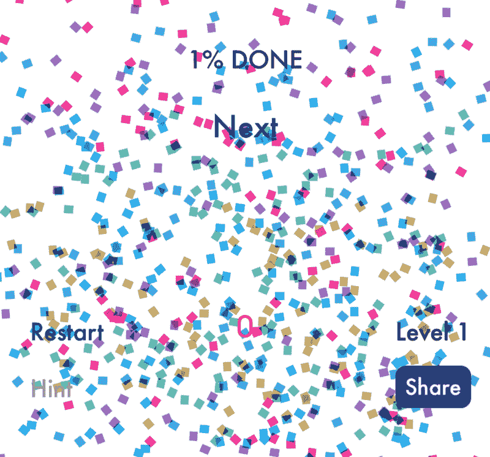
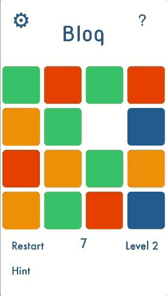
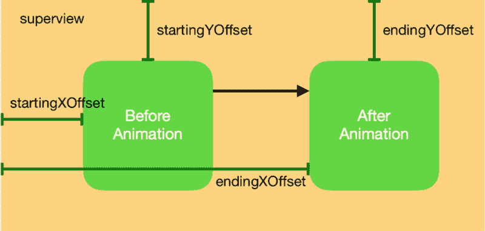
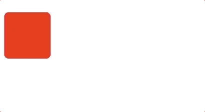
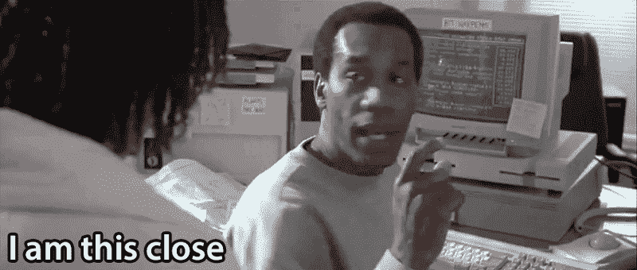
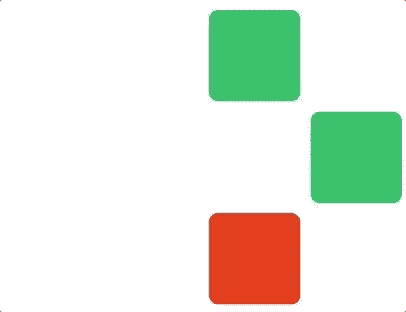

# 如何用 Swift 的 UIViewPropertyAnimator 实现交互式动画

> 原文：<https://www.freecodecamp.org/news/interactive-animations-with-swifts-uiviewpropertyanimator-284262530a0a/>

特雷弗·菲利普斯

# 如何用 Swift 的 UIViewPropertyAnimator 实现交互式动画



让我们抛弃丑陋的代码，给它一个升级，好吗？

这里我们将深入一个实际的例子，使用苹果的`UIViewPropertyAnimator`来创建与用户交互相结合的流畅动画。

你可以在免费应用程序 [Bloq](https://apple.co/2v6dujl) 中查看这些动画的最终结果，它使用下面描述的技术作为游戏的基础。



Animations using UIViewPropertyAnimator

### 背景

这是 iOS 10 中引入的一个类，它提供了比传统`UIView.animate(...)`功能更多的功能:

*   随时以编程方式开始、停止、暂停或恢复动画
*   在你有空的时候给动画师添加动画块和完成块
*   随时反转动画
*   “擦洗”动画，也就是说，以编程方式设置它现在应该走多远

### 入门指南

首先，我们将定义一个自定义视图控制器`BlockViewController`，它将代表游戏中的每个彩色方块。*注意*:我不包括与本教程无关的颜色、圆角或其他方面的代码。

```
class BlockViewController: UIViewController {    var startingXOffset: CGFloat = 0    var endingXOffset: CGFloat = 0    var startingYOffset: CGFloat = 0    var endingYOffset: CGFloat = 0
```

```
 var topConstraint = NSLayoutConstraint()    var leadingConstraint = NSLayoutConstraint()
```

```
 var animationDirection: AnimationDirection = .undefined    var isVerticalAnimation: Bool {        return animationDirection == .up            || animationDirection == .down    }    var transitionAnimator: UIViewPropertyAnimator?    var animationProgress: CGFloat = 0}
```

属性`topConstraint`和`leftConstraint`定义了视图控制器的视图从其超级视图的顶部和左侧的偏移量(分别)。

`UIViewPropertyAnimator`使用`offset`属性来决定动画应该在哪里开始，在哪里结束。由于游戏中的方块可以左右和上下移动，我们定义了`X`和`Y`偏移量。

我们还有一个简单的 enum `AnimationDirection`来辅助动画所需的逻辑。

```
enum AnimationDirection: Int {    case up, down, left, right, undefined}
```

现在在视图控制器的`viewDidLoad()`函数中，我们可以像这样设置约束:

```
topConstraint = view.topAnchor.constraint(equalTo: superview.topAnchor, constant: startingYOffset)
```

```
leadingConstraint = view.leadingAnchor.constraint(equalTo: superview.leadingAnchor, constant: startingXOffset)
```

```
topConstraint.isActive = true
```

```
leadingConstraint.isActive = true
```

```
let recognizer = UIPanGestureRecognizer()
```

```
recognizer.addTarget(self, action: #selector(viewPanned(recognizer:))) // will be defined later!
```

```
view.addGestureRecognizer(recognizer)
```



#### 助手功能

让我们也设置几个“助手”函数，稍后会有用。以下函数将交换偏移值:

```
private func swapXConstraints() {    let tmp = endingXOffset    endingXOffset = startingXOffset    startingXOffset = tmp}
```

```
private func swapYConstraints() {    let tmp = endingYOffset    endingYOffset = startingYOffset    startingYOffset = tmp}
```

这将有助于重置动画:

```
private func nullifyAnimations() {    transitionAnimator = nil    animationDirection = .undefined}
```

这里我们有一个反转动画的函数:

```
private func reverseAnimation() {    guard let animator = transitionAnimator else { return }    animator.isReversed = !animator.isReversed}
```

如果动画是*已经*运行而`isReversed`是`true`，那么我们知道动画是在反向运行。如果动画是*而不是*运行，并且`isReversed`是`true`，动画将在启动时反向运行。

最后，这个小函数将`velocity`表示为`CGPoint`，并根据速度的 x 分量和 y 分量哪个更大来决定动画应该朝哪个方向移动(如果有的话):

```
private func directionFromVelocity(_ velocity: CGPoint) -> AnimationDirection {    guard velocity != .zero else { return .undefined }    let isVertical = abs(velocity.y) > abs(velocity.x)    var derivedDirection: AnimationDirection = .undefined    if isVertical {        derivedDirection = velocity.y < 0 ? .up : .down    } else {        derivedDirection = velocity.x < 0 ? .left : .right    }    return derivedDirection}
```

### 用户交互

让我们来看看最基本的东西:动画和用户交互！

在`viewDidLoad()`中，我们给`BlockViewController`的视图附加了一个平移手势识别器。这个手势识别器在其状态改变时调用函数`viewPanned(recognizer: UIPanGestureRecognizer)`。

```
@objcfunc viewPanned(recognizer: UIPanGestureRecognizer) {  switch recognizer.state {  case .began:    animationProgress = transitionAnimator?.fractionComplete ?? 0  case .changed:    didChangePan(recognizer: recognizer) // described below  case .ended:    didEndPan(recognizer: recognizer) // described below default:    break  }}
```

还记得我怎么提到`UIViewPropertyAnimator`的“刷洗”能力吗？属性允许我们获取并设置动画师应该在动画上走多远。该值的范围从 0.0 到 1.0。



“Catching” the animation halfway through

`animationProgress`在`recognizer.state = .began`中被捕获，因为我们可能有上面显示的情况，其中平移手势在动画中途被启动。在这种情况下，我们希望“捕捉”当前状态的动画。`animationProgress`属性用于启用这种“捕捉”行为。

函数`viewPanned(recognizer: UIPanGestureRecognizer)`将其大部分逻辑卸载到两个函数中，如下所述。我们的代码会变得更加复杂，所以为了增强可读性和突出语法，我现在将切换到 [Github Gists](https://gist.github.com/) 。

评论描述了正在发生的事情。注意，当`viewPanned(recognizer: UIPanGestureRecognizer)`中的`state`是`changed`而不是`began`时，我们实际上开始了动画(如果它不存在的话)。这是因为当`state = .began`时速度总是为零。在速度不为零之前，我们无法确定动画方向，因此要等到`state = .changed`开始动画。

当我们调用`transitionAnimator.continueAnimation(...)`时，我们基本上是在说，“好了动画师，用户已经完成了交互，所以现在去完成你的工作吧！”传递定时参数的`nil`和持续时间因子的`0`将*而不是*使动画瞬间结束。它仍然会平滑地动画到结束。

#### 罗辑解释道

在这个函数的末尾，你是否看到了`isOpposite`变量和一些关于`animator.isReversed`的令人困惑的逻辑？让我们了解一下这是怎么回事。

```
private func oppositeOfInitialAnimation(velocity: CGPoint) -> Bool {    switch animationDirection {    case .up:        return velocity.y > 0    case .down:        return velocity.y < 0    case .left:        return velocity.x > 0    case .right:        return velocity.x < 0    case .undefined:        return false    }}
```

变量`isOpposite`使用了上面的 helper 函数。它简单地将一个速度作为输入，如果这个速度与当前动画方向相反，则返回`true`。

然后我们有一个 if-else 语句，有两种情况:

**案例 1** :平移手势已经以其初始方向的反向结束，但是动画制作人没有反向。这意味着我们需要在调用`transitionAnimator.continueAnimation(...)`之前反转动画师。

**情况 2** :平移手势已经完成了它的*初始*方向，但是动画制作人已经在某个点*反转*。这再次意味着，我们必须在调用`transitionAnimator.continueAnimation(...)`之前反转动画师。



Almost there!

### 动画

在`didChangePan(...)`中，如果过渡动画制作人是`nil`，我们称之为`beginAnimation()`。下面是该函数的实现:

重要的事情是:

*   我们通知一个代表应该设置`startingXOffset`、`endingXOffset`、`startingYOffset`和`endingYOffset`
*   我们用更新视图约束的动画块初始化`transitionAnimator`，然后调用`layoutIfNeeded()`
*   我们配置动画师的完成模块(如下所述)
*   如果动画是以编程方式启动的(不涉及平移手势)，我们调用`transitionAnimator.continueAnimation(...)`让动画自己完成
*   如果动画是从平移手势开始的，我们会立即*暂停*动画，而不是让它完成。这是因为动画进度将在`didChangePan(...)`中被擦除

#### 动画完成

要处理的最后一个功能是`configureAnimationCompletionBlock()`，如下所述:

如果动画师完成了它开始的地方，我们将约束重置回动画之前的状态。

如果动画师在不同的位置按预期完成，我们交换约束。这允许视图一次又一次地来回移动。



Swipe back and forth after swapping constraints in completion block

最后，我们做一个快速的健全性检查，以确保如果`position`状态是`.end`，视图实际上已经改变了位置。开发应用程序时，我遇到了一些错误的行为，但这解决了问题。

### 摘要

示例`BlockViewController`代码[可以在这里](https://gist.github.com/trevphil/859a139ed6549f1022330b2eb1ceff75)找到，但是请记住它是从一个更大的应用程序中断章取义而来的。它不能开箱即用。

对于从 Node.js 到 Raspberry Pi 的更多有趣的项目，请随时[查看我的网站](https://trevphil.com/projects)。或者[在 App Store 上免费下载 Bloq】。](https://apple.co/2v6dujl)